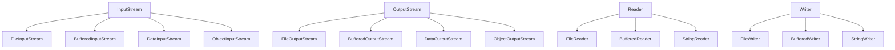

# 0. JavaIO概述
> [!note] 概述
> Java 的输入输出（**I**nput/**O**utput，简称 I/O）系统是其标准库中最核心、最常用的模块之一。它不仅支撑了文件读写、网络通信、序列化等基本功能，也体现了 Java 在抽象设计、资源管理与跨平台兼容性方面的深厚功底。
> 
> JavaIO的两大分支：
> - 字节流：操作原始字节，适用于所有数据类型（图片、音频、二进制文件）
> - 字符流：基于字符编码操作，适合文本处理（如 UTF-8, GBK）
> 
> 继承关系图如下

> [!tip] JavaIO的核心设计模式：装饰器模式
> 装饰器模式允许在不修改原有对象的前提下进行动态修改
> 装饰器模式的本质：
> - 透明封装：包装一个流对象，提供额外功能
> - 使用组合而非继承：通过构造函数传入被包装的流，实现灵活扩展
> 
> 典型示例：BufferedInputStream
> ```java
> BufferedInputStream bis = new BufferedInputStream(new FileInputStream("data.txt"));
> ```
> 这里 `bis` 包装了一个 `FileInputStream`，为其添加了缓冲能力，而 `FileInputStream` 本身无需知道这一点
> 
> 装饰器模式的优势：
> - 高内聚低耦合：每个流只关注单一职责
> - 可组合性强：可以叠加多个装饰器，如
> ```java
> BufferedReader br = new BufferedReader( 
> 	new InputStreamReader( 
> 		new BufferedInputStream( 
> 			new FileInputStream("file.txt") 
> 		) 
> 	) 
> );
> ```
> 

> [!summary] 关键机制概览
> 1. 缓冲机制
> 	- 目标：减少系统调用次数，提升性能
> 	- 实现：内部维护一个 `byte[]` 缓冲区，批量读写
> 2. 关闭与资源管理
> 	- 所有流都实现了`Closeable`接口
> 	- 推荐使用 `try-with-resource`自动关闭资源
> 3. 序列化支持
> 	- `ObjectInputStream` / `ObjectOutputStream` 支持对象的持久化
> 	- 依赖 `Serializable` 接口，底层基于 `DataInputStream` 写入字段值

---
# 1. 输入输出流
## 抽象基类

## InputStream

> [!note] 接口说明
> **该抽象类是所有表示字节输入流的类的超类。**
>
> **需要定义 InputStream 子类的应用程序，必须始终提供一个返回输入流中下一个字节的方法**
### 源代码解析
#### 接口声明
```java
package java.io;  

import jdk.internal.util.ArraysSupport;  

import java.util.ArrayList;
import java.util.Arrays;
import java.util.List;
import java.util.Objects;

public abstract class InputStream implements Closeable
```
> [!note] 说明
> 1. 核心特征
> 	- 抽象类：表明它不能被直接实例化，只能作为子类的父类。这是 Java 中典型的“模板类”设计
> 	- 公共访问权限：可以被任何其他包中的类继承或使用，体现了其基础性地位
> 	- 命名语义：`InputStream` 字面意思是“输入流”，表示数据从外部源流向程序内存
> 	- 面向字节：它处理的是原始 `byte` 数据，适用于任意二进制格式（图片、音频、压缩文件等）
> 2. 继承与实现
> 	- `Closeable`：`Closeable` 是 Java 5 引入的一个标记接口，用于支持资源自动释放。这意味着：**所有 `InputStream` 子类都必须实现 `close()` 方法**，以确保资源（如文件句柄、网络连接）能够被正确释放
> 3. 关键约束
> 	- 必须提供`read()`方法族
> 	- `close()` 必须安全且幂等
> 	- `mark()` / `reset()` 支持可选，但需一致
#### 核心字段
```java
// 这个常量定义了 skip(long n) 方法在内部实现时所使用的最大临时缓冲区大小
private static final int MAX_SKIP_BUFFER_SIZE = 2048;  

// 这个常量定义了 所有基于缓冲的输入流（如 BufferedInputStream）的默认缓冲区大小
private static final int DEFAULT_BUFFER_SIZE = 16384;
```

#### 关键方法
##### 构造方法
```java
public InputStream() {}
```
##### 普通方法
> [!note] 核心读取方法
```java
/**
 * 从输入流中读取下一个字节的数据
 * @return 读取的字节值，范围在0-255之间；如果已到达流末尾，则返回-1
 * @throws IOException 如果发生I/O错误
 */
public abstract int read() throws IOException;

/**
 * 从输入流中读取一定数量的字节，并将其存储在缓冲区数组b中
 * @param b 存储读取数据的缓冲区数组
 * @return 实际读取的字节数；如果已到达流末尾，则返回-1
 * @throws IOException 如果发生I/O错误
 */
public int read(byte[] b) throws IOException {
    return read(b, 0, b.length);
}

/**
 * 从输入流中读取最多len个字节的数据，并将其存储在缓冲区数组b中，从偏移量off开始
 * @param b 存储读取数据的缓冲区数组
 * @param off 数据写入的起始偏移量
 * @param len 要读取的最大字节数
 * @return 实际读取的字节数；如果已到达流末尾，则返回-1
 * @throws IOException 如果发生I/O错误
 */
public int read(byte[] b, int off, int len) throws IOException {
    // 检查参数合法性
    Objects.checkFromIndexSize(off, len, b.length);
    if (len == 0) {
        return 0;
    }

    int c = read();
    if (c == -1) {
        return -1;
    }
    b[off] = (byte)c;

    int i = 1;
    try {
        for (; i < len ; i++) {
            c = read();
            if (c == -1) {
                break;
            }
            b[off + i] = (byte)c;
        }
    } catch (IOException ee) {
        // 捕获异常，但仍返回已读取的字节数
    }
    return i;
}
```

> [!note] 读取所有字节方法
```java
/**
 * 读取输入流中的所有剩余字节
 * @return 包含输入流中所有剩余字节的字节数组
 * @throws IOException 如果发生I/O错误
 * @since 9
 */
public byte[] readAllBytes() throws IOException {
    // 创建初始容量为DEFAULT_BUFFER_SIZE的ByteArrayOutputStream
    ByteArrayOutputStream bos = new ByteArrayOutputStream();
    // 读取并写入所有字节
    bos.writeBytes(this);
    // 返回最终的字节数组
    return bos.toByteArray();
}

/**
 * 从输入流中读取最多len个字节
 * @param len 要读取的最大字节数
 * @return 包含读取字节的字节数组
 * @throws IOException 如果发生I/O错误
 * @since 9
 */
public byte[] readNBytes(int len) throws IOException {
    if (len < 0) {
        throw new IllegalArgumentException("len < 0");
    }

    List<byte[]> bufs = null;
    byte[] result = null;
    int total = 0;
    int remaining = len;
    int n;
    do {
        byte[] buf = new byte[Math.min(remaining, DEFAULT_BUFFER_SIZE)];
        int nread = readNBytes(buf, 0, Math.min(buf.length, remaining));
        if (nread <= 0) {
            break;
        }
        if (total + nread > len) {
            throw new OutOfMemoryError("Required array size too large");
        }
        total += nread;
        if (result == null) {
            result = buf;
        } else {
            if (bufs == null) {
                bufs = new ArrayList<>();
                bufs.add(result);
            }
            bufs.add(buf);
        }
        remaining -= nread;
    } while (remaining > 0 && nread > 0);

    if (bufs == null) {
        if (result == null) {
            return new byte[0];
        }
        return result.length == total ? result : Arrays.copyOf(result, total);
    }

    result = new byte[total];
    int offset = 0;
    remaining = total;
    for (byte[] b : bufs) {
        int count = Math.min(b.length, remaining);
        System.arraycopy(b, 0, result, offset, count);
        offset += count;
        remaining -= count;
    }

    return result;
}

/**
 * 从输入流中读取最多len个字节，并将其存储在缓冲区数组b中，从偏移量off开始
 * @param b 存储读取数据的缓冲区数组
 * @param off 数据写入的起始偏移量
 * @param len 要读取的最大字节数
 * @return 实际读取的字节数
 * @throws IOException 如果发生I/O错误
 * @since 9
 */
public int readNBytes(byte[] b, int off, int len) throws IOException {
    Objects.checkFromIndexSize(off, len, b.length);
    int n = 0;
    while (n < len) {
        int count = read(b, off + n, len - n);
        if (count < 0) {
            break;
        }
        n += count;
    }
    return n;
}
```

> [!note] 跳过字节方法
```java
/**
 * 跳过输入流中的n个字节
 * @param n 要跳过的字节数
 * @return 实际跳过的字节数
 * @throws IOException 如果发生I/O错误
 */
public long skip(long n) throws IOException {
    long remaining = n;
    int nr;

    if (n <= 0) {
        return 0;
    }

    int size = (int)Math.min(MAX_SKIP_BUFFER_SIZE, remaining);
    byte[] skipBuffer = new byte[size];
    while (remaining > 0) {
        nr = read(skipBuffer, 0, (int)Math.min(size, remaining));
        if (nr < 0) {
            break;
        }
        remaining -= nr;
    }

    return n - remaining;
}

/**
 * 跳过输入流中的n个字节，必要时阻塞直到跳过所有字节或到达流末尾
 * @param n 要跳过的字节数
 * @throws IOException 如果发生I/O错误或到达流末尾
 * @since 11
 */
public void skipNBytes(long n) throws IOException {
    if (n <= 0) {
        return;
    }

    long remaining = n;
    while (remaining > 0) {
        long skipped = skip(remaining);
        if (skipped == 0) {
            int b = read();
            if (b < 0) {
                throw new EOFException();
            }
            skipped = 1;
        }
        remaining -= skipped;
    }
}
```

> [!note] 可用字节数方法
```java
/**
 * 返回可以从输入流中无阻塞地读取的字节数的估计值
 * @return 可以无阻塞读取的字节数估计值
 * @throws IOException 如果发生I/O错误
 */
public int available() throws IOException {
    return 0;
}
```

> [!note] 标记和重置方法
```java
/**
 * 标记输入流中的当前位置
 * @param readlimit 标记位置失效前可以读取的最大字节数
 */
public void mark(int readlimit) {}

/**
 * 重置输入流到上次调用mark()方法的位置
 * @throws IOException 如果输入流不支持mark()或reset()方法
 */
public void reset() throws IOException {
    throw new IOException("mark/reset not supported");
}

/**
 * 测试输入流是否支持mark()和reset()方法
 * @return 如果支持mark()和reset()方法，则返回true；否则返回false
 */
public boolean markSupported() {
    return false;
}
```

> [!note] 传输方法
```java
/**
 * 将输入流中的所有剩余字节传输到指定的输出流
 * @param out 目标输出流
 * @return 传输的字节数
 * @throws IOException 如果发生I/O错误
 * @since 9
 */
public long transferTo(OutputStream out) throws IOException {
    Objects.requireNonNull(out);
    long transferred = 0;
    byte[] buffer = new byte[DEFAULT_BUFFER_SIZE];
    int read;
    while ((read = this.read(buffer, 0, DEFAULT_BUFFER_SIZE)) >= 0) {
        out.write(buffer, 0, read);
        transferred += read;
    }
    return transferred;
}
```

> [!note] 关闭方法
```java
/**
 * 关闭输入流并释放与该流关联的所有系统资源
 * @throws IOException 如果发生I/O错误
 */
public void close() throws IOException {}
```

> [!note] 空输入流方法
```java
public static InputStream nullInputStream() {
    return new InputStream() {
        private volatile boolean closed;

        private void ensureOpen() throws IOException {
            if (closed) {
                throw new IOException("Stream closed");
            }
        }

        @Override
        public int available () throws IOException {
            ensureOpen();
            return 0;
        }

        @Override
        public int read() throws IOException {
            ensureOpen();
            return -1;
        }

        @Override
        public int read(byte[] b, int off, int len) throws IOException {
            Objects.checkFromIndexSize(off, len, b.length);
            if (len == 0) {
                return 0;
            }
            ensureOpen();
            return -1;
        }

        @Override
        public byte[] readAllBytes() throws IOException {
            ensureOpen();
            return new byte[0];
        }

        @Override
        public int readNBytes(byte[] b, int off, int len)
            throws IOException {
            Objects.checkFromIndexSize(off, len, b.length);
            ensureOpen();
            return 0;
        }

        @Override
        public byte[] readNBytes(int len) throws IOException {
            if (len < 0) {
                throw new IllegalArgumentException("len < 0");
            }
            ensureOpen();
            return new byte[0];
        }

        @Override
        public long skip(long n) throws IOException {
            ensureOpen();
            return 0L;
        }

        @Override
        public void skipNBytes(long n) throws IOException {
            ensureOpen();
            if (n > 0) {
                throw new EOFException();
            }
        }

        @Override
        public long transferTo(OutputStream out) throws IOException {
            Objects.requireNonNull(out);
            ensureOpen();
            return 0L;
        }

        @Override
        public void close() throws IOException {
            closed = true;
        }
    };
}
```
> [!note] nullInputStream()说明
> 1. **方法作用**：返回一个空的输入流，它表示一个已经到达文件末尾（EOF）的流
> 2. **核心特性**：
>    - 使用匿名内部类实现
>    - 线程安全：使用volatile变量跟踪流状态
>    - 所有读取方法返回-1（EOF标记）
> 3. **设计用途**：
>    - 安全默认值：避免返回null
>    - 测试模拟：用于单元测试
>    - API一致性：允许统一处理

### 使用示例
```java
// 示例1：使用read()方法逐个字节读取
public static void readByteByByte() throws IOException {
    try (InputStream is = new FileInputStream("test.txt")) {
        int data;
        while ((data = is.read()) != -1) {
            System.out.print((char) data);
        }
    }
}

// 示例2：使用read(byte[])方法批量读取
public static void readInBatches() throws IOException {
    try (InputStream is = new FileInputStream("test.txt")) {
        byte[] buffer = new byte[1024];
        int bytesRead;
        while ((bytesRead = is.read(buffer)) != -1) {
            System.out.print(new String(buffer, 0, bytesRead));
        }
    }
}

// 示例3：使用readAllBytes()方法读取所有字节（Java 9+）
public static void readAllBytesExample() throws IOException {
    try (InputStream is = new FileInputStream("test.txt")) {
        byte[] allBytes = is.readAllBytes();
        System.out.print(new String(allBytes));
    }
}

// 示例4：使用transferTo()方法直接传输（Java 9+）
public static void transferToExample() throws IOException {
    try (InputStream is = new FileInputStream("source.txt");
         OutputStream os = new FileOutputStream("destination.txt")) {
        is.transferTo(os);
    }
}

// 示例5：使用mark()和reset()方法（需要支持的流，如BufferedInputStream）
public static void markResetExample() throws IOException {
    try (InputStream is = new BufferedInputStream(new FileInputStream("test.txt"))) {
        // 读取前10个字节
        byte[] buffer = new byte[10];
        is.read(buffer);
        System.out.println("First 10 bytes: " + new String(buffer));
        
        // 标记当前位置
        is.mark(10);
        
        // 读取接下来的10个字节
        is.read(buffer);
        System.out.println("Next 10 bytes: " + new String(buffer));
        
        // 重置到标记位置
        is.reset();
        
        // 再次读取10个字节（应该与上面的Next 10 bytes相同）
        is.read(buffer);
        System.out.println("Reset and read 10 bytes: " + new String(buffer));
    }
}
```


## OutputStream

> [!note] 接口说明
> **该抽象类是所有表示字节输出流的类的超类。**
>
> **输出流接收输出字节并将它们发送到某个接收器。**
### 源代码解析
#### 接口声明
```java
package java.io;

import java.util.Objects;

public abstract class OutputStream implements Closeable, Flushable {
    // ...
}
```
> [!note] 说明
> 1. 核心特征
> 	- 抽象类：不能直接实例化，只能作为子类的父类
> 	- 公共访问权限：可以被任何包中的类继承或使用
> 	- 命名语义：`OutputStream` 表示数据从程序内存流向外部目标
> 	- 面向字节：处理原始 `byte` 数据，适用于任意二进制格式
> 2. 继承与实现
> 	- `Closeable`：支持资源自动释放，必须实现 `close()` 方法
> 	- `Flushable`：支持刷新操作，必须实现 `flush()` 方法
> 3. 关键约束
> 	- 必须提供`write()`方法族
> 	- `close()` 必须安全且幂等
> 	- `flush()` 确保所有缓冲数据被写入目标

#### 核心方法
##### 构造方法
```java
public OutputStream() {}
```

##### 普通方法
> [!note] 核心写入方法
```java
/**
 * 将指定的字节写入输出流
 * @param b 要写入的字节值（0-255之间）
 * @throws IOException 如果发生I/O错误
 */
public abstract void write(int b) throws IOException;

/**
 * 将指定字节数组中的所有字节写入输出流
 * @param b 要写入的字节数组
 * @throws IOException 如果发生I/O错误
 */
public void write(byte[] b) throws IOException {
    write(b, 0, b.length);
}

/**
 * 将指定字节数组中从偏移量off开始的len个字节写入输出流
 * @param b 要写入的字节数组
 * @param off 数据的起始偏移量
 * @param len 要写入的字节数
 * @throws IOException 如果发生I/O错误
 */
public void write(byte[] b, int off, int len) throws IOException {
    // 检查参数合法性
    Objects.checkFromIndexSize(off, len, b.length);
    
    // 逐个字节写入
    for (int i = 0 ; i < len ; i++) {
        write(b[off + i]);
    }
}
```

> [!note] 刷新方法
```java
/**
 * 刷新输出流，确保所有缓冲的输出字节被写入目标
 * @throws IOException 如果发生I/O错误
 */
public void flush() throws IOException {}
```

> [!note] 关闭方法
```java
/**
 * 关闭输出流并释放与该流关联的所有系统资源
 * @throws IOException 如果发生I/O错误
 */
public void close() throws IOException {
    flush();
}
```

> [!note] 空输出流方法
```java
/**
 * 返回一个空的输出流，写入到该流的数据会被忽略
 * @return 一个空的输出流
 * @since 11
 */
public static OutputStream nullOutputStream() {
    return new OutputStream() {
        private volatile boolean closed;

        private void ensureOpen() throws IOException {
            if (closed) {
                throw new IOException("Stream closed");
            }
        }

        @Override
        public void write(int b) throws IOException {
            ensureOpen();
        }

        @Override
        public void write(byte[] b, int off, int len) throws IOException {
            Objects.checkFromIndexSize(off, len, b.length);
            ensureOpen();
        }

        @Override
        public void flush() throws IOException {
            ensureOpen();
        }

        @Override
        public void close() throws IOException {
            closed = true;
        }
    };
}
```

### 使用示例
```java
// 示例1：使用write(int)方法逐个字节写入
public static void writeByteByByte() throws IOException {
    try (OutputStream os = new FileOutputStream("output.txt")) {
        String text = "Hello, World!";
        for (int i = 0; i < text.length(); i++) {
            os.write(text.charAt(i));
        }
    }
}

// 示例2：使用write(byte[])方法批量写入
public static void writeInBatches() throws IOException {
    try (OutputStream os = new FileOutputStream("output.txt")) {
        String text = "Hello, World!";
        byte[] bytes = text.getBytes();
        os.write(bytes);
    }
}

// 示例3：使用write(byte[], int, int)方法写入部分字节
public static void writePartialBytes() throws IOException {
    try (OutputStream os = new FileOutputStream("output.txt")) {
        byte[] bytes = "Hello, World!".getBytes();
        // 只写入前5个字节
        os.write(bytes, 0, 5);
    }
}

// 示例4：使用flush()方法确保数据写入
public static void writeWithFlush() throws IOException {
    try (OutputStream os = new FileOutputStream("output.txt")) {
        os.write("Hello".getBytes());
        os.flush(); // 确保数据被写入
        os.write(", World!".getBytes());
    }
}

// 示例5：使用try-with-resources自动关闭
public static void tryWithResourcesExample() throws IOException {
    String text = "Hello, Java IO!";
    try (OutputStream os = new FileOutputStream("output.txt")) {
        os.write(text.getBytes());
    } // 自动调用close()，内部会调用flush()
}

// 示例6：使用nullOutputStream()忽略输出
public static void nullOutputStreamExample() throws IOException {
    try (OutputStream os = OutputStream.nullOutputStream()) {
        os.write("This will be ignored".getBytes());
        // 不会产生任何输出文件
    }
}
```

---
# 2. File类

> [!note] 类说明
> **File类是Java IO中用于表示文件和目录路径名的抽象表示。**
>
> File类提供了一系列方法来操作文件和目录，包括创建、删除、重命名、获取属性等，但**不提供文件内容的读写操作**。
>
> **核心功能**：
> - 表示文件和目录路径
> - 创建、删除、重命名文件和目录
> - 获取文件和目录的属性（大小、修改时间、权限等）
> - 列出目录中的文件和子目录

### 源代码解析
#### 接口声明
```java
package java.io;

import java.net.URI;
import java.nio.file.Path;
import java.nio.file.Paths;
import java.nio.file.attribute.FileTime;
import java.util.ArrayList;
import java.util.Iterator;
import java.util.List;
import java.util.Objects;

public class File implements Serializable, Comparable<File> {
    // ...
}
```
> [!note] 说明
> 1. 核心特征
> 	- 具体类：可以直接实例化
> 	- 实现了Serializable：支持序列化
> 	- 实现了Comparable：支持自然排序（按路径名）
> 2. 设计目的
> 	- 提供平台无关的文件和目录操作
> 	- 抽象化不同操作系统的路径分隔符差异
> 	- 支持文件和目录的元数据操作

#### 核心字段
```java
// 路径分隔符，Windows使用"\\"，Unix/Linux使用"/"
public static final String separator = "" + separatorChar;

// 路径分隔符字符
public static final char separatorChar = java.io.FileSystems.getDefault().getSeparator().charAt(0);

// 路径分隔符，用于分隔环境变量中的多个路径
public static final String pathSeparator = "" + pathSeparatorChar;

// 路径分隔符字符
public static final char pathSeparatorChar = java.io.FileSystems.getDefault().getPathSeparator().charAt(0);

// 表示当前用户目录的路径
public static final String userDir = System.getProperty("user.dir");

// 表示用户主目录的路径
public static final String userHome = System.getProperty("user.home");
```

#### 核心方法
##### 构造方法
```java
/**
 * 通过将给定路径名字符串转换为抽象路径名来创建一个新的File实例
 * @param pathname 路径名字符串
 */
public File(String pathname) {
    if (pathname == null) {
        throw new NullPointerException();
    }
    this.path = fs.normalize(pathname);
    this.prefixLength = fs.prefixLength(this.path);
}

/**
 * 根据父路径名和子路径名字符串创建一个新的File实例
 * @param parent 父路径名字符串
 * @param child 子路径名字符串
 */
public File(String parent, String child) {
    if (child == null) {
        throw new NullPointerException();
    }
    if (parent != null) {
        if (parent.equals("")) {
            this.path = fs.normalize(child);
            this.prefixLength = fs.prefixLength(this.path);
        } else {
            this.path = fs.resolve(fs.normalize(parent), fs.normalize(child));
            this.prefixLength = fs.prefixLength(this.path);
        }
    } else {
        this.path = fs.normalize(child);
        this.prefixLength = fs.prefixLength(this.path);
    }
}

/**
 * 根据父抽象路径名和子路径名字符串创建一个新的File实例
 * @param parent 父抽象路径名
 * @param child 子路径名字符串
 */
public File(File parent, String child) {
    if (child == null) {
        throw new NullPointerException();
    }
    if (parent != null) {
        if (parent.path.equals("")) {
            this.path = fs.normalize(child);
            this.prefixLength = fs.prefixLength(this.path);
        } else {
            this.path = fs.resolve(parent.path, fs.normalize(child));
            this.prefixLength = fs.prefixLength(this.path);
        }
    } else {
        this.path = fs.normalize(child);
        this.prefixLength = fs.prefixLength(this.path);
    }
}

/**
 * 通过将给定的file: URI转换为抽象路径名来创建一个新的File实例
 * @param uri 一个file: URI
 */
public File(URI uri) {
    // 实现细节...
}
```

##### 普通方法
> [!note] 文件和目录操作
```java
/**
 * 创建一个新的空文件
 * @return 如果文件成功创建，则返回true；如果文件已存在，则返回false
 * @throws IOException 如果发生I/O错误
 */
public boolean createNewFile() throws IOException {
    // 实现细节...
}

/**
 * 删除此抽象路径名表示的文件或目录
 * @return 如果成功删除，则返回true；否则返回false
 */
public boolean delete() {
    // 实现细节...
}

/**
 * 当虚拟机终止时，请求删除此抽象路径名表示的文件或目录
 * @return 如果文件已成功注册为删除，则返回true；否则返回false
 */
public void deleteOnExit() {
    // 实现细节...
}

/**
 * 创建此抽象路径名指定的目录
 * @return 如果目录成功创建，则返回true；如果目录已存在，则返回false
 */
public boolean mkdir() {
    // 实现细节...
}

/**
 * 创建此抽象路径名指定的目录，包括所有必需但不存在的父目录
 * @return 如果目录（或目录的所有必需父目录）成功创建，则返回true；否则返回false
 */
public boolean mkdirs() {
    // 实现细节...
}

/**
 * 重命名此抽象路径名表示的文件
 * @param dest 新的抽象路径名
 * @return 如果重命名成功，则返回true；否则返回false
 */
public boolean renameTo(File dest) {
    // 实现细节...
}
```

> [!note] 文件属性获取
```java
/**
 * 测试此抽象路径名表示的文件或目录是否存在
 * @return 如果存在，则返回true；否则返回false
 */
public boolean exists() {
    // 实现细节...
}

/**
 * 测试此抽象路径名表示的文件是否是一个普通文件
 * @return 如果是普通文件，则返回true；否则返回false
 */
public boolean isFile() {
    // 实现细节...
}

/**
 * 测试此抽象路径名表示的文件是否是一个目录
 * @return 如果是目录，则返回true；否则返回false
 */
public boolean isDirectory() {
    // 实现细节...
}

/**
 * 测试此抽象路径名表示的文件是否是一个隐藏文件
 * @return 如果是隐藏文件，则返回true；否则返回false
 */
public boolean isHidden() {
    // 实现细节...
}

/**
 * 返回此抽象路径名表示的文件的长度（字节数）
 * @return 文件长度；如果文件不存在，则返回0L
 */
public long length() {
    // 实现细节...
}

/**
 * 返回此抽象路径名表示的文件最后一次被修改的时间
 * @return 最后修改时间（毫秒数，从1970-01-01 00:00:00 GMT开始）
 */
public long lastModified() {
    // 实现细节...
}
```

> [!note] 目录列表
```java
/**
 * 返回此抽象路径名表示的目录中的文件和目录的名称数组
 * @return 目录中的文件和目录的名称数组；如果路径名不表示目录，或者发生I/O错误，则返回null
 */
public String[] list() {
    // 实现细节...
}

/**
 * 返回此抽象路径名表示的目录中的文件和目录的File对象数组
 * @return 目录中的文件和目录的File对象数组；如果路径名不表示目录，或者发生I/O错误，则返回null
 */
public File[] listFiles() {
    // 实现细节...
}

/**
 * 返回此抽象路径名表示的目录中满足指定过滤器的文件和目录的名称数组
 * @param filter 文件名过滤器
 * @return 满足过滤器的文件和目录的名称数组；如果路径名不表示目录，或者发生I/O错误，则返回null
 */
public String[] list(FilenameFilter filter) {
    // 实现细节...
}

/**
 * 返回此抽象路径名表示的目录中满足指定过滤器的文件和目录的File对象数组
 * @param filter 文件过滤器
 * @return 满足过滤器的文件和目录的File对象数组；如果路径名不表示目录，或者发生I/O错误，则返回null
 */
public File[] listFiles(FileFilter filter) {
    // 实现细节...
}
```

> [!note] 路径操作
```java
/**
 * 返回此抽象路径名的父路径名的字符串表示
 * @return 父路径名的字符串表示；如果此路径名没有父目录，则返回null
 */
public String getParent() {
    // 实现细节...
}

/**
 * 返回此抽象路径名的父路径名的File对象
 * @return 父路径名的File对象；如果此路径名没有父目录，则返回null
 */
public File getParentFile() {
    // 实现细节...
}

/**
 * 返回此抽象路径名表示的文件或目录的名称
 * @return 文件或目录的名称
 */
public String getName() {
    // 实现细节...
}

/**
 * 返回此抽象路径名的路径名字符串
 * @return 路径名字符串
 */
public String getPath() {
    // 实现细节...
}

/**
 * 返回此抽象路径名的绝对路径名字符串
 * @return 绝对路径名字符串
 */
public String getAbsolutePath() {
    // 实现细节...
}

/**
 * 返回此抽象路径名的绝对路径名的File对象
 * @return 绝对路径名的File对象
 */
public File getAbsoluteFile() {
    // 实现细节...
}

/**
 * 返回此抽象路径名的规范路径名字符串
 * @return 规范路径名字符串
 * @throws IOException 如果发生I/O错误
 */
public String getCanonicalPath() throws IOException {
    // 实现细节...
}

/**
 * 返回此抽象路径名的规范路径名的File对象
 * @return 规范路径名的File对象
 * @throws IOException 如果发生I/O错误
 */
public File getCanonicalFile() throws IOException {
    // 实现细节...
}
```

> [!note] NIO Path转换
```java
/**
 * 返回表示此抽象路径名的java.nio.file.Path对象
 * @return 表示此抽象路径名的Path对象
 * @since 1.7
 */
public Path toPath() {
    // 实现细节...
}
```

### 使用示例
```java
// 示例1：创建File对象
public static void createFileObjects() {
    // 方法1：使用完整路径
    File file1 = new File("C:\\Users\\username\\test.txt");
    
    // 方法2：使用父目录和子文件名
    File file2 = new File("C:\\Users\\username", "test.txt");
    
    // 方法3：使用File父目录和子文件名
    File parent = new File("C:\\Users\\username");
    File file3 = new File(parent, "test.txt");
    
    // 方法4：使用相对路径
    File file4 = new File("test.txt");
    File file5 = new File("./src/main/java");
}

// 示例2：创建文件和目录
public static void createFilesAndDirectories() throws IOException {
    // 创建单个目录
    File dir = new File("test_dir");
    dir.mkdir();
    
    // 创建多级目录
    File nestedDir = new File("test_dir1/test_dir2/test_dir3");
    nestedDir.mkdirs();
    
    // 创建文件
    File file = new File("test.txt");
    file.createNewFile();
}

// 示例3：获取文件属性
public static void getFileAttributes() {
    File file = new File("test.txt");
    
    System.out.println("文件是否存在: " + file.exists());
    System.out.println("是否是文件: " + file.isFile());
    System.out.println("是否是目录: " + file.isDirectory());
    System.out.println("文件大小: " + file.length() + " bytes");
    System.out.println("最后修改时间: " + new java.util.Date(file.lastModified()));
    System.out.println("文件名称: " + file.getName());
    System.out.println("文件路径: " + file.getPath());
    System.out.println("绝对路径: " + file.getAbsolutePath());
}

// 示例4：列出目录内容
public static void listDirectoryContents() {
    File dir = new File(".");
    
    // 列出所有文件和目录名称
    String[] files = dir.list();
    if (files != null) {
        System.out.println("目录中的文件和目录名称:");
        for (String fileName : files) {
            System.out.println(fileName);
        }
    }
    
    // 列出所有File对象
    File[] fileObjects = dir.listFiles();
    if (fileObjects != null) {
        System.out.println("\n目录中的File对象:");
        for (File f : fileObjects) {
            System.out.println(f.getName() + (f.isDirectory() ? " [目录]" : " [文件]"));
        }
    }
    
    // 使用过滤器列出特定文件
    File[] javaFiles = dir.listFiles((File pathname) -> pathname.getName().endsWith(".java"));
    if (javaFiles != null) {
        System.out.println("\n目录中的Java文件:");
        for (File f : javaFiles) {
            System.out.println(f.getName());
        }
    }
}

// 示例5：文件操作
public static void fileOperations() throws IOException {
    // 创建文件
    File source = new File("source.txt");
    source.createNewFile();
    
    // 重命名文件
    File dest = new File("destination.txt");
    source.renameTo(dest);
    
    // 删除文件
    dest.delete();
    
    // 创建临时文件并在JVM退出时删除
    File temp = new File("temp.txt");
    temp.createNewFile();
    temp.deleteOnExit();
}

// 示例6：路径转换
public static void pathConversion() throws IOException {
    File file = new File("test.txt");
    
    // 获取规范路径
    String canonicalPath = file.getCanonicalPath();
    System.out.println("规范路径: " + canonicalPath);
    
    // 转换为NIO Path对象
    java.nio.file.Path path = file.toPath();
    System.out.println("NIO Path: " + path);
}
```

---
# 3. 文件输入输出流
## FileInputStream 和 FileOutputStream

### FileInputStream

> [!note] 类说明
> **FileInputStream是从文件系统中的文件获取输入字节的输入流。**
>
> FileInputStream用于读取诸如图像数据之类的原始字节流。要读取字符流，请考虑使用FileReader。
>
> **核心功能**：
> - 从文件中读取字节数据
> - 支持按字节、字节数组读取
> - 支持标记和重置操作
> - 支持跳过字节

#### 源代码解析
##### 接口声明
```java
package java.io;

import java.nio.channels.FileChannel;
import sun.nio.ch.FileChannelImpl;

public class FileInputStream extends InputStream {
    // ...
}
```
> [!note] 说明
> 1. 核心特征
> 	- 具体类：可以直接实例化
> 	- 继承自InputStream：实现了所有字节输入流的核心方法
> 	- 用于读取文件：专门用于从文件系统读取字节数据
> 2. 设计目的
> 	- 提供高效的文件字节读取能力
> 	- 支持文件的随机访问
> 	- 与FileChannel集成，支持NIO操作

#### 核心字段
```java
// 文件描述符，用于表示打开的文件
private final FileDescriptor fd;

// 引用计数，用于跟踪文件描述符的使用情况
private final Object closeLock = new Object();
private volatile boolean closed = false;

// 文件通道，用于NIO操作
private FileChannel channel = null;
```

#### 核心方法
##### 构造方法
```java
/**
 * 通过打开与实际文件的连接来创建一个FileInputStream，该文件由文件系统中的File对象file命名
 * @param file 要打开的文件
 * @throws FileNotFoundException 如果文件不存在，或者它是一个目录而不是常规文件，或者因为其他某些原因无法打开读取
 */
public FileInputStream(File file) throws FileNotFoundException {
    // 实现细节...
}

/**
 * 通过打开与实际文件的连接来创建一个FileInputStream，该文件由文件系统中的路径名字符串name命名
 * @param name 路径名字符串
 * @throws FileNotFoundException 如果文件不存在，或者它是一个目录而不是常规文件，或者因为其他某些原因无法打开读取
 */
public FileInputStream(String name) throws FileNotFoundException {
    // 实现细节...
}

/**
 * 使用文件描述符fdObj创建一个FileInputStream，该文件描述符表示到文件系统中某个实际文件的现有连接
 * @param fdObj 表示现有文件连接的文件描述符
 */
public FileInputStream(FileDescriptor fdObj) {
    // 实现细节...
}
```

##### 普通方法
> [!note] 核心读取方法
```java
/**
 * 从该输入流中读取一个字节的数据
 * @return 读取的字节值，范围在0-255之间；如果已到达文件末尾，则返回-1
 * @throws IOException 如果发生I/O错误
 */
public int read() throws IOException {
    // 实现细节...
}

/**
 * 从该输入流中将最多b.length个字节的数据读入一个byte数组
 * @param b 存储读取数据的缓冲区
 * @return 实际读取的字节数；如果已到达文件末尾，则返回-1
 * @throws IOException 如果发生I/O错误
 */
public int read(byte[] b) throws IOException {
    // 实现细节...
}

/**
 * 从该输入流中将最多len个字节的数据读入一个byte数组，从偏移量off开始
 * @param b 存储读取数据的缓冲区
 * @param off 数据的起始偏移量
 * @param len 要读取的最大字节数
 * @return 实际读取的字节数；如果已到达文件末尾，则返回-1
 * @throws IOException 如果发生I/O错误
 */
public int read(byte[] b, int off, int len) throws IOException {
    // 实现细节...
}
```

> [!note] 跳过和可用方法
```java
/**
 * 从输入流中跳过并丢弃n个字节的数据
 * @param n 要跳过的字节数
 * @return 实际跳过的字节数
 * @throws IOException 如果发生I/O错误
 */
public long skip(long n) throws IOException {
    // 实现细节...
}

/**
 * 返回可以从此输入流中无阻塞地读取（或跳过）的估计字节数
 * @return 可以无阻塞读取的字节数估计值
 * @throws IOException 如果发生I/O错误
 */
public int available() throws IOException {
    // 实现细节...
}
```

> [!note] 关闭和文件描述符方法
```java
/**
 * 关闭此文件输入流并释放与此流关联的所有系统资源
 * @throws IOException 如果发生I/O错误
 */
public void close() throws IOException {
    // 实现细节...
}

/**
 * 返回与此文件输入流关联的文件描述符
 * @return 与此文件输入流关联的文件描述符
 * @throws IOException 如果发生I/O错误
 */
public final FileDescriptor getFD() throws IOException {
    // 实现细节...
}

/**
 * 返回与此文件输入流关联的唯一FileChannel对象
 * @return 与此文件输入流关联的FileChannel对象
 */
public FileChannel getChannel() {
    // 实现细节...
}
```

### FileOutputStream

> [!note] 类说明
> **FileOutputStream是用于将数据写入文件系统中的文件的输出流。**
>
> FileOutputStream用于写入诸如图像数据之类的原始字节流。要写入字符流，请考虑使用FileWriter。
>
> **核心功能**：
> - 将字节数据写入文件
> - 支持按字节、字节数组写入
> - 支持追加模式
> - 支持刷新操作

#### 源代码解析
##### 接口声明
```java
package java.io;

import java.nio.channels.FileChannel;
import sun.nio.ch.FileChannelImpl;

public class FileOutputStream extends OutputStream {
    // ...
}
```
> [!note] 说明
> 1. 核心特征
> 	- 具体类：可以直接实例化
> 	- 继承自OutputStream：实现了所有字节输出流的核心方法
> 	- 用于写入文件：专门用于向文件系统写入字节数据
> 2. 设计目的
> 	- 提供高效的文件字节写入能力
> 	- 支持文件的追加写入
> 	- 与FileChannel集成，支持NIO操作

#### 核心字段
```java
// 文件描述符，用于表示打开的文件
private final FileDescriptor fd;

// 引用计数，用于跟踪文件描述符的使用情况
private final Object closeLock = new Object();
private volatile boolean closed = false;

// 文件通道，用于NIO操作
private FileChannel channel = null;

// 是否以追加模式打开文件
private final boolean append;
```

#### 核心方法
##### 构造方法
```java
/**
 * 创建一个向具有指定File对象表示的文件中写入数据的文件输出流
 * @param file 要打开的文件
 * @throws FileNotFoundException 如果文件不存在，或者它是一个目录而不是常规文件，或者因为其他某些原因无法打开写入
 */
public FileOutputStream(File file) throws FileNotFoundException {
    // 实现细节...
}

/**
 * 创建一个向具有指定File对象表示的文件中写入数据的文件输出流
 * @param file 要打开的文件
 * @param append 如果为true，则字节将被写入文件的末尾而不是开头
 * @throws FileNotFoundException 如果文件不存在，或者它是一个目录而不是常规文件，或者因为其他某些原因无法打开写入
 */
public FileOutputStream(File file, boolean append) throws FileNotFoundException {
    // 实现细节...
}

/**
 * 创建一个向具有指定名称的文件中写入数据的文件输出流
 * @param name 要打开的文件的名称
 * @throws FileNotFoundException 如果文件不存在，或者它是一个目录而不是常规文件，或者因为其他某些原因无法打开写入
 */
public FileOutputStream(String name) throws FileNotFoundException {
    // 实现细节...
}

/**
 * 创建一个向具有指定名称的文件中写入数据的文件输出流
 * @param name 要打开的文件的名称
 * @param append 如果为true，则字节将被写入文件的末尾而不是开头
 * @throws FileNotFoundException 如果文件不存在，或者它是一个目录而不是常规文件，或者因为其他某些原因无法打开写入
 */
public FileOutputStream(String name, boolean append) throws FileNotFoundException {
    // 实现细节...
}

/**
 * 创建一个向指定文件描述符表示的文件中写入数据的文件输出流
 * @param fdObj 表示到文件系统中某个实际文件的现有连接的文件描述符
 */
public FileOutputStream(FileDescriptor fdObj) {
    // 实现细节...
}
```

##### 普通方法
> [!note] 核心写入方法
```java
/**
 * 将指定的字节写入此文件输出流
 * @param b 要写入的字节值（0-255之间）
 * @throws IOException 如果发生I/O错误
 */
public void write(int b) throws IOException {
    // 实现细节...
}

/**
 * 将指定字节数组中的b.length个字节写入此文件输出流
 * @param b 要写入的字节数组
 * @throws IOException 如果发生I/O错误
 */
public void write(byte[] b) throws IOException {
    // 实现细节...
}

/**
 * 将指定字节数组中从偏移量off开始的len个字节写入此文件输出流
 * @param b 要写入的字节数组
 * @param off 数据的起始偏移量
 * @param len 要写入的字节数
 * @throws IOException 如果发生I/O错误
 */
public void write(byte[] b, int off, int len) throws IOException {
    // 实现细节...
}
```

> [!note] 关闭和文件描述符方法
```java
/**
 * 关闭此文件输出流并释放与此流关联的所有系统资源
 * @throws IOException 如果发生I/O错误
 */
public void close() throws IOException {
    // 实现细节...
}

/**
 * 返回与此文件输出流关联的文件描述符
 * @return 与此文件输出流关联的文件描述符
 * @throws IOException 如果发生I/O错误
 */
public final FileDescriptor getFD() throws IOException {
    // 实现细节...
}

/**
 * 返回与此文件输出流关联的唯一FileChannel对象
 * @return 与此文件输出流关联的FileChannel对象
 */
public FileChannel getChannel() {
    // 实现细节...
}
```

### 使用示例

#### FileInputStream示例
```java
// 示例1：使用FileInputStream读取文件
public static void readFileWithFileInputStream() throws IOException {
    try (FileInputStream fis = new FileInputStream("test.txt")) {
        int data;
        while ((data = fis.read()) != -1) {
            System.out.print((char) data);
        }
    }
}

// 示例2：使用FileInputStream批量读取
public static void readFileInBatches() throws IOException {
    try (FileInputStream fis = new FileInputStream("test.txt")) {
        byte[] buffer = new byte[1024];
        int bytesRead;
        while ((bytesRead = fis.read(buffer)) != -1) {
            System.out.print(new String(buffer, 0, bytesRead));
        }
    }
}

// 示例3：使用available()方法获取可用字节数
public static void useAvailableMethod() throws IOException {
    try (FileInputStream fis = new FileInputStream("test.txt")) {
        System.out.println("Available bytes: " + fis.available());
        
        byte[] buffer = new byte[fis.available()];
        fis.read(buffer);
        System.out.println("File content: " + new String(buffer));
    }
}

// 示例4：使用skip()方法跳过字节
public static void useSkipMethod() throws IOException {
    try (FileInputStream fis = new FileInputStream("test.txt")) {
        // 跳过前5个字节
        fis.skip(5);
        
        int data;
        while ((data = fis.read()) != -1) {
            System.out.print((char) data);
        }
    }
}
```

#### FileOutputStream示例
```java
// 示例1：使用FileOutputStream写入文件
public static void writeFileWithFileOutputStream() throws IOException {
    try (FileOutputStream fos = new FileOutputStream("output.txt")) {
        String text = "Hello, FileOutputStream!";
        fos.write(text.getBytes());
    }
}

// 示例2：使用FileOutputStream追加写入
public static void appendToFile() throws IOException {
    try (FileOutputStream fos = new FileOutputStream("output.txt", true)) {
        String text = "\nThis is appended text.";
        fos.write(text.getBytes());
    }
}

// 示例3：使用write(byte[], int, int)方法写入部分字节
public static void writePartialBytes() throws IOException {
    try (FileOutputStream fos = new FileOutputStream("output.txt")) {
        byte[] buffer = "Hello, World!".getBytes();
        // 只写入前5个字节
        fos.write(buffer, 0, 5);
    }
}

// 示例4：使用flush()方法确保数据写入
public static void useFlushMethod() throws IOException {
    try (FileOutputStream fos = new FileOutputStream("output.txt")) {
        fos.write("Hello".getBytes());
        fos.flush(); // 确保数据被写入
        fos.write(", World!".getBytes());
    }
}
```

#### 综合示例：文件复制
```java
// 使用FileInputStream和FileOutputStream复制文件
public static void copyFile() throws IOException {
    try (FileInputStream fis = new FileInputStream("source.txt");
         FileOutputStream fos = new FileOutputStream("destination.txt")) {
        byte[] buffer = new byte[1024];
        int bytesRead;
        while ((bytesRead = fis.read(buffer)) != -1) {
            fos.write(buffer, 0, bytesRead);
        }
        System.out.println("文件复制完成!");
    }
}
```

## FileReader 和 FileWriter

### FileReader

> [!note] 类说明
> **FileReader是用于读取字符文件的便捷类。**
>
> FileReader使用默认的字符编码和默认的字节缓冲区大小从文件中读取字符。要指定字符编码或字节缓冲区大小，请考虑使用InputStreamReader。
>
> **核心功能**：
> - 从文件中读取字符数据
> - 支持按字符、字符数组读取
> - 继承自InputStreamReader，支持字符编码转换

#### 源代码解析
##### 接口声明
```java
package java.io;

public class FileReader extends InputStreamReader {
    // ...
}
```
> [!note] 说明
> 1. 核心特征
> 	- 具体类：可以直接实例化
> 	- 继承自InputStreamReader：实现了字符流到字节流的转换
> 	- 用于读取字符文件：专门用于从文件系统读取字符数据
> 2. 设计目的
> 	- 提供便捷的字符文件读取能力
> 	- 自动处理字符编码转换
> 	- 简化字符流的创建过程

#### 核心构造方法
```java
/**
 * 创建一个新的FileReader，给定要读取的File对象
 * @param file 要读取的File对象
 * @throws FileNotFoundException 如果文件不存在，或者它是一个目录而不是常规文件，或者因为其他某些原因无法打开读取
 */
public FileReader(File file) throws FileNotFoundException {
    super(new FileInputStream(file));
}

/**
 * 创建一个新的FileReader，给定要读取的文件名
 * @param fileName 要读取的文件名
 * @throws FileNotFoundException 如果文件不存在，或者它是一个目录而不是常规文件，或者因为其他某些原因无法打开读取
 */
public FileReader(String fileName) throws FileNotFoundException {
    super(new FileInputStream(fileName));
}

/**
 * 创建一个新的FileReader，给定要读取的File对象和字符集
 * @param file 要读取的File对象
 * @param cs 要使用的字符集
 * @throws IOException 如果文件不存在，或者它是一个目录而不是常规文件，或者因为其他某些原因无法打开读取
 * @since 11
 */
public FileReader(File file, java.nio.charset.Charset cs) throws IOException {
    super(new FileInputStream(file), cs);
}

/**
 * 创建一个新的FileReader，给定要读取的文件名和字符集
 * @param fileName 要读取的文件名
 * @param cs 要使用的字符集
 * @throws IOException 如果文件不存在，或者它是一个目录而不是常规文件，或者因为其他某些原因无法打开读取
 * @since 11
 */
public FileReader(String fileName, java.nio.charset.Charset cs) throws IOException {
    super(new FileInputStream(fileName), cs);
}
```

### FileWriter

> [!note] 类说明
> **FileWriter是用于写入字符文件的便捷类。**
>
> FileWriter使用默认的字符编码和默认的字节缓冲区大小向文件中写入字符。要指定字符编码或字节缓冲区大小，请考虑使用OutputStreamWriter。
>
> **核心功能**：
> - 将字符数据写入文件
> - 支持按字符、字符数组写入
> - 支持追加模式
> - 继承自OutputStreamWriter，支持字符编码转换

#### 源代码解析
##### 接口声明
```java
package java.io;

public class FileWriter extends OutputStreamWriter {
    // ...
}
```
> [!note] 说明
> 1. 核心特征
> 	- 具体类：可以直接实例化
> 	- 继承自OutputStreamWriter：实现了字节流到字符流的转换
> 	- 用于写入字符文件：专门用于向文件系统写入字符数据
> 2. 设计目的
> 	- 提供便捷的字符文件写入能力
> 	- 自动处理字符编码转换
> 	- 简化字符流的创建过程

#### 核心构造方法
```java
/**
 * 创建一个新的FileWriter，给定要写入的File对象
 * @param file 要写入的File对象
 * @throws IOException 如果文件不存在，或者它是一个目录而不是常规文件，或者因为其他某些原因无法打开写入
 */
public FileWriter(File file) throws IOException {
    super(new FileOutputStream(file));
}

/**
 * 创建一个新的FileWriter，给定要写入的File对象和追加模式
 * @param file 要写入的File对象
 * @param append 如果为true，则将数据写入文件末尾而不是开头
 * @throws IOException 如果文件不存在，或者它是一个目录而不是常规文件，或者因为其他某些原因无法打开写入
 */
public FileWriter(File file, boolean append) throws IOException {
    super(new FileOutputStream(file, append));
}

/**
 * 创建一个新的FileWriter，给定要写入的文件名
 * @param fileName 要写入的文件名
 * @throws IOException 如果文件不存在，或者它是一个目录而不是常规文件，或者因为其他某些原因无法打开写入
 */
public FileWriter(String fileName) throws IOException {
    super(new FileOutputStream(fileName));
}

/**
 * 创建一个新的FileWriter，给定要写入的文件名和追加模式
 * @param fileName 要写入的文件名
 * @param append 如果为true，则将数据写入文件末尾而不是开头
 * @throws IOException 如果文件不存在，或者它是一个目录而不是常规文件，或者因为其他某些原因无法打开写入
 */
public FileWriter(String fileName, boolean append) throws IOException {
    super(new FileOutputStream(fileName, append));
}

/**
 * 创建一个新的FileWriter，给定要写入的File对象、追加模式和字符集
 * @param file 要写入的File对象
 * @param append 如果为true，则将数据写入文件末尾而不是开头
 * @param cs 要使用的字符集
 * @throws IOException 如果文件不存在，或者它是一个目录而不是常规文件，或者因为其他某些原因无法打开写入
 * @since 11
 */
public FileWriter(File file, boolean append, java.nio.charset.Charset cs) throws IOException {
    super(new FileOutputStream(file, append), cs);
}

/**
 * 创建一个新的FileWriter，给定要写入的文件名、追加模式和字符集
 * @param fileName 要写入的文件名
 * @param append 如果为true，则将数据写入文件末尾而不是开头
 * @param cs 要使用的字符集
 * @throws IOException 如果文件不存在，或者它是一个目录而不是常规文件，或者因为其他某些原因无法打开写入
 * @since 11
 */
public FileWriter(String fileName, boolean append, java.nio.charset.Charset cs) throws IOException {
    super(new FileOutputStream(fileName, append), cs);
}
```

### 使用示例

#### FileReader示例
```java
// 示例1：使用FileReader读取文件
public static void readFileWithFileReader() throws IOException {
    try (FileReader fr = new FileReader("test.txt")) {
        int data;
        while ((data = fr.read()) != -1) {
            System.out.print((char) data);
        }
    }
}

// 示例2：使用FileReader批量读取
public static void readFileInBatchesWithFileReader() throws IOException {
    try (FileReader fr = new FileReader("test.txt")) {
        char[] buffer = new char[1024];
        int charsRead;
        while ((charsRead = fr.read(buffer)) != -1) {
            System.out.print(new String(buffer, 0, charsRead));
        }
    }
}
```

#### FileWriter示例
```java
// 示例1：使用FileWriter写入文件
public static void writeFileWithFileWriter() throws IOException {
    try (FileWriter fw = new FileWriter("output.txt")) {
        String text = "Hello, FileWriter!";
        fw.write(text);
    }
}

// 示例2：使用FileWriter追加写入
public static void appendToFileWithFileWriter() throws IOException {
    try (FileWriter fw = new FileWriter("output.txt", true)) {
        String text = "\nThis is appended text.";
        fw.write(text);
    }
}

// 示例3：使用write(char[], int, int)方法写入部分字符
public static void writePartialChars() throws IOException {
    try (FileWriter fw = new FileWriter("output.txt")) {
        char[] buffer = "Hello, World!".toCharArray();
        // 只写入前5个字符
        fw.write(buffer, 0, 5);
    }
}
```

#### 综合示例：使用FileReader和FileWriter复制文本文件
```java
// 使用FileReader和FileWriter复制文本文件
public static void copyTextFile() throws IOException {
    try (FileReader fr = new FileReader("source.txt");
         FileWriter fw = new FileWriter("destination.txt")) {
        char[] buffer = new char[1024];
        int charsRead;
        while ((charsRead = fr.read(buffer)) != -1) {
            fw.write(buffer, 0, charsRead);
        }
        System.out.println("文本文件复制完成!");
    }
}
```

---
# 4. 带缓存的输入输出流

## BufferedInputStream 和 BufferedOutputStream

### BufferedInputStream

> [!note] 类说明
> **BufferedInputStream是为另一个输入流添加缓冲功能的输入流。**
>
> BufferedInputStream通过内部缓冲区减少对底层输入流的直接调用次数，从而提高读取效率。它支持标记和重置操作，允许在流中标记一个位置并稍后返回到该位置。
>
> **核心功能**：
> - 为底层输入流添加缓冲功能
> - 减少IO操作次数，提高读取效率
> - 支持标记和重置操作
> - 支持按字节、字节数组读取

#### 源代码解析
##### 接口声明
```java
package java.io;

public class BufferedInputStream extends FilterInputStream {
    // ...
}
```
> [!note] 说明
> 1. 核心特征
> 	- 具体类：可以直接实例化
> 	- 继承自FilterInputStream：使用装饰器模式包装其他输入流
> 	- 带缓冲：内部维护一个字节数组作为缓冲区
> 2. 设计目的
> 	- 提高读取效率：减少对底层IO的直接调用
> 	- 支持标记和重置：允许在流中标记位置并返回
> 	- 装饰器模式：可以包装任何InputStream实现

#### 核心字段
```java
// 内部缓冲区数组
protected volatile byte buf[];

// 缓冲区中当前位置的索引
protected int count;

// 缓冲区中当前读取位置的索引
protected int pos;

// 标记位置的索引
protected int markpos = -1;

// 标记位置失效前可以读取的最大字节数
protected int marklimit;

// 缓冲区的默认大小
private static final int DEFAULT_BUFFER_SIZE = 8192;

// 缓冲区的最大大小
private static final int MAX_BUFFER_SIZE = Integer.MAX_VALUE - 8;
```

#### 核心方法
##### 构造方法
```java
/**
 * 创建一个带有默认大小缓冲区（8192字节）的BufferedInputStream，用于包装指定的输入流
 * @param in 要包装的输入流
 */
public BufferedInputStream(InputStream in) {
    this(in, DEFAULT_BUFFER_SIZE);
}

/**
 * 创建一个带有指定大小缓冲区的BufferedInputStream，用于包装指定的输入流
 * @param in 要包装的输入流
 * @param size 缓冲区大小
 * @throws IllegalArgumentException 如果缓冲区大小 <= 0
 */
public BufferedInputStream(InputStream in, int size) {
    super(in);
    if (size <= 0) {
        throw new IllegalArgumentException("Buffer size <= 0");
    }
    buf = new byte[size];
}
```

##### 普通方法
> [!note] 核心读取方法
```java
/**
 * 从输入流中读取下一个字节的数据
 * @return 读取的字节值，范围在0-255之间；如果已到达流末尾，则返回-1
 * @throws IOException 如果发生I/O错误
 */
public synchronized int read() throws IOException {
    // 实现细节...
}

/**
 * 从输入流中读取一定数量的字节，并将其存储在缓冲区数组b中
 * @param b 存储读取数据的缓冲区数组
 * @return 实际读取的字节数；如果已到达流末尾，则返回-1
 * @throws IOException 如果发生I/O错误
 */
public synchronized int read(byte[] b, int off, int len) throws IOException {
    // 实现细节...
}
```

> [!note] 标记和重置方法
```java
/**
 * 标记输入流中的当前位置
 * @param readlimit 标记位置失效前可以读取的最大字节数
 */
public synchronized void mark(int readlimit) {
    marklimit = readlimit;
    markpos = pos;
}

/**
 * 重置输入流到上次调用mark()方法的位置
 * @throws IOException 如果输入流不支持mark()或reset()方法，或者标记已失效
 */
public synchronized void reset() throws IOException {
    // 实现细节...
}

/**
 * 测试输入流是否支持mark()和reset()方法
 * @return 如果支持mark()和reset()方法，则返回true；否则返回false
 */
public boolean markSupported() {
    return true;
}
```

> [!note] 跳过和可用方法
```java
/**
 * 跳过输入流中的n个字节
 * @param n 要跳过的字节数
 * @return 实际跳过的字节数
 * @throws IOException 如果发生I/O错误
 */
public synchronized long skip(long n) throws IOException {
    // 实现细节...
}

/**
 * 返回可以从输入流中无阻塞地读取的字节数估计值
 * @return 可以无阻塞读取的字节数估计值
 * @throws IOException 如果发生I/O错误
 */
public synchronized int available() throws IOException {
    // 实现细节...
}
```

### BufferedOutputStream

> [!note] 类说明
> **BufferedOutputStream是为另一个输出流添加缓冲功能的输出流。**
>
> BufferedOutputStream通过内部缓冲区减少对底层输出流的直接调用次数，从而提高写入效率。它支持刷新操作，确保所有缓冲数据被写入底层输出流。
>
> **核心功能**：
> - 为底层输出流添加缓冲功能
> - 减少IO操作次数，提高写入效率
> - 支持刷新操作
> - 支持按字节、字节数组写入

#### 源代码解析
##### 接口声明
```java
package java.io;

public class BufferedOutputStream extends FilterOutputStream {
    // ...
}
```
> [!note] 说明
> 1. 核心特征
> 	- 具体类：可以直接实例化
> 	- 继承自FilterOutputStream：使用装饰器模式包装其他输出流
> 	- 带缓冲：内部维护一个字节数组作为缓冲区
> 2. 设计目的
> 	- 提高写入效率：减少对底层IO的直接调用
> 	- 支持缓冲刷新：确保数据及时写入
> 	- 装饰器模式：可以包装任何OutputStream实现

#### 核心字段
```java
// 内部缓冲区数组
protected byte buf[];

// 缓冲区中当前位置的索引
protected int count;

// 缓冲区的默认大小
private static final int DEFAULT_BUFFER_SIZE = 8192;
```

#### 核心方法
##### 构造方法
```java
/**
 * 创建一个带有默认大小缓冲区（8192字节）的BufferedOutputStream，用于包装指定的输出流
 * @param out 要包装的输出流
 */
public BufferedOutputStream(OutputStream out) {
    this(out, DEFAULT_BUFFER_SIZE);
}

/**
 * 创建一个带有指定大小缓冲区的BufferedOutputStream，用于包装指定的输出流
 * @param out 要包装的输出流
 * @param size 缓冲区大小
 * @throws IllegalArgumentException 如果缓冲区大小 <= 0
 */
public BufferedOutputStream(OutputStream out, int size) {
    super(out);
    if (size <= 0) {
        throw new IllegalArgumentException("Buffer size <= 0");
    }
    buf = new byte[size];
}
```

##### 普通方法
> [!note] 核心写入方法
```java
/**
 * 将指定的字节写入此缓冲输出流
 * @param b 要写入的字节值（0-255之间）
 * @throws IOException 如果发生I/O错误
 */
public synchronized void write(int b) throws IOException {
    if (count >= buf.length) {
        flushBuffer();
    }
    buf[count++] = (byte)b;
}

/**
 * 将指定字节数组中的b.length个字节写入此缓冲输出流
 * @param b 要写入的字节数组
 * @throws IOException 如果发生I/O错误
 */
public synchronized void write(byte[] b) throws IOException {
    write(b, 0, b.length);
}

/**
 * 将指定字节数组中从偏移量off开始的len个字节写入此缓冲输出流
 * @param b 要写入的字节数组
 * @param off 数据的起始偏移量
 * @param len 要写入的字节数
 * @throws IOException 如果发生I/O错误
 */
public synchronized void write(byte[] b, int off, int len) throws IOException {
    // 实现细节...
}
```

> [!note] 刷新方法
```java
/**
 * 刷新此缓冲输出流，确保所有缓冲数据被写入底层输出流
 * @throws IOException 如果发生I/O错误
 */
public synchronized void flush() throws IOException {
    flushBuffer();
    out.flush();
}

/**
 * 刷新内部缓冲区，将所有缓冲数据写入底层输出流
 * @throws IOException 如果发生I/O错误
 */
private void flushBuffer() throws IOException {
    if (count > 0) {
        out.write(buf, 0, count);
        count = 0;
    }
}
```

### 使用示例

#### BufferedInputStream示例
```java
// 示例1：使用BufferedInputStream读取文件
public static void readFileWithBufferedInputStream() throws IOException {
    try (BufferedInputStream bis = new BufferedInputStream(new FileInputStream("test.txt"))) {
        int data;
        while ((data = bis.read()) != -1) {
            System.out.print((char) data);
        }
    }
}

// 示例2：使用BufferedInputStream批量读取
public static void readFileInBatches() throws IOException {
    try (BufferedInputStream bis = new BufferedInputStream(new FileInputStream("test.txt"))) {
        byte[] buffer = new byte[1024];
        int bytesRead;
        while ((bytesRead = bis.read(buffer)) != -1) {
            System.out.print(new String(buffer, 0, bytesRead));
        }
    }
}

// 示例3：使用mark()和reset()方法
public static void useMarkReset() throws IOException {
    try (BufferedInputStream bis = new BufferedInputStream(new FileInputStream("test.txt"))) {
        // 读取前10个字节
        byte[] buffer = new byte[10];
        bis.read(buffer);
        System.out.println("First 10 bytes: " + new String(buffer));
        
        // 标记当前位置
        bis.mark(10);
        
        // 读取接下来的10个字节
        bis.read(buffer);
        System.out.println("Next 10 bytes: " + new String(buffer));
        
        // 重置到标记位置
        bis.reset();
        
        // 再次读取10个字节（应该与上面的Next 10 bytes相同）
        bis.read(buffer);
        System.out.println("Reset and read 10 bytes: " + new String(buffer));
    }
}
```

#### BufferedOutputStream示例
```java
// 示例1：使用BufferedOutputStream写入文件
public static void writeFileWithBufferedOutputStream() throws IOException {
    try (BufferedOutputStream bos = new BufferedOutputStream(new FileOutputStream("output.txt"))) {
        String text = "Hello, BufferedOutputStream!";
        bos.write(text.getBytes());
    }
}

// 示例2：使用BufferedOutputStream追加写入
public static void appendToFile() throws IOException {
    try (BufferedOutputStream bos = new BufferedOutputStream(new FileOutputStream("output.txt", true))) {
        String text = "\nThis is appended text.";
        bos.write(text.getBytes());
    }
}

// 示例3：使用flush()方法确保数据写入
public static void useFlushMethod() throws IOException {
    try (BufferedOutputStream bos = new BufferedOutputStream(new FileOutputStream("output.txt"))) {
        bos.write("Hello".getBytes());
        bos.flush(); // 确保数据被写入
        bos.write(", World!".getBytes());
    }
}
```

#### 综合示例：使用BufferedInputStream和BufferedOutputStream复制文件
```java
// 使用BufferedInputStream和BufferedOutputStream复制文件
public static void copyFile() throws IOException {
    try (BufferedInputStream bis = new BufferedInputStream(new FileInputStream("source.txt"));
         BufferedOutputStream bos = new BufferedOutputStream(new FileOutputStream("destination.txt"))) {
        byte[] buffer = new byte[8192]; // 与默认缓冲区大小相同
        int bytesRead;
        while ((bytesRead = bis.read(buffer)) != -1) {
            bos.write(buffer, 0, bytesRead);
        }
        System.out.println("文件复制完成!");
    }
}
```

## BufferedReader 和 BufferedWriter

### BufferedReader

> [!note] 类说明
> **BufferedReader是为另一个字符输入流添加缓冲功能的字符输入流。**
>
> BufferedReader通过内部缓冲区减少对底层字符输入流的直接调用次数，从而提高读取效率。它支持按行读取，是处理文本文件的常用工具。
>
> **核心功能**：
> - 为底层字符输入流添加缓冲功能
> - 减少IO操作次数，提高读取效率
> - 支持按行读取
> - 支持标记和重置操作

#### 源代码解析
##### 接口声明
```java
package java.io;

public class BufferedReader extends Reader {
    // ...
}
```
> [!note] 说明
> 1. 核心特征
> 	- 具体类：可以直接实例化
> 	- 继承自Reader：实现了所有字符输入流的核心方法
> 	- 带缓冲：内部维护一个字符数组作为缓冲区
> 2. 设计目的
> 	- 提高字符读取效率：减少对底层IO的直接调用
> 	- 支持按行读取：方便处理文本文件
> 	- 支持标记和重置：允许在流中标记位置并返回

#### 核心字段
```java
// 内部缓冲区数组
private char[] cb;

// 缓冲区中当前位置的索引
private int nextChar;

// 缓冲区中的字符数量
private int nChars;

// 标记位置的索引
private int markedChar = -1;

// 标记位置失效前可以读取的最大字符数
private int readAheadLimit = 0;

// 缓冲区的默认大小
private static final int DEFAULT_BUFFER_SIZE = 8192;

// 行缓冲区的大小
private static final int DEFAULT_CHAR_BUFFER_SIZE = 8192;
```

#### 核心方法
##### 构造方法
```java
/**
 * 创建一个带有默认大小缓冲区（8192字符）的BufferedReader，用于包装指定的字符输入流
 * @param in 要包装的字符输入流
 */
public BufferedReader(Reader in) {
    this(in, DEFAULT_BUFFER_SIZE);
}

/**
 * 创建一个带有指定大小缓冲区的BufferedReader，用于包装指定的字符输入流
 * @param in 要包装的字符输入流
 * @param sz 缓冲区大小
 * @throws IllegalArgumentException 如果缓冲区大小 <= 0
 */
public BufferedReader(Reader in, int sz) {
    super(in);
    if (sz <= 0) {
        throw new IllegalArgumentException("Buffer size <= 0");
    }
    cb = new char[sz];
    nextChar = nChars = 0;
}
```

##### 普通方法
> [!note] 核心读取方法
```java
/**
 * 从输入流中读取一个字符
 * @return 读取的字符值，范围在0-65535之间；如果已到达流末尾，则返回-1
 * @throws IOException 如果发生I/O错误
 */
public int read() throws IOException {
    // 实现细节...
}

/**
 * 从输入流中读取一定数量的字符，并将其存储在缓冲区数组cbuf中
 * @param cbuf 存储读取数据的缓冲区数组
 * @return 实际读取的字符数；如果已到达流末尾，则返回-1
 * @throws IOException 如果发生I/O错误
 */
public int read(char[] cbuf, int off, int len) throws IOException {
    // 实现细节...
}

/**
 * 读取一行文本
 * @return 包含该行内容的字符串，不包括任何行终止符；如果已到达流末尾，则返回null
 * @throws IOException 如果发生I/O错误
 */
public String readLine() throws IOException {
    // 实现细节...
}
```

> [!note] 标记和重置方法
```java
/**
 * 标记输入流中的当前位置
 * @param readAheadLimit 标记位置失效前可以读取的最大字符数
 */
public void mark(int readAheadLimit) throws IOException {
    // 实现细节...
}

/**
 * 重置输入流到上次调用mark()方法的位置
 * @throws IOException 如果输入流不支持mark()或reset()方法，或者标记已失效
 */
public void reset() throws IOException {
    // 实现细节...
}

/**
 * 测试输入流是否支持mark()和reset()方法
 * @return 如果支持mark()和reset()方法，则返回true；否则返回false
 */
public boolean markSupported() {
    return true;
}
```

### BufferedWriter

> [!note] 类说明
> **BufferedWriter是为另一个字符输出流添加缓冲功能的字符输出流。**
>
> BufferedWriter通过内部缓冲区减少对底层字符输出流的直接调用次数，从而提高写入效率。它支持写入行终止符，是处理文本文件的常用工具。
>
> **核心功能**：
> - 为底层字符输出流添加缓冲功能
> - 减少IO操作次数，提高写入效率
> - 支持写入行终止符
> - 支持刷新操作

#### 源代码解析
##### 接口声明
```java
package java.io;

public class BufferedWriter extends Writer {
    // ...
}
```
> [!note] 说明
> 1. 核心特征
> 	- 具体类：可以直接实例化
> 	- 继承自Writer：实现了所有字符输出流的核心方法
> 	- 带缓冲：内部维护一个字符数组作为缓冲区
> 2. 设计目的
> 	- 提高字符写入效率：减少对底层IO的直接调用
> 	- 支持写入行终止符：方便处理文本文件
> 	- 支持刷新操作：确保数据及时写入

#### 核心字段
```java
// 内部缓冲区数组
private char[] cb;

// 缓冲区中当前位置的索引
private int nextChar;

// 缓冲区大小
private final int nChars;

// 行分隔符
private final String lineSeparator;

// 缓冲区的默认大小
private static final int DEFAULT_BUFFER_SIZE = 8192;
```

#### 核心方法
##### 构造方法
```java
/**
 * 创建一个带有默认大小缓冲区（8192字符）的BufferedWriter，用于包装指定的字符输出流
 * @param out 要包装的字符输出流
 */
public BufferedWriter(Writer out) {
    this(out, DEFAULT_BUFFER_SIZE);
}

/**
 * 创建一个带有指定大小缓冲区的BufferedWriter，用于包装指定的字符输出流
 * @param out 要包装的字符输出流
 * @param sz 缓冲区大小
 * @throws IllegalArgumentException 如果缓冲区大小 <= 0
 */
public BufferedWriter(Writer out, int sz) {
    super(out);
    if (sz <= 0) {
        throw new IllegalArgumentException("Buffer size <= 0");
    }
    cb = new char[sz];
    nChars = sz;
    nextChar = 0;
    lineSeparator = java.security.AccessController.doPrivileged(
        new sun.security.action.GetPropertyAction("line.separator"));
}
```

##### 普通方法
> [!note] 核心写入方法
```java
/**
 * 写入单个字符
 * @param c 要写入的字符值（0-65535之间）
 * @throws IOException 如果发生I/O错误
 */
public void write(int c) throws IOException {
    if (nextChar >= nChars) {
        flushBuffer();
    }
    cb[nextChar++] = (char) c;
}

/**
 * 写入字符数组
 * @param cbuf 要写入的字符数组
 * @throws IOException 如果发生I/O错误
 */
public void write(char[] cbuf, int off, int len) throws IOException {
    // 实现细节...
}

/**
 * 写入字符串
 * @param s 要写入的字符串
 * @throws IOException 如果发生I/O错误
 */
public void write(String s, int off, int len) throws IOException {
    // 实现细节...
}

/**
 * 写入行终止符
 * @throws IOException 如果发生I/O错误
 */
public void newLine() throws IOException {
    write(lineSeparator);
}
```

> [!note] 刷新方法
```java
/**
 * 刷新此缓冲输出流，确保所有缓冲数据被写入底层输出流
 * @throws IOException 如果发生I/O错误
 */
public void flush() throws IOException {
    flushBuffer();
    out.flush();
}

/**
 * 刷新内部缓冲区，将所有缓冲数据写入底层输出流
 * @throws IOException 如果发生I/O错误
 */
private void flushBuffer() throws IOException {
    if (nextChar == 0) {
        return;
    }
    out.write(cb, 0, nextChar);
    nextChar = 0;
}
```

### 使用示例

#### BufferedReader示例
```java
// 示例1：使用BufferedReader读取文件
public static void readFileWithBufferedReader() throws IOException {
    try (BufferedReader br = new BufferedReader(new FileReader("test.txt"))) {
        String line;
        while ((line = br.readLine()) != null) {
            System.out.println(line);
        }
    }
}

// 示例2：使用BufferedReader按字符读取
public static void readFileByChar() throws IOException {
    try (BufferedReader br = new BufferedReader(new FileReader("test.txt"))) {
        int data;
        while ((data = br.read()) != -1) {
            System.out.print((char) data);
        }
    }
}

// 示例3：使用BufferedReader读取并处理大文件
public static void processLargeFile() throws IOException {
    try (BufferedReader br = new BufferedReader(new FileReader("large_file.txt"))) {
        String line;
        int lineCount = 0;
        while ((line = br.readLine()) != null) {
            // 处理每一行数据
            lineCount++;
            if (lineCount % 1000 == 0) {
                System.out.println("Processed " + lineCount + " lines");
            }
        }
        System.out.println("Total lines: " + lineCount);
    }
}
```

#### BufferedWriter示例
```java
// 示例1：使用BufferedWriter写入文件
public static void writeFileWithBufferedWriter() throws IOException {
    try (BufferedWriter bw = new BufferedWriter(new FileWriter("output.txt"))) {
        String text = "Hello, BufferedWriter!";
        bw.write(text);
    }
}

// 示例2：使用BufferedWriter按行写入
public static void writeFileByLines() throws IOException {
    try (BufferedWriter bw = new BufferedWriter(new FileWriter("output.txt"))) {
        bw.write("Line 1");
        bw.newLine();
        bw.write("Line 2");
        bw.newLine();
        bw.write("Line 3");
    }
}

// 示例3：使用BufferedWriter追加写入
public static void appendToFile() throws IOException {
    try (BufferedWriter bw = new BufferedWriter(new FileWriter("output.txt", true))) {
        bw.newLine();
        bw.write("This is appended line.");
    }
}
```

#### 综合示例：使用BufferedReader和BufferedWriter复制文本文件
```java
// 使用BufferedReader和BufferedWriter复制文本文件
public static void copyTextFile() throws IOException {
    try (BufferedReader br = new BufferedReader(new FileReader("source.txt"));
         BufferedWriter bw = new BufferedWriter(new FileWriter("destination.txt"))) {
        String line;
        while ((line = br.readLine()) != null) {
            bw.write(line);
            bw.newLine(); // 保持原文件的行分隔符
        }
        System.out.println("文本文件复制完成!");
    }
}
```

---
# 5. 数据的输入输出流

## DataInputStream 

> [!note] 类说明
> **DataInputStream是一种允许应用程序以与机器无关的方式从底层输入流读取基本Java数据类型的输入流。**
> 
> DataInputStream通过提供一系列readXXX()方法，将字节流转换为Java基本数据类型，实现了数据的格式化读取。它通常与DataOutputStream配合使用，用于读写结构化数据。
> 
> **核心功能**：
> - 以与机器无关的方式读取Java基本数据类型
> - 支持从输入流中读取字符串
> - 通常与DataOutputStream配合使用，实现数据的序列化和反序列化
> - 继承自FilterInputStream，支持装饰器模式

### 源代码解析
#### 接口声明
```java
package java.io;

import java.util.Arrays;
import java.util.Objects;

/**
 * DataInputStream 允许应用程序以与机器无关的方式从底层输入流读取基本Java数据类型
 * <p>
 * 应用程序使用DataOutputStream写入的数据可以被DataInputStream读取
 * <p>
 * DataInputStream 对于多线程访问不一定是安全的。线程安全是可选的，它是由应用程序在外部实现的
 *
 * @author  Arthur van Hoff
 * @since   1.0
 */
public class DataInputStream extends FilterInputStream implements DataInput
```
> [!note] 说明
> 1. 核心特征
> 	- 具体类：可以直接实例化，用于读取格式化数据
> 	- 继承关系：继承自FilterInputStream，支持装饰器模式
> 	- 实现接口：实现DataInput接口，该接口定义了读取Java基本数据类型的方法
> 	- 命名语义："Data"表示它处理的是结构化数据，"InputStream"表示它是输入流
> 2. 设计意图
> 	- 跨平台数据交换：确保在不同机器上写入的数据可以被正确读取
> 	- 类型安全：提供类型化的读取方法，避免手动类型转换
> 	- 结构化数据处理：支持读取复杂的结构化数据

#### 核心字段
```java
/**
 * 用于读取字符串的内部缓冲区
 */
private byte[] inBuf;
```

#### 核心方法
##### 构造方法
```java
/**
 * 创建一个使用指定底层InputStream的DataInputStream
 *
 * @param  in 要使用的底层输入流
 */
public DataInputStream(InputStream in) {
    super(in);
}
```

##### 普通方法

> [!note] 读取基本数据类型方法
```java
/**
 * 从输入流中读取一个布尔值
 * <p>
 * 读取一个字节，如果该字节非零，则返回true，否则返回false
 *
 * @return 从输入流中读取的布尔值
 * @throws EOFException 如果到达流末尾
 * @throws IOException  如果发生I/O错误
 */
public final boolean readBoolean() throws IOException {
    int ch = in.read();
    if (ch < 0) {
        throw new EOFException();
    }
    return (ch != 0);
}

/**
 * 从输入流中读取一个字节
 *
 * @return 从输入流中读取的字节值（0-255）
 * @throws EOFException 如果到达流末尾
 * @throws IOException  如果发生I/O错误
 */
public final byte readByte() throws IOException {
    int ch = in.read();
    if (ch < 0) {
        throw new EOFException();
    }
    return (byte)(ch);
}

/**
 * 从输入流中读取一个无符号字节
 *
 * @return 从输入流中读取的无符号字节值（0-255）
 * @throws EOFException 如果到达流末尾
 * @throws IOException  如果发生I/O错误
 */
public final int readUnsignedByte() throws IOException {
    int ch = in.read();
    if (ch < 0) {
        throw new EOFException();
    }
    return ch;
}

/**
 * 从输入流中读取一个短整型值
 * <p>
 * 按照大端字节序读取两个字节，组成一个short值
 *
 * @return 从输入流中读取的短整型值
 * @throws EOFException 如果到达流末尾
 * @throws IOException  如果发生I/O错误
 */
public final short readShort() throws IOException {
    int ch1 = in.read();
    int ch2 = in.read();
    if ((ch1 | ch2) < 0) {
        throw new EOFException();
    }
    return (short)((ch1 << 8) + (ch2 << 0));
}

/**
 * 从输入流中读取一个无符号短整型值
 * <p>
 * 按照大端字节序读取两个字节，组成一个int值
 *
 * @return 从输入流中读取的无符号短整型值
 * @throws EOFException 如果到达流末尾
 * @throws IOException  如果发生I/O错误
 */
public final int readUnsignedShort() throws IOException {
    int ch1 = in.read();
    int ch2 = in.read();
    if ((ch1 | ch2) < 0) {
        throw new EOFException();
    }
    return (ch1 << 8) + (ch2 << 0);
}

/**
 * 从输入流中读取一个字符
 * <p>
 * 按照大端字节序读取两个字节，组成一个char值
 *
 * @return 从输入流中读取的字符
 * @throws EOFException 如果到达流末尾
 * @throws IOException  如果发生I/O错误
 */
public final char readChar() throws IOException {
    int ch1 = in.read();
    int ch2 = in.read();
    if ((ch1 | ch2) < 0) {
        throw new EOFException();
    }
    return (char)((ch1 << 8) + (ch2 << 0));
}

/**
 * 从输入流中读取一个整型值
 * <p>
 * 按照大端字节序读取四个字节，组成一个int值
 *
 * @return 从输入流中读取的整型值
 * @throws EOFException 如果到达流末尾
 * @throws IOException  如果发生I/O错误
 */
public final int readInt() throws IOException {
    int ch1 = in.read();
    int ch2 = in.read();
    int ch3 = in.read();
    int ch4 = in.read();
    if ((ch1 | ch2 | ch3 | ch4) < 0) {
        throw new EOFException();
    }
    return ((ch1 << 24) + (ch2 << 16) + (ch3 << 8) + (ch4 << 0));
}

/**
 * 从输入流中读取一个长整型值
 * <p>
 * 按照大端字节序读取八个字节，组成一个long值
 *
 * @return 从输入流中读取的长整型值
 * @throws EOFException 如果到达流末尾
 * @throws IOException  如果发生I/O错误
 */
public final long readLong() throws IOException {
    return ((long)(readInt()) << 32) + (readInt() & 0xFFFFFFFFL);
}

/**
 * 从输入流中读取一个浮点型值
 * <p>
 * 读取四个字节，然后使用Float.intBitsToFloat()方法将其转换为float值
 *
 * @return 从输入流中读取的浮点型值
 * @throws EOFException 如果到达流末尾
 * @throws IOException  如果发生I/O错误
 */
public final float readFloat() throws IOException {
    return Float.intBitsToFloat(readInt());
}

/**
 * 从输入流中读取一个双精度浮点型值
 * <p>
 * 读取八个字节，然后使用Double.longBitsToDouble()方法将其转换为double值
 *
 * @return 从输入流中读取的双精度浮点型值
 * @throws EOFException 如果到达流末尾
 * @throws IOException  如果发生I/O错误
 */
public final double readDouble() throws IOException {
    return Double.longBitsToDouble(readLong());
}
```

> [!note] 读取字符串方法
```java
/**
 * 从输入流中读取一个字符串
 * <p>
 * 首先读取一个short值，表示字符串的长度，然后读取该长度的字节数，
 * 并将其转换为字符串（使用ISO-8859-1编码）
 *
 * @return 从输入流中读取的字符串
 * @throws EOFException 如果到达流末尾
 * @throws IOException  如果发生I/O错误
 * @deprecated 该方法无法正确处理非Latin-1字符，建议使用readUTF()方法
 */
@Deprecated
public final String readLine() throws IOException {
    char buf[] = new char[128];
    int room = buf.length;
    int offset = 0;
    int c;

    loop: while (true) {
        switch (c = in.read()) {
        case -1:  // EOF
        case '\n':
            break loop;
        case '\r':
            int c2 = in.read();
            if ((c2 != '\n') && (c2 != -1)) {
                if (!(in instanceof PushbackInputStream)) {
                    in = new PushbackInputStream(in);
                }
                ((PushbackInputStream)in).unread(c2);
            }
            break loop;
        default:
            if (--room < 0) {
                char[] newBuf = new char[offset + 128];
                room = newBuf.length - offset - 1;
                System.arraycopy(buf, 0, newBuf, 0, offset);
                buf = newBuf;
            }
            buf[offset++] = (char) c;
            break;
        }
    }
    if ((c == -1) && (offset == 0)) {
        return null;
    }
    return new String(buf, 0, offset);
}

/**
 * 从输入流中读取一个UTF-8编码的字符串
 * <p>
 * 首先读取一个short值，表示字符串的UTF-8编码长度，然后读取该长度的字节数，
 * 并将其转换为字符串
 *
 * @return 从输入流中读取的UTF-8编码字符串
 * @throws EOFException 如果到达流末尾
 * @throws IOException  如果发生I/O错误
 * @throws UTFDataFormatException 如果读取的字节不是有效的UTF-8编码
 */
public final String readUTF() throws IOException {
    return readUTF(this);
}

/**
 * 从指定的DataInput中读取一个UTF-8编码的字符串
 *
 * @param in 要读取的DataInput
 * @return 读取的UTF-8编码字符串
 * @throws EOFException 如果到达流末尾
 * @throws IOException  如果发生I/O错误
 * @throws UTFDataFormatException 如果读取的字节不是有效的UTF-8编码
 */
public static final String readUTF(DataInput in) throws IOException {
    int utflen = in.readUnsignedShort();
    byte[] bytearr = null;
    char[] chararr = null;
    if (in instanceof DataInputStream) {
        DataInputStream dis = (DataInputStream)in;
        if (dis.inBuf.length < utflen) {
            dis.inBuf = new byte[utflen * 2];
            dis.chars = new char[utflen * 2];
        }
        chararr = dis.chars;
        bytearr = dis.inBuf;
    } else {
        bytearr = new byte[utflen];
        chararr = new char[utflen];
    }

    int c, char2, char3;
    int count = 0;
    int chararr_count=0;

    in.readFully(bytearr, 0, utflen);

    while (count < utflen) {
        c = (int) bytearr[count] & 0xff;
        if (c > 127) break;
        count++;
        chararr[chararr_count++] = (char)c;
    }

    while (count < utflen) {
        c = (int) bytearr[count] & 0xff;
        switch (c >> 4) {
            case 0: case 1: case 2: case 3: case 4: case 5: case 6: case 7:
                /* 0xxxxxxx */
                count++;
                chararr[chararr_count++] = (char)c;
                break;
            case 12: case 13:
                /* 110x xxxx   10xx xxxx */
                count += 2;
                if (count > utflen) {
                    throw new UTFDataFormatException(
                        "malformed input: partial character at end");
                }
                char2 = (int) bytearr[count-1] & 0xff;
                if ((char2 & 0xC0) != 0x80) {
                    throw new UTFDataFormatException(
                        "malformed input around byte " + count);
                }
                chararr[chararr_count++] = (char)(((c & 0x1F) << 6) |
                                                (char2 & 0x3F));
                break;
            case 14:
                /* 1110 xxxx  10xx xxxx  10xx xxxx */
                count += 3;
                if (count > utflen) {
                    throw new UTFDataFormatException(
                        "malformed input: partial character at end");
                }
                char2 = (int) bytearr[count-2] & 0xff;
                char3 = (int) bytearr[count-1] & 0xff;
                if (((char2 & 0xC0) != 0x80) || ((char3 & 0xC0) != 0x80)) {
                    throw new UTFDataFormatException(
                        "malformed input around byte " + (count-1));
                }
                chararr[chararr_count++] = (char)(((c     & 0x0F) << 12) |
                                                ((char2 & 0x3F) << 6)  |
                                                ((char3 & 0x3F) << 0));
                break;
            default:
                /* 10xx xxxx,  1111 xxxx */
                throw new UTFDataFormatException(
                    "malformed input around byte " + count);
        }
    }
    // The number of chars produced may be less than utflen
    return new String(chararr, 0, chararr_count);
}
```

> [!note] 其他重要方法
```java
/**
 * 从输入流中读取一些字节，并将它们存储在缓冲区数组b中
 * <p>
 * 此方法会阻塞，直到至少读取一个字节
 *
 * @param b 存储读取数据的缓冲区数组
 * @return 实际读取的字节数，如果到达流末尾，则返回-1
 * @throws IOException 如果发生I/O错误
 */
public final int read(byte b[]) throws IOException {
    return in.read(b, 0, b.length);
}

/**
 * 从输入流中读取最多len个字节，并将它们存储在缓冲区数组b中，从偏移量off开始
 * <p>
 * 此方法会阻塞，直到至少读取一个字节
 *
 * @param b 存储读取数据的缓冲区数组
 * @param off 数据写入的起始偏移量
 * @param len 要读取的最大字节数
 * @return 实际读取的字节数，如果到达流末尾，则返回-1
 * @throws IOException 如果发生I/O错误
 */
public final int read(byte b[], int off, int len) throws IOException {
    return in.read(b, off, len);
}

/**
 * 从输入流中读取len个字节，并将它们存储在缓冲区数组b中，从偏移量off开始
 * <p>
 * 此方法会阻塞，直到读取完所有len个字节或到达流末尾
 *
 * @param b 存储读取数据的缓冲区数组
 * @param off 数据写入的起始偏移量
 * @param len 要读取的字节数
 * @throws EOFException 如果到达流末尾
 * @throws IOException  如果发生I/O错误
 */
public final void readFully(byte b[], int off, int len) throws IOException {
    if (len < 0) {
        throw new IndexOutOfBoundsException();
    }
    int n = 0;
    while (n < len) {
        int count = in.read(b, off + n, len - n);
        if (count < 0) {
            throw new EOFException();
        }
        n += count;
    }
}

/**
 * 从输入流中读取b.length个字节，并将它们存储在缓冲区数组b中
 * <p>
 * 此方法会阻塞，直到读取完所有字节或到达流末尾
 *
 * @param b 存储读取数据的缓冲区数组
 * @throws EOFException 如果到达流末尾
 * @throws IOException  如果发生I/O错误
 */
public final void readFully(byte b[]) throws IOException {
    readFully(b, 0, b.length);
}

/**
 * 跳过输入流中的n个字节
 * <p>
 * 此方法会阻塞，直到跳过n个字节或到达流末尾
 *
 * @param n 要跳过的字节数
 * @return 实际跳过的字节数
 * @throws IOException 如果发生I/O错误
 */
public final int skipBytes(int n) throws IOException {
    int total = 0;
    int cur = 0;

    while ((total < n) && ((cur = (int) in.skip(n - total)) > 0)) {
        total += cur;
    }

    return total;
}
```

### 使用示例

> [!note] 基本数据类型读取示例
```java
import java.io.*;

public class DataInputStreamExample {
    public static void main(String[] args) {
        try (FileInputStream fis = new FileInputStream("data.bin");
             DataInputStream dis = new DataInputStream(fis)) {
            
            // 读取基本数据类型
            boolean boolValue = dis.readBoolean();
            byte byteValue = dis.readByte();
            short shortValue = dis.readShort();
            int intValue = dis.readInt();
            long longValue = dis.readLong();
            float floatValue = dis.readFloat();
            double doubleValue = dis.readDouble();
            String stringValue = dis.readUTF();
            
            // 输出读取的数据
            System.out.println("Boolean value: " + boolValue);
            System.out.println("Byte value: " + byteValue);
            System.out.println("Short value: " + shortValue);
            System.out.println("Int value: " + intValue);
            System.out.println("Long value: " + longValue);
            System.out.println("Float value: " + floatValue);
            System.out.println("Double value: " + doubleValue);
            System.out.println("String value: " + stringValue);
            
        } catch (IOException e) {
            e.printStackTrace();
        }
    }
}
```

> [!note] 综合示例：读取结构化数据
```java
import java.io.*;
import java.util.ArrayList;
import java.util.List;

// 学生类，用于演示结构化数据的读写
class Student {
    private String name;
    private int age;
    private double score;
    
    public Student(String name, int age, double score) {
        this.name = name;
        this.age = age;
        this.score = score;
    }
    
    public String getName() {
        return name;
    }
    
    public int getAge() {
        return age;
    }
    
    public double getScore() {
        return score;
    }
    
    @Override
    public String toString() {
        return "Student{" +
                "name='" + name + '\'' +
                ", age=" + age +
                ", score=" + score +
                '}';
    }
}

public class DataInputStreamStudentExample {
    public static void main(String[] args) {
        try {
            // 读取学生数据
            List<Student> students = readStudents("students.dat");
            
            // 输出学生数据
            System.out.println("读取的学生数据：");
            for (Student student : students) {
                System.out.println(student);
            }
            
        } catch (IOException e) {
            e.printStackTrace();
        }
    }
    
    // 从文件中读取学生数据
    public static List<Student> readStudents(String filename) throws IOException {
        List<Student> students = new ArrayList<>();
        
        try (FileInputStream fis = new FileInputStream(filename);
             DataInputStream dis = new DataInputStream(fis)) {
            
            // 读取学生数量
            int count = dis.readInt();
            
            // 读取每个学生的数据
            for (int i = 0; i < count; i++) {
                String name = dis.readUTF();
                int age = dis.readInt();
                double score = dis.readDouble();
                
                students.add(new Student(name, age, score));
            }
        }
        
        return students;
    }
}
```

## DataOutputStream

> [!note] 类说明
> **DataOutputStream是一种允许应用程序以与机器无关的方式将基本Java数据类型写入底层输出流的输出流。**
> 
> DataOutputStream通过提供一系列writeXXX()方法，将Java基本数据类型转换为字节流，实现了数据的格式化写入。它通常与DataInputStream配合使用，用于读写结构化数据。
> 
> **核心功能**：
> - 以与机器无关的方式写入Java基本数据类型
> - 支持向输出流中写入字符串
> - 通常与DataInputStream配合使用，实现数据的序列化和反序列化
> - 继承自FilterOutputStream，支持装饰器模式
> - 提供了用于跟踪写入字节数的方法

### 源代码解析
#### 接口声明
```java
package java.io;

import java.util.Objects;

/**
 * DataOutputStream 允许应用程序以与机器无关的方式将基本Java数据类型写入底层输出流
 * <p>
 * 应用程序使用DataOutputStream写入的数据可以被DataInputStream读取
 * <p>
 * DataOutputStream 对于多线程访问不一定是安全的。线程安全是可选的，它是由应用程序在外部实现的
 *
 * @author  Arthur van Hoff
 * @since   1.0
 */
public class DataOutputStream extends FilterOutputStream implements DataOutput
```
> [!note] 说明
> 1. 核心特征
> 	- 具体类：可以直接实例化，用于写入格式化数据
> 	- 继承关系：继承自FilterOutputStream，支持装饰器模式
> 	- 实现接口：实现DataOutput接口，该接口定义了写入Java基本数据类型的方法
> 	- 命名语义："Data"表示它处理的是结构化数据，"OutputStream"表示它是输出流
> 2. 设计意图
> 	- 跨平台数据交换：确保在不同机器上写入的数据可以被正确读取
> 	- 类型安全：提供类型化的写入方法，避免手动类型转换
> 	- 结构化数据处理：支持写入复杂的结构化数据
> 	- 字节计数：提供了用于跟踪写入字节数的方法

#### 核心字段
```java
/**
 * 已写入到数据输出流的字节数
 */
protected int written;
```

#### 核心方法
##### 构造方法
```java
/**
 * 创建一个使用指定底层OutputStream的DataOutputStream
 *
 * @param  out 要使用的底层输出流
 */
public DataOutputStream(OutputStream out) {
    super(out);
}
```

##### 普通方法

> [!note] 写入基本数据类型方法
```java
/**
 * 向输出流中写入一个布尔值
 * <p>
 * 写入一个字节，如果参数为true，则写入1，否则写入0
 *
 * @param      v   要写入的布尔值
 * @throws     IOException  如果发生I/O错误
 */
public final void writeBoolean(boolean v) throws IOException {
    out.write(v ? 1 : 0);
    incCount(1);
}

/**
 * 向输出流中写入一个字节
 *
 * @param      v   要写入的字节值（0-255）
 * @throws     IOException  如果发生I/O错误
 */
public final void writeByte(int v) throws IOException {
    out.write(v);
    incCount(1);
}

/**
 * 向输出流中写入一个短整型值
 * <p>
 * 按照大端字节序写入两个字节
 *
 * @param      v   要写入的短整型值
 * @throws     IOException  如果发生I/O错误
 */
public final void writeShort(int v) throws IOException {
    out.write((v >>> 8) & 0xFF);
    out.write((v >>> 0) & 0xFF);
    incCount(2);
}

/**
 * 向输出流中写入一个字符
 * <p>
 * 按照大端字节序写入两个字节
 *
 * @param      v   要写入的字符
 * @throws     IOException  如果发生I/O错误
 */
public final void writeChar(int v) throws IOException {
    out.write((v >>> 8) & 0xFF);
    out.write((v >>> 0) & 0xFF);
    incCount(2);
}

/**
 * 向输出流中写入一个整型值
 * <p>
 * 按照大端字节序写入四个字节
 *
 * @param      v   要写入的整型值
 * @throws     IOException  如果发生I/O错误
 */
public final void writeInt(int v) throws IOException {
    out.write((v >>> 24) & 0xFF);
    out.write((v >>> 16) & 0xFF);
    out.write((v >>>  8) & 0xFF);
    out.write((v >>>  0) & 0xFF);
    incCount(4);
}

/**
 * 向输出流中写入一个长整型值
 * <p>
 * 按照大端字节序写入八个字节
 *
 * @param      v   要写入的长整型值
 * @throws     IOException  如果发生I/O错误
 */
public final void writeLong(long v) throws IOException {
    writeInt((int)(v >>> 32));
    writeInt((int)(v >>>  0));
    incCount(8);
}

/**
 * 向输出流中写入一个浮点型值
 * <p>
 * 首先使用Float.floatToIntBits()方法将float值转换为int值，然后写入该int值
 *
 * @param      v   要写入的浮点型值
 * @throws     IOException  如果发生I/O错误
 */
public final void writeFloat(float v) throws IOException {
    writeInt(Float.floatToIntBits(v));
}

/**
 * 向输出流中写入一个双精度浮点型值
 * <p>
 * 首先使用Double.doubleToLongBits()方法将double值转换为long值，然后写入该long值
 *
 * @param      v   要写入的双精度浮点型值
 * @throws     IOException  如果发生I/O错误
 */
public final void writeDouble(double v) throws IOException {
    writeLong(Double.doubleToLongBits(v));
}
```

> [!note] 写入字符串方法
```java
/**
 * 向输出流中写入一个字符串
 * <p>
 * 写入字符串中的每个字符的低8位（使用ISO-8859-1编码）
 * <p>
 * 注意：该方法不会写入字符串的长度，因此读取时需要知道字符串的长度或使用分隔符
 *
 * @param      s   要写入的字符串
 * @throws     IOException  如果发生I/O错误
 * @deprecated 该方法无法正确处理非Latin-1字符，建议使用writeUTF()方法
 */
@Deprecated
public final void writeBytes(String s) throws IOException {
    int len = s.length();
    for (int i = 0 ; i < len ; i++) {
        out.write((byte)s.charAt(i));
    }
    incCount(len);
}

/**
 * 向输出流中写入一个字符串
 * <p>
 * 写入字符串中的每个字符的16位（使用UTF-16编码）
 * <p>
 * 注意：该方法不会写入字符串的长度，因此读取时需要知道字符串的长度或使用分隔符
 *
 * @param      s   要写入的字符串
 * @throws     IOException  如果发生I/O错误
 */
public final void writeChars(String s) throws IOException {
    int len = s.length();
    for (int i = 0 ; i < len ; i++) {
        int v = s.charAt(i);
        out.write((v >>> 8) & 0xFF);
        out.write((v >>> 0) & 0xFF);
    }
    incCount(len * 2);
}

/**
 * 向输出流中写入一个UTF-8编码的字符串
 * <p>
 * 首先写入一个short值，表示字符串的UTF-8编码长度，然后写入该长度的字节数
 *
 * @param      s   要写入的字符串
 * @throws     IOException  如果发生I/O错误
 */
public final void writeUTF(String s) throws IOException {
    writeUTF(s, this);
}

/**
 * 向指定的DataOutput中写入一个UTF-8编码的字符串
 * <p>
 * 首先写入一个short值，表示字符串的UTF-8编码长度，然后写入该长度的字节数
 *
 * @param      s   要写入的字符串
 * @param      out 要写入的DataOutput
 * @throws     IOException  如果发生I/O错误
 */
static int writeUTF(String s, DataOutput out) throws IOException {
    int strlen = s.length();
    int utflen = 0;
    int c, count = 0;

    /* 计算UTF-8编码的字符串长度 */
    for (int i = 0; i < strlen; i++) {
        c = s.charAt(i);
        if ((c >= 0x0001) && (c <= 0x007F)) {
            utflen++; 
        } else if (c > 0x07FF) {
            utflen += 3;
        } else {
            utflen += 2;
        }
    }

    if (utflen > 65535) {
        throw new UTFDataFormatException(
            "encoded string too long: " + utflen + " bytes");
    }

    byte[] bytearr = null;
    if (out instanceof DataOutputStream) {
        DataOutputStream dos = (DataOutputStream)out;
        if (dos.buf == null || (dos.count + utflen + 2) > dos.buf.length) {
            dos.buf = new byte[Math.max(2048, dos.count + utflen + 2)];
        }
        bytearr = dos.buf;
        count = dos.count;
        dos.count += utflen + 2;
    } else {
        bytearr = new byte[utflen + 2];
    }

    /* 写入UTF-8编码的字符串长度 */
    bytearr[count++] = (byte)((utflen >>> 8) & 0xFF);
    bytearr[count++] = (byte)((utflen >>> 0) & 0xFF);

    int i=0;
    for (i=0; i<strlen; i++) {
       c = s.charAt(i);
       if (!((c >= 0x0001) && (c <= 0x007F))) break;
       bytearr[count++] = (byte)c;
    }

    for (;i < strlen; i++){
        c = s.charAt(i);
        if ((c >= 0x0001) && (c <= 0x007F)) {
            bytearr[count++] = (byte)c;

        } else if (c > 0x07FF) {
            bytearr[count++] = (byte)(0xE0 | ((c >> 12) & 0x0F));
            bytearr[count++] = (byte)(0x80 | ((c >>  6) & 0x3F));
            bytearr[count++] = (byte)(0x80 | ((c >>  0) & 0x3F));
        } else {
            bytearr[count++] = (byte)(0xC0 | ((c >>  6) & 0x1F));
            bytearr[count++] = (byte)(0x80 | ((c >>  0) & 0x3F));
        }
    }

    if (out instanceof DataOutputStream) {
        /* 使用DataOutputStream的底层输出流写入字节数组 */
        ((DataOutputStream)out).out.write(bytearr, 0, count);
    } else {
        /* 直接写入字节数组 */
        out.write(bytearr);
    }
    return utflen + 2;
}
```

> [!note] 字节计数方法
```java
/**
 * 返回已写入到数据输出流的字节数
 *
 * @return     已写入的字节数
 */
public final int size() {
    return written;
}

/**
 * 增加已写入的字节数
 *
 * @param      value   要增加的字节数
 */
protected final void incCount(int value) {
    int temp = written + value;
    if (temp < 0) { 
        /* 溢出 */
        temp = Integer.MAX_VALUE;
    }
    written = temp;
}
```

> [!note] 其他重要方法
```java
/**
 * 向输出流中写入一个字节
 *
 * @param      b   要写入的字节值（0-255）
 * @throws     IOException  如果发生I/O错误
 */
public void write(int b) throws IOException {
    out.write(b);
    incCount(1);
}

/**
 * 向输出流中写入字节数组b的所有内容
 *
 * @param      b   要写入的字节数组
 * @throws     IOException  如果发生I/O错误
 */
public void write(byte b[]) throws IOException {
    write(b, 0, b.length);
}

/**
 * 向输出流中写入字节数组b中从偏移量off开始的len个字节
 *
 * @param      b     要写入的字节数组
 * @param      off   数据的起始偏移量
 * @param      len   要写入的字节数
 * @throws     IOException  如果发生I/O错误
 */
public void write(byte b[], int off, int len) throws IOException {
    out.write(b, off, len);
    incCount(len);
}

/**
 * 刷新输出流并强制写出所有缓冲的输出字节
 *
 * @throws     IOException  如果发生I/O错误
 */
public void flush() throws IOException {
    out.flush();
}
```

### 使用示例

> [!note] 基本数据类型写入示例
```java
import java.io.*;

public class DataOutputStreamExample {
    public static void main(String[] args) {
        try (FileOutputStream fos = new FileOutputStream("data.bin");
             DataOutputStream dos = new DataOutputStream(fos)) {
            
            // 写入基本数据类型
            dos.writeBoolean(true);
            dos.writeByte((byte) 123);
            dos.writeShort((short) 4567);
            dos.writeInt(890123);
            dos.writeLong(456789012345L);
            dos.writeFloat(3.14159f);
            dos.writeDouble(2.718281828459045);
            dos.writeUTF("Hello, DataOutputStream!");
            
            // 输出写入的字节数
            System.out.println("已写入 " + dos.size() + " 字节");
            
        } catch (IOException e) {
            e.printStackTrace();
        }
    }
}
```

> [!note] 综合示例：写入结构化数据
```java
import java.io.*;
import java.util.ArrayList;
import java.util.List;

// 学生类，用于演示结构化数据的读写
class Student {
    private String name;
    private int age;
    private double score;
    
    public Student(String name, int age, double score) {
        this.name = name;
        this.age = age;
        this.score = score;
    }
    
    public String getName() {
        return name;
    }
    
    public int getAge() {
        return age;
    }
    
    public double getScore() {
        return score;
    }
    
    @Override
    public String toString() {
        return "Student{" +
                "name='" + name + '\'' +
                ", age=" + age +
                ", score=" + score +
                '}';
    }
}

public class DataOutputStreamStudentExample {
    public static void main(String[] args) {
        // 创建学生列表
        List<Student> students = new ArrayList<>();
        students.add(new Student("张三", 20, 85.5));
        students.add(new Student("李四", 21, 90.0));
        students.add(new Student("王五", 19, 78.5));
        students.add(new Student("赵六", 22, 92.5));
        
        try {
            // 写入学生数据
            writeStudents(students, "students.dat");
            System.out.println("学生数据写入完成");
            
        } catch (IOException e) {
            e.printStackTrace();
        }
    }
    
    // 将学生数据写入文件
    public static void writeStudents(List<Student> students, String filename) throws IOException {
        try (FileOutputStream fos = new FileOutputStream(filename);
             DataOutputStream dos = new DataOutputStream(fos)) {
            
            // 写入学生数量
            dos.writeInt(students.size());
            
            // 写入每个学生的数据
            for (Student student : students) {
                dos.writeUTF(student.getName());
                dos.writeInt(student.getAge());
                dos.writeDouble(student.getScore());
            }
            
            // 输出写入的字节数
            System.out.println("已写入 " + dos.size() + " 字节");
        }
    }
}
```

> [!note] DataInputStream和DataOutputStream配合使用示例
```java
import java.io.*;

public class DataStreamExample {
    public static void main(String[] args) {
        // 写入数据
        try (FileOutputStream fos = new FileOutputStream("test.dat");
             DataOutputStream dos = new DataOutputStream(fos)) {
            
            // 写入一些数据
            dos.writeUTF("测试数据");
            dos.writeInt(12345);
            dos.writeDouble(3.1415926535);
            dos.writeBoolean(true);
            
            System.out.println("数据写入完成，共写入 " + dos.size() + " 字节");
            
        } catch (IOException e) {
            e.printStackTrace();
        }
        
        // 读取数据
        try (FileInputStream fis = new FileInputStream("test.dat");
             DataInputStream dis = new DataInputStream(fis)) {
            
            // 读取数据
            String str = dis.readUTF();
            int intValue = dis.readInt();
            double doubleValue = dis.readDouble();
            boolean boolValue = dis.readBoolean();
            
            // 输出读取的数据
            System.out.println("读取的数据：");
            System.out.println("字符串：" + str);
            System.out.println("整数：" + intValue);
            System.out.println("双精度浮点数：" + doubleValue);
            System.out.println("布尔值：" + boolValue);
            
        } catch (IOException e) {
            e.printStackTrace();
        }
    }
}
```

---
# 6. 序列化与反序列化

## 序列化协议概述

> [!note] 序列化定义
> **序列化是将对象的状态信息转换为可以存储或传输的形式的过程。**
> 
> 在Java中，序列化允许将对象转换为字节序列，这些字节序列可以被保存到文件、数据库中，或者通过网络传输到其他Java虚拟机中。反序列化则是将字节序列转换回对象的过程。

> [!note] 序列化的核心概念
> 1. **Serializable接口**：
>    - 一个标记接口，没有任何方法
>    - 实现该接口表示对象可以被序列化
>    - 所有非静态和非瞬态字段都会被序列化
> 
> 2. **transient关键字**：
>    - 用于标记字段，使其不被序列化
>    - 常用于敏感信息或计算字段
> 
> 3. **serialVersionUID**：
>    - 用于验证序列化对象的版本一致性
>    - 建议显式声明，否则Java会根据类的结构自动生成
>    - 如果类的结构发生变化，自动生成的serialVersionUID会改变，导致反序列化失败
> 
> 4. **ObjectInputStream/ObjectOutputStream**：
>    - 用于实现对象的序列化和反序列化
>    - 基于DataInputStream/DataOutputStream实现
>    - 支持读写对象图

> [!note] 序列化协议格式
> Java序列化协议是一种二进制格式，包含以下主要部分：
> 1. **魔数**：固定值0xACED，用于标识Java序列化数据
> 2. **版本号**：当前版本为5
> 3. **类描述**：包含类名、serialVersionUID、字段描述等
> 4. **字段值**：对象的非静态、非瞬态字段的值
> 5. **引用共享**：相同对象的引用只序列化一次，提高效率
> 6. **继承关系**：父类的字段也会被序列化

> [!note] 序列化的优缺点
> **优点**：
> - 简单易用：只需要实现Serializable接口
> - 支持复杂对象图：自动处理对象之间的引用关系
> - 跨平台：可以在不同Java虚拟机之间传输
> 
> **缺点**：
> - 性能较差：序列化和反序列化过程相对较慢
> - 安全性问题：反序列化可能导致安全漏洞
> - 版本兼容性：类结构变化可能导致反序列化失败
> - 无法跨语言：只能在Java环境中使用

## ObjectInputStream

> [!note] 类说明
> **ObjectInputStream是一种允许应用程序从底层输入流读取Java对象的输入流。**
> 
> ObjectInputStream通过反序列化过程，将字节序列转换回Java对象。它通常与ObjectOutputStream配合使用，用于实现对象的持久化和网络传输。
> 
> **核心功能**：
> - 从输入流中读取序列化的Java对象
> - 支持读取基本数据类型和字符串
> - 处理对象引用和继承关系
> - 验证序列化对象的版本一致性
> - 支持自定义反序列化过程

### 源代码解析
#### 接口声明
```java
package java.io;

import java.io.ObjectStreamConstants;
import java.lang.reflect.Field;
import java.lang.reflect.InvocationTargetException;
import java.lang.reflect.Method;
import java.security.AccessController;
import java.security.PrivilegedAction;
import java.util.*;
import java.util.concurrent.ConcurrentHashMap;

/**
 * ObjectInputStream 允许应用程序从底层输入流读取Java对象
 * <p>
 * ObjectInputStream 用于恢复之前由ObjectOutputStream写入的对象
 * <p>
 * ObjectInputStream 对于多线程访问不一定是安全的。线程安全是可选的，它是由应用程序在外部实现的
 *
 * @author  unascribed
 * @since   1.1
 */
public class ObjectInputStream extends InputStream implements ObjectInput, ObjectStreamConstants
```
> [!note] 说明
> 1. 核心特征
> 	- 具体类：可以直接实例化，用于读取序列化对象
> 	- 继承关系：继承自InputStream，支持装饰器模式
> 	- 实现接口：实现ObjectInput和ObjectStreamConstants接口
> 	- 命名语义："Object"表示它处理的是对象，"InputStream"表示它是输入流
> 2. 设计意图
> 	- 对象恢复：将序列化的字节序列转换回Java对象
> 	- 类型安全：确保反序列化的对象类型正确
> 	- 版本兼容：处理不同版本的序列化对象
> 	- 引用处理：正确恢复对象之间的引用关系

#### 核心方法
##### 构造方法
```java
/**
 * 创建一个从指定InputStream读取的ObjectInputStream
 * <p>
 * 该构造方法会读取并验证序列化流头部（魔数和版本号）
 *
 * @param      in 要读取的底层InputStream
 * @throws     IOException  如果发生I/O错误
 * @throws     SecurityException  如果存在安全管理器且拒绝创建ObjectInputStream
 */
public ObjectInputStream(InputStream in) throws IOException {
    verifySubclass();
    bin = new BlockDataInputStream(in);
    handles = new HandleTable(10);
    vlist = new ValidationList();
    enableOverride = false;
    readStreamHeader();
    bin.setBlockDataMode(true);
}
```

##### 普通方法

> [!note] 读取对象方法
```java
/**
 * 从输入流中读取一个对象
 * <p>
 * 该方法会读取对象的类描述和字段值，并创建相应的对象
 * <p>
 * 支持自定义反序列化（通过readObject()方法）
 *
 * @return     从输入流中读取的对象
 * @throws     ClassNotFoundException  如果找不到对象的类
 * @throws     IOException  如果发生I/O错误
 */
public final Object readObject() throws IOException, ClassNotFoundException {
    if (enableOverride) {
        return readObjectOverride();
    }

    // if nested read, passHandle contains handle of enclosing object
    int outerHandle = passHandle;
    try {
        Object obj = readObject0(false);
        handles.markDependency(outerHandle, passHandle);
        ClassNotFoundException ex = handles.lookupException(passHandle);
        if (ex != null) {
            throw ex;
        }
        if (depth == 0) {
            vlist.doCallbacks();
        }
        return obj;
    } finally {
        passHandle = outerHandle;
        if (closed && depth == 0) {
            clear();
        }
    }
}

/**
 * 读取对象的实际实现方法
 */
private Object readObject0(boolean unshared) throws IOException {
    // ... 复杂的实现逻辑，包括：
    // 1. 读取对象标记
    // 2. 处理基本类型、字符串、数组等特殊类型
    // 3. 读取类描述
    // 4. 验证serialVersionUID
    // 5. 创建对象实例
    // 6. 读取字段值
    // 7. 处理对象引用
    // 8. 调用自定义readObject()方法
    // 9. 处理对象验证
}
```

> [!note] 读取基本数据类型方法
```java
/**
 * 从输入流中读取一个布尔值
 * <p>
 * 该方法调用DataInputStream的readBoolean()方法
 *
 * @return 从输入流中读取的布尔值
 * @throws EOFException 如果到达流末尾
 * @throws IOException  如果发生I/O错误
 */
public boolean readBoolean() throws IOException {
    return bin.readBoolean();
}

/**
 * 从输入流中读取一个字节
 * <p>
 * 该方法调用DataInputStream的readByte()方法
 *
 * @return 从输入流中读取的字节值（0-255）
 * @throws EOFException 如果到达流末尾
 * @throws IOException  如果发生I/O错误
 */
public byte readByte() throws IOException {
    return bin.readByte();
}

// 其他基本数据类型的readXXX()方法...
```

> [!note] 特殊对象处理方法
```java
/**
 * 从输入流中读取一个字符串
 * <p>
 * 支持普通字符串和长字符串
 *
 * @return 从输入流中读取的字符串
 * @throws EOFException 如果到达流末尾
 * @throws IOException  如果发生I/O错误
 */
public String readUTF() throws IOException {
    return bin.readUTF();
}

/**
 * 从输入流中读取一个数组
 * <p>
 * 支持各种类型的数组
 *
 * @return 从输入流中读取的数组
 * @throws ClassNotFoundException  如果找不到数组元素的类
 * @throws IOException  如果发生I/O错误
 */
private Object readArray(boolean unshared) throws IOException {
    // ... 实现逻辑
}

/**
 * 从输入流中读取一个枚举类型
 *
 * @return 从输入流中读取的枚举对象
 * @throws ClassNotFoundException  如果找不到枚举类
 * @throws IOException  如果发生I/O错误
 */
private Object readEnum(boolean unshared) throws IOException {
    // ... 实现逻辑
}
```

> [!note] 版本控制和验证方法
```java
/**
 * 读取并验证序列化流头部
 * <p>
 * 检查魔数和版本号
 *
 * @throws IOException  如果流头部无效
 */
protected void readStreamHeader() throws IOException {
    short s0 = bin.readShort();
    short s1 = bin.readShort();
    if (s0 != STREAM_MAGIC || s1 != STREAM_VERSION) {
        throw new StreamCorruptedException(
            String.format("invalid stream header: %04X%04X", s0, s1));
    }
}

/**
 * 注册一个对象验证器
 * <p>
 * 验证器会在对象完全反序列化后被调用
 *
 * @param      obj   要验证的对象
 * @param      validator  验证器对象
 * @throws     NotActiveException  如果不在反序列化过程中
 */
public void registerValidation(ObjectInputValidation validator, int priority) throws NotActiveException {
    if (validator == null) {
        throw new NullPointerException();
    }
    if (depth == 0) {
        throw new NotActiveException("stream inactive");
    }
    vlist.add(validator, priority);
}
```

### 使用示例

> [!note] 基本反序列化示例
```java
import java.io.*;

// 实现Serializable接口的类
class Person implements Serializable {
    private static final long serialVersionUID = 1L;
    private String name;
    private int age;
    private transient String password; // 该字段不会被序列化
    
    public Person(String name, int age, String password) {
        this.name = name;
        this.age = age;
        this.password = password;
    }
    
    // 自定义反序列化方法
    private void readObject(ObjectInputStream in) throws IOException, ClassNotFoundException {
        // 调用默认的反序列化方法
        in.defaultReadObject();
        // 可以在这里进行额外的初始化
        this.password = "default_password";
    }
    
    @Override
    public String toString() {
        return "Person{" +
                "name='" + name + '\'' +
                ", age=" + age +
                ", password='" + password + '\'' +
                '}';
    }
}

public class ObjectInputStreamExample {
    public static void main(String[] args) {
        try (FileInputStream fis = new FileInputStream("person.ser");
             ObjectInputStream ois = new ObjectInputStream(fis)) {
            
            // 读取序列化的对象
            Person person = (Person) ois.readObject();
            
            // 输出对象信息
            System.out.println("反序列化的对象：" + person);
            
        } catch (IOException | ClassNotFoundException e) {
            e.printStackTrace();
        }
    }
}
```

## ObjectOutputStream

> [!note] 类说明
> **ObjectOutputStream是一种允许应用程序将Java对象写入底层输出流的输出流。**
> 
> ObjectOutputStream通过序列化过程，将Java对象转换为字节序列。它通常与ObjectInputStream配合使用，用于实现对象的持久化和网络传输。
> 
> **核心功能**：
> - 向输出流中写入序列化的Java对象
> - 支持写入基本数据类型和字符串
> - 处理对象引用和继承关系
> - 支持自定义序列化过程
> - 验证序列化对象的版本一致性

### 源代码解析
#### 接口声明
```java
package java.io;

import java.io.ObjectStreamConstants;
import java.lang.reflect.Field;
import java.lang.reflect.Method;
import java.security.AccessController;
import java.security.PrivilegedAction;
import java.util.*;
import java.util.concurrent.ConcurrentHashMap;

/**
 * ObjectOutputStream 允许应用程序将Java对象写入底层输出流
 * <p>
 * ObjectOutputStream 用于将对象的状态保存到持久化存储或通过网络传输
 * <p>
 * ObjectOutputStream 对于多线程访问不一定是安全的。线程安全是可选的，它是由应用程序在外部实现的
 *
 * @author  unascribed
 * @since   1.1
 */
public class ObjectOutputStream extends OutputStream implements ObjectOutput, ObjectStreamConstants
```
> [!note] 说明
> 1. 核心特征
> 	- 具体类：可以直接实例化，用于写入序列化对象
> 	- 继承关系：继承自OutputStream，支持装饰器模式
> 	- 实现接口：实现ObjectOutput和ObjectStreamConstants接口
> 	- 命名语义："Object"表示它处理的是对象，"OutputStream"表示它是输出流
> 2. 设计意图
> 	- 对象持久化：将对象状态保存到存储设备
> 	- 网络传输：允许对象在不同Java虚拟机之间传输
> 	- 类型安全：确保序列化的对象类型正确
> 	- 引用处理：正确处理对象之间的引用关系

#### 核心方法
##### 构造方法
```java
/**
 * 创建一个写入指定OutputStream的ObjectOutputStream
 * <p>
 * 该构造方法会写入序列化流头部（魔数和版本号）
 *
 * @param      out 要写入的底层OutputStream
 * @throws     IOException  如果发生I/O错误
 * @throws     SecurityException  如果存在安全管理器且拒绝创建ObjectOutputStream
 */
public ObjectOutputStream(OutputStream out) throws IOException {
    verifySubclass();
    bout = new BlockDataOutputStream(out);
    handles = new HandleTable(10, (float) 3.00);
    subs = new ReplaceTable(10, (float) 3.00);
    enableOverride = false;
    writeStreamHeader();
    bout.setBlockDataMode(true);
    if (extendedDebugInfo) {
        debugInfoStack = new DebugTraceInfoStack();
    } else {
        debugInfoStack = null;
    }
}
```

##### 普通方法

> [!note] 写入对象方法
```java
/**
 * 向输出流中写入一个对象
 * <p>
 * 该方法会写入对象的类描述和字段值
 * <p>
 * 支持自定义序列化（通过writeObject()方法）
 *
 * @param      obj 要写入的对象
 * @throws     IOException  如果发生I/O错误
 */
public final void writeObject(Object obj) throws IOException {
    if (enableOverride) {
        writeObjectOverride(obj);
        return;
    }
    try {
        writeObject0(obj, false);
    } catch (IOException ex) {
        if (depth == 0) {
            writeFatalException(ex);
        }
        throw ex;
    }
}

/**
 * 写入对象的实际实现方法
 */
private void writeObject0(Object obj, boolean unshared) throws IOException {
    // ... 复杂的实现逻辑，包括：
    // 1. 检查对象是否为null
    // 2. 处理基本类型、字符串、数组等特殊类型
    // 3. 检查对象是否已经被序列化（引用共享）
    // 4. 写入类描述
    // 5. 写入字段值
    // 6. 处理对象引用
    // 7. 调用自定义writeObject()方法
    // 8. 处理对象验证
}
```

> [!note] 写入基本数据类型方法
```java
/**
 * 向输出流中写入一个布尔值
 * <p>
 * 该方法调用DataOutputStream的writeBoolean()方法
 *
 * @param      v 要写入的布尔值
 * @throws     IOException  如果发生I/O错误
 */
public void writeBoolean(boolean v) throws IOException {
    bout.writeBoolean(v);
    incCount(1);
}

/**
 * 向输出流中写入一个字节
 * <p>
 * 该方法调用DataOutputStream的writeByte()方法
 *
 * @param      v 要写入的字节值（0-255）
 * @throws     IOException  如果发生I/O错误
 */
public void writeByte(int v) throws IOException {
    bout.writeByte(v);
    incCount(1);
}

// 其他基本数据类型的writeXXX()方法...
```

> [!note] 序列化流头部和控制方法
```java
/**
 * 写入序列化流头部
 * <p>
 * 写入魔数和版本号
 *
 * @throws IOException  如果发生I/O错误
 */
protected void writeStreamHeader() throws IOException {
    bout.writeShort(STREAM_MAGIC);
    bout.writeShort(STREAM_VERSION);
}

/**
 * 重置对象句柄表
 * <p>
 * 允许相同的对象被多次写入流中
 *
 * @throws IOException  如果发生I/O错误
 */
public void reset() throws IOException {
    bout.setBlockDataMode(false);
    handles.reset();
    subs.reset();
    bout.setBlockDataMode(true);
}

/**
 * 写入一个对象的替换对象
 * <p>
 * 用于自定义对象的序列化过程
 *
 * @param      obj 要替换的对象
 * @return     替换后的对象
 * @throws     IOException  如果发生I/O错误
 */
protected Object replaceObject(Object obj) throws IOException {
    return obj;
}
```

### 使用示例

> [!note] 基本序列化示例
```java
import java.io.*;

// 实现Serializable接口的类
class Person implements Serializable {
    private static final long serialVersionUID = 1L;
    private String name;
    private int age;
    private transient String password; // 该字段不会被序列化
    
    public Person(String name, int age, String password) {
        this.name = name;
        this.age = age;
        this.password = password;
    }
    
    // 自定义序列化方法
    private void writeObject(ObjectOutputStream out) throws IOException {
        // 调用默认的序列化方法
        out.defaultWriteObject();
        // 可以在这里进行额外的序列化操作
    }
    
    @Override
    public String toString() {
        return "Person{" +
                "name='" + name + '\'' +
                ", age=" + age +
                ", password='" + password + '\'' +
                '}';
    }
}

public class ObjectOutputStreamExample {
    public static void main(String[] args) {
        Person person = new Person("张三", 25, "123456");
        
        try (FileOutputStream fos = new FileOutputStream("person.ser");
             ObjectOutputStream oos = new ObjectOutputStream(fos)) {
            
            // 写入序列化对象
            oos.writeObject(person);
            System.out.println("对象序列化完成：" + person);
            
        } catch (IOException e) {
            e.printStackTrace();
        }
    }
}
```

> [!note] 综合示例：序列化和反序列化
```java
import java.io.*;
import java.util.ArrayList;
import java.util.List;

// 实现Serializable接口的类
class Book implements Serializable {
    private static final long serialVersionUID = 1L;
    private String title;
    private String author;
    private double price;
    
    public Book(String title, String author, double price) {
        this.title = title;
        this.author = author;
        this.price = price;
    }
    
    @Override
    public String toString() {
        return "Book{" +
                "title='" + title + '\'' +
                ", author='" + author + '\'' +
                ", price=" + price +
                '}';
    }
}

public class SerializationExample {
    public static void main(String[] args) {
        // 创建书籍列表
        List<Book> books = new ArrayList<>();
        books.add(new Book("Java核心技术", "Cay S. Horstmann", 128.0));
        books.add(new Book("Effective Java", "Joshua Bloch", 99.0));
        books.add(new Book("深入理解Java虚拟机", "周志明", 89.0));
        
        // 序列化到文件
        try (ObjectOutputStream oos = new ObjectOutputStream(
                new FileOutputStream("books.ser"))) {
            oos.writeObject(books);
            System.out.println("书籍列表序列化完成");
        } catch (IOException e) {
            e.printStackTrace();
        }
        
        // 从文件反序列化
        try (ObjectInputStream ois = new ObjectInputStream(
                new FileInputStream("books.ser"))) {
            List<Book> deserializedBooks = (List<Book>) ois.readObject();
            System.out.println("\n从文件反序列化的书籍列表：");
            for (Book book : deserializedBooks) {
                System.out.println(book);
            }
        } catch (IOException | ClassNotFoundException e) {
            e.printStackTrace();
        }
    }
}
```

---
# 7. 最佳实践

## try-with-resource 的正确使用

> [!note] 什么是try-with-resource
> **try-with-resource是Java 7引入的一种异常处理机制，用于自动关闭实现了AutoCloseable接口的资源。**
> 
> 在Java IO中，所有流类都实现了Closeable接口，而Closeable接口继承自AutoCloseable接口，因此所有流都可以使用try-with-resource进行自动关闭。

> [!note] try-with-resource的优势
> 1. **自动关闭资源**：无需手动调用close()方法，避免资源泄漏
> 2. **代码简洁**：减少了try-catch-finally的嵌套，提高代码可读性
> 3. **异常抑制**：如果在关闭资源时发生异常，会被抑制，只抛出主要异常
> 4. **支持多个资源**：可以在一个try语句中声明多个资源，它们会按照声明顺序的相反顺序关闭

> [!note] 基本语法
```java
// 单个资源
try (资源声明) {
    // 使用资源
} catch (异常类型 异常变量) {
    // 异常处理
}

// 多个资源
try (资源1声明; 资源2声明; ...) {
    // 使用资源
} catch (异常类型 异常变量) {
    // 异常处理
}
```

> [!note] 正确使用示例
```java
// 错误的方式：手动关闭资源，容易遗漏
InputStream is = null;
try {
    is = new FileInputStream("file.txt");
    // 使用is
} catch (IOException e) {
    e.printStackTrace();
} finally {
    if (is != null) {
        try {
            is.close();
        } catch (IOException e) {
            e.printStackTrace();
        }
    }
}

// 正确的方式：使用try-with-resource
try (InputStream is = new FileInputStream("file.txt")) {
    // 使用is
} catch (IOException e) {
    e.printStackTrace();
}

// 多个资源的情况
try (FileInputStream fis = new FileInputStream("input.txt");
     FileOutputStream fos = new FileOutputStream("output.txt");
     BufferedInputStream bis = new BufferedInputStream(fis);
     BufferedOutputStream bos = new BufferedOutputStream(fos)) {
    
    // 使用bis和bos进行文件复制
    byte[] buffer = new byte[1024];
    int len;
    while ((len = bis.read(buffer)) != -1) {
        bos.write(buffer, 0, len);
    }
    
} catch (IOException e) {
    e.printStackTrace();
}
```

> [!note] 注意事项
> 1. **资源必须实现AutoCloseable接口**：否则无法在try-with-resource中使用
> 2. **资源声明必须在try语句中**：不能在try语句外声明，然后在try-with-resource中使用
> 3. **资源会自动关闭**：无需手动调用close()方法
> 4. **关闭顺序**：多个资源会按照声明顺序的相反顺序关闭
> 5. **异常处理**：try-with-resource可以和catch、finally块一起使用

## `flush()`的时机控制

> [!note] flush()的作用
> **flush()方法用于将缓冲区中的数据强制写入到底层设备。**
> 
> 在Java IO中，许多输出流都使用缓冲区来提高性能，数据会先写入缓冲区，当缓冲区满了或者流关闭时，才会自动写入到底层设备。flush()方法允许手动将缓冲区中的数据写入到底层设备，而不需要等待缓冲区满或流关闭。

> [!note] 何时需要调用flush()
> 1. **在重要数据写入后**：确保重要数据立即写入到底层设备，避免数据丢失
> 2. **在网络通信中**：确保数据及时发送到网络另一端，避免通信延迟
> 3. **在日志记录中**：确保日志信息及时写入到日志文件，便于调试和监控
> 4. **在多个线程共享输出流时**：确保数据及时可见
> 5. **在调用close()方法前**：虽然close()方法会自动调用flush()，但在某些情况下，可能需要在关闭前手动flush()

> [!note] 何时不需要调用flush()
> 1. **当流即将关闭时**：close()方法会自动调用flush()，无需手动调用
> 2. **当使用try-with-resource时**：try-with-resource会自动关闭流，因此会自动调用flush()
> 3. **当缓冲区足够小时**：缓冲区很快就会满，自动flush()
> 4. **当性能要求不高时**：频繁调用flush()会降低性能，因为每次flush()都会导致系统调用

> [!note] 正确使用示例
```java
// 示例1：网络通信中使用flush()
try (Socket socket = new Socket("localhost", 8080);
     OutputStream os = socket.getOutputStream();
     PrintWriter pw = new PrintWriter(new BufferedWriter(new OutputStreamWriter(os)))) {
    
    // 发送请求头
    pw.println("GET / HTTP/1.1");
    pw.println("Host: localhost:8080");
    pw.println("Connection: close");
    pw.println();
    
    // 强制发送数据，确保服务器及时收到请求
    pw.flush();
    
    // 读取响应...
    
} catch (IOException e) {
    e.printStackTrace();
}

// 示例2：日志记录中使用flush()
try (FileOutputStream fos = new FileOutputStream("log.txt", true);
     PrintWriter pw = new PrintWriter(new BufferedWriter(new OutputStreamWriter(fos)))) {
    
    // 记录重要日志
    pw.println("[INFO] 系统启动成功");
    pw.flush(); // 确保日志立即写入文件
    
    // 继续执行其他操作...
    
} catch (IOException e) {
    e.printStackTrace();
}
```

> [!note] flush()的实现原理
> 以BufferedOutputStream为例，flush()方法的实现如下：
```java
/**
 * 刷新此缓冲输出流
 * <p>
 * 将缓冲区中的所有数据写入到底层输出流
 *
 * @throws IOException  如果发生I/O错误
 */
public synchronized void flush() throws IOException {
    flushBuffer();
    out.flush();
}

/**
 * 刷新内部缓冲区
 */
private void flushBuffer() throws IOException {
    if (count > 0) {
        out.write(buf, 0, count);
        count = 0;
    }
}
```

## 缓冲区大小选择建议

> [!note] 缓冲区的作用
> **缓冲区是一块内存区域，用于临时存储数据，减少对底层设备的直接访问次数，从而提高IO性能。**
> 
> 在Java IO中，缓冲区的大小对性能有重要影响：
> - 缓冲区太小：会导致频繁的系统调用，降低性能
> - 缓冲区太大：会浪费内存，增加GC压力

> [!note] 默认缓冲区大小
> Java IO中常用流的默认缓冲区大小：
> - BufferedInputStream/BufferedOutputStream：8192字节（8KB）
> - BufferedReader/BufferedWriter：8192字符
> - ByteArrayOutputStream：32字节
> - StringBufferInputStream：16字节

> [!note] 如何选择合适的缓冲区大小
> 1. **考虑底层设备的特性**：
>    - 硬盘：通常使用4KB或8KB的缓冲区，与硬盘的扇区大小匹配
>    - 网络：根据网络带宽和延迟调整，通常使用8KB到64KB
> 2. **考虑数据量大小**：
>    - 小数据量：使用默认缓冲区大小即可
>    - 大数据量：可以考虑使用更大的缓冲区，如64KB或128KB
> 3. **考虑内存限制**：
>    - 避免使用过大的缓冲区，导致内存不足
>    - 对于多个并发流，要考虑总内存占用
> 4. **进行性能测试**：
>    - 在实际环境中测试不同缓冲区大小的性能
>    - 根据测试结果选择最优的缓冲区大小

> [!note] 缓冲区大小选择示例
```java
// 默认缓冲区大小（8KB）
try (BufferedInputStream bis = new BufferedInputStream(new FileInputStream("file.txt")))
    // 使用bis
} catch (IOException e) {
    e.printStackTrace();
}

// 自定义缓冲区大小（64KB）
try (BufferedInputStream bis = new BufferedInputStream(new FileInputStream("file.txt"), 65536)) {
    // 使用bis
} catch (IOException e) {
    e.printStackTrace();
}

// 自定义缓冲区大小（128KB）
try (BufferedOutputStream bos = new BufferedOutputStream(new FileOutputStream("file.txt"), 131072)) {
    // 使用bos
} catch (IOException e) {
    e.printStackTrace();
}
```

> [!note] 缓冲区大小的性能影响
> - **过小的缓冲区**：
>   - 优点：内存占用小
>   - 缺点：频繁的系统调用，CPU利用率高，总吞吐量低
> - **过大的缓冲区**：
>   - 优点：减少系统调用次数
>   - 缺点：内存占用大，GC压力大，可能导致内存不足
> - **合适的缓冲区**：
>   - 平衡内存占用和系统调用次数
>   - 最大化总吞吐量

## 避免重复包装

> [!note] 什么是重复包装
> **重复包装是指对同一个流进行多次相同类型的包装，导致性能下降。**
> 
> 在Java IO中，装饰器模式允许对同一个流进行多次包装，但如果多次使用相同类型的包装器，就会导致重复包装，增加不必要的开销。

> [!note] 重复包装的危害
> 1. **性能下降**：每次包装都会增加额外的方法调用开销
> 2. **代码可读性差**：过多的包装会使代码变得复杂，难以理解
> 3. **资源浪费**：每个包装器都会占用一定的内存
> 4. **可能导致错误**：某些包装器可能不适合多次使用

> [!note] 常见的重复包装情况
```java
// 错误：重复使用BufferedInputStream包装
InputStream is = new FileInputStream("file.txt");
BufferedInputStream bis1 = new BufferedInputStream(is);
BufferedInputStream bis2 = new BufferedInputStream(bis1); // 重复包装
BufferedInputStream bis3 = new BufferedInputStream(bis2); // 重复包装

// 错误：重复使用BufferedReader包装
Reader reader = new FileReader("file.txt");
BufferedReader br1 = new BufferedReader(reader);
BufferedReader br2 = new BufferedReader(br1); // 重复包装

// 错误：在try-with-resource中重复包装
try (BufferedInputStream bis = new BufferedInputStream(
         new BufferedInputStream(
             new FileInputStream("file.txt")))) {
    // 使用bis
} catch (IOException e) {
    e.printStackTrace();
}
```

> [!note] 正确的包装方式
```java
// 正确：只使用一次BufferedInputStream包装
try (BufferedInputStream bis = new BufferedInputStream(new FileInputStream("file.txt"))) {
    // 使用bis
} catch (IOException e) {
    e.printStackTrace();
}

// 正确：合理的包装顺序（从底层到高层）
try (BufferedReader br = new BufferedReader(
         new InputStreamReader(
             new BufferedInputStream(
                 new FileInputStream("file.txt")), "UTF-8"))) {
    // 使用br
} catch (IOException e) {
    e.printStackTrace();
}

// 正确：根据需要选择合适的包装器
try (DataInputStream dis = new DataInputStream(
         new BufferedInputStream(
             new FileInputStream("data.bin")))) {
    // 使用dis读取结构化数据
} catch (IOException e) {
    e.printStackTrace();
}
```

> [!note] 如何避免重复包装
> 1. **检查流的类型**：在包装前检查流是否已经是目标类型
> 2. **合理设计包装顺序**：从底层流到高层流，逐层包装
> 3. **使用工厂方法**：创建流的工厂方法，避免重复包装
> 4. **代码审查**：定期审查代码，发现并修复重复包装问题
> 5. **使用IDE的警告**：许多IDE会提示重复包装的问题

## 反序列化安全风险

> [!note] 反序列化安全风险概述
> **反序列化是将字节序列转换为对象的过程，如果字节序列来自不可信的来源，可能会导致安全问题。**
> 
> Java反序列化漏洞是一种严重的安全问题，攻击者可以通过构造恶意的字节序列，在目标系统上执行任意代码。

> [!note] 常见的反序列化安全风险
> 1. **远程代码执行**：攻击者构造恶意字节序列，导致目标系统执行任意代码
> 2. **拒绝服务攻击**：攻击者构造特殊的字节序列，导致目标系统内存耗尽或CPU使用率过高
> 3. **信息泄露**：攻击者通过反序列化获取敏感信息
> 4. **权限提升**：攻击者通过反序列化提升权限

> [!note] 反序列化安全风险的原因
> 1. **Serializable接口的设计缺陷**：任何实现Serializable接口的类都可以被序列化和反序列化
> 2. **readObject()方法的安全性问题**：readObject()方法可以执行任意代码
> 3. **第三方库的漏洞**：许多第三方库存在反序列化漏洞
> 4. **缺乏输入验证**：对反序列化的输入没有进行严格的验证

> [!note] 如何防范反序列化安全风险
> 1. **不要反序列化不可信的数据**：只反序列化来自可信来源的数据
> 2. **实现readObject()方法的安全检查**：在readObject()方法中添加安全检查
> 3. **使用transient关键字**：对敏感字段使用transient关键字，避免被序列化
> 4. **使用安全的序列化库**：考虑使用更安全的序列化库，如JSON、Protobuf等
> 5. **限制可序列化的类**：只允许特定的类被序列化
> 6. **使用Java 9+的序列化过滤器**：Java 9引入了序列化过滤器，可以限制反序列化的类
> 7. **定期更新依赖库**：及时更新第三方库，修复已知的反序列化漏洞

> [!note] 安全的反序列化示例
```java
// 实现readObject()方法的安全检查
class SafeClass implements Serializable {
    private static final long serialVersionUID = 1L;
    private String data;
    private transient String sensitiveData;
    
    // 自定义readObject()方法，添加安全检查
    private void readObject(ObjectInputStream in) throws IOException, ClassNotFoundException {
        // 调用默认的readObject()方法
        in.defaultReadObject();
        
        // 添加安全检查
        if (data == null || data.length() > 1000) {
            throw new SecurityException("Invalid data");
        }
        
        // 初始化transient字段
        sensitiveData = "default";
    }
    
    // getter和setter方法
}

// 使用Java 9+的序列化过滤器
public class SerializationFilterExample {
    public static void main(String[] args) {
        // 设置全局序列化过滤器
        ObjectInputFilter.Config.setSerialFilter(info -> {
            // 只允许特定的类被反序列化
            String className = info.serialClass().getName();
            return className.equals("com.example.SafeClass") ||
                   className.startsWith("java.") ||
                   className.startsWith("javax.");
        });
        
        // 反序列化操作...
    }
}
```

> [!note] 反序列化安全最佳实践
> 1. **最小化可序列化类的数量**：只让必要的类实现Serializable接口
> 2. **显式声明serialVersionUID**：避免自动生成的serialVersionUID导致的版本问题
> 3. **对敏感字段使用transient关键字**：避免敏感信息被序列化
> 4. **实现readObjectNoData()方法**：处理反序列化不完整的情况
> 5. **使用安全管理器**：限制反序列化的权限
> 6. **监控反序列化操作**：记录和监控反序列化操作，及时发现异常
> 7. **考虑使用替代方案**：对于跨语言通信，考虑使用JSON、Protobuf等更安全的序列化格式
