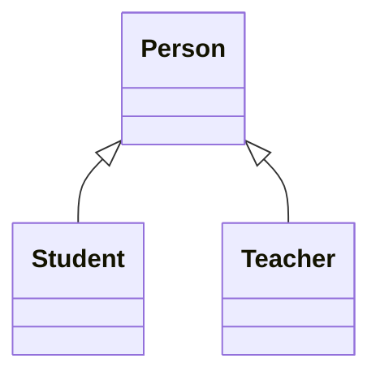
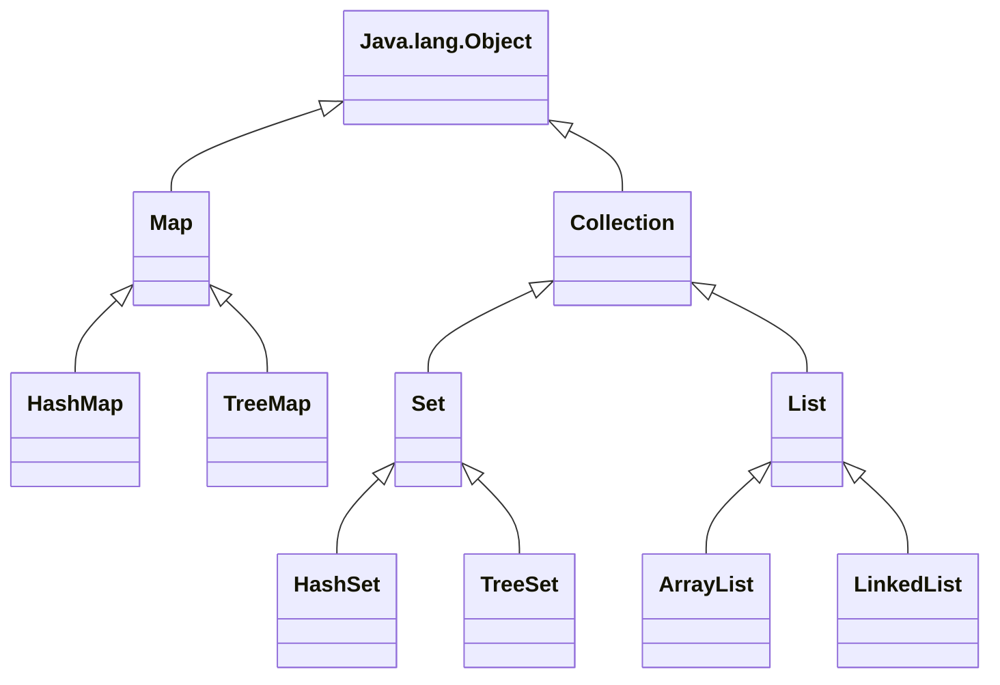
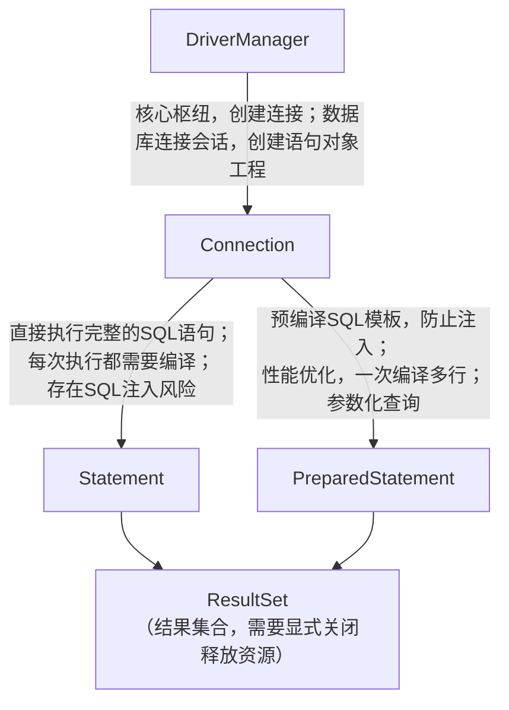

[Java知识点总结.md](https://github.com/user-attachments/files/25073051/Java.md)

# 0.Java简介
Java 是一种高级、**面向对象** 的编程语言,相比于C/C++,它优化了在开发过程中容易犯的错,如内存管理,指针悬空等; 相比于Python,性能更好.因此在开发方面,Java成为了众多程序员的选择
### 1. Java 的核心特点

- ​**跨平台性**​："Write Once, Run Anywhere"（一次编写，到处运行）是 Java 的核心理念，通过 Java 虚拟机（JVM）实现
- ​**面向对象**​：完全面向对象，支持封装、继承和多态
- ​**健壮性**​：强类型检查、自动内存管理（垃圾回收）、异常处理机制
- ​**安全性**​：提供安全管理机制，适合网络环境
- ​**多线程**​：内置多线程支持
- ​**动态性**​：支持运行时加载类和反射机制
### 2. Java 技术体系

- ​**Java SE**​ (Standard Edition)：标准版，核心 Java 平台
- ​**Java EE**​ (Enterprise Edition)：企业版，现改名为 Jakarta EE
- ​**Java ME**​ (Micro Edition)：微型版，用于嵌入式设备
- ​**JavaFX**​：富客户端应用开发平台
### 3. Java 开发环境

- ​**JDK**​ (Java Development Kit)：Java 开发工具包，包含编译器、调试器等
- ​**JRE**​ (Java Runtime Environment)：Java 运行环境
- ​**JVM**​ (Java Virtual Machine)：Java 虚拟机，执行字节码

---

# 1.基本语法
## 1.1.Java的所有关键字

|    关键字     |         说明         |     关键字      |        说明         |
| :--------: | :----------------: | :----------: | :---------------: |
|  abstract  |   表明类或者成员方法有抽象属性   |    class     |        类声明        |
|   assert   |     断言,用来调试程序      |    const     |    保留关键字,无具体含义    |
|  boolean   |      布尔类型关键字       |   continue   |     回到一个块的开始处     |
|   break    |   跳出语句,提前跳出一个代码块   |   default    |       默认选项        |
|    byte    |        字节类型        |      do      |  do...while循环关键字  |
|    case    |   在switch语句中表示分支   |    double    |      双精度浮点类型      |
|   catch    |        捕捉异常        |     else     | 分支结构中表示条件不成立时的分支  |
|    char    |        字符类型        |     enum     |        枚举         |
|  extends   |       类的继承关系       |    public    |       公有权限        |
|   final    |    常量(不可改变的属性)     |    return    |       返回语句        |
|  finally   |  声明异常处理中始终会被处理的内容  |    short     |       短整数类型       |
|   float    |        浮点类型        |    static    |     静态变量/方法声明     |
|    for     |      for循环关键字      |   strictfp   |   用于声明FP_strict   |
|    goto    |    保留关键字,没有具体含义    |    super     |       父类对象        |
|     if     |   分支结构(if语句)关键字    |    switch    |  switch类型分支结构关键字  |
| implements |    创建类和接口的实现关系     | synchronized |      线程同步关键字      |
|   import   |        导入语句        |     this     |       本类对象        |
| instanceof |     判断两个类的继承关系     |    throw     |       抛出异常        |
|    int     |        整数类型        |    throws    |    方法将异常抛向外部方法    |
| interface  |        声明接口        |  transient   |    声明不用序列化的成员域    |
|    long    |       长整数类型        |     try      |  尝试监控可能抛出异常的代码块   |
|   native   | 声明一个方法是有计算机相关语言实现的 |     var      |      声明局部变量       |
|    new     |      创建新的实例对象      |     void     |     表示方法无返回值      |
|  package   |        包语句         |   volatile   | 表明两个或多个变量必须同步发生变化 |
|  private   |        私有权限        |    while     |    while循环关键字     |
| protected  |       被保护权限        |              |                   |
> [!tip] 总结
>可以看出,Java中的关键字和C/C++中的很多关键字很像(其实用法也差不多),因此,Java对于有C尤其是C++的基础的开发者还是非常好上手的,没有基础的普通玩家,在理解了面向对象的思想后,也能够理解这些关键字!

## 1.2.输出
> [!note] 实现
> System.out.println(); -->(IDEA中使用sout直接生成)
> println表示输出的内容占一行 (ln不是数学中的自然对数,而是line的缩写,表示输出的内容独占一行)

例: 编写第一个程序,在控制台打印"Hello World"
```Java
public class Helloworld{  
       public static void main(String[] args){  
             System.out.println("Hello world\nGood Night World!");  
       }  
}
```
---
## 1.3.输入
相比于C的scanf或C++的cin>>,Java的输入框是一个Java的常用类库==Scanner==, 在每次准备输入时,我们都需要创建一个输入框**对象**, 也就是常说的new一个对象,然后使用这个new出来的输入框进行输入
==注意,我们在使用Scanner之前,需要在这个类的最前面来引入这个类==

> [!example] 例: 一小球的初始高度为10,要求用户输入反弹次数求出反弹结束后的高度
```Java
import java.util.Scanner;
public class FreeFall {  
    public static void main(String[] args) {  
        double height = 10;  
        System.out.println("请输入反弹次数:");  
        /*Scanner声明这个对象是Scanner类型,对象名为sc,
        new表示新建一个Scanner的示例对象*/
        Scanner sc = new Scanner(System.in);  
        //sc.nextInt表示下一个接收的内容为一个整数
        double n = sc.nextInt();  
        for (int i =1;i<=n;i++)  
        {  
            height/=2;  
            if(height==0)  
            {  
                break;  
            }  
            else  
                continue;  
        }  
        //在Java的输出语句中,加号在字符串之间表示字符串的拼接
        System.out.println("第"+n+"次反弹后,高度为"+height);  
    }  
}
```
---
## 1.4.分支结构
> [!note] 说明
> 分支结构分为两种,一种是if-(else if)-else, 另外一种是switch-case-default. 二者的使用场景往往不同,前者偏向于判断条件很多的情况 , 而后者的条件是可以列举出来的. 下面我们举例说明

### if-(else if)-else    
例:输入一个数字,判断平闰年
```Java
import java.util.Scanner;  
public class LeapYear {  
    public static void main(String[] args) {  
        Scanner year = new Scanner(System.in);  
        System.out.println("请输入有效年份:");  
        int Y = year.nextInt();  
        if ((Y%4==0 & Y%100!=0) | Y%400==0)  
        {  
            System.out.println(Y+"是闰年");  
        }  
        else {  
            System.out.println(Y + "不是闰年");  
        }  
        year.close();  
    }  
}
```

### switch-case-default 
 例: 输入一个整数类型的成绩(0~90,步进为10),判断成绩情况
```Java
import java.util.Scanner;  
  
public class Grade {  
    public static void main(String[] args) {  
        Scanner sc = new Scanner(System.in);  
        System.out.println("请输入一个成绩:");  
        int grade = sc.nextInt();  
        switch (grade){  
            case 90:  
                System.out.println("优秀");  
                break;  
            case 80:  
                System.out.println("良好");  
                break;  
            case 70:  
                System.out.println("及格");  
                break;  
            case 60:  
                System.out.println("不及格");  
                break;  
            case 50:  
            case 40:  
            case 30:  
            case 20:  
            case 10:  
            case 0:  
                System.out.println("不及格");  
                break;  
            default:  
                System.out.println("输入错误");  
                break;  
        }  
        //关闭扫描器,防止资源泄露  
        sc.close();  
    }  
}
```

---
## 1.5.循环结构
> [!note] 说明
> 循环结构分为**while, do...while , for ,foreach**四种方式.三者的终止循环模式略有差距

### while  -->满足循环不变式时保持循环,不满足时终止循环
例:顺序输出从1到100的数字
```Java
public class whileTest {  
    public static void main(String[] args) {  
        int i = 1;  
        while (i <= 100) {  
            System.out.println(i);  
            i++;  
        }  
    }  
}
```
### do...while -->与while类似,但是是在先执行一遍内容,再执行对循环不变式的判断
```Java
public class dowhileTest {  
    public static void main(String[] args){  
        int i = 1;  
        do{  
            System.out.println("hello world");  
            i++;  
        }while(i<=5);  
    }  
}
```
### for --> 循环判断多为对执行次数的判定
```Java
public class ForTest {  
    public static void main(String[] args) {  
        for (int i = 0; i < 5; i++) {  
            System.out.println( i);  
        }  
    }  
}
```
### foreach -->是for的简化版本,格式为for(元素类型 x : 遍历对象obj)
```Java
public class ArrTest {  
    public static void main(String[] args) {  
        int[]arr={1,2,3,4,5};  
        for (int i = 0; i < arr.length; i++) {  
            if (arr[i]%2==0)  
            {  
                arr[i]/=2;  
            }  
            else  
            {  
                arr[i]*=2;  
            }  
        }  
        //遍历数组arr中的每个整数元素j
        for (int j : arr) {  
            System.out.println(j);  
        }  
    }  
}
```

嵌套循环具体的实现根据需求灵活应用

---
## 1.6.数组
> [!note] 说明
> 在Java中, 数组的**长度是确定**的,一旦被创建,大小就锁死,不可改变

### 一维数组
Java中的数组定义方式与C有所不同,格式为: 元素类型 数组名 = new 元素类型 `[ 元素个数 ]`
或者直接指定数组的内容
```Java
//直接指定
int[]arr={1,2,3,4,5};
//声明+分配
int month[] = new int[12]
```
### 二维数组
二维数组本质是数组元素为一维数组的一维数组.声明方式如下
```Java
int arr[][] = new int [3][4];
```

遍历二维数组通常使用嵌套循环.

---
## 1.7.方法(重要)
方法就是类中的成员函数,由修饰符,返回值类型,方法名,参数组成
在使用方法解决问题之前,我们需要考虑如下问题:
- 这个方法的调用范围是什么?(类内外均可调用为public,类内可调用外不可调用为private)
- 这个方法**要不要返回值**?
- 如果要返回值,需要返回个**什么类型**的值?
- 我这个方法的**参数**是什么?(我**要操作的目标**是什么?)

题目: 拟定数组,完成两个方法: 输出数组 , 为数组排序

先完成以上思考,我们发现,在排序的方法里,不需要返回值(这个方法是个纯粹的操作的过程), 操作的目标是一个整型的数组. 输出数组的方法经过分析,发现也不需要返回值(因为在方法内就使用了输出语句),操作对象也是一个整型数组.于是,我们开始编写代码

有人会问这个权限的问题,由于是在同一个类中编写的方法,将排序和输出的权限改为私有仍然可以运行(类内调用).以这个输出数组为例,如果我在另外一个类中也要调用这个输出的方法,我这个方法的权限就只能是public了

例:构建数组并实现冒泡排序
```Java
import java.util.Scanner;  
  
public class BubbleSort  
{  
    public static void main(String[] args)  
    {  
        Scanner sc = new Scanner(System.in);  
        int[] arr = new int[10];  
        System.out.println("为数组元素赋值:");  
        for (int i = 0; i < 10; i++)  
        {  
            arr[i] = sc.nextInt();  
        }  
        BubbleSort.sort(arr);  
    }  
  
  
    public static void sort(int[] arr)  
    {  
        {  
            for (int i = 1; i <10; i++) {  
                for (int j = 0; j < 10-i; j++) {  
                    if (arr[j]>arr[j+1])  
                    {  
                        int tmp=arr[j];  
                        arr[j]=arr[j+1];  
                        arr[j+1]=tmp;  
                    }  
                }  
            }  
            ShowArray(arr);  
        }  
    }  
  
  
  
  
    public static void ShowArray(int[]arr)  
    {  
        for (int i : arr)  
        {  
            System.out.print(i+"\t");  
        }  
        System.out.println();  
    }  
  
}
```

阶段练习:使用基本内容写一个推箱子小游戏

---
# 2.面向对象编程(重点)
## 2.0.面向对象介绍

> [!note] 在学习完基础的内容之后,我们发现,Java与接触过的C/C++不同,它的文件形式是*Java类*
> 1. Java类和C文件的本质区别
> 	- C/C++: 以**函数**为基本单元, 文件是函数的集合
> 	- Java: 以**类**为基本单元,文件是类的载体
> 2. 编译逻辑
> 	- C/C++：单独编译源文件后链接（如 `g++ main.cpp utils.cpp`）
> 	- Java：每个类独立编译为`.class`文件，运行时由JVM动态加载
> 3. *权限关键字的使用*
> Java通过权限修饰符来限制严格的封装控制
> - public -> 暴露API接口,允许外部访问
> - private -> 隐藏内部实现细节(如字段私有化,然后通过getter和setter进行跨类的调用)
> - protected -> 允许子类继承修改,但是禁止外部访问
> 
> 接下来我将用几个形象的例子对这三个关键字进行解释
> 
> - private -> 锁在抽屉中的日记本
> 	- 你自己可以任意读写其中的内容
> 	- 你妈妈(同包), 你儿子(子类), 陌生人(其他类)想偷看都会报错
> 	- 本质: 绝对的隐私保护,必须通过你提供的方法来进行访问
> ```Java
> class Diary{
> 	private String msg = "我喜欢xxx";
> 	public void tearDiaryPage(){
> 		msg = "日记已被撕毁";
> 	}
> }
> ```
> - protected -> 家族保险箱
> 	- 你和你的孩子们(子类)都可以打开
> 	- 邻居(同包非子类)和陌生人(其他类)无法触碰
> 	- 本质: 家庭继承特权,外人无法访问
> ```Java
> class FamilyVault{
> 	protected String money = "1000万元";
> 	void  showToFamily(){
> 		System.out.println(money);
> 	}
> }
> class Son extends FamilyVault{
> 	void pay(){
> 		System.out.println("孩子花掉了"+money); //子类可以直接使用
> 	}
> }
> ```
> - public -> ATM机
> 	- 用户只能通过机器上的按钮进行操作(*public方法*)
> 	- 内部的运行逻辑完全不可见(*private字段/方法*)
> ```Java
> class ATM{
> 	//公共操作按钮
> 	public void withdraw(int amount){
> 		if(checkBalance() >= amount){
> 			dispenseCash(amount);
> 		}
> 	}
> 	//余额检查逻辑不可见
> 	private int checkBalance(){...}
> 	//出钱机制不可见
> 	private void dispenseCash(int n){...}
> }
> ```
> 


>[!note]  知道了类的相关细节,那么对象又是什么呢
>想象你正在导演一场戏剧，面向对象编程(OOP)就像是这场戏剧的剧本创作方式。让我们用生动的比喻来理解这个编程范式：
>1. 🎭 角色与演员：类与对象
>在OOP中，​**类(Class)​**就像是角色的剧本大纲。比如"英雄"这个角色有大纲描述了他的能力、性格特征等。而**对象(Object)​**则是根据这个大纲实际登台表演的演员 - 比如"蜘蛛侠"就是"英雄"类的一个具体==实例==。
>
>2. 🎒 角色的装备：属性 ->每个角色都有自己的**属性(Properties)​**​：
>	- 英雄可能装备着"振金盾牌"(属性值)
>	- 拥有"超级力量"(属性值)
>	- 穿着"红色斗篷"(属性值)
>这些属性定义了角色的**状态和特征**。
>
>3. 🎬 角色的动作：方法 -> 角色的**方法(Methods)​**是他们能执行的动作：
>	- 英雄可以"飞行()"
>	- 可以"发射激光()"
>	- 可以"自我修复()"
>这些方法定义了角色**能做什么**。
>
>4. 👨👦 家族传承：继承 -> **继承(Inheritance)​**就像家族遗传：
>	- "钢铁侠"类可以继承自更通用的"超级英雄"类
>	- 孩子继承了父母的特征，但可以添加自己独特的能力
>	- 这避免了重复编写相似的代码
>
>5. 🕵️‍♂️ 多重身份：多态 -> **多态(Polymorphism)​**让角色可以以不同形式出现：
>	- 一个"攻击()"方法，对于弓箭手是射箭，对于法师是施法
>	- 同样的方法名，**根据对象类型不同而有不同实现**
>6. 🔒 秘密日记：封装  **封装(Encapsulation)​**就像角色的秘密日记：
>	- 把数据(属性)和操作数据的方法捆绑在一起
>	- 隐藏内部实现细节，只暴露必要的接口
>	- 就像你不需要知道手机如何工作，只需知道怎么使用它
>
>7. 🤝 角色关系：关联、聚合与组合
>	- ​**关联**​：英雄认识记者(松散关系)
>	- **聚合**​：复仇者联盟由多个英雄组成(整体与部分可独立存在)
>	- **组合**​：手臂是身体的一部分(部分不能脱离整体存在)
>


---
## 2.1.类和对象基本内容
如,我们创建一个手机对象,它的**属性**有品牌,价格等,它的**行为**(方法)有打电话,玩游戏等.

> [!warning] 注意!
> 对象的方法的默认权限为**private**,只能在同一个包内调用.若要在包外的类调用必须显式声明为public

例:构建手机类,实现基本方法,如打电话,玩游戏
```java
//  类:描述一类事物     
    //  JavaBean 类,不包含main方法,编写一系列属性和方法描述事物 //  
    //1.成员变量--属性//  
    /*  完整格式:修饰符 数据类型 变量名 = 初始化值  
    一般不需要指定初始化值,存在默认值.  
      整数--0,小数--0.0,布尔--false,引用类型--NULL*/  
public class Phone { 
    String brand;  
    double price;  
    //构造函数  
    public Phone(String brand , double price) {  
        this.brand = brand;  
        this.price = price;  
    }  
    public Phone(){  
        this.brand = "苹果";  
        this.price = 8888;  
    }  
    public Phone(double price){  
        this.brand = "华为";  
        this.price = price;  
    }  
    //2成员方法--行为//  
    public void call()  
    {  
        System.out.println("手机在打电话");  
    }  
    public void playgame(){  
        System.out.println("手机在玩游戏");  
    }  
}
```

在测试类中,我们创建(new)了3个新的手机对象的实例p1,p2,p3
```Java
/*  对象,类比C的结构体,包含了一个事物的多种属性    */
public class PhoneTest {  
    //测试类:包含main方法//  
    public static void main(String[] args) {  
        //创建对象//-->new  
        //方法(函数)的重载,接受的参数不同,输出内容可能会有所不同
        Phone p1 = new Phone("小米",1999.9);  
        Phone p2 = new Phone();  
        Phone p3 = new Phone(7499);
        //获取对象中的值//  
        System.out.println(p1.brand);  
        System.out.println(p1.price);  
        System.out.println(p2.brand);  
        System.out.println(p2.price);  
        System.out.println(p3.brand);  
        System.out.println(p3.price);  
  
  
        //调用对象的方法//  
        p1.call();  
        p2.call();  
        p3.call();  
        p1.playgame();  
        p2.playgame();  
        p3.playgame();  
  
    }  
}
```
输出结果如下
```text
小米
1999.9
苹果
8888.0
华为
7499.0
手机在打电话
手机在打电话
手机在打电话
手机在玩游戏
手机在玩游戏
手机在玩游戏
```

---

## 2.2. 封装-->高内聚,低耦合
- 内部细节由自己完成,不允许外部干涉.仅允许个别方法供外部使用
- 属性私有,使用**get/set方法**供外部调用数据
以一个学生类举例,其中id,name,age均为private.如果此时直接在Test类中去使用`student.id`,会报错.所以我们需要用get和set的公有方法来供Test类来调用,来设置/获取信息
```jAVA
public class Student {  
    private int id;  
    private String name;  
    private int age;  
  
  
    public Student() {  
    }  
  
    public Student(int id, String name, int age) {  
        this.id = id;  
        this.name = name;  
        this.age = age;  
    }  
  
    /**  
     * 获取  
     * @return id  
     */    
    public int getId() {  
        return id;  
    }  
  
    /**  
     * 设置  
     * @param id  
     */  
    public void setId(int id) {  
        this.id = id;  
    }  
  
    /**  
     * 获取  
     * @return name  
     */    
    public String getName() {  
        return name;  
    }  
  
    /**  
     * 设置  
     * @param name  
     */  
    public void setName(String name) {  
        this.name = name;  
    }  
  
    /**  
     * 获取  
     * @return age  
     */    
     public int getAge() {  
        return age;  
    }  
  
    /**  
     * 设置  
     * @param age  
     */  
    public void setAge(int age) {  
        this.age = age;  
    }  
  
    public String toString() {  
        return "Student{id = " + id + ", name = " + name + ", age = " + age + "}";  
    }  
}
```

```Java
public class Test {  
    public static void main(String[] args) {  
        Student []arr = new Student[3];  
        Student st1 = new Student(1,"张三",23);  
        Student st2 = new Student(2,"李四",24);  
        Student st3 = new Student(3,"王五",25);  
  
        arr[0]=st1;  
        arr[1]=st2;  
        arr[2]=st3;  
        //删除一个对象//  
        int index = getIndex(arr,2);  
        //System.out.println(index);//  
        if (index>=0){  
            arr[index]=null;  
            Print(arr);  
        }  
        else {  
            System.out.println("ID不存在,删除失败!");  
        }  
        //再添加一个对象并进行唯一性的判断//  
        Student st4 = new Student(4,"赵六",24);  
        //唯一性判断--已存在->不添加;不存在->添加进数组  
        boolean flag = contains(arr,st4.getId());  
        if (flag){  
            System.out.println("当前ID重复,请修改后再添加!");  
        }  
        else{  
            int count = getCount(arr);  
            if (count == arr.length){  
                //已经存满,创建新数组,长度为原数组长度+1  
                Student[]NewArr = CreateNewArr(arr);  
                //将新的元素插入'  
                NewArr[count]=st4;  
                //添加后遍历所有信息  
                Print(NewArr);  
            }  
            else {  
                arr[count] = st4;  
            }  
        }  
        //数组已经存满了,创建新数组,长度为4//  
    }  
    //打印元素的方法  
    public static void Print(Student[]arr){  
        for (int i = 0; i < arr.length; i++) {  
            Student stu = arr[i];  
            if (stu!=null){  
                System.out.println(stu.getName()+','+stu.getId()+','+stu.getAge());  
            }  
        }  
    }  
    //判断数组存放多少元素的方法  
    public static int getCount(Student[]arr){  
        //计数器  
        int Count = 0;  
        for (int i = 0; i < arr.length; i++) {  
            if(arr[i]!=null){  
                Count++;  
            }  
        }  
        return Count;  
    }  
    //创建新数组的方法  
    public static Student[] CreateNewArr(Student[]arr){  
        Student[]newArr = new Student[arr.length+1];  
        for (int i = 0; i < arr.length; i++) {  
            newArr[i]=arr[i];  
        }  
        return newArr;  
    }  
    //判断学号唯一的方法//  
    public static boolean contains(Student[]arr,int id){  
        for (int i = 0; i < arr.length; i++) {  
            //获取对象  
            Student stu = arr[i];  
            if (stu!=null){  
                int sid = stu.getId();  
                if (sid==id){  
                    return  true;  
                }  
            }  
            //获取ID  
        }  
        return  false;  
    }  
    //找id在数组索引//  
    public static int getIndex(Student[]arr,int id){  
        for (int i = 0; i < arr.length; i++) {  
            //依次得到每个学生对象//  
            Student stu = arr[i];  
            if (stu!=null){  
                int sid = stu.getId();  
                if(sid == id){  
                    return i;//输出对应的索引//  
                }  
            }  
        }  
        return -1;  
    }  
  
}
```


---

## 2.3.继承-->extends-->表示子类是父类的扩展
- 继承是**类和类之间的关系**
- 继承关系的两个类,一个为父类(基类)一个为子类(派生类),子类继承父类,用extends表示
- 子父类之间,从意义上讲应有"is a"的关系.如Student is a person
- 所有的继承源于Object类,也就是说,Object类是所有类的父类
```java
package extendDemo;  
  
public class Person {  
    public void say(){  
        System.out.println("说了一句话.");  
    }  
    public int money(){  
         return 100000;  
    }  
}
```
```Java
package extendDemo;  
  
public class Student extends Person{  
    public int score(){  
        return 80;  
    }  
}
```
```Java
package extendDemo;  
  
public class Test {  
    public static void main(String[] args) {  
        Student stu = new Student();  
        stu.say();  
        System.out.println(stu.money());  
        System.out.println(stu.score());  
  
        Person person = new Person();  
        person.say();  
        System.out.println(person.money());  
//        System.out.println(person.score());   错误!!!  
    }  
}
```
学生类继承了person类,也就能调用person中的方法.但是person对象无法使用student的方法

> [!warning] 注意
> Java中**类之间**只有单继承,没有多继承


> [!question] 思考：子类如何访问父类的私有内容？
> 在Java中，子类无法直接访问父类的私有成员，因为**私有成员的访问权限被严格限制**。要实现父类的私有内容，需通过以下方法间接访问：
> 
> 1. 通过父类的公共方法或属性
> 父类如果提供了获取 private 成员 public 方法，子类就可以通过调用这些方法间接访问私有内容
> ```java
> class Parent { 
> 	private String privateField = "私有值"; 
> 	public String getPrivateField() { 
> 		return privateField; // 公共方法返回私有字段 
> 	} 
> } 
> class Child extends Parent { 
> 	public void accessPrivateField() { 
> 		String value = super.getPrivateField(); // 通过父类方法访问 System.out.println("子类获取的私有字段值: " + value); 
> 	  } 
>  }
> ```
> 2. 通过构造函数传递参数
> 若父类私有字段在构造函数中初始化，子类可通过传递参数触发父类的构造函数，间接获取私有字段。例如：
> ```java
> class Parent { 
> 	private String name; 
> 	public Parent(String name) { 
> 		this.name = name; // 初始化私有字段 
> 	} 
> } 
>  class Child extends Parent { 
> 	  public Child(String name) { 
> 		super(name); // 调用父类构造函数，传递参数 
> 		System.out.println("子类构造函数调用父类私有字段: " + name); 
> 	  } 
>   }
> ```
> 3. 继承父类的公共属性
> 若父类将私有字段暴露为公共属性（如静态常量），子类可直接访问：
> ```java
> class Parent { 
> 	private static final String PRIVATE静态常量 = "私有静态常量"; 
> } 
> class Child extends Parent { 
> 	public static void main(String[] args) { 
> 		System.out.println(PUBLIC静态常量); // 通过静态常量访问 
> 	} 
> }
> ```
> 4. 反射（不安全）
> 通过`java.lang.reflect`包的API，可强制访问父类的私有字段，但**破坏封装且不安全**：
> ```java
> import java.lang.reflect.Field; 
> class Parent { 
> 	private String privateField = "私有值"; 
> } 
> class Child extends Parent { 
> 	public void reflectAccess() { 
> 		Field privateFieldField =Child.class.getDeclaredField("privateField"); privateFieldField.setAccessible(true); // 破坏私有性 String value = (String) privateFieldField.get(this); // 获取私有字段值 System.out.println("通过反射访问私有字段: " + value); 
> 	} 
> }
> ```
> 

> [!summary] 总结
> 继承是Java实现代码复用和层次化设计的核心机制，通过 `extends` 关键字实现。子类可以访问父类的非私有成员，但私有成员需通过公共方法或构造函数间接访问。继承与多态结合，允许同一接口的不同实现，提升程序的灵活性。需要注意Java的单继承特性、构造函数调用规则、访问权限控制以及异常处理的限制。

---
## 2.4 详解this和super关键字

#### 2.4.1. this关键字
> [!note] 定义与作用
> `this`关键字用于在方法或构造函数内部**引用当前实例**（即调用者对象）。它允许方法或构造函数访问**本类的私有成员**，并实现**多态调用**。

> [!example] 使用场景
1. **访问当前实例的私有字段**  
   ```java
   public class Student {
       private String name;
       private int age;
       
    public Student(String name, int age) {
        this.name = name; // 使用this访问当前实例的name字段
        this.age = age;
    }
}
```

2. **多态调用父类方法**

```java
public class Child extends Parent {
    public void method() {
        this.method(); // 调用本类的方法（若为静态方法需注意）
        super.method(); // 调用父类方法
    }
}
```

3. **构造方法中的参数传递**
```java
public class Circle {
   private int radius;
        
    public Circle(int radius) {
        this.radius = radius; // this用于关联当前实例的radius字段
    }
}
```

> [!attention] 注意
> - **不能用于静态方法或局部变量**：`this`仅指向当前实例，静态方法无实例，局部变量不可访问。
> - **避免重复使用**：在循环或递归中需谨慎，可能导致逻辑错误。
> - **多态调用的优先级**：`this`和`super`的调用顺序需与继承关系一致。

#### 2.4.2. super关键字

> [!note] 定义与作用
> super关键字用于在子类中**引用父类对象**，实现**父类方法或字段的覆盖**。在构造函数中，`super`用于调用父类的构造方法。

> [!example] 使用场景
1. **调用父类构造方法**
```java
public class Child extends Parent {
    public Child(int param) {
        super(param); // 调用父类构造方法
    }
}
```

2. **重写父类方法**
```java
public class Derived extends Base {
    @Override
    public void print() {
        super.print(); // 调用父类print方法
        System.out.println("子类扩展内容"); // 添加子类逻辑
    }
}
```

3. **访问父类私有字段**
```java
public class Child extends Parent {
    public void showParentField() {
        // 通过super访问父类name字段
        System.out.println("父类字段值: " + super.name);
    }
}
```

> [!attention] 注意
> - **权限检查**：父类方法/字段需满足访问权限（如`private`字段仅能通过本类方法访问）。
> - **构造函数调用**：`super`必须在子类构造函数**第一个语句**调用，否则抛出`IllegalStateException`。
> - **多态覆盖**：若子类重写方法，需通过`super`调用父类原始方法（非重写后方法）。

#### 2.4.3. this与super的典型应用

> [!example] 示例1：多态方法调用
```java
public class Animal {
    public void eat() {
        System.out.println("动物在进食");
    }
}

public class Dog extends Animal {
    @Override
    public void eat() {
        super.eat(); // 调用父类eat方法
        System.out.println("狗在啃骨头");
    }
}

public class Main {
    public static void main(String[] args) {
        Animal a = new Dog();
        a.eat(); // 输出：动物在进食\n狗在啃骨头
    }
}
```

> [!example] 示例2：构造函数传递参数
```java
public class Person {
    private String name;
    private int age;
    
    public Person(String name, int age) {
        this.name = name;
        this.age = age;
    }
}

public class Student extends Person {
    public Student(String name, int age, int grade) {
        super(name, age); // 调用父类构造方法初始化部分参数
        this.grade = grade;
    }
    
    private int grade;
    
    public void display() {
        super.display(); // 调用父类display方法（若存在）
        System.out.println("成绩: " + grade);
    }
}
```

#### 2.4.4. 常见错误与最佳实践

> [!example] 错误示例1：this在静态方法中的误用
```java
public class Test {
    public static void main(String[] args) {
        Test t = new Test();
        t静态方法(); // 编译错误：this不能用于静态方法
    }
    
    private static void 静态方法() {
        this; // 语法错误：静态方法无this
    }
}
```

> [!example] 错误示例2：super在非继承类中的调用
```java
public class NonChild {
    public void method() {
        super(); // 编译错误：非继承类调用super
    }
}
```

**最佳实践**

1. **明确访问对象**：

```java
public void printInfo() {
    System.out.println("当前对象: " + this); // 输出实例对象地址
    System.out.println("父对象: " + super); // 输出父类实例地址
}
```
    
2. **构造函数链式调用**：

```java
public class Child extends Parent {
    public Child(int param) {
        super(param); // 链式调用父类构造方法
    }
}
```

3. **多态方法优先级**：

```java
public class Base {
    public void abstractMethod() {
        System.out.println("基类方法");
    }
}
    
public class Derived extends Base {
    @Override
    public void abstractMethod() {
        super.abstractMethod(); // 调用父类原始方法
        System.out.println("子类方法扩展");
    }
}
```

#### 2.4.5. this和super的对比总结

|对比项|this关键字|super关键字|
|:-:|:-:|:-:|
|**作用对象**|当前实例（调用者对象）|父类对象（隐式或显式）|
|**使用场景**|访问当前实例的成员|调用父类方法/字段或构造函数|
|**继承关系**|仅在子类中可用|子类与父类必须存在继承关系|
|**语法限制**|不能用于静态方法或局部变量|不能用于本类方法或字段|
|**典型操作**|`this.name = "实例值";`|`super.name = "父类值";`|

> [!summary] 示例代码整合
```java
public class Parent {
    private String commonField = "公共字段";
    public void commonMethod() {
        System.out.println("父类方法");
    }
}

public class Child extends Parent {
    private String childField = "子类字段";
    
    public Child(String name) {
        super(name); // 调用父类构造方法初始化commonField
        this.childField = name;
    }
    
    @Override
    public void commonMethod() {
        super.commonMethod(); // 调用父类方法
        System.out.println("子类扩展输出: " + this.childField);
    }
}

public class Main {
    public static void main(String[] args) {
        Child child = new Child("张三");
        child.commonMethod(); // 输出：父类方法\n子类扩展输出: 张三
    }
}
```

**运行结果**
```text
父类方法
子类扩展输出: 张三
```

---
## 2.5.方法的重写
- 需要有继承关系,子类方法重写父类方法
- 方法名必须相同,方法体可以不同
- 参数列表必须相同(否则会成为重载)
- 修饰符范围可以扩大不可以缩小    **public>protected>default>private**
- 抛出的异常: 范围可以被缩小不可以被扩大   `ClassNotFoundException`
- 为什么需要重写? --> 父类的功能子类不一定需要或不一定满足

```java
public class B {  
    public  void test(){  
        System.out.println("B.test()");  
    }  
}

public class A extends B{  
    @Override  
    public  void test() {  
        System.out.println("A.test()");  
    }  
}

public class Text2 {  
    public static void main(String[] args) {  
        //静态方法-->方法调用只和左边的类型相关  
        A a = new A();  
        a.test();   //A  
        //父类的引用指向了子类  
        B b = new A();  //子类重写了父类的方法  
        b.test();   //B  
    }  
}
```
运行结果如下
```text
A.test()
A.test()
```

---
## 2.6.多态-->实现**动态编译**
- 多态是**方法的多态**,属性没有多态
- 父类和子类必须有联系,否则会出现类型转换异常 `ClassCastException`
- 存在条件: 存在继承关系, 方法需要重写, 父类的引用指向的是子类
- static方法属于类不属于示例
- final常量
- private无法重写,不可能存在多态

> [!example] 举例:图形计算
> 矩形和圆的计算方式肯定不同,需要有自己的计算方式,所以需要重写方法.
```Java
public class PolymorphismExample {
    public static void main(String[] args) {
        // ============= 多态的核心体现 =============
        // 父类Shape的引用，指向子类Circle对象
        Shape shape1 = new Circle(5.0);
        // 父类Shape的引用，指向子类Rectangle对象
        Shape shape2 = new Rectangle(4.0, 6.0);
        
        // 同一个方法调用，根据实际对象类型表现出不同行为
        System.out.println("圆形面积: " + shape1.calculateArea()); // 输出圆的面积
        System.out.println("矩形面积: " + shape2.calculateArea()); // 输出矩形面积
        
        // ============= 多态在集合中的应用 =============
        Shape[] shapes = new Shape[2];
        shapes[0] = new Circle(3.0);
        shapes[1] = new Rectangle(2.0, 4.0);
        
        // 遍历时无需知道具体子类类型
        for (Shape shape : shapes) {
            System.out.println("图形面积: " + shape.calculateArea());
        }
    }
}

/**
 * 父类：抽象图形类（包含抽象方法）
 */
abstract class Shape {
    // 抽象方法：由子类实现具体计算逻辑
    public abstract double calculateArea();
}

/**
 * 子类1：圆形
 */
class Circle extends Shape {
    private double radius;

    public Circle(double radius) {
        this.radius = radius;
    }

    // 重写父类抽象方法（实现多态的关键）
    @Override
    public double calculateArea() {
        return Math.PI * radius * radius;
    }
}

/**
 * 子类2：矩形
 */
class Rectangle extends Shape {
    private double width;
    private double height;

    public Rectangle(double width, double height) {
        this.width = width;
        this.height = height;
    }

    // 重写父类抽象方法（实现多态的关键）
    @Override
    public double calculateArea() {
        return width * height;
    }
}
```


---
## 2.7.instanceof关键字-->判断两个类的继承关系

Person和String无关联,直接报错
```Java
package extendDemo;  
  
import java.util.Objects;  
  
public class Test1 {  
    public static void main(String[] args) {  
        Object object = new Student();  
  
        System.out.println(object instanceof Student);  
        System.out.println(object instanceof Person);  
        System.out.println(object instanceof Object);  
        System.out.println(object instanceof Teacher);  
        System.out.println(object instanceof String);  
        System.out.println("==================================");  
        Person person = new Student();  
        System.out.println(person instanceof Object);  
        System.out.println(person instanceof Person);  
        System.out.println(person instanceof Student);  
        System.out.println(person instanceof Teacher);  
//        System.out.println(person instanceof String);  报错
        System.out.println("==================================");  
        Student student = new Student();  
        System.out.println(student instanceof Object);  
        System.out.println(student instanceof Person);  
        System.out.println(student instanceof Student);  
//        System.out.println(student instanceof Teacher);  报错
    }  
}
```

运行结果:
```text
true
true
true
false
false
==================================
true
true
true
false
==================================
true
true
true
```

---
## 2.8.类型转换
> [!example] 高转低
```Java
public class Test3 {  
    public static void main(String[] args) {  
        Person zhangSan = new Student();  
        Student student = (Student)zhangSan;  
        student.say();  
    }  
}
```

> [!attention] 注意
> 低转高可能会丢失自己的一些方法(不安全)

---
## 2.9.static关键字-->使用类名访问
- 属于类而非对象
- 在类加载时初始化    
- 所有对象共享同一份静态成员
```java
class Employee {
    int id;         // 实例变量（每个对象独立）
    static String company = "ABC Corp"; // 静态变量（所有对象共享）
    
    Employee(int id) {
        this.id = id;
    }
    
    void display() {
        System.out.println(id + " " + company);
    }
}

public class Test {
    public static void main(String[] args) {
        Employee e1 = new Employee(101);
        Employee e2 = new Employee(102);
        
        e1.display(); // 输出：101 ABC Corp
        e2.display(); // 输出：102 ABC Corp
        
        // 修改静态变量会影响所有实例
        Employee.company = "XYZ Inc";
        e1.display(); // 输出：101 XYZ Inc
        e2.display(); // 输出：102 XYZ Inc
    }
}
```

运行结果:
```text
101 ABC Corp
102 ABC Corp
101 XYZ Inc
102 XYZ Inc
```
---

## 2.10.抽象类(abstract)和接口(interface)
### 抽象类
- 由abstract修饰
- 抽象类的所有方法,集成了它的**子类必须实现它的方法**
- 不能被实例化,只能靠子类实现(一般将抽象类定义为父类)
- *抽象方法必须在抽象类中*
- 抽象类中可以有普通方法
```Java
public abstract  class Parent {  
    abstract void show();  
}
```

### 接口-->约束作用, 做到约束和实现分离
> [!note] 引入
> 提到接口,我们不由会联想到生活中常见的东西,如电脑上的各种接口,排查的插销等,这些都是实体的"接口",它们的共同特点是**符合某一规范**(如USB,Type-C,HDMI,或是插座的形状规范),但是不限制具体的内容是什么. 

那么在任何面向对象的编程中, 接口这个概念与生活中的接口类似, 起到一个**约束和规范**的作用,具体特点如下:
- 接口可以实现多继承
- 接口是纯粹的抽象类
- 接口不能被实例化, 因而接口中没有构造方法, 也就是说类的构造和接口并无关联
- 必须重写接口中的方法
```Java
public interface Paintable {  
    public void paint();  
}

public class Quadrangle {  
    public void doAnything()  
    {  
        System.out.println("四边形");  
    }  
}

public class Square extends Quadrangle implements Paintable{  
    public void paint()  
    {  
        System.out.println("画一个正方形");  
    }  
}

public class Circle implements Paintable{  
    public void paint()  
    {  
        System.out.println("画一个圆形");  
    }  
}

public class Test {  
    public static void main(String[] args) {  
        Square square = new Square();  
        Circle circle = new Circle();  
        Quadrangle quadrangle = new Quadrangle();  
        square.paint();  
        circle.paint();  
        quadrangle.doAnything();  
    }  
}
```
运行结果:
```text
画一个正方形
画一个圆形
四边形
```

> [!question] 思考：我们在看一些接口（如Collection，List）的源代码时会发现其中有的函数有函数体，这是否违背了接口的设计原则？
> 答案是：从Java8之后，Java引入了**默认方法**
> 默认方法是接口中使用 `default` 关键字定义的方法，它提供了一个默认实现。
> 1. 定义
> ```java
> public interface MyInterface { 
> 	// 抽象方法（必须被实现类覆盖） 
> 	void abstractMethod(); 
> 	// 默认方法（可直接使用，或被实现类覆盖） 
> 	default void defaultMethod() { 
> 		System.out.println("这是默认方法的默认实现"); 
> 	} 
> }
> ```
> 2. 默认方法的作用
> 	- **接口扩展**：在不破坏已有实现类的情况下，为接口添加新方法
> 	- **向后兼容**：已有实现类无需修改即可使用新方法
> 	- **支持函数式编程**：与lambda表达式结合，简化代码
> 3. 使用场景
> 	- **接口扩展**：当需要为接口添加新功能时，避免修改所有实现类。
> 	- **工具方法**：定义一些通用方法，供实现类直接调用。
> 	- **与抽象方法结合**：接口中可以同时包含抽象方法和默认方法，实现类需覆盖抽象方法。
> 
> 示例：Java8中的`Iterable`接口新增了`forEach()`方法，允许集合直接遍历
> ```java
> public interface Iterable<T> { 
> 	// 抽象方法 
> 	Iterator<T> iterator(); 
> 		// 默认方法 
> 	default void forEach(Consumer<? super T> action) { Objects.requireNonNull(action); 
> 		for (T t : this) { 
> 			action.accept(t); 
> 		} 
> 	} 
> }
> ```
> 4. 注意事项
> 	- **实现类优先级**：如果实现类覆盖了默认方法，优先使用实现类的版本。
> 	- **静态方法**：接口中可以定义静态方法（Java 8新增），但静态方法不能与默认方法冲突。
> 	- **与Lambda表达式结合**：默认方法可以与函数式接口的Lambda实现共存。
> 5. 优缺点
> 	- *优点*
> 		- 促进接口演化
> 		- 减少实现类的修改
> 		- 支持函数式编程和lambda表达式
> 	- *缺点*
> 		- 可能导致接口实现复杂性增加
> 		- 需要处理多接口默认方法冲突
> 6. 总结
> 默认方法是Java 8引入的重要特性，它允许接口在不破坏现有实现类的情况下*扩展功能*。通过 `default` 关键字定义，默认方法可以被实现类直接使用或覆盖。这一特性提升了接口的灵活性，是Java向函数式编程演进的关键一步。


---
## 2.11.包和内部类
### 包
> [!note] 说明
> 包在整个管理过程中起到了非常重要的作用,使用包可以有效地管理繁杂的类文件, 解决类重名的问题.在类中使用包和权限可以控制其他人对类成员的访问.同时,也解决了类名冲突的问题.
如,我现在在写项目,有若干个包(文件夹),我跨包调用时,就会用到**import**来导入相应包中的内容

```Java
//Service包
package com.Service;
//导入包中的一个服务类
import Service.UserService;
//导入其他内容(如系统自带的包)
import java.util.List;
import java.util.Map;
//========================================//

//类的详细内容
public class Controller(){
	...
}

```
import除了能够导入包, 还可以导入静态内容(静态变量和方法)
```Java
package com.mr;
import static java.lang.Math.max;    //静态成员方法
import static java.lang.System.out;  //导入静态成员变量
public class ImportTest(){
	public static void main(String[]args){
		out.println("1和4中,最大值为"+max(1,4));
	}
}
```


### 内部类
> [!note] 说明
> 如果在类中再定义一个类,那么这个类称为内部类.内部类又分为**成员内部类**和**匿名内部类**

#### 成员内部类
> [!note] 定义
> 成员内部类是最常见的内部类，它定义在外部类的成员位置（与字段、方法同级)
在一个类中使用内部类,可以在内部类中直接存取其所在类中的私有变量

```Java
// 外部类
public class OuterClass {
    private String outerField = "外部类字段";
    
    // 成员内部类
    public class InnerClass {
        private String innerField = "内部类字段";
        
        public void display() {
            System.out.println("访问外部类字段: " + outerField);//可以直接访问外部类私有成员
            System.out.println("访问内部类字段: " + innerField);
        }
    }
    
    public void createInner() {
        InnerClass inner = new InnerClass();
        inner.display();
    }
}

// 测试类
public class Test {
    public static void main(String[] args) {
        // 创建外部类实例
        OuterClass outer = new OuterClass();
        
        // 通过外部类实例创建内部类实例
        OuterClass.InnerClass inner = outer.new InnerClass();
        inner.display();
        
        // 或者通过外部类方法创建
        outer.createInner();
    }
}
```
#### 匿名内部类
> [!note] 定义
> 匿名内部类是没有名字的内部类，通常用于实现接口或继承类的一次性使用场景

```java
// 接口
interface Greeting {
    void greet();
}

// 外部类
public class AnonymousInnerClassDemo {
    public static void main(String[] args) {
        // 匿名内部类实现接口
        Greeting greeting = new Greeting() {
            @Override
            public void greet() {
                System.out.println("你好，这是匿名内部类的问候！");
            }
        };
        greeting.greet();
        
        // 匿名内部类继承类
        Thread thread = new Thread() {
            @Override
            public void run() {
                System.out.println("匿名线程正在运行");
            }
        };
        thread.start();
        
        // 带参数的匿名内部类（常用于事件监听）
        Button button = new Button();
        button.setOnClickListener(new OnClickListener() {
            @Override
            public void onClick() {
                System.out.println("按钮被点击了");
            }
        });
    }
}

// 模拟按钮类
class Button {
    public void setOnClickListener(OnClickListener listener) {
        listener.onClick();
    }
}

interface OnClickListener {
    void onClick();
}
```

|  类型   |    适用场景     |       示例        |
| :---: | :---------: | :-------------: |
| 成员内部类 | 需要多次创建内部类实例 | 迭代器中的iterator实现 |
| 匿名内部类 | 一次性使用的简单实现  | 事件监听,线程创建,临时实现  |
这两种内部类在Android开发（如事件处理）、Swing GUI编程和集合框架中都非常常见.

> [!note] 总结
> 面向对象的内容到此结束,总而言之,Java面向对象编程(OOP)的核心在于**四大特性**：**封装**通过隐藏数据提供安全访问，**继承**实现代码复用和层次化设计，**多态**允许同一接口呈现不同行为，**抽象**提取共性忽略细节。类作为对象的模板，通过构造方法初始化，利用`this`引用当前实例，访问控制修饰符管理可见性。接口定义规范支持多继承，抽象类提供部分实现。关键区别在于：方法**重载**是同类同名不同参，**重写**是子类覆盖父类实现。遵循SOLID原则，优先组合而非继承，设计时应追求高内聚低耦合。面向对象的核心优势在于提升代码的可维护性、扩展性和复用性, 在实际开发中至关重要! 


---
# 3.核心技术

## 3.1.异常处理
### 异常是什么
> [!note] 说明
> 实际工作中,遇到的情况不可能是非常完美的.在软件运行的过程中,我们可能会遇到一些"意外"会导致程序无法正常运行,这些"意外"就叫做**异常(Exception)**

举个例子:
```Java
public static void main(String[] args) {  
    int result = 3/0;  
    System.out.println(result);  
}
```

异常可以分为三类:
- **检查性异常**:最具代表的检查性异常是用户错误或问题引起的异常,这是程序员无法预见的.例如在打开一个不存在的文件时,一个异常就发生了,这些异常在编译时不能被简单的忽略掉
- **运行时异常**:可能被程序员避免的异常.与检查性异常相反,运行时异常可以在编译时被忽略
- **错误**:错误不是异常,而是脱离程序员控制的问题.错误在代码中通常被忽略.如当栈溢出的时候,一个错误就发生了,它们在编译的过程中检查不到
Java把异常当做对象来处理,并定义一个基类java.lang.Throwable作为所有异常类的超类
在JavaAPI中已经定义了很多异常类,这些异常类分为两大类,==错误(Error)和异常(Exception)==

### Java中常见的异常类

|               异常类               |                            说明                            |
| :-----------------------------: | :------------------------------------------------------: |
|       ClassCastException        |                          类型转换异常                          |
|     ClassNotFoundException      |                       未找到相应类时抛出的异常                       |
|       ArithmeticException       |                           算数异常                           |
| ArrayIndexOutOfBoundsException  |                          数组下标越界                          |
|       ArrayStoreException       |                       数据库包含不兼容值的异常                       |
|          SQLException           |                       操作数据库时抛出的异常                        |
|      NullPointerException       |                          空指针异常                           |
|      NoSuchFieldException       |                        字段未找到抛出的异常                        |
|      NoSuchMethodException      |                        方法未找到抛出的异常                        |
|      NumberFormatException      |                       字符串被转换为数字的异常                       |
|   NegativeArraySizeException    |                      数组元素个数为负时抛出的异常                      |
| StringIndexOutOfBoundsException |                     字符串索引超出范围时抛出的异常                      |
|           IOException           |                          输入输出异常                          |
|     IllegalAccessException      |                        不允许访问某类的异常                        |
|     InstantiationException      | 当程序试图使用Class类中的newInstance()方法创建一个类的实例,而指定的类无法被实例化时抛出的异常 |
|          EOFException           |                       文件已结束时抛出的异常                        |
|      FileNotFoundException      |                       文件未找到时抛出的异常                        |

### 异常的处理:抛出和捕获
相关关键字:

| 关键字 |      try       | catch |  finally  | throw |      throws      |
| :-: | :------------: | :---: | :-------: | :---: | :--------------: |
| 功能  | 尝试监控可能抛出异常的代码块 | 捕获异常  | 始终都会执行的语句 | 抛出异常  | 方法将异常**抛出至外部方法** |

#### 通过**try...catch**语句捕获异常.可以一次性捕获多个异常(类似于if...else语句)
```Java
public static void main(String[] args) {  
    int a = 3;  
    int b = 0;  
    //监控异常  
    try {  
        System.out.println(a / b);  
    }   
    //捕获异常  
    catch (ArithmeticException e) {  
        System.out.println("除数不能为0!");  
    }  
    //善后工作  (非必要)
    finally {  
        System.out.println("程序结束");  
    }  
  
}
```


#### 假设捕获多个异常,需要按照范围从小到大的去捕获,否则会报错.
```Java
public static void main(String[] args) {  
    int a = 3;  
    int b = 0;  
    try {  
        System.out.println(a/b);  
    }  
    catch (Error e){  
        System.out.println("Error");  
    }  
    catch (Exception e){  
        System.out.println("Exception");  
    }  
    catch (Throwable e){  
        System.out.println("Throwable");  
    }  
}
```

#### 抛出异常-->**throw**,一般在方法中使用主动抛出异常
```Java
public static void main(String[] args) {  
  
    new Demo3().test(1,0);  
}  
  
  
public void test(int a,int b){  
    if (b==0){  
        throw new ArithmeticException();  
    }  
    System.out.println(a/b);  
}
```


#### 在方法上抛出异常-->throws
```Java
//定义方法并抛出异常  
static void pop()throws NegativeArraySizeException{  
    int []arr = new int[-1];  
}  
  
public static void main(String[] args) {  
    try {  
        pop();  
    }catch (NegativeArraySizeException e){  
        System.out.println("NegativeArraySizeException");  
    }  
}
```

运行结果:
```text
NegativeArraySizeException
```


### 自定义异常
步骤:
- 创建自定义异常类
- 在方法中通过throw抛出关键异常对象
- 如果在当前抛出异常的方法中处理异常,可以使用try...catch进行捕获和处理,否则需要在方法声明处通过throws指明要抛出给方法调用者的异常
- 在出现异常的方法的调用者中捕获并处理异常
```Java
//自定义异常类
public class MyException extends Exception {  
    public MyException(String message) {  
        super(message);  
    }  
}

//通过方法抛出自定义异常
static int avg(int a,int b)throws MyException{  
    if (a<0||b<0){  
        throw new MyException("参数不能小于0");  
    }  
    if (a>100||b>100){  
        throw new MyException("数值过大");  
    }  
    return (a+b)/2;  
}  
  
public static void main(String[] args) {  
    try {  
        int result = avg(102,100);  
        System.out.println(result);  
    }catch (MyException e){  
        System.out.println(e);  
    }  
}
```

运行结果:
```text
exceptionDemo.MyException: 数值过大
```


### 自定义异常的原则
Java的异常强制用户考虑程序的健壮性和安全性. 异常处理不应该用来控制程序的正常流程,其主要作用应该是捕获程序运行时出现的异常并进行相关的处理.编写代码处理某个方法可能出现的异常时,可以遵循以下的几条原则:
- 在当前方法中使用try...catch语句进行异常的捕获
- 当一个方法被覆盖时,覆盖它的方法必须抛出一个与之相同的异常或者该异常的子类
- 如果父类抛出多个异常,则覆盖它的方法必须抛出那些异常的一个子集,不能抛出新的异常

---

## 3.2.字符串([[String]])
> [!note] 简介
> 字符串也是Java中常处理的一个对象.在Java中,字符串作为String的实例来处理.以对象的方式处理字符串,使得字符串更加灵活方便.通过深入了解字符串的相关方法,可以提高编写和维护的效率.
> 在Java中,单个字符可以使用char存储,多个字符组成的文本则需要存储在String对象中.String通常被称为字符串.

下面,介绍关于字符串的相关内容
### 字符串的声明和创建
在Java中,字符串必须被==双引号==包裹.
```Java
String s1 = "abc";
```
创建字符串的方法:
- **String(char a [ ] )**  : 通过字符数组创建字符串
```java
char a[] = {'g','o','o','d'};
String s = new String(a);
-->"good"
```
- **String(char a[ ] , int offset , int length)** : 提取字符数组的一部分创建一个字符串对象 , offset是开始截取的位置, length是截取的长度
```java 
char a[] = {'s','t','u','d','e','n','t'};
String s = new String(a,2,4) //从索引2开始截取4个字符
-->"uden"
```
- **Sting(char [ ]value)** : 分配一个新的String对象,使其表示字符数组参数中所有的元素连接的结果.
```java
char a[] = {'s','t','u','d','e','n','t'};
String s = new String(a);
-->"student"
```

### 字符串拼接
在输出语句中,如果是字符串之间有了加号,表示字符串的拼接
```java 
System.out.println("love" + "you");
-->"loveyou"
```

### 获取字符串的信息
#### 获取字符串长度: **length
```Java
String str = "i love you";
int size = str.length();

-->10(包含空格)
```
#### 查找字符串 : **indexOf(String s)** 和 **lastIndexOf(String str)**
前者用于返回参数字符串s在指定字符串中首次出现的索引位置,如果自始至终都未找到,则返回-1
```Java
String str = "We are students";
int location = str.indexOf("a");

-->3(索引包括空格)
```
后者用于返回指定字符串最后一次出现的索引位置.
```Java
//在str中寻找substr最后一次出现的位置,如果没找到则返回-1
str.lastIndexOf(substr);
```
#### 获取指定索引的字符 : **charAt(int index)**
返回index处的字符
```java
String str = "student";
char target = str.charAt(3)

-->"d"
```

### 操作字符串
#### 获取子字符串 : **substring(int beginIndex)** 和 **substring(int beginIndex , int endIndex)**
前者返回从指定的索引位置开始截取到字符串结尾的子串
```Java
String str = "hello";
String substr = str.substring(2);

-->"llo"
```
后者返回某一索引开始截取到另外一个索引结束的子串(索引范围是左闭右开)
```Java
String str = "hello";
String substr = str.substring(0,3);

-->"hel"
```

#### 去除空格 : **trim()**  
方法返回字符串的副本,忽略前导空格和尾部空格
```Java
String str = "We are students";
String trimstr = str.trim();

-->"Wearestudents"
```

#### 替换字符串 **replace(CharSequence tatget , CharSequence replacement)**
将指定的字符换为新的字符或字符串
```Java
String str = "address";
String newstr = str.replace("a","A");

-->"Address"
```
如果指定的字符出现了多次,那么replace方法会将所有的指定字符转换为新字符
```Java
String str = "java project";
String newstr = str.replace("j","J");

-->"Java proJect"
```

#### 判断字符串的开头和结尾 : **startsWith()** 和 **endsWith()**
二者的返回值类型均为==布尔类型(boolean)==
前者判断当前字符串对象的前缀是否为参数指定的字符串
```Java
String num1 = "22045612";
boolean result1 = num1.startsWith("22");

-->true
```
后者判断当前字符串是否为给定的子字符串结束
```java
String num2 = "21304578";
boolean result2 = num2.endsWith("78");

-->true
```

#### 判断字符串是否相等 : **equals()** 和 **equalsIgnoreCase()**
> [!danger] 注意!!
> 对**对象**的比较不能简单地使用`==` 去比较.因为比较运算符比较的是二者的地址.因此即使两个对象的内容相同,使用比较运算符后的结果仍然是false

> [!example] 我们联想一个登录账号的过程:
> 当我们输入账号之后,还需要输入*密码*来完成登录,这时,输入的密码必须完全对应,系统才能将你放行进去.这就是我们的**equals()** 方法实现的内容-->如果两个字符串的内容==完全相同==,返回true,反之返回false

```Java
String pwd = "MyPassword";
String str = "mypassword";
boolean isRight = str.equals(pwd);

-->false
```
但是,由于太长时间没有登录,系统怀疑你是否是脚本操作,这时需要你输入一串包含数字和字母的混合*验证码*,这时你会发现,虽然给的示例图片中的字母是大写,但是不管你的字母输入是大写还是小写,验证过程并没有出意外,这说明验证码的检测是不对比大小写的. 这就是 **equalsIgnoreCase()** 实现的内容-->不对比大小写的情况下,内容相同返回true,反之返回false
```java 
String CAPTCHA = "3G6S5A";
String str = "3g6s5a";
boolean isRight = str.equalsIgnoreCase(CAPTCHA);

-->true
```


#### 按照字典的顺序比较字符串 : **compareTo()**
> [!note] 说明
> 按照字典的顺序比较字符串基于字符串中各字符的Unicode值,按照字典的顺序将String对象表示的字符序列与参数字符串所表示的字符序列进行比较.如果按照字典顺序该String对象位于参数字符串之前则比较结果是一个负整数,位于参数字符串之后则比较结果是一个正整数,如果相等则返回0

```Java
String str1 = new String("a");
String str2 = new String("b");
String str3 = new String("c");

System.out.println(str2 + "compareTo" + str1 +":" +str2.compareTo(str1)); 
-->"b compareTo a:1"
System.out.println(str2 + "compareTo" + str3 +":" +str2.compareTo(str3));
-->"b compareTo c:-1"
```
#### 字符串的大小写转换 : **toLowerCase()** 和 **toUpperCase()**
> [!note] 说明
> 前者会将字符串中的所有大写字母转换为小写字母,后者会将字符串中的所有小写字母转换为大写字母.如果没有要转换的内容则会返回原字符串,字符串长度不会发生改变,非英文字符不会受到影响.

```Java
String str = "Hello";
String str1 = str.toLowerCase();
-->"hello"
String str2 = str.toUpperCase();
-->"HELLO"
```
#### 分割字符串 : **split(String sign)** 和 **split(String sign , int limit)**
**split(String sign)** 可根据给定的分隔符对字符串进行拆分
```java
String str = "192.168.0.1";
//按照.进行分割
String []str1 = str.split("\\.");
-->[192][168][0][1]
```
**split(String sign , int limit)** 可根据给定的分隔符对字符串进行拆分,并限定拆分的次数
```Java
//按照.分割2次
String []str2 = str.split("\\.",2);
-->[192][168.0.1]
```

### 格式化字符串
String类的静态 **format()** 方法用于创建格式化的字符串.有两种重载方式:
- **format( String format , Object...args)**
该方法使用指定的格式字符串和参数返回一个格式化字符串,格式化后的新字符串使用本地默认的语言环境
- **format(Local l ,String format , Object...args)**
该方法使用指定的语言环境,格式字符串和参数返回一个格式化字符串,格式化后的新字符串使用指定的语言环境

### 正则表达式
正则表达式常用于匹配的判断中,用于检查某一字符串是否满足规定格式.在网络爬虫中会按照正则表达式的要求去抓取相关的内容.
正则表达式的元字符:

|    元字符    |   正则表达式中的写法   |             意义              |
| :-------: | :-----------: | :-------------------------: |
|     .     |       .       |           任意一个字符            |
|    \d     |     `\\d`     |         0~9的任意一个数字          |
|    \D     |     `\\D`     |         任何一个非数字的字符          |
|    \s     |     `\\s`     |       空白字符,如'\t','\n'       |
|    \S     |     `\\S`     |            非空白字符            |
|    \w     |     `\\w`     |       可用于标识符的字符,不包括$        |
|    \W     |     `\\W`     |         不可用于标识符的字符          |
| \p{Lower} | `\\p{Lower}`  |           小写字母a~z           |
| \p{Upper} |  `\\p{Upper`  |           大写字母A~Z           |
| \p{ASCII} | `\\p{ASCII}`  |           ASCII字符           |
| \p{Alpha} | `\\p{Alpha}`  |            字母字符             |
| \p{Digit} | `\\p{Digit}`  |          十进制数字0~9           |
| \p{Alnum} | `\\p{Alnum}`  |           数字或字母字符           |
| \p{Punct} | `\\p{Punct}}` |            标点符号             |
| \p{Graph} | `\\p{Graph}`  | 可见字符:`[\p{Alnum}\p{punct}]` |
| \p{Print} | `\\p{Print}`  |  可输出的字符: `[\p{Graph}\x20]`  |
| \p{Blank} | `\\p{Blank}`  |           空格或制表符            |
| \p{Cntrl} | `\\p{Cntrl}`  |  控制字符: `[\x00-\x1F-\x7F]`   |
### 字符串生成器(可变字符串)
> [!note] 说明
> 创建成功的字符串,其长度是固定的,内容不能被改变和编译.虽然使用+能够起到拼接的作用,但是+会产生一个新的String实例,会创建一个新的字符串对象.如果反复的对一个字符串进行修改,会造成极大的空间浪费.而JDK新增的***StringBuilder***类能够极大提高反复修改字符串的效率

#### StringBuilder的常用方法
- **append()**
该方法用于想字符串生成器中追加内容,通过该方法的多个重载形式,可以实现接受任何类型的数据,如int,boolean,char,String,double或另一个字符串生成器等
```Java
StringBuilder sb = new StringBuilder("hello");
sb.append(1);
-->"hello1"
```
- **insert(int offset , arg)**
该方法用于想字符串生成器中的指定位置处插入数据内容,通过该方法的不同重载形式,可是吸纳向字符串生成器中插入int,boolean,char,String,double等基本数据类型的数据或其他对象
```java 
sb.insert(5,"world");
-->"helloworld"
```
- **delete(int start , int end)**
该方法用于移除此序列的子序列中的字符.该字符从索引start开始到索引end-1结束,如果不存在这种字符,则一直到序列尾部.如果start=end,则不发生任何更改
```Java
StringBuilder sb = new StringBuilder("helloworld");
sb.delete(5,10);
-->"hello"
```
- **reverse()**
该方法用于反转字符串
```Java
StringBuilder sb = new StringBuilder("hello");
sb.reverse();
-->"olleh"
```
- **length()**
该方法用于返回生成器中字符串的长度,返回值为int类型.
```java
StringBuilder sb = new StringBuilder("hello");
int size = sb.length();
--> size=5
```
- **toString()**
该方法会将字符串生成器中的内容以字符串的形式返回
```Java
StringBuilder sb = new StringBuilder("helloworld");
sb.delete(5,10);
System.out.println(sb.toString());
-->"hello"
```


---

## 3.3.常用类库
### 包装类
> [!note] 引入
> 我们说过,Java是一门面向对象的语言,但是在Java中,基本的数据类型不能被定义为对象,为了能够将基本的数据类型当做对象来处理,Java提出了包装类的概念,他主要是把基本数据类型封装在了包装类中,这样便可以把这些基本类型转换为对象进行处理.

包装类及其对应的基本数据类型

|    包装类    | 对应的基本数据类型 |   包装类   | 对应的基本数据类型 |
| :-------: | :-------: | :-----: | :-------: |
|   Byte    |   byte    |  Short  |   short   |
|  Integer  |    int    |  Long   |   long    |
|   Float   |   float   | Double  |  double   |
| Character |   char    | Boolean |  boolean  |

####  **Integer类**
Integer类在对象中包装了一个基本数据类型int的值,该类的对象包含一个int类型的字段.此外,该类提供了多个方法,这些方法可以在int类型和String类型之间相互转换,同时提供了其他一些处理int类型很有用的常量和方法

|                方法                 |                               功能描述                               |
| :-------------------------------: | :--------------------------------------------------------------: |
|        valueOf(String str)        |                     返回保存指定的String值的Integer对象                     |
|       parseInt(String str)        |                    返回包含在有str指定的字符串中的数字的等价整数值                     |
|            toString()             |                返回一个表示该Integer值的String对象(可以指定进制基数)                |
|       toBinaryString(int i)       |                   以二进制无符号整数的形式返回一个整数参数的字符串表示形式                   |
|        toHexString(int i)         |                  以十六进制无符号整数的形式返回一个整数参数的字符串表示形式                   |
|       toOctalString(int i)        |                   以八进制无符号整数的形式返回一个整数参数的字符串表示形式                   |
|     equals(Object IntegerObj)     |                         比较该对象和指定的对象是否相等                          |
|            intValue()             |                        以int类型返回该Integer对象                        |
|           shortValue()            |                       以short类型返回该Integer对象                       |
|            byteValue()            |                       以byte类型返回该Integer对象                        |
| compareTo(Integer anotherInteger) | 在数字上比较两个Integer对象,两个值相等返回0, 调用对象的值小于anotherInteger的值,返回负值,大于返回正值 |

Integer类提供了以下四个常量:

- MAX_VALUE: 表示int类型可以取到的最大值,即
$$
2^{32}-1
$$
- MIN_VALUE: 表示int类型可以取到的最小值,即
$$
-2^{31}
$$
- SIZE:用来以二进制补码形式表示int值的位数
- TYPE:表示基本类型int的Class实例


####  **Double类**
Double类和Float类封装的类型分别为double和float. 由于它们都是Number类的子类,且操作对象都是浮点类型,因此它们的方法基本相同.

double类常用的方法:

|          方法           |                           功能描述                            |
| :-------------------: | :-------------------------------------------------------: |
|  valueOf(String str)  |             返回保存用参数字符串str表示的double值的Double对象              |
| parseDouble(String s) |      返回一个新的double值,该值被初始化为用指定String表示的值,与valueOf()一样      |
|     doubleValue()     |                   以double形式返回该Double对象                    |
|        isNAN()        | 如果此double值不是数字(**N**ot **A** **N**umber),返回true,反之返回false |
|      intValue()       |                     以int形式返回该double值                      |
|      byteValue()      |                 以byte形式返回Double对象值(强制转换)                  |
|      longValue()      |                以long形式返回double值(强制转换为long)                |
|  compareTo(Double d)  |        对比两个Double对象的数值,如果相等返回0,调用对象小于d返回负值,大于返回正值         |
|  equals(Object obj)   |                       将该对象与指定的对象比较                        |
|      toString()       |                    返回此Double对象的字符串表示形式                    |
| toHexString(double d) |                  返回double参数的十六进制字符串表示形式                   |

Double类提供了以下常量:
- MAX_EXPONENT: 返回int值,表示有限double变量可能具有的最大指数
- MIN_EXPONENT: 返回int值,表示标准化double变量可能具有的最小值书
- NEGATIVE_INFINITY:返回double值,表示保存double类型的负无穷大值的常量
- POSITIVE_INFINITY:返回double值,表示保存double类型的正无穷大值的常
####  **Boolean类**
Boolean类将基本类型为boolean的值包装到一个对象中.一个Boolean类型的对象只包含一个类型为boolean的字段.此外,此类还为boolean类型和String类型的相互转换提供了许多方法,并提供了处理boolean类型时非常有用的其他一些常量和方法.

Boolean类常用的方法

|           方法           |                                     功能描述                                      |
| :--------------------: | :---------------------------------------------------------------------------: |
|     booleanValue()     |                          将Boolean对象的值以对应的boolean值返回                           |
|   equals(Object obj)   | 判断调用该方法的对象与obj是否相等.当且仅当参数不是null,而且与调用该方法的对象一样都表示同一个boolean值的Boolean对象时,返回true |
| parseBoolean(String s) |                               将字符串参数解析为boolean值                               |
|       toString()       |                            返回表示该boolean值的String对象                             |
|   valueOf(String s)    |                             返回一个用指定字符串表示的boolean值                             |
Boolean类提供了以下三个常量:
- TRUE: 对应基值为true的Boolean对象
- FALSE: 对应基值为false的Boolean对象
- TYPE: 基本类型boolean的Class对象
####  **Character类**
Character类在对象中包装一个基本类型为char的值,该类也提供了多种方法,以确定字符的类别,并可以很方便地将字符从大写转换到小写,反之亦然.Character类提供了很多方法来完成对字符的操作,常用方法如下表

|                  方法                   |            功能描述             |
| :-----------------------------------: | :-------------------------: |
|            valueOf(char a)            |   返回保存指定char值的Character对象   |
| compareTo(Character anotherCharacter) | 根据数字比较两个Character对象,如果相等返回0 |
|          equals(Object obj)           |     将调用该方法的对象与指定的对象进行比较     |
|         toUpperCase(char ch)          |         将字符参数转换为大写          |
|         toLowerCase(char ch)          |         将字符参数转换为小写          |
|              toString()               |   返回一个表示指定char值的String对象    |
|              charValue()              |      返回该Character对象的值       |
|         isUpperCase(char ch)          |        判断指定字符是否为大写字符        |
|         isLowerCase(char ch)          |        判断指定字符是否为小写字符        |
|           isLetter(char ch)           |         判断指定字符是否为字母         |
|           isDigit(char ch)            |         判断指定字符是否为数字         |
Character类提供了大量表示特定字符的常量:
- CONNECTOR_PUNCTUATION: 返回byte型值,表示Unicode规范中的常规类别"Pc"
- UNASSIGNED: 返回byte型值,表示Unicode规范中的常规类别"Cn"
- TITLECASE_LETTER: 返回byte型值,表示Unicode规范中的常规类别"Lt"

####  **Number类**
对于数值类型的包装类, 它们有一个共同的父类--Number类.Number类是一个抽象类,它是Byte,Integer,Short,Long,Double,Float的父类,其子类必须提供将表示的数值转换为相应基本类型的方法.

|      方法      |      功能描述       |      方法       |       功能描述       |
| :----------: | :-------------: | :-----------: | :--------------: |
| byteValue()  | 以byte形式返回指定的数值  | shortValue()  | 以short形式返回指定的数值  |
|  intValue()  |  以int形式返回指定的数值  |  longValue()  |  以long形式返回指定的数值  |
| floatValue() | 以float形式返回指定的数值 | doubleValue() | 以double形式返回指定的数值 |


### 数字处理
> [!note] 介绍
> Java提供了一个执行数学基本运算的**Math类**,该类包括常用的数学运算方法,如三角函数指数函数等.除此之外,Java还提供了一系列数学常量,如PI,E等.此外,还提供了随机数的算法和大数字的操作类

#### **Math类**
- 常量
调用方法如下:
```Java
Math.PI
Math.E
```
- 三角函数(相关方法均为**public static double**)

|          方法           |    描述     |
| :-------------------: | :-------: |
|     sin(double a)     | 返回角的三角正弦  |
|     cos(double a)     | 返回角的三角余弦  |
|     tan(double a)     | 返回角的三角正切  |
|    asin(double a)     | 返回一个值的反正弦 |
|    acos(double a)     | 返回一个值的反余弦 |
|    atan(double a)     | 返回一个值的反正切 |
| toRadians(double deg) | 将角度转换为弧度  |
| toDegrees(double rad) | 将弧度转换为角度  |
需要注意,角度和弧度的转换通常是不准确的

- 指数函数(相关方法均为**public static double**)

|           方法           |    描述    |
| :--------------------: | :------: |
|     exp(double a)      | 获取e的a次方  |
|     log(double a)      | 取自然对数lna |
|    log10(double a)     |  取常用对数   |
|     sqrt(double a)     |  对a开平方   |
|     cbrt(double a)     |  对a开立方   |
| pow(double a,double b) |  求a的b次方  |

- 取整函数

|                  方法                  |               描述               |
| :----------------------------------: | :----------------------------: |
| public static double ceil(double a)  |      返回大于等于参数的最小整数(向上取整)       |
| public static double floor(double a) |      返回小于等于参数的最大整数(向下取整)       |
| public static double rint(double a)  | 返回与参数最接近的整数,如果存在两个同样接近的整数则取偶数  |
|   public static int round(float a)   |       将参数加0.5后返回与参数最近的整数       |
|  public static long round(double a)  | 将参数加0.5后返回与参数最近的整数然后强制转换为长整数类型 |


- 最大值/最小值

|                      方法                      |          描述          |
| :------------------------------------------: | :------------------: |
| public static double max(double a,double b)  |      取a和b之间的最大值      |
|      public static int min(int a,int b)      |   取a和b之间的最小值,参数为整型   |
|    public static long min(long a,long b)     |  取a和b之间的最小值,参数为长整型   |
|   public static float min(float a,float b)   | 取a和b之间的最小值,参数为单精度浮点型 |
| public static double min (double a,double b) | 取a和b之间的最小值,参数为双精度浮点型 |

- 绝对值

|                 方法                 |        描述        |
| :--------------------------------: | :--------------: |
|    public static int abs(int a)    |   取a的绝对值,参数为整型   |
|  public static float abs(float a)  | 取a的绝对值,参数为单精度浮点型 |
| public static double abs(double a) | 取a的绝对值,参数为双精度浮点型 |
|   public static long abs(long a)   |  取a的绝对值,参数为长整型   |

#### **Random类**
> [!note] 说明
> Random类是JDK中的随机数生成器类,程序开发者可以通过实例化一个Random对象来创建一个随机数生成器

```Java
Random rd = new Random();
```
用户也可以在实例化Random对象时,设置生成随机数的种子,如下:
```Java
Random rd = new Random(seedValue);
```
相关方法如下表

|              方法              |          描述          |
| :--------------------------: | :------------------: |
|     public int nextInt()     |       返回一个随机整数       |
|  public int nextInt(int n)   |   返回大于等于0且小于n的随机整数   |
|    public long nextLong()    |      返回一个随机长整数       |
| public boolean nextBoolean() |      返回一个随机布尔值       |
|   public float nextFloat()   |     返回一个随机单精度浮点值     |
|  public double nextDouble()  |     返回一个随机双精度浮点值     |
| public double nextGaussian() | 返回一个概率密度为高斯分布的双精度浮点值 |
#### **BigInteger类**
之前我们介绍过Integer类是int的包装类,处理的最大值为

$$
2^{31}-1.
$$

如果要处理更大的数字,Integer就不够用了,因此java提供了BigInteger类来处理更大的数字.BigInteger类支持任意精度的整数,也就是说在运算中BigInteger类会准确计算,不会丢失任何数值

相关方法如下:

|                            方法                            |                     描述                      |
| :------------------------------------------------------: | :-----------------------------------------: |
|          public BigInteger add(BigInteger val)           |                     加法                      |
|        public BigInteger subtract(BigInteger val)        |                     减法                      |
|       public BigInteger multiply (BigInteger val)        |                     乘法                      |
|        public BigInteger divide (BigInteger val)         |                     除法                      |
|       public BigInteger remainder (BigInteger val)       |                     取余                      |
| public BigInteger [ ] divideAndRemainder(BigInteger val) |           用数组返回余数和商,第一个值为商第二个值为余数           |
|              public BigInteger pow (int n)               |                  进行取参数的n次方                  |
|               public BigInteger negate ()                |                    取相反数                     |
|            public BigInteger shiftLeft(int n)            |             将数字左移n位,如果n为负数进行右移              |
|           public BigInteger shiftRight(int n)            |             将数字右移n位,如果n为负数进行左移              |
|          public BigInteger and(BigInteger val)           |                      与                      |
|           public BigInteger or(BigInteger val)           |                      或                      |
|           public int compareTo(BigInteger val)           |                    比较数值                     |
|            public boolean equals(Object obj)             | 当参数obj是BigInteger类型的数字并且数值和对象实例的数值相同则返回true |
|          public BigInteger max(BigInteger val)           |                   返回较大的值                    |
|          public BigInteger min(BigInteger val)           |                   返回较小的值                    |
#### **BigDecimal类**
BigDecimal类和BigInteger类都可以实现对大数字的运算,不同的是BigDecimal类添加了小数的概念.
BigDecimal类支持任何精度的定点数,可以用它精确计算货币值
常用的两个构造方法如下:

|          构造方法          |             描述             |
| :--------------------: | :------------------------: |
| BigDecimal(double val) | 实例化时,将双精度浮点转换为BigDecimal类型 |
| BigDecimal(String val) |  实例化时,将字符串转换为BigDecimal类型  |

BigDecimal类型的加减乘除方法如下:

|                                方法                                 |                描述                |
| :---------------------------------------------------------------: | :------------------------------: |
|                         add(BigDecimal n)                         |                加                 |
|                      subtract(BigDecimal n)                       |                减                 |
|                      multiply(BigDecimal n)                       |                乘                 |
| divide(BigDecimal divisor, int scale , RoundingMode roundingMode) | 除,方法中三个参数分别代表除数,商的小数点后的位数,近似处理模式 |
除法的近似处理模式:

|           模式           |                               含义                                |
| :--------------------: | :-------------------------------------------------------------: |
|    RoundingMode.UP     |                    商的最后一位如果大于0,则向前进位,正负数都如此                     |
|   RoundingMode.DOWN    |                        商的最后一位无论是什么数字都省略                         |
|  RoundingMode.CEILING  |       如果商是正数,按照UP处理; 如果商是负数,按照DOWN处理.这种模式的处理都会使近似值大于等于实际值       |
|   RoundingMode.FLOOR   |       商如果是整数则按照DOWN处理; 如果商是负数则按照UP处理.这种模式的处理都会是近似值小于等于实际值       |
| RoundingMode.HALF_DOWN |          对商进行四舍五入: 如果商最后一位小于等于5,则舍弃,大于5则做进位操作. 如7.5≈7           |
|  RoundingMode.HALF_UP  |          对商进行四舍五入: 如果商的最后一位小于5, 则舍弃, 大于等于5则做进位. 如7.5≈8          |
| RoundingMode.HALF_EVEN | 如果商的倒数第二位为奇数,则按照HALF_UP处理,如果为偶数则按照HALF_DOWN处理. 如7.5≈8 , 8.5约等于8 |


### System类
> [!note] 说明
> System类是JDK中提供的系统类,该类由***final***修饰,因此不允许被继承.System类提供了许多系统层面的操作,并且这些方法全部是静态的.System类提供的方法如下:


|             方法             |                                   描述                                   |
| :------------------------: | :--------------------------------------------------------------------: |
|    currentTimeMillis()     |                             返回以毫秒为单位的当前时间                              |
|      exit(int status)      | 通过启动虚拟机的关闭序列,终止当前正在运行的Java虚拟机.此方法从不正常返回.可以将变量作为一个状态码,非0表示非正常终止,0表示正常终止 |
| Map<String,String>getenv() |                        返回一个不能修改的当前系统环境的字符串映射视图                         |
|    getenv(String name)     |                               获取指定的环境变量值                               |
| getProperties(String key)  |                               确定当前的系统属性                                |
|  getProperty(String key)   |                             获取用指定键描述的系统属性                              |
|   setIn(InputStream in)    |                               重新分配标准输入流                                |

### Scanner类
> [!note] 说明
> 和C语言不同,Java控制台读取用户输入的值,使用的不是一行可以直接使用的代码,而是由一个叫Scanner的类实现的.Scanner的英文直译就是扫描仪,它的用途亦然,将数字化的信息流转换为人类可识别的文字.

在使用Scanner类之前,需要先导入该类
```Java
import java.util.Scanner;
```

Scanner类提供的方法如下:

|      方法       |  返回值类型  |         描述          |     方法      | 返回值类型  |        描述        |
| :-----------: | :-----: | :-----------------: | :---------: | :----: | :--------------: |
|    next()     | String  | 查找并返回此扫描器获取的下一个完整标记 |  nextInt()  |  int   |  扫描一个值并返回int类型   |
| nextBoolean() | boolean |    扫描一个布尔值标记并返回     | nextLine()  | String | 扫描一个值并返回String类型 |
|  nextByte()   |  byte   |   扫描一个值并返回byte类型    | nextLong()  |  long  |  扫描一个值并返回long类型  |
| nextDouble()  | double  |  扫描一个值并返回double类型   | nextShort() | short  | 扫描一个值并返回short类型  |
|  nextFloat()  |  float  |   扫描一个值并返回float类型   |   close()   |  void  |      关闭该扫描器      |

### 日期时间类
在程序开发中,经常需要处理日期时间,Java中提供了专门的日期时间类来处理相应的问题
#### **Date类**
Date类用于表示日期时间,使用该类表示时间**需要使用构造方法**创建对象
构造方法如下:

|      构造方法       |                              描述                               |
| :-------------: | :-----------------------------------------------------------: |
|     Date()      |                   分配Date对象并初始化此对象,表示分配它的时间                    |
| Date(long date) | 分配Date对象并初始化此对象,以表示自标准基准时间(即1970年1月1日00:00:00 GMT)起经过指定毫秒数的时间 |
Date类的常用方法如下:

|         方法         |                             描述                              |
| :----------------: | :---------------------------------------------------------: |
|  after(Date when)  |                       测试当前日期是否在指定日期之后                       |
| before(Date when)  |                       测试当前日期是否在指定日期之前                       |
|     getTime()      |            获得自1970年1月1日00:00:00 GMT开始到现在所经过的毫秒数             |
| setTime(long time) | 设置当前Date对象所表示的日期时间值,该值用以表示1970年1月1日00:00:00 GMT以后time毫秒的时间点 |

#### **日期时间格式化类**
> [!question] 思考:
> 如果在程序中直接输出Date对象,显示的是"Mon Feb 20 17:39:00 CST 2025"这种格式的日期时间,那么如何将其显示为"2025-2-20"或"17:39:00"的格式呢?
> Java中提供了**DateFormat类**来实现类似的功能

> [!note] 介绍
> DateFormat类是日期格式化子类的抽象类,可以按照指定的格式对日期或时间进行格式化.DateFormat提供了很多类方法,以获得基于默认或给定语言环境和多种格式化风格的默认日期时间Formatter,格式化风格主要包括**SHORT,MEDIUM,LONG,FULL**四种.

- SHORT: 完全为数字,如12.31.52或3.30pm
- MEDIUM: 较长,如Jan 12,1952
- LONG: 更长,如January 12,1952或3:30:52 pm
- FULL: 完全指定,如Tuesday,April 12,1952AD
DateFormat类还提供了一些静态方法:

|          方法           |               描述                |
| :-------------------: | :-----------------------------: |
|   format(Date date)   |      将一个Date对象实例化为日期/时间字符串      |
|     getCalendar()     |        获取与此日期/时间格式器关联的日历        |
|   getDateInstance()   |  获取日期格式器,该格式器具有默认语言环境的默认格式化风格   |
| getDateTimeInstance() | 获取日期/时间格式器,该格式器具有默认语言环境的默认格式化风格 |
|     getInstance()     |  获取为日期和时间使用SHORT风格的默认日期/时间格式器   |
|   getTimeInstance()   |  获取时间格式器,该格式器具有默认语言环境的默认格式化风格   |
| parse(String source)  |   将字符串解析为一个日期,并返回这个日期的Date对象    |
例如:将当前日期按照DateFormat类默认格式输出
```java
DateFormat df = DateFormat.getInstance();
System.out.println(df.format(new Date()));

-->2025/7/1 15:08
```

> [!warning] 注意!
由于DateFormat类是一个抽象类,不允许被实例化.因此,除了使用getXXXInstance()方法创建对象,还可以使用其子类,如**SimpleDateFormat**类.该类是一个以与语言环境相关的方式来格式化和分析日期的具体类,他允许进行格式化(日期->文本),分析(文本->日期)和规范化

SimpleDateFormat提供了19个格式化字符,可以让开发者任意编写日期格式

| 字 母 |  日期或时间元素   |        类 型        |                示 例                 |
| :-: | :--------: | :---------------: | :--------------------------------: |
|  G  |   Era标识符   |       Text        |                 AD                 |
|  y  |     年      |       Year        |              1996;96               |
|  M  |   年中的月份    |       Month       |            July;Jul;07             |
|  w  |   年中的周数    |      Number       |                 27                 |
|  W  |   月份中的周数   |      Number       |                 2                  |
|  D  |   年中的天数    |      Number       |                189                 |
|  d  |   月份中的天数   |      Number       |                 10                 |
|  F  |   月份中的星期   |      Number       |                 2                  |
|  E  |   星期中的天数   |       Text        |            Tuesday;Tue             |
|  a  |  am/pm标记   |       Text        |                 PM                 |
|  H  |  一天中的小时数   |      Number       |                 0                  |
|  h  | am/pm中的小时数 |      Number       |                 12                 |
|  k  |  一天中的小时数   |      Number       |                 24                 |
|  K  | am/pm中的小时数 |      Number       |                 0                  |
|  m  |  小时中的分钟数   |      Number       |                 30                 |
|  s  |   分钟中的秒数   |      Number       |                 55                 |
|  S  |    毫秒数     |      Number       |                978                 |
|  z  |     时区     | General time zone | Pacific Standard Time;PST;GMT-8:00 |
|  Z  |     时区     | RFC 822 time zone |                -800                |

#### **Calendar类**
> [!note] 介绍
> java.util.Calendar 是Java中用于处理日期和时间的***抽象基类***，它提供了比`java.util.Date`类更强大的日期操作功能。

> [!warning] 注意
> 由于Calendar类是一个抽象类,因此无法直接new出来一个实例化的对象,只能使用getInstance()方法创建. 如果需要创建Calendar类的对象, 必须使用其子类,如GregorianCalendar类.


- Calendar类提供的字段及其说明如下:

|          字段          |                         说明                         |
| :------------------: | :------------------------------------------------: |
|         DATE         |               get和set的字段数字,指示一个月中的某天               |
|     DAY_OF_MONTH     |               get和set的字段数字,指示一个月中的某天               |
|     DAY_OF_WEEK      |              get和set的字段数字,指示一个星期中的某天               |
| DAY_OF_WEEK_IN_MONTH |             get和set的字段数字,指示当前月中的第几个星期              |
|     DAY_OF_YEAR      |               get和set的字段数字,指示当前年中的天数               |
|         HOUR         |              get和set的字段数字,指示上午或下午的小时               |
|     HOUR_OF_DAY      |               get和set的字段数字,指示一天中的小时                |
|     MILLISECOND      |               get和set的字段数字,指示一秒中的毫秒                |
|        MINUTE        |               get和set的字段数字,指示一小时中的分钟               |
|        MONTH         |                 指示月份的get和set的字段数字                  |
|        SECOND        |                get和set的字段数字,指示一分钟的秒                |
|         time         | 日历的当前设置时间,以毫秒为单位,表示自格林威治标准时间1970年1月1日0:00:00后经过的时间 |
|    WEEK_OF_MONTH     |              get和set的字段数字,指示当前月中的星期数               |
|     WEEK_OF_YEAR     |              get和set的字段数字,指示当前年中的星期数               |
|         YEAR         |                  指示年的get和set的字段数字                  |
- Calendar类提供的方法

|                                    方法                                     |                            描述                            |
| :-----------------------------------------------------------------------: | :------------------------------------------------------: |
|                        add(int field, int amount)                         |        根据日历的规则,为给定的日历字段添加或减去指定的时间量,***会影响更大的字段***        |
|                            after(Object when)                             |       判断此Calendar对象表示的时间是否在指定Object表示的时间之后,返回判断结果        |
|                            before(Object when)                            |       判断此Calendar对象表示的时间是否在指定Object表示的时间之前,返回判断结果        |
|                              get(int field)                               |                        返回给定日历字段的值                        |
|                               getInstance()                               |                    使用默认时区和语言环境获得一个日历                     |
|                                 getTime()                                 |        返回一个表示此Calendar对象时间值(从历元至现在的毫秒偏移量)的Date对象         |
|                             getTimeInMillis()                             |                返回此Calendar对象表示的时间值,以毫秒为单位                |
|                        rool(int field, boolean up)                        |           在给定的时间字段上添加或减去单个时间单元,***不更改更大的字段***            |
|                         set(int field, int value)                         |                      将给定的日历字段设置为指定值                      |
|                    set(int year, int month, int date)                     |            设置日历字段 YEAR, MONTH, DAY_OF_MONTH的值            |
|       set(int year, int month, int date, int hourOfDay, int minute)       |     设置日历字段 YEAR, MONTH, DAY_OF_MONTH, HOUR, MINUTE的值     |
| set(int year, int month, int date, int hourOfDay, int minute, int second) | 设置日历字段 YEAR, MONTH, DAY_OF_MONTH, HOUR, MINUTE, SECOND的值 |
|                            setTime(Date date)                             |               使用给定的Date对象设置此Calendar对象的时间                |
|                       setTimeInMillis(long millis)                        |               用给定的long值设置此Calendar对象的当前时间值               |
最后对Calendar类做个总结:
- c.set(Calendar.DAY_OF_MONTH,0)获取的是上个月的最后一天,因此调用前需要将月份往后加一个月
- Calendar.MONTH的第一个月是*从0开始记录*的,因此在获得月份数字后要加1. 年和日是从1开始记录的,不需要加1
- Calendar.DAY_OF_WEEK的第一天是周日,周六是最后一天


---

## 3.4.集合类

### 集合类概述
java.util包中提供了一些集合类,这些集合类又被称为[[数据容器]]. 说到容器,我们不难联想到数组.
集合类和数组的不同之处在于: 
- 数组存放的内容是基本数据类型的内容,而**集合类存放的内容是对象的引用**(地址,类似于C/C++的指针,但是比指针更安全)
- 数组的长度固定而集合的长度可变

与数组相同, 集合中第一个元素的索引为0

常用的集合类有**List,Set,Map**. 其中List和Set又继承了Collection接口,各接口还提供了不同的实现类.
继承关系如下图所示:


### Collection接口
> [!note] 说明
> Collection接口是层次结构中的***根接口***, 构成Collection的单位被称为元素. Collection接口通常不能被直接使用,但是该接口提供了添加元素,删除元素,管理数据的方法. 由于List和Set都继承了Collection接口,因此这些方法对List和Set是通用的. 


Collection接口的常用方法如下

|                方法                 |                   描述                   |
| :-------------------------------: | :------------------------------------: |
|             add(E e)              |             将指定的对象添加到该集合中              |
| `addAll(Collection<? extends T>)` |            将参数中的所有元素都添加到集合中            |
|        contains(Object o)         |             判断该集合中是否包含对象o              |
|         remove(Object o)          |              将指定的对象从集合中移除              |
|             isEmpty()             |       返回boolean值, 用于判断当前集合是否为空.        |
|            iterator()             | 返回在此Collection的元素上进行迭代的迭代器, 用于遍历集合中的对象 |
|              size()               |           返回int值,返回集合中的元素个数            |
|        `Object [] toArray`        |             返回一个包含所有元素的数组              |

### List接口
> [!note] 概述
> List接口继承了Collection接口,因此包含Collection接口中的所有方法.此外,List接口还定义了以下两个重要的方法:
> - ***get(int index)***: 获取指定索引位置的元素
> - ***set(int index, Object obj)***: 将集合中指定索引位置的对象修改为指定对象


 List接口可以实例化为*ArrayList*和*LinkedList*

#### **ArrayList类**
> [!note] 说明
> ArrayList类实现了可变的数组,运行保存所有元素(包括null),并可以根据索引位置对集合进行快速的随机访问.缺点是插入和删除操作的效率较低


通过ArrayList可以实例化List接口
```Java
List<E> list = new ArrayList<>();
```

ArrayList的常用方法实现:
```Java
public static void main(String[] args) {  
    //创建集合  
    ArrayList<String> list = new ArrayList<>();  
    //1.添加元素  
    boolean result = list.add("aaa");  
    boolean result1 = list.add("bbb");  
    boolean result11 = list.add("ccc");  
    System.out.println(result1);  
    //2.删除  
    boolean result2 = list.remove("aaa");  
    System.out.println(result2);  
    String  str = list.remove(0);  
    //3.修改  
    String str1 = list.set(0,"ddd");  
    //4.查询  
    String found = list.get(0);  
    //5.获取长度  
    int len = list.size();  
    System.out.println(list);  
    System.out.println(len);  
    System.out.println();  
    //6.遍历  
    for (int i = 0; i < list.size(); i++) {  
        String str11 = list.get(i);  
        System.out.println(str11);  
    }  
    //7.判断是否为空-->空返回true,非空返回false  
    boolean isempty = list.isEmpty();  
    System.out.println(isempty);  
    //8.返回包含所有元素的数组  
    Object []array = list.toArray();  
    for (Object element :array){  
        System.out.println(element);  
    }  
}
```

运行结果
```text
true
true
[ddd]
1

ddd
false
ddd
```

#### **LinkedList类**
> [!note] 说明
> LinkedList类采用**双向链表**结构存储对象.这种结构的优点是便于向集合中插入对象或从集合中删除对象. 但是对于随机访问集合中的对象, 使用LinkedList类实现List集合效率较低


同样的,通过LinkedList也可以实例化List接口
```Java
List<E> list = new LinkedList<>();
```

LinkedList的特有方法;

|         方法         |            描述             |
| :----------------: | :-----------------------: |
| void addFirst(E e) | 将指定的元素添加到该集合的开头(链表头部插入结点) |
| void addLast(E e)  | 将指定的元素添加到该集合的末尾(链表尾部插入结点) |
|    E getFirst()    |        返回该集合的第一个元素        |
|    E getLast()     |       返回该集合的最后一个元素        |
|  E removeFirst()   |        删除该集合的第一个元素        |
|   E removeLast()   |        删除该集合的第二个元素        |
|                    |                           |


LinkedList的常用方法实现
```Java
public static void main(String[] args) {  
    List<String> products = new ArrayList<>();  
    //创建集合对象  
    String p1 = new String("C语言从入门到精通");  
    String p2 = new String("Java从入门到精通");  
    String p3 = new String("Python从入门到精通");  
    String p4 = new String("C++从入门到精通");  
    //将新建的对象添加到集合  
    products.add(p1);  
    products.add(p2);  
    products.add(p3);  
    products.add(p4);  
  
    String p5 = new String("Spring Boot从入门到精通");  
    //将p5添加到链表末尾  
    products.addLast(p5);  
    //输出商品信息  
    System.out.println("--------商品信息--------");  
    System.out.println();  
    System.out.println("当前商品有:");  
    for (int i = 0; i < products.size(); i++) {  
        System.out.println(products.get(i)+"\t");  
    }  
    System.out.println();  
    System.out.println("第一个商品为:"+products.getFirst());  
    System.out.println("最后一个商品为:"+products.getLast());  
    System.out.println();  
    //删除最后一个元素  
    products.removeLast();  
    //更新商品列表  
    System.out.println("删除最后一个元素,当前商品有:");  
    for (int i = 0; i < products.size(); i++) {  
        System.out.println(products.get(i));  
    }  
}
```
运行结果
```text
--------商品信息--------

当前商品有:
C语言从入门到精通	
Java从入门到精通	
Python从入门到精通	
C++从入门到精通	
Spring Boot从入门到精通	

第一个商品为:C语言从入门到精通
最后一个商品为:Spring Boot从入门到精通

删除最后一个元素,当前商品有:
C语言从入门到精通
Java从入门到精通
Python从入门到精通
C++从入门到精通
```


### 遍历集合中的元素
#### ***Iterator遍历***
> [!note] Iterator
> Iterator,又称迭代器,是一个**接口**,主要用于遍历Collection中的元素. 在遍历Collection集合中的元素时, 需要使用Iterator接口中用于判断集合中元素是否被遍历完全的***hasNext()*** 方法和用于返回集合中下一个元素的***next()*** 方法.

```Java
public static void main(String[] args) {  
    Collection<String> list = new ArrayList<>();  
    list.add("C#从入门到精通");  
    list.add("Java从入门到精通");  
    list.add("Python从入门到精通");  
    Iterator< String> it = list.iterator();  
    //迭代器迭代集合中的对象  
    while (it.hasNext()){  
        String s = it.next();  
        System.out.println(s);  
    }  
    System.out.println("===================================");  
    //转换为数组遍历数组  
    Object []arr = list.toArray();  
    for (int i = 0; i < arr.length; i++) {  
        System.out.println(arr[i]);  
    }  
  
}
```

运行结果:
```text
C#从入门到精通
Java从入门到精通
Python从入门到精通
===================================
C#从入门到精通
Java从入门到精通
Python从入门到精通
```

#### ***foreach()方法实现***
使用foreach方法遍历要比使用迭代器更加便捷
```Java
public static void main(String[] args) {  
    Collection <String>ct = new ArrayList<>();  
    ct.add("C#从入门到精通");  
    ct.add("Java从入门到精通");  
    ct.add("Python从入门到精通");  
    for(String e:ct){  
        System.out.println(e);  
    }  
}
```

运行结果:
```text
C#从入门到精通
Java从入门到精通
Python从入门到精通
```

#### ***forEach()方法遍历集合中的元素***
> [!note] 说明
> forEach()方法是Iterable接口中的一个默认方法. 为了遍历Collection集合中的元素, 即可调用forEach方法
```Java
public static void main(String[] args) {  
    Collection<String> ct = new ArrayList<>();  
    ct.add("C#从入门到精通");  
    ct.add("Java从入门到精通");  
    ct.add("Python从入门到精通");  
    ct.forEach(e-> System.out.println(e));  
}
```

运行结果:
```text
C#从入门到精通
Java从入门到精通
Python从入门到精通
```

### 使用Predicate操作集合
> [!note] 介绍
> Java8 为Collection集合新增了一个**removeIf(Predicate filter)** 方法,该方法将会批量删除符合filter条件的所有元素.不难发现,removeIf()方法需要一个Predicate对象作为参数.因为Predicate是一个函数式的接口, 所以可使用Lambda表达式作为参数

Predicate的使用场景:
- 过滤集合
```Java
public static void main(String[] args) {  
    Collection<String> ct = new ArrayList<>();  
    ct.add("C#从入门到精通");  
    ct.add("Java从入门到精通");  
    ct.add("Python从入门到精通");  
    ct.removeIf(e->(e).length()>8);  
    System.out.println(ct);  
}
```
在代码中,使用removeIf()方法移除了字符串长度大于8的元素,再将剩余的结果输出到控制台
运行结果:
```text
[C#从入门到精通]
```

- 简化集合运算
```Java
public static void main(String[] args) {  
    Collection<String> ct = new ArrayList<>();  
    ct.add("C#从入门到精通");  
    ct.add("Java从入门到精通");  
    ct.add("Python从入门到精通");  
    //分别输出集合中包含字符串"C","Java",以及长度大于8的元素数量  
    System.out.println(calNum(ct, e->((String) e).contains("C")));  
    System.out.println(calNum(ct, e->((String) e).contains("Java")));  
    System.out.println(calNum(ct, e->((String) e).length()>8));  
  
}  
  
public static int calNum(Collection ct, Predicate pc){  
    int count = 0;  
    for (Object obj : ct){  
        if (pc.test(obj)){  
            count++;  
        }  
    }  
    return count;  
}
```
先输出包含字符串"C"的元素的数量,再输出包含"Java"的元素数量,最后输出字符串长度大于8的元素数量
运行结果
```text
1
1
2
```
结果的意义是: 符合三个条件的元素个数分别为1,1,2个
### Set接口
> [!note] 概述
> Set集合由Set接口和Set接口的实现类组成. Set接口继承了Collection接口,因此它包含了Collection接口中的所有方法. Set接口常用的实现类由***HashSet类***和***TreeSet类***

#### **HashSet类**
> [!note] 说明
> HashSet类实现Set接口,由哈希表(实际上是一个HashMap实例)支持. 它不保证Set集合的迭代顺序,特别是它不保证该顺序恒久不变. 此类允许使用null元素


使用Set接口时通常被声明为Set类型,通过HashSet类实例化Set接口
```Java
Set<E> set = new HashSet<>();
```

```java
public static void main(String[] args) {  
    Set<String> set = new HashSet<>();  
    String str1 = new String("C语言从入门到精通");  
    String str2 = new String("C++从入门到精通");  
    String str3 = new String("Java从入门到精通");  
    String str4 = new String("Python从入门到精通");  
    //将定义的字符串存储到Set集合中  
    set.add(str1);  
    set.add(str2);  
    set.add(str3);  
    set.add(str4);  
    System.out.println("从入门到精通系列图书有:");  
    for(String s : set){  
        System.out.println( s);  
    }  
}
```
该类通过HashSet类实例化Set接口,向集合中添加书名,使用foreach遍历Set中的元素,并输出到控制台
运行结果:
```text
从入门到精通系列图书有:
Java从入门到精通
C++从入门到精通
Python从入门到精通
C语言从入门到精通
```


#### **TreeSet类**
通过TreeSet类也可以实例化Set接口
```java
Set <E> set = new TreeSet<>();
```

TreeSet类不仅实现了Set接口,还实现了java.util.SortedSet接口,因此在遍历集合时,TreeSet类实现的Set集合==**可以按照自然顺序进行递增排序**==,即可以通过比较器对用TreeSet类实现的Set集合中的对象进行排序.

TreeSet类新增的方法如下:

|                 方法                 |                            描述                            |
| :--------------------------------: | :------------------------------------------------------: |
|              first()               |                     返回Set集合中当前第一个元素                      |
|               last()               |                     返回Set集合中当前最后一个元素                     |
|            comparator()            |           返回Set集合中的元素进行排序的比较器. 如果使用自然顺序则返回null           |
|        headSet(E toElement)        |        返回一个新的Set集合,这个新集合包含toElement对象(不包含)之前的所有对象        |
| subSet(E fromElement, E toElement) | 返回一个新的Set集合,这个新集合包含fromElement(包含)与toElement(不包含)之间的所有对象 |
|       tailSet(E fromElement)       |       返回一个新的Set集合,这个新集合包含fromElement对象(包含)之后的所有对象        |

```java
public static void main(String[] args) {  
    Set<Integer> set = new TreeSet<>();  
    set.add(-5);  
    set.add(5);  
    set.add(0);  
    set.add(-10);  
    set.add(10);  
  
    Iterator<Integer> it = set.iterator();  
    while(it.hasNext()){  
        System.out.println(it.next());  
    }  
  
}
```
使用add(val)方法向集合中依次添加整数元素,最后使用迭代器输出Set集合中的元素(自然顺序-->按从小到大排列)
运行结果:
```text
-10
-5
0
5
10
```

小技巧:
使用headSet(), subSet(), tailSet()方法截取对象生成新的集合时,是否包含指定的参数,可以通过如下方法来判断
- 如果指定参数位于新集合的起始位置,则包含该对象,如subSet()的第一个参数和tailSet()的最后一个参数
- 如果指定参数位于新集合的终止位置,则不包含该参数,如headSet()方法的入口参数和subSet()方法的第二个参数
### Map接口
>[!note] 简介
>Map接口并未继承Collection接口,其提供的是**key到value的映射**(键值对). 通过Map接口的实现类实现Map接口,即可创建Map集合. 在Map集合中**不能包含相同的key**, 每个key只能映射一个value. key还决定了存储对象在映射中的存储位置,但不是由key对象本身决定的,而是通过一种**散列技术**进行处理的,产生一个散列码的整数值(其实就是哈希算法(参考[[哈希表]])). 散列码通常被用作一个偏移量, 该偏移量对应分配给映射的内存区域的起始位置,从而确定存储对象在映射中的位置.


除了集合的常用方法外,Map接口还提供了如下的方法

|             方法              |               描述               |
| :-------------------------: | :----------------------------: |
|     `put(K key, V val)`     |     向集合中添加指定的key与val的映射关系      |
|  `containsKey(Object key)`  |   如果此映射包含指定的key的映射关系,返回true    |
| `containsValue(Object val)` | 如果此映射将一个或多个key映射到指定值上, 则返回true |
|      `get(Object key)`      | 如果存在指定的key对象,则返回该对象的值,反之返回null |
|         `keySet()`          |     返回该集合中所有key对象形成的Set集合      |
|         `values()`          |   返回该集合中所有值对象形成的Collection集合   |


#### **HashMap类**
> [!note] 说明
> 建议使用HashMap类来实现Map集合, 因为由HashMap类实现的Map集合*添加和删除映射关系效率更高*. 可以通过HashMap类创建Map集合, 当需要顺序输出时,再创建一个完成相同映射关系的TreeMap来实现


```Java
public static void main(String[] args) {  
    Map<String, String> map = new HashMap<>();  
    map.put("ID-001","Java从入门到精通");  
    map.put("ID-002","C语言从入门到精通");  
    map.put("ID-003","Python从入门到精通");  
    map.put("ID-004","C++从入门到精通");  
    map.put("ID-005","C#从入门到精通");  
  
    Set<String> set = map.keySet();     //构建Map集合中所有key的Set集合  
    Iterator<String> iterator = set.iterator();  
    System.out.println("所有key有:");  
    while(iterator.hasNext()){  
        System.out.println(iterator.next());  
    }  
  
    Collection <String> coll = map.values();  
    iterator = coll.iterator();  
    System.out.println("所有的val:");  
    while (iterator.hasNext()){  
        System.out.println(iterator.next());  
    }  
}
```
先创建Map集合,再向集合中添加键值对.接着获取Map集合中的key和val并输出
运行结果
```text
所有key有:
ID-003
ID-002
ID-005
ID-004
ID-001
所有的val:
Python从入门到精通
C语言从入门到精通
C#从入门到精通
C++从入门到精通
Java从入门到精通
```

#### **遍历Map集合**
> [!note] 说明
> Map集合的遍历与List和Set不同.由于Map集合有键值对<key,val>的存在,所以在遍历Map集合时,可以只遍历key,也可以只遍历val,还可以同时遍历.
##### 遍历key**或**val
```Java
public static void main(String[] args) {  
    Map<String , String> map = new HashMap<>();  
    map.put("Mon","星期一");  
    map.put("Tue","星期二");  
    map.put("Wed","星期三");  
    map.put("Thu","星期四");  
    map.put("Fri","星期五");  
    map.put("Sat","星期六");  
    map.put("Sun","星期日");  
  
    //输出key  
    for(String key : map.keySet()){  
        System.out.print(key+"\t\t");  
    }  
    System.out.println();  
    //输出value  
    for(String val : map.values()){  
        System.out.print(val+"\t");  
    }  
}
```

运行结果:
```text
Thu		Tue		Wed		Sat		Fri		Mon		Sun		
星期四	星期二	星期三	星期六	星期五	星期一	星期日	
```

##### 遍历key**和**val
> [!note] 实现方法
> 在for循环中使用*entries*能够同时遍历Map集合中的key和val.这种方式常见也常用.

```Java
public static void main(String[] args) {  
    Map<String , String> map = new HashMap<>();  
    map.put("Mon","星期一");  
    map.put("Tue","星期二");  
    map.put("Wed","星期三");  
    map.put("Thu","星期四");  
    map.put("Fri","星期五");  
    map.put("Sat","星期六");  
    map.put("Sun","星期日");  
    //使用entries遍历集合  
    for(Map.Entry<String , String> entry : map.entrySet()){  
        System.out.println(entry.getKey()+"\t"+entry.getValue());  
    }  
}
```

运行结果:
```text
Thu	星期四
Tue	星期二
Wed	星期三
Sat	星期六
Fri	星期五
Mon	星期一
Sun	星期日
```
#### **TreeMap类**
> [!note] 说明
> TreeMap不仅实现了Map接口,还实现了`java.util.SortedMap`接口,因此集合中的映射关系具有一定的顺序.但在添加删除和定位映射关系时, TreeMap类比HashMap类的性能稍差. 由于TreeMap类实现的Map集合中的映射关系是根据key对象按照一定顺序排列的,因此**不允许对象是null**


```Java
public static void main(String[] args) {  
    Map<String,String> map = new TreeMap<>();  
    map.put("Mon","星期一");  
    map.put("Tue","星期二");  
    map.put("Wed","星期三");  
    map.put("Thu","星期四");  
    map.put("Fri","星期五");  
    map.put("Sat","星期六");  
    map.put("Sun","星期日");  
  
    Set< String> set = map.keySet();  
    Iterator<String> it = set.iterator();  
    System.out.print("key:");  
    while(it.hasNext()){  
        System.out.print(it.next()+"\t\t");  
    }  
    System.out.println();  
    System.out.print("val:");  
    Collection<String> coll = map.values();  
    it = coll.iterator();  
    while(it.hasNext()){  
        System.out.print(it.next()+"\t");  
    }  
}
```

运行结果
```text
key:Fri		Mon		Sat		Sun		Thu		Tue		Wed		
val:星期五	星期一	星期六	星期日	星期四	星期二	星期三	
```


#### **Properties类**
> [!note] 说明
> Properties类是一个比较特殊的集合. 它表示一个*持久的属性集*, 在属性列表中的每个key及其对应的val都是一个字符串. Properties类主要用于读取Java文件, 其配置文件为Properties文件,属于文本文件,是以键值对的形式进行配对的.

Properties类的常用方法如下:

|                         方法                         |            描述            |
| :------------------------------------------------: | :----------------------: |
|           String getProperty(String key)           |     用指定的键在此属性列表中搜索属性     |
| void load(InputStream inStream) throws IOException | 将文件中的键值对加载到properties集合中 |
|     Object setProperty(String key, String val)     |   调用HashTable的方法put()    |
|     void store(Writer writer, String comments)     | 将集合中的数据存储到.properties文件中 |
```java
public static void main(String[] args) {  
    //创建Properties集合  
    Properties p1 = new Properties();  
    p1.put("Name","Peter");  
    p1.put("Age","18");  
    p1.put("Sex","Male");  
    //明确pro.property文件的路径  
    try (FileOutputStream fos = new FileOutputStream("pro.property") ){  
        //将Properties集合中的数据，保存到指定的文件中  
        p1.store(fos,"this is a person");  
    }  
    catch (Exception e){  
        e.printStackTrace();  
    }  
    finally {  
        System.out.println("保存完毕");  
    }  
}
```
将Properties集合中的内容存到了当前项目文件夹下的pro.property文件中(不能有中文!)

运行结果:
```text
保存完毕
```

pro.property文件中的内容:
```text
#this is a person  
#Wed Jul 02 19:08:28 CST 2025  
Age=18  
Name=Peter  
Sex=Male
```

### Collections类
> [!note] 说明
> Java.util.Collections是一个工具类,用于操作Map,Set,List等集合. 它提供了一系列用于操作集合元素的静态方法. 需要注意的是,Collection类不能通过new进行创建对象,这是因为Collections类中的构造方法被私有化了.因此,直接通过类名即可调用Collections类的静态方法.


Collections和Collection虽然只相差一个字母,却是两个完全不同的概念. 
- Collections是一个具有属性和静态方法的*工具类*
- Collection是一个含有List和Set接口及其相对应的实现类的*接口*

Collections类的常用方法及其说明如下:

|                                 方法                                 |                描述                |
| :----------------------------------------------------------------: | :------------------------------: |
|                    `static void shuffle(List)`                     |               打乱排序               |
|     `static <T> boolean addAll(Collection<T> c, T...elements)`     |              添加一些元素              |
|     `static <T> void sort(List<T> list, Comparator<?superT>)`      |        排序,将集合中的元素按照指定规则排序        |
| `static <T extends Comparable<? super T>> void sort(List<T> list)` |        排序,将集合中的元素按照默认规则排序        |
|          `static int binarySearch(List list, Object key)`          | 使用二分查找获得指定对象在List中的索引位置(必须保证有有序) |
|   `static void copy(List<? super T>dest,List<? extends T> src)`    |    复制,用于将指定集合中的所有元素复制到另一个集合中     |
|                     `static void replaceAll()`                     |        替换,替换集合中所有旧元素为新元素         |

示例: 打乱List集合中的元素
```Java
public static void main(String[] args) {  
    //创建一个List集合  
    List<Integer> list = new LinkedList<>();  
    //向集合中添加元素  
    list.add(1);  
    list.add(13);  
    list.add(5);  
    list.add(54);  
    list.add(76);  
    //使用foreach遍历集合  
    for (Integer i : list){  
        System.out.print(i+"\t");  
    }  
  
    System.out.println();  
    Collections.shuffle(list);  
    System.out.println("打乱集合后:");  
    for (Integer i : list){  
        System.out.print(i+"\t");  
    }  
}
```

运行结果
```text
1	13	5	54	76	
打乱集合后:
5	13	1	54	76	
```

---

## 3.5.枚举和泛型
### 枚举
使用枚举类型, 可以取代前面学习过的定义常量的方式, 同时枚举类型还赋予程序在编译时进行检查的功能.

定义常量的代码如下:
```Java
public interface Constants{
	public static final int Constant_A = 1;
	public static final int Constant_B = 2;
}
```
使用枚举之后:
```Java
public enum Constants{
	Constant_A;
	Constant_B;
}
```

枚举类型相较于传统定义常量的方式, 除了具有参数类型检测的优势以外,还有其他方面的优势.
- 用户可以将枚举看作一个类,,它继承自java.lang.Enum类, 当定义一个枚举类型时, 每一个枚举类型的成员都可以被看做是枚举类型的一个实例,这些枚举类型的成员都默认被final, public, static修饰, 因此当使用枚举类型成员时直接使用枚举类型名称调用枚举类型成员即可

枚举类型的常用方法:

|     方法      |          描述          |       使用方法       |                举例                |
| :---------: | :------------------: | :--------------: | :------------------------------: |
|  values()   | 该方法可以将枚举类型成员以数组的方式返回 |  enum.values()   |        Constants1.values         |
|  valueOf()  | 该方法可以实现将普通字符串转换为枚举实例 |  enum.valueOf()  |    Constants1.valueOf("abc")     |
| compareTo() | 该方法用于比较两个枚举对象在定义时的顺序 | enum.compareTo() | Constants1.compareTo(Constants2) |
|  ordinal()  |   该方法用于得到枚举成员的位置索引   |  enum.ordinal()  |       Constants1.ordinal()       |
```java
public enum SeasonEnum {  
    SPRING, SUMMER, AUTUMN, WINTER;  
}
```

```java
public static void main(String[] args) {  
    //values方法  
    SeasonEnum [] es = SeasonEnum.values();  
    for (int i =0; i < es.length; i++){  
        System.out.println("枚举常量:"+es[i]);  
    }  
    System.out.println("=========================");  
    //valueOf方法和compareTo方法  
    SeasonEnum tmp = SeasonEnum.valueOf("SUMMER");  
    for (int i = 0; i < es.length; i++) {  
        String message = "";  
        int result = es[i].compareTo(tmp);  
        if(result<0){  
            message = tmp+"在"+es[i]+"之前"+(-result)+"个位置";  
        }  
        else if(result>0){  
            message = tmp+"在"+es[i]+"之后"+result+"个位置";  
        }  
        else{  
            message = tmp+"和"+es[i]+"相等";  
        }  
        System.out.println(message);  
    }  
    System.out.println("=========================");  
    //ordinal方法  
    for (int i = 0; i < es.length; i++) {  
        System.out.println(es[i]+"的索引为:"+es[i].ordinal());  
    }  
}
```

运行结果:
```text
枚举常量:SPRING
枚举常量:SUMMER
枚举常量:AUTUMN
枚举常量:WINTER
=========================
SUMMER在SPRING之前1个位置
SUMMER和SUMMER相等
SUMMER在AUTUMN之后1个位置
SUMMER在WINTER之后2个位置
=========================
SPRING的索引为:0
SUMMER的索引为:1
AUTUMN的索引为:2
WINTER的索引为:3
```

总结: 枚举类型的优势有
- 类型安全
- 紧凑有效的数据定义
- 可以和程序的其他部分完美交互
- 运行效率高


### 泛型
> [!note] 定义
> 泛型实质上就是使程序员定义安全的类型. 在没有出现泛型之前, Java也提供了对Object类的引用"任意化"操作, 这种"任意化"操作就是对Object类型的引用进行向下和向上转型的操作, 但是某些强制类型转换的错误也许不会被编译器捕捉, 而在运行后出现异常,可见强转存在安全隐患,因此提供了泛型机制

#### 回顾向上转型和向下转型
##### 向上转型
子类->父类的自动转换
```Java
Object obj = "Hello"; // String自动转为Object
```
##### 向下转型
父类->子类的强制转换(存在风险)
```Java
Object obj = new Integer(5);
String str = (String) obj; // 运行时出现ClassCastException
```

#### 泛型的常用方法
- 定义泛型类
> [!attention] 泛型的尖括号中的内容指的是**类或接口**，而不是对象
```Java
类名 <T>
```
- 泛型的定义可以定义多个类型(其中,T1和T2均为可能被定义的类型)
```Java
class MyClass<T1,T2>{}
```

- 定义泛型类时声明数组类型
```Java
public class GenericsDemo1<T> {  
    private T[] arr;  
    public T[] getArr() {  
        return arr;  
    }  
    public void setArr(T[] arr) {  
        this.arr = arr;  
    }  
  
    public static void main(String[] args) {  
        GenericsDemo1<String> demo = new GenericsDemo1<String>();  
        String []val = {"C语言从入门到精通","C++从入门到精通","Java从入门到精通","Python从入门到精通"};  
        demo.setArr(val);  
        String []arr = demo.getArr();  
        for (int i = 0; i < arr.length; i++) {  
            System.out.println(arr[i]);  
        }  
    }  
}
```

运行结果
```text
C语言从入门到精通
C++从入门到精通
Java从入门到精通
Python从入门到精通
```

> [!attention] 可以在使用泛型机制的同时声明一个数组, 但是不能使用泛型来建立数组的实例
> 错误示范:
```Java
public class ArrayClass<T>{
	private T[] arr = new T[10]; //会报错!!
}
```

- 集合类声明容器的元素
JDK中的集合接口,集合类都被定义了泛型, 命名规范: E-Element, K-Key, V-Value, T-Type

常用的被泛型化的集合类:

|    集合类    |      泛型定义      |
| :-------: | :------------: |
| ArrayList | `ArrayList<E>` |
|  HashMap  | `HashMap<K,V>` |
|  HashSet  |  `HashSet<E>`  |

```java
public static void main(String[] args) {  
    //定义ArrayList容器并设置容器内的类型为Integer  
    ArrayList<Integer> a = new ArrayList<Integer>();  
    a.add(1);  
    for (int i = 0; i < a.size(); i++) {  
        System.out.println("ArrayList容器的成员:"+a.get(i));  
    }  
    //定义HashMap容器并设置键值对的类型为<Integer, String>  
    Map<Integer, String> m = new HashMap<Integer, String>();  
    for (int i = 0; i < 5; i++) {  
        m.put(i, "key:"+i);  
    }  
    for (int i = 0; i < m.size(); i++) {  
        System.out.println("Map容器成员:"+m.get(i));  
    }  
}
```

运行结果:
```text
ArrayList容器的成员:1
Map容器成员:key:0
Map容器成员:key:1
Map容器成员:key:2
Map容器成员:key:3
Map容器成员:key:4
```


#### 泛型的高级用法
##### 限制泛型的可用类型
默认可以使用任何类型来实例化一个泛型对象,但是Java中也对泛型类的实例的类型进行了限制.
语法如下
```Java
class 类名 <T extends anyClass>
```
其中,anyClass指某个接口或类
使用泛型限制后,泛型类的类型必须实现或继承anyClass这个接口或类. 无论anyClass是类还是接口, 在进行泛型限制时都需要使用**extends**关键字
```Java
public static void main(String[] args) {  
    //可以实例化已经实现List接口的类  
    LimitClass <ArrayList>  list1 = new LimitClass<ArrayList>();  
    LimitClass <LinkedList> list2 = new LimitClass<LinkedList>();  
}
```
如果我要在里面写这一句代码,则会出错
```Java
LimitClass <HashMap> list3 = new LimitClass<HashMap>();
```

当没有使用extends限制类型时,默认Object类下的所有子类都可以实例化对象

##### 使用类型通配符
> [!note] 说明
> 在泛型机制中,提供了*类型通配符*,其主要作用是在创建一个泛型类对象的时候**限制这个泛型类的类型**实现或继承某个接口或类的子类. 要声明这样一个对象可以使用 **"?"** 通配符来表示, 同时使用extends对泛型加以限制.

用法如下
```Java
泛型类名 <? extends List> a = null;
```
其中,`<? extends List>`表示类型未知,当需要使用该泛型对象时, 可以单独对其实例化
如:
```Java
A <? extends List> a = null;
a = new A<ArrayList>();
a = new A<LinkedList>();
```
如果实例化没有实现List接口的泛型对象,编译器就会报错

除了可以实例化一个限制泛型类型的实例, 还可以将实例放在方法的参数中
```Java
public void doSomething(A<? extends List> a){}
```

如果使用`A<?>`这种形式来实例化泛型对象, 则表示A指定为实例化Object及以下的子类类型
```Java
List<String> l1 = new ArrayList<String>();
l1.add("张三");
List<?> l2 = l1;
List<?> l3 = new LinkedList<Integer>();
System.out.print(l2.get(0));
```
在上面的例子中, `List<?>`类型的对象可以接受String的ArrayList集合也可以接受Integer类型的LinkedList集合.

> [!warning] 注意: 
> 对于使用通配符的对象,不能向其中加入新的信息(不能使用set方法), 只能从中获取或删除信息(get或remove方法可用)

泛型类型除了可以向下限制,也可以向上限制. 只需要在定义时使用**super**关键字即可.
如
```Java
A<? super List> a = null;
```
这样定义后, 对象a就只能接受List接口或上层父类的类型.
如
```Java
a = new A<Object>();
```


##### 继承泛型类与实现泛型的接口
定义为泛型的类和接口也可以被继承或实现.
```Java
class ExtendedClass<T1>{}
class SubClass<T1,T2,T3> extends ExtendedClass<T1>{}
```
如果在SubClass类继承ExtendedClass类时保留父类的泛型类型, 需要在继承时声明,如果没有指明, 直接使用extends进行继承, 则T1,T2,T3均会变为Object类型. 所以一般情况下都对父类的泛型进行保留

定义为泛型的接口也能被实现
```Java
interface SomeInterface<T1>{}
class SubClass<T1,T2,T3> implements SomeInterface<T1>{}
```
#### 总结
- 泛型的类型参数只能是类类型,不可以是简单类型,如`A<int>`这种泛型定义就是错误的
- 泛型的类型个数可以是多个
- 可以使用extends关键字限制泛型的类型
- 可以使用通配符限制泛型的类型


---

## 3.6.lambda表达式与流处理
### lambda表达式
> [!note] 概述
> lambda是希腊字母λ的读音,lambda表达式是基于λ演算而得名, 因为lambda抽象(lambda abstraction)表示一个匿名函数, 于是开发语言也将lambda表达式用来**表示匿名函数**, 也就是没有函数名的函数. 为了提高开发效率以及跨语言的开发者模式,Java中也引入了lambda表达式.
> 
> lambda表达式可以用极少的代码来实现抽象方法. lambda表达式不能被独立执行, 因此必须实现函数式接口, 并且返回一个函数式接口的对象.

lambda表达式的语法很抽象, 且有非常强大的自动化功能, 如自动识别泛型, 自动数据类型转换等.
可以按照如下方式来理解
```Java
  ()         ->          {代码块}
这些参数     按照     代码块中的内容实现
```
lambda表达式的语法格式:
```Java
()->结果表达式
参数 -> 结果表达式
(参数1,参数2,...,参数n) -> 结果表达式
//实现复杂方法
()->{代码块}
参数 -> {代码块}
(参数1,参数2,...,参数n) -> {代码块}
```
第一行实现无参方法,箭头右侧代表返回值
第二行实现只有一个参数的方法,参数可以写在括号里或不写括号
第三行实现多个参数的方法,所有参数按顺序写在括号里,且括号不可省略


#### **lambda表达式实现函数式接口**
> [!note] 说明
> 函数式接口是指仅包含一个抽象方法的接口, 接口中的方法简单明了地说明了接口的用途, 如线程接口Runnable, 动作事件监听接口ActionListener等.当然,也可以自定义函数式接口

如:
```Java
interface MyInterface{
	void method();
}
```
如果接口中有一个以上的抽象方法,则不符合函数式接口的规范,这样的接口不能使用lambda表达式来创建匿名对象.

##### 使用lambda表达式来实现无参抽象方法
```Java
public interface SayHelloInterface {  
    public String sayHello();  
}

public class SayHelloInterface_Demo {  
    public static void main(String[] args) {  
        SayHelloInterface s = () -> "Hello,这是一个lambda表达式";  
        System.out.println(s.sayHello());  
    }  
}
```
本例直接在lambda表达式中创建SayHelloInterface对象,并指定了一个字符串作为接口方法的返回值.(注意方法的属性和返回值的类型相匹配)
运行结果:
```text
Hello,这是一个lambda表达式
```

##### lambda表达式实现有参抽象方法
```Java
public interface AdditionInterface {  
    public int add(int a, int b);  
}

public class AdditionDemo {  
    public static void main(String[] args) {  
        AdditionInterface c = (a, b) -> a + b;  
        System.out.println(c.add(1, 2));  
    }  
}
```
运行结果
```text
3
```


##### lambda表达式使用代码块
```Java
public interface CheckGrade {  
    public String check(int grade);  
}

public class GradeChecker {  
    public static void main(String[] args) {  
        CheckGrade c = (grade)->  
        {  
            if(grade>=90)  
                return "优秀";  
            else if(grade>=80)  
                return "良好";  
            else if(grade>=70)  
                return "及格";  
            else if(grade>=60)  
                return "不及格";  
            else  
                return "输入错误";  
        };  
        Scanner sc = new Scanner(System.in);  
        System.out.println("请输入一个成绩:");  
        int grade = sc.nextInt();  
        System.out.println(c.check(grade));  
    }  
}
```

运行结果
```text
请输入一个成绩:
78
及格
```

#### **lambda表达式调用外部变量**
##### lambda表达式无法改变局部变量
局部变量在lambda表达式中被定义为final, 也就是说lambda表达式只能调用局部变量却不能改变其值
```Java
public interface VariableInterface1 {  
    void method();  
}

public class VariableDemo1 {  
    public static void main(String[] args) {  
        int val = 100;  
        VariableInterface1 v = () ->{  
            int num = val+10;  
            val = 12;  
        };  
    }  
}
```
我们尝试修改局部变量的值,会出现如下报错
```text
java: 从lambda 表达式引用的本地变量必须是最终变量或实际上的最终变量
```

##### lambda表达式可以更改类成员变量
类成员变量在lambda表达式中是不被final修饰的,因此lambda表达式可以修改其值
```Java
public interface VariableInterface2 {  
    public void method();  
}

public class VariableDemo2 {  
    int val = 100;  
  
    public void action(){  
        VariableInterface2 v = ()->{  
            val = -12;  
        };  
        System.out.println("运行接口方法前,val="+val);  
        v.method();  
        System.out.println("运行接口方法后,val="+val);  
    }  
    public static void main(String[] args) {  
        VariableDemo2 vd = new VariableDemo2();  
        vd.action();  
    }  
}
```

运行结果
```text
运行接口方法前,val=100
运行接口方法后,val=-12
```
从这个结果中可以看出
- lambda表达式可以调用并修改类成员变量的值
- lambda表达式只是描述了抽象方法是如何实现的, 在抽象方法没有被调用前,lambda表达式中的代码不会被执行,因此在执行抽象方法之前类成员变量的值不会发生改变
- 只要抽象方法被调用, 就会执行lambda表达式中的代码,类成员变量也会被修改

#### **lambda表达式与异常处理**
很多接口的抽象方法为了保证程序的安全性,会在定义时抛出异常. 但是lambda表达式中并没有抛出异常的语法, 这是因为lambda表达式默认抛出抽象方法原有的异常,当此方法被调用时则需要进行异常处理

```Java
public interface AntiaddiotInterface {  
    boolean check(int age) throws Exception;  
}

public class UnderAgeException extends Exception {  
    public UnderAgeException(String message) {  
        super(message);  
    }  
}

public class AgeTest {  
    public static void main(String[] args) {  
        Scanner sc = new Scanner(System.in);  
        AntiaddiotInterface add = (age) ->{  
            if (age < 18){  
                throw new UnderAgeException("未满18岁,为您开启防沉迷!");  
            }  
            else{  
                return true;  
            }  
        };  
        System.out.println("请输入您的年龄:");  
        int age = sc.nextInt();  
        try {  
            if(add.check(age)){  
                System.out.println("欢迎进入到XX世界!");  
            }  
        }  
        catch (UnderAgeException e) {  
            System.err.println(e);  
        }  
        sc.close();  
    }  
}
```

运行结果
```text
请输入您的年龄:
19
欢迎进入到XX世界!

请输入您的年龄:
16
lambdaDemo.UnderAgeException: 未满18岁,为您开启防沉迷!
```
从这个实例中可以看出, 即使lambda表达式没有定义异常, 原抽象方法抛出的异常依然存在, 当接口对象执行该方法时会被强制执行异常处理


### 方法的引用
lambda表达式还添加了一类新语法用来*引用方法*, 也就是说方法也可以被当做一个对象调用.根据方法的不同, 方法的引用包括引用静态方法,构造方法和成员方法等.
#### **引用静态方法**
引用静态方法的语法如下
```Java
类名 :: 静态方法名
```
这个语法中出现了一个新的操作符`" :: "`,冒号之间没有空格. 这个操作符左边表示所属的类名,右边是方法名.需要注意,这个语法中方法名不被括号包裹

```Java
public interface StaticMethodInterface {  
    int method(int a, int b);  
}

public class Demo1 {  
    static int add(int a, int b) {  
        return a+b;  
    }  
  
    public static void main(String[] args) {  
        StaticMethodInterface sm = Demo1::add;  
        int result1 = sm.method(3, 5);  
        System.out.println(result1);  
        sm = Math::max;  
        int result2 = sm.method(3, 5);  
        System.out.println(result2);  
    }  
}
```
使用引用静态方法来让接口中对象的抽象方法按照引用方法来实现
运行结果
```text
8
5
```

#### **引用成员方法**
引用成员方法的语法如下
```Java
对象名 :: 成员方法名
```
与引用静态方法不同, 这里操作符的左侧必须是一个对象名而非类名. 这种语法也可以达到抽象方法按照类成员的逻辑来实现的目的

```Java
public interface InstanceMethodInterface {  
    String method(Date date);  
}

public class Demo2 {  
    public String format(Date date){  
        SimpleDateFormat sp = new SimpleDateFormat("yyyy-MM-dd");  
        return sp.format(date);  
    }  
  
    public static void main(String[] args) {  
        Demo2 demo = new Demo2();  
        InstanceMethodInterface im = demo::format;  //引用类对象方法  
        Date date = new Date();  
        System.out.println("默认格式:"+date);  
        System.out.println("指定格式:"+im.method(date));  
    }  
}
```

运行结果
```text
默认格式:Fri Jul 04 09:08:43 CST 2025
指定格式:2025-07-04
```

#### **引用带泛型的方法**
泛型是Java开发经常使用到的功能, " `::` "操作符支持引用带泛型的类.
```Java
public interface ParadigmInterface<T> {  
    int method(T[]t);  
}

public class Demo3 {  
    static public <T> int repeatCount(T[]t){  
        int arrayLength = t.length;  
        HashSet<T> set = new HashSet<>();  
        for(T tmp : t){  
            set.add(tmp);  
        }  
        return arrayLength - set.size();  
    }  
  
    public static void main(String[] args) {  
        Integer [] a= {1,2,3,1,5,6,3,4,2,1};  
        String []s = {"hello","world","hello","world","hello","world"};  
        ParadigmInterface<Integer> p1 = Demo3::repeatCount;  
        System.out.println("整数数组重复元素个数:"+p1.method(a));  
        ParadigmInterface<String> p2 = Demo3::repeatCount;  
        System.out.println("字符串数组重复元素个数:"+p2.method(s));  
    }  
}
```

运行结果
```text
整数数组重复元素个数:4
字符串数组重复元素个数:4
```
与其他泛型的使用场景相同, 要保证代码的前后泛型一致,否则会发生编译错误

#### **引用构造方法**
lambda表达式有3中引用构造方法的语法

- 引用无参构造方法
```Java
类名 :: new
```

由于构造方法和类名相同,如果在左右两侧都写上类名, 会让操作符认为是在引用和类名相同的静态方法,这样会导致程序出现bug,所以引用构造方法的语法使用了new关键字.

这个语法有一点要注意: new关键字后没有圆括号,也没有参数的定义. "::"操作符会返回与抽象方法参数结构相同的构造方法. 如果找不到和参数接口相同的构造方法,则会发生错误.
```java
public interface ConstructorsInterface1 {  
    ConstructorsDemo1 action();  
}

public class ConstructorsDemo1 {  
    public ConstructorsDemo1(){  
        System.out.println("无参构造");  
    }  
    public ConstructorsDemo1(int a){  
        System.out.println("有参构造");  
    }  
  
    public static void main(String[] args) {  
        //引用构造方法  
        ConstructorsInterface1 a = ConstructorsDemo1::new;  
        //通过无参方法创建对象  
        ConstructorsDemo1 b = a.action();  
    }  
}
```

- 引用含参构造方法
```java
public interface ConstructorsInterface2 {  
    ConstructorsDemo2 action(int i);  
}

public class ConstructorsDemo2 {  
    public ConstructorsDemo2(){  
        System.out.println("无参构造");  
    }  
    public ConstructorsDemo2(int a){  
        System.out.println("有参构造,参数为"+a);  
    }  
  
    public static void main(String[] args) {  
        ConstructorsInterface2 a = ConstructorsDemo2::new;  
        ConstructorsDemo2 b = a.action(1);  
    }  
}
```

运行结果
```text
有参构造,参数为1
```

- 引用数组构造方法
在实际开发过程中,可能出现这样的场景: 把数组类型当做泛型. 如果方法的返回值是泛型, 在这种特殊的情况下,方法就应该返回一个数组类型的结果. 如果要求抽象方法既引用构造方法又要返回数组的类型结果, 在这种场景下抽象方法的参数就多了一个含义-->数组个数. 抽象方法的参数可以决定返回的数组长度, 但数组中的元素不一定是有值的, 还需要再次对其赋值.引用数据构造方法的语法也会有所不同,如下
```Java
类名[] :: new
```

```Java
public interface ArraysConsInterface<T> {  
    // 抽象方法返回数组,方法参数决定数组个数  
    T action(int n);  
}

public class ArraysConsDemo {  
    // 重写 toString() 提升打印可读性  
    @Override  
    public String toString() {  
        return "ArraysConsDemo Instance";  
    }  
  
    public static void main(String[] args) {  
        // 使用数组构造方法引用创建 ArraysConsDemo 数组  
        ArraysConsInterface<ArraysConsDemo[]> a = ArraysConsDemo[]::new;  
  
        // 创建大小为 3 的数组  
        ArraysConsDemo[] arr = a.action(3);  
  
        // 初始化数组元素  
        arr[0] = new ArraysConsDemo();  
        arr[1] = new ArraysConsDemo();  
        arr[2] = new ArraysConsDemo();  
  
        // 打印每个对象，此时将显示 "ArraysConsDemo Instance"        for (ArraysConsDemo i : arr) {  
            System.out.println(i);  
        }  
    }  
}
```

运行结果
```text
ArraysConsDemo Instance
ArraysConsDemo Instance
ArraysConsDemo Instance
```
#### **Function接口**
> [!note] 描述
> 在前面的例子中, 想要使用lambda表达式都需要先创建函数式接口, 但java.util.function包已经提供了很多预定义函数式接口,就是没有实现任何功能,仅仅用来封装lambda表达式的对象. 该包中最常用的接口是`Function<T,R>`,这个接口中有两个泛型:
> - T : 被操作的类型,可以理解为方法参数类型. 
> - R : 操作结果类型, 可以理解为方法的返回类型.
> 

Function接口是函数式接口,因此只会有一个抽象方法, 但是Function接口还提供了3个已实现的方法,以便开发者对函数逻辑进行更深层的处理.

Function接口方法

|                        方法                        |                       说明                        |             方法返回值             |
| :----------------------------------------------: | :---------------------------------------------: | :---------------------------: |
|                    apply(T t)                    |         抽象方法,按照被子类实现的逻辑执行函数,参数为被操作泛型对象          |               R               |
| `andThen(Function<? super R,? extends V>after)`  | 先执行apply(t)方法,将执行结果作为该方法的参数,再按照after函数逻辑继续执行该方法 | (T,t)->after.apply(apply(t))  |
| `compose(Function<? super V,? extends T>before)` |  先按照before函数逻辑操作接口被操作对象t, 再将执行结果作为apply方法的参数.   | (V,v)->apply(before.apply(v)) |
|                static identity()                 |   静态方法, 返回一个Function对象,此对象的apply()方法只会返回参数值.    |             t->t              |

例:组合IP地址数字
```java
public class FunctionDemo {  
    //创建Function对象  
    Function<Integer[],String> function = (n)->{  
        StringBuilder str = new StringBuilder();  
        for(Integer i : n){  
            str.append(i);  
            str.append(".");  
        }  
        str.deleteCharAt(str.length()-1);  
        return str.toString();  
    };  
  
    public static void main(String[] args) {  
        Integer [] ip = {192,168,1,1};  
        FunctionDemo f = new FunctionDemo();  
        System.out.println(f.function.apply(ip));  
    }  
}
```
运行结果
```text
192.168.1.1
```
### 流处理(Stream API)
> [!note] 概述
> 流(Stream)是Java 8中处理集合(Collection)数据的抽象概念，它可以让你以声明式的方式处理数据集合。流不是数据结构，而是从数据源(如集合、数组或I/O资源)获取数据的管道。

#### **主要特点：**
1. ​**声明式编程**​：你只需说明"做什么"而不是"如何做"
2. ​**可组合**​：多个操作可以链式连接
3. ​**可并行**​：能自动利用多核架构
4. ​**内部迭代**​：不同于集合的外部迭代（for-each循环）

流处理有点类似于数据库中的SQL语句,可以执行非常复杂的*过滤,映射,查找,收集*功能,并且代码量很少.唯一的缺点就是可读性不高.
#### **Stream接口**
> [!note] 简介
> 流处理的接口被定义在java.util.stream包中. BaseStream接口是最基础的接口,但最常用的是BaseStream的一个子接口--Stream接口. 基本上绝大多数的流处理都是在Stream接口上实现的.

Stream接口是一个泛型接口,因此流中的对象可以是任何类的对象.

Stream接口的常用方法

|                        方法                        |     返回值类型      |                    功能描述                     |  类型  |
| :----------------------------------------------: | :------------: | :-----------------------------------------: | :--: |
|                     count()                      |      long      |                  返回流中的元素个数                  | 终端操作 |
|                    distinct()                    |  `Stream<T>`   |                  去除流中的重复元素                  | 中间操作 |
|      `filter(Predict<? super T> predicate`)      |  `Stream<T>`   |                 返回一个满足条件的流                  | 中间操作 |
|      `forEach(Consumer<? super T> action)`       |      void      |            遍历流中的每一个元素,执行action操作            | 终端操作 |
|               limit(long maxSize)                |  `Stream<T>`   |               获取流中前maxSize个元素               | 中间操作 |
|  `map(Function<? super T,? extends R> mapper)`   | `<R>Stream<R>` |       对流中的元素调用mapper方法,产生包含这些元素的一个新的流       | 中间操作 |
| `mapToDouble(ToDoubleFunction<? super T>mapper)` |  DoubleStream  | 对流中的元素调用mapper方法,产生包含这些元素的一个新的DoubleStream流 | 中间操作 |
|  `mapToInt(ToDoubleFunction<? super T>mapper)`   |   IntStream    |  对流中的元素调用mapper方法,产生包含这些元素的一个新的IntStream流   | 中间操作 |
|  `mapToLong(ToDoubleFunction<? super T>mapper)`  |   LongStream   |  对流中的元素调用mapper方法,产生包含这些元素的一个新的LongStream流  | 中间操作 |
|      `max(Comparator<? super T>comparator)`      | `Optional<T>`  |             根据指定比较器规则,获取流中的最大元素             | 终端操作 |
|      `min(Comparator<? super T>comparator)`      | `Optional<T>`  |             根据指定比较器规则,获取流中的最小元素             | 终端操作 |
|                   skip(long n)                   |  `Stream<T>`   |                 去除流中的前n个元素                  | 中间操作 |
|                     sorted()                     |  `Stream<T>`   |                  将流中的元素排序                   | 终端操作 |
|    `sorted(Comparator<? super T>comparator)`     |  `Stream<T>`   |              将流中的元素按照指定比较器规则排序              | 终端操作 |
表中最后一列的"类型"有两种值: **终端操作**和**中间操作**. 
- 中间操作类型的方法会生成一个新的流对象,被操作的流对象仍然可以进行其他操作 
- 终端操作会消费流,操作结束之后,被操作的流对象就不能执行其他操作了

Collection接口新增了两个可以==获取流对象==的方法
- 获取集合的顺序
```Java
Stream<E> stream();
```
- 获取集合的并行流
```java
Stream<E> parallelsStream();
```

#### **Optional类**
> [!note] 简介
> Optional类像是一个容器,可以保存任何对象,并且针对NullPointerException空指针异常做了优化, 保证Optional类保存的值不会是null. 因此,Optional类针对对象不确定是否为空的情况,为开发者提供了优质的解决方案.

> [!warning] 注意
> Optional类是**由final修饰**的, 因此不能有子类. Optional类由于是带有泛型的类,因此可以保存任意对象的值


```Java
public final class Optional<T>{
	private final T value;
	...
}
```
Optional类中还有一个叫做value的成员属性, 这个属性就是用来保存具体值的. value是用泛型T修饰的, 并且还用了final修饰, 这表示**一个Optional对象只能存储一个值**.

Optional类提供的常用方法

|         方法          |     返回类型      |                                  描述                                   |
| :-----------------: | :-----------: | :-------------------------------------------------------------------: |
|       empty()       | `Optional<T>` |                          静态方法, 返回一个表示空值的实例.                           |
|      filter()       | `Optional<T>` | 如果Optional实例的value是有值的, 并且该值与给定条件匹配, 则返回这个值的Optional实例,否则返回一个表示空值的实例. |
|        get()        |     `<T>`     |                  如果Optional实例的value有值,返回值,否则抛出空指针异常                   |
|     of(T value)     | `Optional<T>` |                    静态方法,返回一个value值等于参数值的Optional实例                    |
| ofNullable(T value) | `Optional<T>` |                   返回一个value值等于参数值的非null的Optional实例                    |
|   orElse(T value)   |     `<T>`     |              如果Optional实例的value是有值的,则返回value值,否则返回参数的值.               |
```Java
public class OptionalDemo {  
    public static void main(String[] args) {  
        Optional<String> strVal = Optional.of("hello");  
        boolean haveFlag = strVal.isPresent();  
        System.out.println("strVal对象是否包含值:"+haveFlag);  
        if (haveFlag){  
            String str = strVal.get();  
            System.out.println("strVal对象的值为:"+ str);  
        }  
        Optional<String > noVal = Optional.empty();  
        boolean noHaveFlag = noVal.isPresent();  
        System.out.println("noVal对象是否包含值:"+noHaveFlag);  
        if (noHaveFlag){  
            String str = noVal.get();  
            System.out.println("noVal对象的值为:"+ str);  
        }  
        else {  
            String str = noVal.orElse("使用默认值");  
            System.out.println("noVal对象没有值,使用默认值:"+ str);  
        }  
    }  
}
```

运行结果
```text
strVal对象是否包含值:true
strVal对象的值为:hello
noVal对象是否包含值:false
noVal对象没有值,使用默认值:使用默认值
```

#### **Collectors类**
> [!note] 简介
> Collectors类为收集器类, 该类实现了java.util.Collector接口, 可以将Stream流对象进行各种各样的封装,归集,分组等操作. 同时, Collectors类还提供了很多实用的数据加工方法,如数据统计计算等


Collectors类常用方法

|                                              方法                                              |                           描述                           |
| :------------------------------------------------------------------------------------------: | :----------------------------------------------------: |
|                    `averagingDouble(ToDoubleFunction<? extends T>mapper)`                    |                        计算流元素平均值                        |
|                       `averagingInt(ToIntFunction<? extends T>mapper)`                       |                        计算流元素平均值                        |
|                      `averagingLong(ToLongFunction<? extends T>mapper)`                      |                        计算流元素平均值                        |
|                                          counting()                                          |                         统计元素个数                         |
|                          `maxBy(Comparator<? super T> comparator)`                           |                      返回符合条件的最大的元素                      |
|                          `minBy(Comparator<? super T> comparator)`                           |                      返回符合条件的最小的元素                      |
|                       `summarizingInt(ToIntFunction<? super T>mapper)`                       |                        返回流元素的和                         |
|                                          joining()                                           |                 按照顺序将元素连成一个String类型的数据                 |
|                               joining(CharSequence delimiter)                                |           按照顺序将元素连成一个String类型的数据,并指定元素之间的分隔符           |
|                                           toList()                                           |                    将流中的元素封装成List集合                     |
| `toMap(Function<? super T,? extends K>keyMapper,Function<? super T,? extends U>valueMapper)` |                     将流中的元素封装成Map集合                     |
|                                           toSet()                                            |                     将流中的元素封装成Set集合                     |
|                   `groupingBy(Function<? super T,? extends K>classifier)`                    |              根据分类函数对元素进行分组,并将结果封装成一个Map集合              |
|  `groupingBy(Function<? super T,? extends K>classifier,Collector<? super T,A,D>downStream)`  | 根据分类函数对元素进行分组,并将结果封装成一个Map集合.第一个参数为一级分组条件,第二个参数为二级分组条件 |

#### **数据过滤**
数据过滤就是在杂乱的数据中筛选出符合条件的数据,类似于SQL语句中的WHERE关键字,给出一定的条件,将符合条件的数据过滤并展示出来

##### filter()方法
> [!note] 说明
> filter()方法是Stream接口提供的过滤方法. 该方法可以将lambda表达式作为参数,然后按照lambda表达式的逻辑过滤掉流中的元素. 过滤出想要的元素后,还需要使用Stream提供的collect()方法按照指定方法进行重新封装

```Java
import java.util.ArrayList;  
import java.util.List;  
import java.util.stream.Collectors;  
import java.util.stream.Stream;

public class FilterOddDemo {  
    static void printEach(String message, List list){  
        System.out.println(message);  
        list.stream().forEach(n->{  
            System.out.print(n+" ");  
        });  
        System.out.println();  
    }  
  
    public static void main(String[] args) {  
        List<Integer> list = new ArrayList<>();  
        for (int i = 0; i < 10; i++) {  
            list.add(i);  
        }  
        printEach("所有数据",list);  
        Stream<Integer> stream1 = list.stream();  
        //将奇数过滤出来  
        stream1 = stream1.filter(n->n%2==1);  
        //将对象重新封装成一个集合  
        List<Integer> result = stream1.collect(Collectors.toList());  
        List<Integer> result1 = list.stream().filter(n->n%2==0).collect(Collectors.toList());  
        printEach("奇数数据",result);  
        printEach("偶数数据",result1);  
    }  
}
```

运行结果
```text
所有数据
0 1 2 3 4 5 6 7 8 9 
奇数数据
1 3 5 7 9 
```

这个示例将流的**获取**,**过滤**,**封装**三个部分的操作分开编写.通常为了代码的简洁, 将三部分写到一行代码中(过滤偶数数据时使用的方法). 这种写法也可以避免终端操作导致的"流被浪费掉"的问题,因为每次被操作的对象都是从集合中获取的.
```Java
List<Integer> result1 = list.stream().filter(n->n%2==0).collect(Collectors.toList());  
```

##### distinct()方法
> [!note] 说明
> distinct()方法是Stream接口提供的过滤方法.该方法可以去除流中的重复元素,效果与SQL语句的DISTINCT关键字相同.

```Java
import java.util.ArrayList;  
import java.util.List;  
import java.util.stream.Collectors;  
  
public class distinctDemo {  
    static void printEach(String message, List list){  
        System.out.println( message);  
        list.stream().forEach(n->{  
            System.out.print(n+" ");  
        });  
        System.out.println();  
    }  
  
    public static void main(String[] args) {  
        List<Integer> list = new ArrayList<>();  
        for (int i = 0; i < 5; i++) {  
            list.add(i);  
        }  
        for (int i = 2; i < 6; i++) {  
            list.add(i);  
        }  
        printEach("去重前:",list);  
        List<Integer> resultList = list.stream().distinct().collect(Collectors.toList());  
        printEach("去重后:",resultList);  
  
    }  
}
```
运行结果
```text
去重前:
0 1 2 3 4 2 3 4 5 
去重后:
0 1 2 3 4 5 
```

由于distinct属于中间操作,所以可以和filter一起使用

##### limit()方法
limit()方法是Stream提供的方法,该方法可以**获取流中的前n个元素**
```Java
import java.util.ArrayList;  
import java.util.List;  
import java.util.stream.Collectors;  
  
public class limitDemo {  
    public static void printEach(String message, List list){  
        System.out.println(message);  
        list.stream().forEach(n->{  
            System.out.print(n+" ");  
        });  
        System.out.println();  
    }  
  
    public static void main(String[] args) {  
        List<Integer> list = new ArrayList<>();  
        for (int i = 0; i < 20; i++) {  
            list.add(i);  
        }  
        printEach("原始数据:",list);  
        List<Integer> resultList = list.stream().limit(10).collect(Collectors.toList());  
        printEach("截取前10个数据:",resultList);  
    }  
}
```

运行结果
```text
原始数据:
0 1 2 3 4 5 6 7 8 9 10 11 12 13 14 15 16 17 18 19 
截取前10个数据:
0 1 2 3 4 5 6 7 8 9 
```


##### skip()方法
skip()方法是Stream接口提供的方法,该方法可以**忽略流中的前n个元素**
```Java
import java.util.ArrayList;  
import java.util.List;  
import java.util.stream.Collectors;  
  
public class skipDemo {  
        public static void printEach(String message, List list){  
            System.out.println(message);  
            list.stream().forEach(n->{  
                System.out.print(n+" ");  
            });  
            System.out.println();  
        }  
  
        public static void main(String[] args) {  
            List<Integer> list = new ArrayList<>();  
            for (int i = 0; i < 20; i++) {  
                list.add(i);  
            }  
            printEach("原始数据:",list);  
            List<Integer> resultList = list.stream().skip(10).collect(Collectors.toList());  
            printEach("跳过前10个数据:",resultList);  
        }  
}
```

运行结果
```text
原始数据:
0 1 2 3 4 5 6 7 8 9 10 11 12 13 14 15 16 17 18 19 
跳过前10个数据:
10 11 12 13 14 15 16 17 18 19 
```

#### **数据映射**
> [!note] 说明
> 数据的映射和过滤的概念不同: 过滤是在流中找到符合条件的元素,映射是**在流中获得具体数据**.
> 
> Stream接口提供了map()方法用来实现数据映射,map()方法会按照参数中的函数逻辑获取新的流对象,新的流对象中元素类型可能与旧的流元素对象元素类型不相同.

```Java
import java.util.ArrayList;  
import java.util.List;  
  
public class Student {  
    private String name;  
    private int age;  
    private double score;  
    private String sex;  
  
    public Student(String name, int age, double score, String sex)  
    {  
        this.name = name;  
        this.age = age;  
        this.score = score;  
        this.sex = sex;  
    }  
    public String getName()  
    {  
        return name;  
    }  
    public int getAge()  
    {  
        return age;  
    }  
    public double getScore()  
    {  
        return score;  
    }  
    public String getSex(){  
        return sex;  
    }  
  
    static List<Student> getEmpList(){  
        List<Student> list = new ArrayList<Student>();  
        list.add(new Student("张三",18,88.8,"男"));  
        list.add(new Student("李四",19,99.9,"女"));  
        list.add(new Student("王五",20,77.7,"男"));  
        list.add(new Student("赵六",18,66.6,"女"));  
        list.add(new Student("孙七",18,55.5,"女"));  
        list.add(new Student("周八",20,44.4,"男"));  
        return list;  
    }  
  
    @Override  
    public String toString() {  
        return "Student [name=" + name + ", age=" + age + ", score=" + score + ",sex:"+ sex+"]"; 
    }  
}

import java.util.List;  
import java.util.stream.Collectors;  
  
public class MapDemo {  
    public static void printEach(String message, List list){  
        System.out.println(message);  
        list.stream().forEach(n->{  
            System.out.print(n+" ");  
        });  
        System.out.println();  
    }  
    public static void main(String[] args) {  
        List<Student> list = Student.getEmpList();  
        List<String> resultList = list.stream()  
                .filter(s->s.getAge()==18)  
                .map(Student::getName)  
                .collect(Collectors.toList());  
        printEach("18岁学生姓名:",resultList);  
  
    }  
}
```
运行结果
```text
18岁学生姓名:
张三 赵六 孙七 
```
在这个例子中,通过map映射出符合条件的学生,然后输出对应的姓名.可见结果的列表的类型是String而非Student.

#### **数据查找**
在这里我们所讲的数据查找并非是从流中去获取数据,而是判断流中是否有符合条件的数据,返回值是一个boolean值或者一个Optional类的对象.

##### allMatch()方法 (全称量词)
> [!note] 说明
> allMatch()方法是Stream接口提供的方法, 该方法会判断流中的元素**是否全部符合某一条件**,返回结果是boolean值.如果全部符合条件则返回true,反之返回false

```Java
import java.util.List;  
import java.util.stream.Stream;  
  
public class AllMatchDemo {  
    public static void main(String[] args) {  
        List<Student> list = Student.getEmpList();  
        Stream<Student> stream = list.stream();  
        boolean result = stream.allMatch(s->s.getAge()>18);  
        System.out.println("所有人的年龄是否都大于18:"+result);  
    }  
}
```
运行结果
```text
所有人的年龄是否都大于18:false
```
由于有3个人的年龄不符合大于18的条件,所以最后结果返回了false.

##### anyMatch()方法 (存在量词)
> [!note] 说明
> anyMatch()方法是Stream接口提供的方法,该方法会判断流中的元素是否有符合某一条件,只有有一个元素符合条件,就返回true,如果没有符合条件的元素,返回false.

```Java
import java.util.List;  
import java.util.stream.Stream;  
  
public class AnyMatchDemo {  
    public static void main(String[] args) {  
        List<Student> list = Student.getEmpList();  
        Stream<Student> stream = list.stream();  
        boolean result = stream.anyMatch(s->s.getAge()>18);  
        System.out.println("是否存在年龄大于18的:"+result);  
    }  
}
```
运行结果
```text
是否存在年龄大于18的:true
```

##### noneMatch()方法
> [!note] 说明
> noneMatch()方法是Stream接口提供的方法,该方法会判断流中的元素*是否都不符合某一条件*.与allMatch()方法相反

```Java
import java.util.List;  
import java.util.stream.Stream;  
  
public class noneMatchDemo {  
    public static void main(String[] args) {  
        List<Student> list = Student.getEmpList();  
        Stream<Student> stream = list.stream();  
        boolean result = stream.noneMatch(s->s.getAge()>18);  
        System.out.println("不存在年龄大于18的:"+result);  
    }  
}
```
运行结果
```text
不存在年龄大于18的:false
```
因为成员中有存在18岁的,所以返回了false

##### findFirst()方法
> [!note] 说明
> findFirst()方法是Stream接口提供的接口方法,这个方法会*返回符合条件的第一个元素*

```Java
import java.util.List;  
import java.util.Optional;  
import java.util.stream.Collectors;  
  
public class findFirstDemo {  
    public static void printEach(String message, List list){  
        System.out.println(message);  
        list.stream().forEach(n->{  
            System.out.print(n+" ");  
        });  
        System.out.println();  
    }  
    public static void main(String[] args) {  
        List<Student> list = Student.getEmpList();  
  
        List<Student> result = list.stream().filter(s->s.getAge()>18).collect(Collectors.toList());  
        printEach("过滤后结果:",result);  
        Optional<Student> young = result.stream().findFirst();  
        System.out.println("第一个年龄大于18的:"+young.get());  
    }  
}
```
运行结果
```text
过滤后结果:
Student [name=李四, age=19, score=99.9,sex:女] Student [name=王五, age=20, score=77.7,sex:男] Student [name=周八, age=20, score=44.4,sex:男] 
第一个年龄大于18的:李四
```


#### **数据收集**
数据收集可以理解为高级的"数据过滤+数据映射", 是对数据的深加工.我们将讲解两种实用的场景:
##### 数据统计
> [!note] 说明
> 数据统计不仅能筛选出特殊元素,还可以对元素的属性进行计算.这种复杂的操作并非是由Stream实现的,而是通过Collector收集器类实现的,收集器提供了丰富的API,有着强大的数据挖掘的能力


例:统计各项数据并输出报表
```Java
import java.util.Comparator;  
import java.util.DoubleSummaryStatistics;  
import java.util.List;  
import java.util.Optional;  
import java.util.stream.Collectors;  
  
public class ReducingDemo {  
    public static void main(String[] args) {  
        List<Student> list = Student.getEmpList();  
  
        long count = list.stream().count();  
        System.out.println("学生总人数:"+ count);  
  
        //通过比较器比较年龄  
        Optional<Student> ageMax = list.stream()  
                .collect(Collectors.maxBy(Comparator.comparing(Student::getAge)));  
        Student older = ageMax.get();  
        System.out.println("年龄最大的学生:"+older);  
  
        Optional<Student> ageMin = list.stream()  
                .collect(Collectors.minBy(Comparator.comparing(Student::getAge)));  
        Student younger = ageMin.get();  
        System.out.println("年龄最小的学生:"+younger);  
  
        double scoreSum = list.stream()  
                .collect(Collectors.summingDouble(Student::getScore));  
        System.out.println("所有学生的总分:"+scoreSum);  
  
        double scoreAvg = list.stream()  
                .collect(Collectors.averagingDouble(Student::getScore));  
        System.out.println("所有学生的平均分:"+scoreAvg);  
  
        System.out.println();  
          
        DoubleSummaryStatistics s = list.stream()  
                .collect(Collectors.summarizingDouble(Student::getScore));  
        System.out.println("所有学生的统计信息:"+s);  
        System.out.println("所有学生的最大分:"+s.getMax());  
        System.out.println("所有学生的最小分:"+s.getMin());  
        System.out.println("所有学生的平均分:"+s.getAverage());  
        System.out.println("所有学生的总数:"+s.getCount());  
        System.out.println("所有学生的和:"+s.getSum());  
    }  
}
```
运行结果
```Java
学生总人数:6
年龄最大的学生:Student [name=王五, age=20, score=77.7,sex:男]
年龄最小的学生:Student [name=张三, age=18, score=88.8,sex:男]
所有学生的总分:432.9
所有学生的平均分:72.14999999999999

所有学生的统计信息:DoubleSummaryStatistics{count=6, sum=432.900000, min=44.400000, average=72.150000, max=99.900000}
所有学生的最大分:99.9
所有学生的最小分:44.4
所有学生的平均分:72.14999999999999
所有学生的总数:6
所有学生的和:432.9
```

##### 数据分组
> [!note] 说明
> 数据分组就是将流中的元素按照指定的条件分开保存,类似SQL语句中的GROUP BY关键字. 分组之后的数据会被按照不同的标签分别保存到一个集合中,然后按照键值对的形式封装在Map对象中.

例:将学生信息按照分数段分组,再按照性别分组
```Java
import java.util.List;  
import java.util.Map;  
import java.util.function.Function;  
import java.util.stream.Collectors;  
import java.util.stream.Stream;  
  
public class GroupingDemo {  
    public static void main(String[] args) {  
        List<Student> list = Student.getEmpList();  
        Stream<Student> stream = list.stream();  
        //一级分组:按照分数段  
        Function<Student,Double> scoreFun = Student::getScore;  
        //二级分组:按照性别分组  
        Function<Student,String> sexFun = Student::getSex;  
        //将流中的数据进行二次分组,先对分数段分组再对性别分组  
        Map<String,Map<String,List<Student>>> grouped = list.stream()  
                .collect(Collectors.groupingBy(s->{  
                    if(scoreFun.apply(s)>=90)  
                        return "优秀";  
                    else if(scoreFun.apply(s)>=80)  
                        return "良好";  
                    else if(scoreFun.apply(s)>=70)  
                        return "及格";  
                    else  
                        return "不及格";  
                },Collectors.groupingBy(Student::getSex)));  
        grouped.forEach((scoreLevel, genderMap) -> {  
            System.out.println(scoreLevel + ":");  
            genderMap.forEach((gender, students) -> {  
                System.out.println("  " + gender + ": " + students);  
            });  
        });  
    }  
}
```

运行结果
```text
不及格:
  女: [Student [name=赵六, age=18, score=66.6,sex:女], Student [name=孙七, age=18, score=55.5,sex:女]]
  男: [Student [name=周八, age=20, score=44.4,sex:男]]
优秀:
  女: [Student [name=李四, age=19, score=99.9,sex:女]]
及格:
  男: [Student [name=王五, age=20, score=77.7,sex:男]]
良好:
  男: [Student [name=张三, age=18, score=88.8,sex:男]]
```


---

## 3.7 Java I/O
> [!note] 介绍
> 在变量,数组和对象中,存储的数据都是咱是存在的,当程序结束的时候便消失. 若要永久保存程序创建的数据, 就需要将其保存到磁盘文件中,而只有将数据存储起来,在其他程序中才能够使用它们. [[JavaIO]]技术可以将数据保存到文本文件,二进制文件甚至是zip压缩文件中,以达到永久保存数据的要求.
> 
> 在程序开发的过程中,我们将输入与输出设备之间的数据传递抽象为流, 根据流的方向又可以分为输入流和输出流
> 
> 从内存的角度来讲, 输入是指数据从数据源流入内存中的过程, 输出是指数据从内存流出进入到数据源的过程
> 
Java语言定义了许多类,专门负责各种方式的输入和输出, 这些类被放在**java.io**包中. 其中,所有的输入流类都是抽象类**InputStream(字节输入流)** 或抽象类 **Reader(字符输入流)** 的子类; 而所有的输出流都是抽象类**OutputStream(字节输出流)** 或抽象类**Writer(字符输出流)** 的子类

### 输入输出流
#### **InputStream字节/Reader字符输入流**
- InputStream类是字节输入流的抽象类,它是所有字节输入流的父类. **该类中所有的方法遇到错误都会抛出IOException异常**

InputStream的常用方法:

|         方法          |                           说明                            |
| :-----------------: | :-----------------------------------------------------: |
|       read()        | 从输入流中读取数据的下一个字节,返回0~255的int字节值.如果因为已经到达流末尾而没有可用的字节,则返回1 |
|  `read(byte []b)`   |               从输入流中读取一定长度的字节,并以整数的形式返回字节数               |
| mark(int readlimit) |   在输入流当前位置放置一个标记, readlimit参数告知此输入流在标记位置失效之前允许读取的字节数    |
|       reset()       |                     将输入指针返回当前所做的标记处                     |
|    skip(long n)     |                 跳过输入流上的n个字节并返回实际跳过的字节数                  |
|   markSupported()   |             如果当前流支持mark()或reset()操作,就返回true             |
|        close        |                  关闭此输入流并释放与该流相关的所有系统资源                  |

- Java字符是Unicode编码的,并且是双字节的. InputStream是用来处理字节的,并不适合处理字符文本. Java为字符文本的输入专门提供了一套单独的类,即**Reader类**, 但是Reader并非是InputStream的替代者,只是在处理字符串时简化了编程.

#### **OutputStream字节/Writer字符输出流**
- OutputStream类是字节输出流的抽象类, 此抽象类是表示输出字节流的所有类的超类. OutputStream的方法返回值均为void, 在遇到错误时会抛出IOException异常.

OutputStream的一些常用方法:

|                方法                 |                 描述                 |
| :-------------------------------: | :--------------------------------: |
|           write(int b)            |            将指定的字节写入该输出流            |
|         `write(byte[] b)`         |      将b个字节从指定的byte数组中写入到该输出流中      |
| `write(byte[] b,int off,int len)` | 将指定的byte数组中从偏移量off开始的len个字节写入此输入流中 |
|              flush()              |            彻底完成输出并清空缓冲区            |
|               close               |               关闭输出流                |

- Writer类是字符输出流的抽象类,所有字符输出类的实现都是它的子类.
### File类
> [!note] 概述
> File类是java.io包中唯一代表磁盘文件本身的类. File类定义了一些与平台无关的方法来操作文件, 这意味着程序开发者可以通过调用File类中的方法来实现**创建,删除,重命名**文件等操作.
> 
> File类的对象主要用来获取文件本身的一些信息, 如文件所在目录,文件的长度,读取权限等. 数据流可以将数据写入文件中,文件也是数据流最常用的数据媒体.

#### **文件的创建和删除**
可以使用File类创建一个文件对象,通常使用三种构造方法来创建

|                 方法                 |                      描述                       |
| :--------------------------------: | :-------------------------------------------: |
|      `File(String pahtName)`       | 该构造方法通过给定的路径名称字符串转换为抽象路径来创建实例,其中pathName包含文件名 |
| `File(String parent,String child)` |    该构造方法根据定义的父路径和子路径字符串(包含文件名)创建一个新的File对象    |
|    `File(File f, String child)`    |   该构造方法根据文件f的抽象路径名和child路径名字字符串创建一个新的File实例   |
示例代码
```java
public class Create_Delete {  
    public static void main(String[] args) {  
        File file = new File("F:/test.txt");  
        if (file.exists()){  
            file.delete();  
            System.out.println("文件已删除");  
        }  
        else{  
            try {  
                file.createNewFile();  
                System.out.println("文件已创建");  
            } catch (Exception e) {  
                e.printStackTrace();  
            }  
        }  
    }  
}
```
上述代码判断在F盘中是否存在test.txt文件,如果存在,则删除,如果不存在则创建

#### **获取文件信息**
File类提供了很多方法用于获取文件的信息

|        方法         |   返回值   |       说明       |       方法       |   返回值   |          说明           |
| :---------------: | :-----: | :------------: | :------------: | :-----: | :-------------------: |
|     getName()     | String  |     获取文件名称     |  getParent()   | String  |       获取文件的父路径        |
|     canRead()     | boolean |    判断文件是否可读    |    isFile()    | boolean | 判断抽象路径名表示的文件是否为一个标准文件 |
|    canWrite()     | boolean |    判断文件是否可写    | isDirectory()  | boolean |      判断文件是否为一个目录      |
|     exists()      | boolean |    判断文件是否存在    |   isHidden()   | boolean |      判断文件是否为隐藏文件      |
|     length()      |  long   | 获取文件长度(以字节为单位) | lastModified() |  long   |      获取文件的最后修改时间      |
| getAbsolutePath() | String  |   获取文件的绝对路径    |                |         |                       |
示例代码
```Java
public class getInfo {  
    public static void main(String[] args) {  
        File file = new File("F:/test.txt");  
        //判断文件是否存在  
        if(file.exists()){  
            //获取文件名  
            String name = file.getName();  
            //获取文件大小  
            long size = file.length();  
            //判断文件是否隐藏  
            boolean isHidden = file.isHidden();  
            //输出文件信息  
            System.out.println("文件名：" + name + "，文件大小：" + size + "，文件是否隐藏：" + isHidden);  
        }  
        else{  
            System.out.println("文件不存在");  
        }  
    }  
}
```


### 文件输入输出流

> [!note] 概述
> 程序运行期间,大部分数据在内存中被操作,当程序被关闭时,这些数据将会消失. 如果需要将数据永久保存,则需要通过文件输入输出流来将他们**写入到文件中**.

#### **FileInputStream和FileOutputStream**
FileInputStream和FileOutputStream类用于**操作磁盘文件**. 这两个类的功能相对应, 提供了基本的写入能力.

两个类都具有两种常用的构造方法
```Java
//使用给定的文件名创建流对象
FileInputStream|FileOutputStream(String name);
//使用File对象创建流对象

FileInputStream|FileOutputStream(File file);
```

示例代码
```Java
public class FileTest {  
    public static void main(String[] args) {  
        File file = new File("F:/test.txt");  
        // 文件写入操作：创建FileOutputStream对象，将"Hello World"字符串转换为字节数组并写入文件  
        try {  
            // 创建文件输出流  
            FileOutputStream out = new FileOutputStream(file);  
            // 将字符串转换为字节数组  
            byte b[] = "Hello World".getBytes();  
            // 将字节数组写入文件  
            out.write(b);  
            // 关闭输出流  
            out.close();  
        }catch (IOException e){  
            e.printStackTrace();  
        }  
  
        // 文件读取操作：创建FileInputStream对象，从文件中读取数据并转换为字符串输出  
        try {  
            // 创建文件输入流  
            FileInputStream in = new FileInputStream(file);  
            // 创建字节数组用于存储读取的数据  
            byte b[] = new byte[1024];  
            // 从文件中读取数据到字节数组，返回实际读取的字节数  
            int len = in.read(b);  
            // 将字节数组转换为字符串并输出  
            System.out.println("文件中的信息是:"+new String(b,0,len));  
            // 关闭输入流
            in.close();                                          
        }catch (IOException e){  
            e.printStackTrace();  
        }  
    }  
}
```
程序运行后会在F盘根目录下的test.txt文件中写入一行文字,并在控制台上生成写入的内容


#### **FileReader和FileWriter**
> [!note] 概述
> 使用FileOutputStream向文件中写入数据和用FileInputStream从文件中读取内容都存在一点不足--这两个类只提供了对字节或字节数组的读取方法. 由于汉字在文件中占用两个字节,如果使用字节输入输出流,读取不好时会出现乱码, 此时采用字符输入输出流FileReader和FileWriter进行操作即可避免这种现象.
> 
> FileReader和FileWriter类分别对应FileInputStream和FileOutputStream.FileReader类顺序地读取文件,只要不关闭流,每次调用read()方法就能够顺序读取源中的其他内容,直到源末或流关闭

> [!example] 示例: 读取F盘中的test.txt文件写入一句话并读取,将读取到的内容输出到控制台上
```Java
import java.io.File;  
import java.io.FileReader;  
import java.io.FileWriter;  
  
public class FileReaderDemo {  
    public static void main(String[] args) {  
        File file = new File("F:/test.txt");  
        try {  
            FileWriter fileWriter = new FileWriter(file);  
            String str = "问君能有几多愁,恰似一江春水向东流";  
            fileWriter.write(str);  
            fileWriter.close();  
        }        
        catch (Exception e) {  
            e.printStackTrace();  
        }        
        try {  
            FileReader fileReader = new FileReader(file);  
            char ch[] = new char[1024];  
            int len = fileReader.read(ch);  
            System.out.println("文件中的内容是:"+new String(ch,0,len));  
            fileReader.close();  
        }        
        catch (Exception e) {  
            e.printStackTrace();  
        }    
    }     
}
```

运行结果:
```text
文件中的内容是:问君能有几多愁,恰似一江春水向东流
```

### 带缓存的输入输出流
> [!question] 什么是带缓存的输入输出流?
> **缓存**是I/O的一种性能优化. 缓存流为I/O增加了内存缓存区,这使得在流上运行`skip()`,`mark()`和`reset()`方法都成为可能

#### **BufferedInputStream和BufferedOutputStream**
> [!note] 概述
> 1. BufferedInputStream类对所有的InputStream类进行带缓存的包装以达到对性能的优化. 其两种构造方法如下
> 	- `BufferedInputStream(InputStream in)`
> 	- `BufferedInputStream(InputStream in,int size)`
> 第一种构造方法创建了一个有32个字节的缓存区,第二种的构造按照指定的大小来创建缓存区. 
> 一个最优缓存区的大小取决于它所在的操作系统,可用的内存空间以及机器配置
> BufferedInputStream读取文件的过程如下图
> ```mermaid
> graph LR
> A[文件] --> B[InputStream]
> B --> C[BufferedInputStream]
> C --> D[目的地]
> ```
> 2. 使用BufferedOutputStream类输出信息与仅用OutputStream输出信息完全相同,只不过BufferedOutputStream类有一个`flush()`方法来将缓冲区中的内容强制输出完. 相同,BufferedOutputStream类也有两种构造方法
> 	- `BufferedOutputStream(OutputStream out)`
> 	- `BufferedOutputStream(OutputStream out,intsize)`
> 同理,第一个构造方法创建了一个有32个字节的缓存区,第二种的构造按照指定的大小来创建缓存区
> 

> [!attention] 注意
> `flush()`方法就是用于即使在缓存区没有满的情况下,特能够将缓存区的内容强制写入外部设备中,习惯上称这个过程为*刷新*. 该方法只对使用缓存区的OutputStream类的子类有效. 当调用`close()`方法关闭流之前,也会将缓存区中的信息刷新到磁盘文件中.
#### **BufferedReader和BufferedWriter**
> [!note] 概述
> BufferedReader和BufferedWriter分别继承自Reader和Writer. 这两个类同样也具有内部缓存机制,并能够进行*以行为单位*的输入/输出
> 
> 根据BufferedReader类的特点,可以总结出如下图所示的带缓存的字符数据读取文件的过程.
> 
> ```mermaid
> graph LR
> A[文件] --> B[InputStream]
> B --> C[InputStreamReader]
> C --> D[BufferedReader]
> D --> E[字符数据]
> ```
> 
> - BufferReader类的常用方法如下
> 	- `read()`方法: 读取单个字符
> 	- `readLine()`方法: 读取一个文本行,并将其返回为字符串.若无数据可读,则返回null
> - BufferedWriter类中的所有方法都返回void,常用方法如下
> 	- `write(String str,int offset,int length)`方法: 写入指定字符串的某一部分
> 	- `flush()`方法: 刷新该流的缓存
> 	- `newLine()`方法: 写入一个行分隔符

> [!danger] 注意!
> 在使用BufferedWriter类的`write()`方法时, 数据并没有立刻被写入到输出流中,而是首先进入到缓存区中. 如果需要立刻将缓存区的内容写入到输出流中,则一定需要使用`flush()`方法

> [!example] 示例代码: 使用BufferedReader和BufferedWriter向test.txt文件中写入多行内容,然后将其读取到控制台上.
```Java
/**  
 * BufferedDemo类演示了使用BufferedWriter和BufferedReader进行文件读写操作  
 * 该类将一组字符串写入文件，然后读取并显示文件内容  
 */  
public class BufferedDemo {  
    /**  
     * main方法是程序的入口点  
     * 它首先将预定义的字符串数组写入指定文件，然后读取该文件并打印每一行内容  
     * @param args 命令行参数数组  
     */  
    public static void main(String[] args) {  
        // 定义要写入文件的字符串内容数组  
        String content [] = {  
                "明月几时有",  
                "把酒问青天",  
                "不知天上宫阙",  
                "今夕是何年"  
        };  
        // 创建文件对象，指定文件路径  
        File file = new File("F:/test.txt");  
  
        // 使用BufferedWriter将内容写入文件  
        try {  
            FileWriter fw = new FileWriter(file);  
            BufferedWriter bw = new BufferedWriter(fw);  
            // 遍历内容数组，将每个字符串写入文件并换行  
            for (int i = 0; i < content.length; i++) {  
                bw.write(content[i]);  
                bw.newLine();  
            }            // 关闭写入流  
            bw.close();  
            fw.close();  
        }        
        catch (Exception e) {  
            e.printStackTrace();  
        }  
        // 使用BufferedReader读取文件内容并打印  
        try {  
            FileReader fr = new FileReader(file);  
            BufferedReader br = new BufferedReader(fr);  
            String tmp = null;  
            int i = 1;  
            // 逐行读取文件内容并打印  
            while ((tmp = br.readLine()) != null) {  
                System.out.println("第"+i + "行:" + tmp);  
                i++;  
            }            // 关闭读取流  
            br.close();  
            fr.close();  
        }        
        catch (Exception e) {  
            e.printStackTrace();  
        }  
    }
}
```
运行结果
```text
第1行:明月几时有
第2行:把酒问青天
第3行:不知天上宫阙
第4行:今夕是何年
```

### 数据的输入输出流
> [!note] 概述
> 数据输入/输出流(DataInputStream类和DataOutputStream类),它们属于**过滤流**(处理流)的范畴，允许应用程序以与机器无关的方式从底层输入流中读取基本的Java数据类型. 也就是说,当读取一个数据时,不必再关心这个数值应当是那种字节.
> 
> 特性:
> 1. ​**数据类型持久化**​：以*二进制形式*读写Java基本数据类型(int, double, boolean等)
> 2. **平台无关性**​：无论数据在何种平台上存储，都能正确读取
> 3.  ​**高效性**​：直接操作二进制数据，比文本转换效率更高
> 
> DataInputStream类和DataOutputStream类的构造方法如下
> - `DataInputStream(InputStream in)`
> 使用指定的基础InputStream对象创建一个数据输入流
> - `DataOutputStream(OutputStream out)`
> 使用指定的基础OutputStream对象创建一个数据输出流
> 

常用方法
1. DataInputStream

|          方法          |       描述        |
| :------------------: | :-------------: |
|   `readBoolean()`    |  读取一个boolean值   |
|     `readByte()`     |   读取一个8位的byte   |
|     `readChar()`     |  读取一个16位的char   |
|    `readShort()`     |  读取一个16位的short  |
|     `readInt()`      |   读取一个32位的int   |
|     `readLong()`     |  读取一个64位的long   |
|    `readFloat()`     |  读取一个32位的float  |
|    `readDouble()`    | 读取一个64位的double  |
|     `readUTF()`      | 读取一个UTF-8格式的字符串 |
| `readFully(byte[]b)` | 读取指定长度的字节到字节数组  |

2. DataOutputStream

|            方法             |       描述        |
| :-----------------------: | :-------------: |
| `writeBoolean(boolean v)` |  写入一个boolean值   |
|    `writeByte(int v)`     |   写入一个8位的byte   |
|    `writeChar(int v)`     |  写入一个16位的char   |
|    `writeShort(int v)`    |  写入一个16位的short  |
|     `writeInt(int v)`     |   写入一个32位的int   |
|    `writeLong(long v)`    |  写入一个64位的long   |
|   `writeFloat(float v)`   |  写入一个32位的float  |
|  `writeDouble(double v)`  | 写入一个64位的double  |
|  `writeUTF(String str)`   | 写入一个UTF-8格式的字符串 |
|     `write(byte[] b)`     |     写入字节数组      |

> [!danger] 注意事项
> 1. 顺序一致性: **读取数据的顺序必须和写入的顺序完全一致**,否则会导致数据读取错误
> 2. 异常处理: 必须妥善处理IOException, 养成写try-with-resources语句
> 3. 字符编码: 字符串使用`writeUTF()`方法写入,采用UTF-8编码,读取时也必须使用`readUTF()`方法
> 4. 资源关闭: 关闭DataOutputStream时, 会先刷新缓冲区再关闭底层流, 关闭DataInputStream只会关闭底层流
> 5. 性能考虑: 对于大量数据读写，建议使用缓冲流(BufferedInputStream/BufferedOutputStream)包装

> [!example] 示例代码: 分别向test.txt文件中写入不同的数据类型并正确读取,将读取结果输出到控制台
```Java
import java.io.*;  
  
public class DataStreamDemo {  
    /**  
     * 主函数  
     * 演示DataOutputStream写入各种基本数据类型到文件，然后使用DataInputStream从文件读取这些数据  
     * @param args 命令行参数数组  
     */  
    public static void main(String[] args) {  
        File file = new File("F:/test.txt");  
        try {  
            // 创建文件输出流和数据输出流，向文件写入不同类型的数据  
            FileOutputStream fos = new FileOutputStream(file);  
            DataOutputStream dos = new DataOutputStream(fos);  
            dos.writeDouble(3.14);  
            dos.writeInt(100);  
            dos.writeBoolean(true);  
            dos.writeChar('a');  
            dos.writeUTF("hello world");  
            dos.close();  
            fos.close();  
  
            // 创建文件输入流和数据输入流，从文件读取不同类型的数据  
            FileInputStream fis = new FileInputStream(file);  
            DataInputStream dis = new DataInputStream(fis);  
            System.out.println("用readDouble()读取: "+dis.readDouble());  
            System.out.println("用readInt()读取: "+dis.readInt());  
            System.out.println("用readBoolean()读取: "+dis.readBoolean());  
            System.out.println("用readChar()读取: "+dis.readChar());  
            System.out.println("用readUTF()读取: "+dis.readUTF());  
            dis.close();  
            fis.close();  
        }        
        catch (Exception e) {  
            e.printStackTrace();  
        }    
    }
}
```

运行结果
```text
用readDouble()读取: 3.14
用readInt()读取: 100
用readBoolean()读取: true
用readChar()读取: a
用readUTF()读取: hello world
```

> [!question] 🔍思考: **二进制数据流的平台无关性验证**
> 在运行DataInputStream/DataOutputStream的测试代码后，观察到两个重要现象：
> 1. ​**文本编辑器中的乱码现象**
> 	- 用文本编辑器打开生成的.txt文件时，除部分字符串外显示为乱码
> 	- 原因分析：  
> 		✓ 数据**以二进制原始格式存储**（非文本编码）  
> 		✓ 文本编辑器尝试用字符编码解析二进制数据  
> 		✓ 基本数据类型(int/double等)的二进制表示无法对应有效字符
> 2. **控制台的正确输出**
> - 程序读取后控制台输出与原始写入数据完全一致
> - 关键结论：  
> 	✓ 证明Java的二进制I/O具有**平台无关性**  
> 	✓ 同一套读写方法**在不同系统上行为一致**  
> 	✓ 数据类型转换由JVM在字节层面处理
> 💡 ​**延伸思考：​**
> - 二进制存储 vs 文本存储：  
> - ├─ 二进制：保持数据精度，节省空间，但不可直接阅读  
> - └─ 文本：可读性强，但存在编码转换和精度损失
> 
>- 实际应用建议：  
✓ 配置文件/日志等需要人工查看的 → 使用文本格式  
✓ 需要**精确存储/高效传输**的数据 → 使用二进制格式

### 对象序列化输入输出流
> [!note] 概述
> ObjectOutputStream类的对象用来序列化对象,而ObjectInputStream类的对象用来反序列化对象. 它们分别继承自OutputStream和InputStream类
> 
> 一个类只有实现**Serializable接口**或**Externalizable接口**才能被序列化或反序列化. Serializable接口是一个标记接口.
> 
> 示例代码
> ```Java
> import java.io.Serializable;
> public class Book implements Serializable{...}
> ```
> Java负责处理从输入流中读取或从输出流中写入到Serializable对象的细节
> 
> 实现Externalizable接口能够更好地控制从输入流中读取对象或从输出流中写入对象. 这是因为Externalizable接口继承了Serializable接口.
> 
> 当从输入流中读取一个对象时,需要调用`readExternal()`方法 ; 当从输出流中写入一个对象时,需要使用`writeExternal()`方法.

#### 序列化对象
> [!example] 序列化一个Book类
> - [√] 创建ObjectOutputStream类的对象,并将对象保存到book.ser文件中.
> - [√] 将对象保存到ByteArrayOutputStream类中,并构造一个对象输出流
> - [√] 使用ObjectOutputStream类的writeObject()方法序列化对象
> - [√] 关闭对象输出流

> [!note] 根据上述步骤,在Book.java文字中编写Book类
```java
import java.io.Serializable;  
  //必须实现Serializable接口!!!
public class Book implements Serializable {  
    private String name;  
    private double price;  
    public Book(String name, double price){  
        this.name = name;  
        this.price = price;  
    }  
    @Override  
    public String toString(){  
        return "Book [name=" + name + ", price=" + price + "]";  
    }
}
```

> [!note] 在BookOutTest.java文件中编写序列化Book类对象的代码
```java
import java.io.File;  
import java.io.FileOutputStream;  
import java.io.IOException;  
import java.io.ObjectOutputStream;  
  
public class BookOutTest {  
    public static void main(String[] args) {
        // 创建两个Book对象用于序列化测试
        Book book1 = new Book("Java从入门到精通", 89.9);
        Book book2 = new Book("C#从入门到精通", 89.9);
        
        // 指定序列化文件路径
        File fileObject = new File("book.ser");
        
        // 使用try-with-resources语句自动关闭资源
        try (ObjectOutputStream oos = new ObjectOutputStream(new FileOutputStream(fileObject))){
            // 将Book对象序列化并写入文件
            oos.writeObject(book1);
            oos.writeObject(book2);
            
            // 在控制台输出Book对象信息
            System.out.println(book1);
            System.out.println(book2);
        }
        catch (IOException e) {
            // 捕获并打印IO异常信息
            e.printStackTrace();
        }
    }
}
```

运行结果
```text
Book [name=Java从入门到精通, price=89.9]
Book [name=C#从入门到精通, price=89.9]
```

#### 反序列化对象
> [!example] 反序列化一个Book类对象需要执行如下步骤
> - [√] 创建ObjectInputStream类的对象,并从book.ser文件中读取对象
> - [√] 从ByteArrayInputStream类中读取对象,创建一个对象输入流
> - [√]  使用ObjectInputStream类的`readObject()`方法反序列化对象
> - [√]  关闭对象输入流


> [!note] 根据上述步骤,在Book类和book.ser都保持不变的情况下,在BookInTest.java类中进行Book对象的反序列化
```java
import java.io.File;  
import java.io.FileInputStream;  
import java.io.ObjectInputStream;  
  
public class BookInTest {  
    public static void main(String[] args) {
        // 创建指向序列化文件的File对象
        File fileObject = new File("book.ser");
        
        // 使用try-with-resources语句自动关闭输入流
        try (ObjectInputStream ois = new ObjectInputStream(new FileInputStream(fileObject)))
        {
            // 从输入流中读取两个Book对象
            Book book1 = (Book) ois.readObject();
            Book book2 = (Book) ois.readObject();
            
            // 打印Book对象信息到控制台
            System.out.println(book1);
            System.out.println(book2);
        }
        catch (Exception e){
            // 捕获并打印异常堆栈信息
            e.printStackTrace();
        }
    }
}
```
运行结果
```text
Book [name=Java从入门到精通, price=89.9]
Book [name=C#从入门到精通, price=89.9]
```

可以看出,输出的结果就是在序列化对象中存储的两个Book对象

> [!tip] 总结
> ## 一、核心框架
> - **两大体系**​：
> - ​**字节流**​：InputStream/OutputStream → 处理所有类型数据
> - ​**字符流**​：Reader/Writer → 专为文本设计（解决编码问题）
> ## 二、关键组件详解
> ### 1. File类 - 文件基础操作
> - 创建/删除文件
> - 获取文件属性信息
> - 文件路径管理
> ### 2. 文件流 - 基础读写
> - ​**FileInputStream/FileOutputStream**​：字节级文件操作
> - ​**FileReader/FileWriter**​：字符级文本处理
> ### 3. 缓冲流 - 性能优化
> - ​**Buffered系列**​：大幅提升IO效率
> - 减少物理读写次数，自动处理缓冲区
> ### 4. 数据流 - 结构化存储
> - DataInputStream/DataOutputStream
> - 直接读写基本数据类型（int, double等）
> - 保持数据精度和平台一致性
> ### 5. 对象流 - 高级序列化
> - ObjectInputStream/ObjectOutputStream
> - 实现Serializable接口
> - 完整对象持久化和恢复
> - ## 三、选择指南
> | 场景     | 推荐方案                                      |
> |------ | ----------------------------------------- |
> | 二进制文件  | FileInputStream/OutputStream              |
> | 文本文件   | FileReader/Writer + BufferedReader/Writer |
> | 基本数据类型 | DataInputStream/DataOutputStream          |
> | 完整对象存储 | ObjectInputStream/ObjectOutputStream      |
> ## 四、最佳实践要点
> 1. ​**始终使用try-with-resources**确保资源释放
> 2. ​**缓冲流包装基础流**提升性能
> 3. ​**对象序列化**记得加serialVersionUID
> 4. ​**字符流指定编码**避免乱码问题
>  
>  ## 五、核心价值
>  掌握了从字节到字符、从数据到对象的完整IO处理能力，能够根据具体需求选择最合适的IO方案！
>  这个知识体系为你打下了坚实的Java I/O基础，后续可以深入学习NIO提高并发处理能力。 💪

---

## 3.8.反射和注解
### 反射


### Annotation注解功能


---
## 3.9 数据库操作(重要!)
### 数据库基础
[[MySQL知识点梳理|MySQL]]

### JDBC
> [!note] 概述
> JDBC是一种可用于执行SQL语句的Java API(**A**pplication **P**rogramming **I**nterface,应用程序设计接口),是连接数据库和Java的纽带
> 
> JDBC的全称是**J**ava **D**ata**B**ase **C**onnectivity,是一套面向对象的应用程序**接口**, 指定了统一地访问各种关系型数据库的标准接口.  JDBC是一种底层API, 因此访问数据时应该在业务逻辑层中嵌入SQL语句. 由于SQL语句是面向关系的,依赖于关系模型, 因此通过JDBC技术访问数据库也是面向关系的.
> 
> JDBC主要完成以下几个任务
> - [√] 与数据库建立连接
> - [√] 向数据库中发送SQL语句
> - [√] 处理从数据库中返回的结果.
> 
> 需要注意,JDBC不能直接访问数据库,必须依赖于JDBC驱动程序, 驱动分为以下几类
> 1. JDBC-ODBC桥
> 2. 本地API驱动程序
> 3. JDBC网络驱动
> 4. 本地协议驱动
> 
> JDBC网络驱动和本地驱动是JDBC访问数据库的首选,这两类驱动提供了Java的所有优点


#### JDBC常用的类和接口

##### DriverManager类
> [!note] 概述
> DriverManager类是JDBC的**管理层**, 用于*管理数据库中的驱动程序*. 在操作指定数据库之前,需要使用Java中的Class类的内部方法`forName(String className)`*加载指定数据库的驱动程序*.

> [!example] 例: 加载MySQL驱动程序
> ```Java
> try{
> 	Class.forName("com.mysql.cj.jdbc.Driver");
> }
> catch(ClassNotFoundException){
> 	e.printStackTrace();
> }
> ```
> 加载完相应的驱动之后,Java会自动将驱动程序的实例注册到DriverManager类中,这时即可通过DriverManager类的`getConnection()`方法连接到相应的数据库.DriverManager的常用方法如下


|                           方法                            |               描述               |
| :-----------------------------------------------------: | :----------------------------: |
| `getConnection(String url,String user,String password)` |      指定三个入口参数,来获取和数据库的链接       |
|                   `setLoginTimeout()`                   | 获取驱动程序视图登录某一数据库时可以等待最长时间,以秒为单位 |
|                  `println(String msg)`                  |      将一条信息输出到当前的JDBC日志流中       |


##### Connection接口
> [!note] 概述
> Connection接口代表与特定的数据库进行**连接**, 在连接上下文中执行SQL语句并返回结果.
> Connection接口的常用方法如下


|                              方法                               |                         描述                          |
| :-----------------------------------------------------------: | :-------------------------------------------------: |
|                      `createStatement()`                      |                    创建Statement对象                    |
| `createStatement(int resultSetType,int resultSetConcurrency)` | 创建一个Statement对象, 该对象将生成具有给定类型,并发性和可保存性的ResultSet对象  |
|                     `preparedStatement()`                     |              创建预处理对象preparedStatement               |
|                        `isReadOnly()`                         |             查看当前Connection对象的读取形式是否为只读              |
|                        `setReadOnly()`                        |            将当前的Connection对象设置为只读(默认为非只读)            |
|                          `commit()`                           | 使上一次提交/回滚后进行的所有更改成为持久更改,并释放此Connection对象当前持有的所有数据库锁 |
|                         `roolback()`                          |      取消当前在事务中的所有更改,并释放此Connection对象当前持有的所有数据库锁      |
|                           `close()`                           |      立即释放此Connection对象的数据库和JDBC资源,而非等待它们被自动释放.      |


##### Statement接口(stmt)
> [!note] 概述
> Statement接口用于在已经建立连接的数据库上向数据库发送SQL语句. 在JDBC中有三种Statement语句:
> 1. Statement -> 执行简单的SQL语句
> 2. PreparedStatement -> 执行动态SQL语句
> 3. CallableStatement -> 执行对数据库的存储过程的调用
> 
> Statement接口的常用方法如下


|             方法             |                            描述                             |
| :------------------------: | :-------------------------------------------------------: |
|   `execute(String sql)`    |                执行静态的SELECT语句,该语句可能返回多个结果集                 |
| `executeQuery(String sql)` |               执行给定的SQL语句,该语句返回单个ResultSet对象               |
|       `clearBatch()`       |                 清空此对Statement对象当前的SQL命令列表                 |
|      `executeBatch()`      | 将一批命令交给数据库来执行,如果全部执行成功,则返回更新计数组成的数组. 数组元素的排序与SQL语句的添加顺序对应 |
|   `addBatch(String sql)`   |   将给定的SQL命令添加到Statement对象的当前命令列表中. 如果驱动程序不支持批量处理,将抛出异常    |
|         `close()`          |                释放Statement实例占用的数据库和JDBC资源                 |


##### PreparedStatement(ps)
> [!note] 概述
> PreparedStatement接口用来动态执行SQL语句. PreparedStatement实例执行的动态SQL语句, 将被预编译并保存到该实例中, 从而可以反复执行SQL语句.
> 
> PreparedStatement接口的常用方法如下


|                方法                 |                        描述                         |
| :-------------------------------: | :-----------------------------------------------: |
|     `setInt(int index,int k)`     |                  将指定位置的参数设置为int值                  |
|   `setFloat(int index,float f)`   |                 将指定位置的参数设置为float值                 |
|    `setLong(int index,long l)`    |                 将指定位置的参数设置为long值                  |
|  `setDouble(int index,double d)`  |                将指定位置的参数设置为double值                 |
| `setBoolean(int index,boolean b)` |                将指定位置的参数设置为boolean值                |
|  `setDate(int index,date date)`   |                 将指定位置的参数设置为date值                  |
|         `executeQuery()`          | 在此PreparedStatement对象中执行SQL语句查询,并返回生成的ResultSet对象 |
|  `setString(int index,String s)`  |                将指定位置的参数设置为String值                 |
| `setNull(int index, intsqlType)`  |                将指定位置的参数设置为SQL NULL                |
|         `executeUpdate()`         |        执行前面所包含的参数的动态insert,update或delete语句        |
|        `clearParameters()`        |                    清除当前所有参数的值                     |

##### ResultSet接口(rs)
> [!note] 概述
> ResultSet接口类似于一个临时表, 用来暂时*存储数据库查询操作所获得的结果集*.
> ResultSet实例具有指向当前数据行的指针, 指针一开始的位置在第一条记录的前面,通过`next()`方法可将指针向下移.
> 
> ResultSet的常用方法如下


|          方法           |                        描述                        |
| :-------------------: | :----------------------------------------------: |
|      `getInt()`       |   以int形式获取此ResultSet对象的当前行的指定列值. 如果列值为null,返回0   |
|     `getFloat()`      |  以float形式获取此ResultSet对象的当前行的指定列值. 如果列值为null,返回0  |
|      `getDate()`      | 以date形式获取此ResultSet对象的当前行的指定列值. 如果列值为null,返回null |
|    `getBoolean()`     |   以形式获取此ResultSet对象的当前行的指定列值. 如果列值为null,返回null   |
|     `getString()`     |   以形式获取此ResultSet对象的当前行的指定列值. 如果列值为null,返回nul    |
|     `getObject()`     |   以形式获取此ResultSet对象的当前行的指定列值. 如果列值为null,返回null   |
|       `first()`       |                  将指针移动到当前记录的第一行                  |
|       `last()`        |                 将指针移动到当前记录的最后一行                  |
|       `next()`        |                     将指针下移一行                      |
|    `beforeFirst()`    |                 将指针移到集合的开头(第一行)                  |
|     `afterLast()`     |                 将指针一道集合的末尾(最后一行)                 |
| `absolute(int index)` |               将指针移到ResultSet给定编号的行               |
|      `isFirst()`      |       判断指针是否位于当前ResultSet集合的第一行.如果是则返回true       |
|      `isLast()`       |      判断指针是否位于当前ResultSet集合的最后一行.如果是则返回true       |
|     `updateInt()`     |                    用int值更新指定列                    |
|    `updateFloat()`    |                   用float值更新指定列                   |
|    `updateLong()`     |                  用指定的long值更新指定列                  |
|   `updateString()`    |                 用指定的String值更新指定列                 |
|   `updateObject()`    |                  用Object值更新指定列                   |
|    `updateNull()`     |                  将指定的列值修改为null                   |
|    `updateDate()`     |                  用指定的date值更新指定列                  |
|   `updateDouble()`    |                 用指定的double值更新指定列                 |
|      `getrow()`       |                     查看当前行的索引                     |
|     `insertRow()`     |                  将插入行的内容插入到数据库中                  |
|     `updateRow()`     |                  将当前行的内容同步到数据表中                  |
|     `deleteRow()`     |      删除当前行但是不同步到数据库中,而是在执行完`close()`方法后进行同步      |

> [!tip] 小结
> 把JDBC组件想象成**快递系统**​：
> - ​**DriverManager**​ = 快递总公司（分配最近的网点)
> - ​**Connection**​ = 快递网点（建立物流通道）
> - ​**Statement**​ = 手写运单（每次都要重新填写）
> - ​**PreparedStatement**​ = 电子运单模板（一次填写，多次使用）
> - ​**ResultSet**​ = 快递包裹（里面装着你要的数据）


关系图:



### 数据库操作
> [!tip] 概述
> 要对数据库中的数据进行操作,首先需要建立和数据库的连接.
> JDBC API中提供的各种类可对数据表中的数据进行*增删改查*等操作


#### 连接数据库
> [!note] 概述
> 想要访问数据库,首先需要加载数据库的驱动程序(只需要在第一次访问数据库的时候加载依次),然后每次访问数据时创建一个*临时的Connection对象*,接着执行操作数据库的SQL语句,在执行完操作之后销毁这个临时对象,释放与数据库的连接
```java
public class ConnectionDemo {  
    public static void main(String[] args) {  
        Connection con = null;  
        try {  
            Class.forName("com.mysql.cj.jdbc.Driver");  
            con = DriverManager.getConnection("jdbc:mysql://localhost:3306/stutest","root","123456");  
            if(con != null){  
                System.out.println("数据库连接成功!");  
            }        }        catch (SQLException e){  
            e.printStackTrace();  
            System.out.println("数据库连接失败!");  
        }        catch (ClassNotFoundException e){  
            e.printStackTrace();  
            System.out.println("未找到驱动类!");  
        }
    }
}
```
#### 向数据库发送SQL语句
> [!note] 概述
> 创建了和数据库的连接之后,需要执行SQL语句. 这时就需要创建*Statement对象*.
```java
Statement stmt = con.createStatement();
```
#### 处理查询结果集
> [!note] 概述
> 有了Statement对象之后,就可以调用相应的方法实现对数据库的查询和修改,并*将查询结果集存储到ResultSet对象中*.
```java
ResultSet = stmt.executeQuery("select * from student")
```
> [!tip] 提示
> 运行结果返回一个ResultSet对象. ResultSet对象一次只能看到结果集中的一行数据,使用`next()`方法可以将光标移到下一行
#### 顺序查询
> [!note] 概述
> ResultSet类中的`next()`方法是返回值为boolean的数据,当指针移动到最后一行数据后会返回false.


> [!example] 例:查询数据库中student表中的所有数据
```java
// 顺序查询  
public class SequentialqueryDemo {  
    public static void main(String[] args) {  
        Connection con = null;  
        try {  
            // 加载驱动  
            Class.forName("com.mysql.cj.jdbc.Driver");  
            // 获取连接  
            con = DriverManager.getConnection("jdbc:mysql://localhost:3306/stutest","root","123456");  
            if(con != null){  
                System.out.println("数据库连接成功!");  
            }  
            // 查询  
            Statement stmt = con.createStatement();  
            ResultSet rs = stmt.executeQuery("select * from student");  
            while (rs.next()){  
                String id = rs.getString("id");  
                String name = rs.getString("name");  
                System.out.println("编号:"+id+" 姓名:"+name);  
            }        }        catch (SQLException e){  
            e.printStackTrace();  
            System.out.println("数据库连接失败!");  
        }        catch (ClassNotFoundException e){  
            e.printStackTrace();  
            System.out.println("未找到驱动类!");  
        }
    }
}
```
运行结果
```text
数据库连接成功!
编号:1 姓名:张三
编号:2 姓名:李四
编号:3 姓名:王五
编号:4 姓名:赵六
编号:5 姓名:孙七
```

#### 模糊查询
> [!note] 概述
> SQL语句中提供了LIKE操作符用于模糊查询,可使用`%`来代替0个或多个字符,使用`_`来代替单个字符.
```java
// 模糊查询  
public class FuzzyqueryDemo {  
    public static void main(String[] args) {  
        Connection con = null;  
        try {  
            // 加载驱动  
            Class.forName("com.mysql.cj.jdbc.Driver");  
            // 获取连接  
            con = DriverManager.getConnection("jdbc:mysql://localhost:3306/stutest","root","123456");  
            if(con != null){  
                System.out.println("数据库连接成功!");  
            }  
            // 查询  
            Statement stmt = con.createStatement();  
            ResultSet rs = stmt.executeQuery("select * from student where name like '张%'");  
            while (rs.next()){  
                String id = rs.getString("id");  
                String name = rs.getString("name");  
                System.out.println("编号:"+id+" 姓名:"+name);  
            }        }        catch (SQLException e){  
            e.printStackTrace();  
            System.out.println("数据库连接失败!");  
        }        catch (ClassNotFoundException e){  
            e.printStackTrace();  
            System.out.println("未找到驱动类!");  
        }
    }
}
```

#### 预处理语句
> [!note] 概述
> 向数据库发送一个SQL命令,数据库中的解释器负责把SQL语句生成为底层的内部命令,然后执行该命令,完成相关的数据操作. 如果不断向数据库提交SQL语句,会增加SQL解释器的负担,影响执行速度
> 
> JDBC可以通过Connection对象的`preparedStatement(String sql)`方法来对SQL语句进行预处理,生成数据库底层的内部命令,并将该对象封装在PreparedStatement对象中. 通过调用该对象的相应方法,使SQL可以执行底层的命令
> 
> 对SQL进行预处理时可以使用通配符`?`来代替任何字段值,如
> ```Java
> sql = con.prepareStatement("select * from tb_stu where id = ?")
> ```
> 在执行预处理语句之前,必须使用相应的方法来设置通配符表示的值.例如
> ```Java
> sql.setInt(1,16);
> ```
> 该语句中的1表示从左向右第一个通配符,16表示设置的通配符的值.
> 
> 虽然看起来麻烦了点,但是预处理语句可以使应用程序动态地改变SQL语句中关于字段值条件的设置

> [!example] 例:找到编号为3的同学
```java
// 通过预处理语句查找数据  
public class PreparedStmtDemo {  
    public static void main(String[] args) {  
        Connection con = null;  
        try {  
            // 加载驱动  
            Class.forName("com.mysql.cj.jdbc.Driver");  
            // 获取连接  
            con = DriverManager.getConnection("jdbc:mysql://localhost:3306/stutest", "root", "123456");  
            if (con != null) {  
                System.out.println("数据库连接成功!");  
            }  
            // 预处理语句,后续只需读取通配符位置的内容即可  
            PreparedStatement ps = con.prepareStatement("select * from student where id = ?");  
            ps.setInt(1, 3);  
            ResultSet rs = ps.executeQuery();  
            while (rs.next()) {  
                String id = rs.getString("id");  
                String name = rs.getString("name");  
                System.out.println("编号:" + id + " 姓名:" + name);  
            }        } catch (SQLException e) {  
            e.printStackTrace();  
            System.out.println("数据库连接失败!");  
        } catch (ClassNotFoundException e) {  
            e.printStackTrace();  
            System.out.println("未找到驱动类!");  
        }
    }
}
```

#### 增/删/改记录
> [!note] 概述
> SQL语句可以对数据进行增删改查的操作.
> 可通过PreparedStatement类的指定参数来动态地对数据表中的原有数据进行更改,并通过`executeUpdate()`方法执行更新语句的操作.

>[!example] 例:对学生表进行增删改查操作
>- 添加新生,姓名为: 王富贵
>- 将编号为2的学生姓名修改为: 李美丽
>- 删除编号为3的学生
>
```java
// 对数据库中的内容进行增删改查  
public class UpdateDemo {  
    Connection con;  
  
    // 初始化数据库(创建连接并检测)  
    public void initConnection() {  
        try {  
            // 加载驱动  
            Class.forName("com.mysql.cj.jdbc.Driver");  
            // 获取连接  
            con = DriverManager.getConnection("jdbc:mysql://localhost:3306/stutest", "root", "123456");  
        } catch (SQLException e) {  
            handleException(e, "数据库连接失败!");  
        } catch (ClassNotFoundException e) {  
            handleException(e, "未找到驱动类!");  
        }
    }  
    /**  
     * 显示所有学生数据  
     */  
    public void showAllStudents() {  
        String query = "select * from student";  
        try (Statement stmt = con.createStatement(); ResultSet rs = stmt.executeQuery(query)) {  
            while (rs.next()) {  
                String id = rs.getString("id");  
                String name = rs.getString("name");  
                System.out.println("编号:" + id + " 姓名:" + name);  
            }        } catch (SQLException e) {  
            handleException(e, "查询学生数据失败!");  
        }
    }  
    /**  
     * 添加学生数据  
     */  
    public void addStudent(String name) {  
        if (name == null || name.trim().isEmpty()) {  
            System.out.println("学生姓名不能为空!");  
            return;  
        }        String sql = "insert into student values(default, ?)";  
        try (PreparedStatement ps = con.prepareStatement(sql)) {  
            ps.setString(1, name); // 修复索引错误  
            ps.executeUpdate();  
        } catch (SQLException e) {  
            handleException(e, "添加学生数据失败!");  
        }
    }  
    /**  
     * 删除学生  
     */  
    public void deleteStudent(int id) {  
        if (id <= 0) {  
            System.out.println("无效的学生编号!");  
            return;  
        }        String sql = "delete from student where id = ?";  
        try (PreparedStatement ps = con.prepareStatement(sql)) {  
            ps.setInt(1, id);  
            ps.executeUpdate();  
        } catch (SQLException e) {  
            handleException(e, "删除学生数据失败!");  
        }
    }  
    /**  
     * 修改学生信息  
     */  
    public void modifyStudent(int id, String name) {  
        if (id <= 0 || name == null || name.trim().isEmpty()) {  
            System.out.println("无效的学生编号或姓名!");  
            return;  
        }        String sql = "update student set name = ? where id = ?";  
        try (PreparedStatement ps = con.prepareStatement(sql)) {  
            ps.setString(1, name);  
            ps.setInt(2, id);  
            ps.executeUpdate();  
        } catch (SQLException e) {  
            handleException(e, "修改学生数据失败!");  
        }    }  
    /**  
     * 通用异常处理方法  
     */  
    private void handleException(Exception e, String message) {  
        e.printStackTrace();  
        System.out.println(message);  
    }  
    public static void main(String[] args) {  
        UpdateDemo demo = new UpdateDemo();  
        // 初始化数据库  
        demo.initConnection();  
        // 显示所有学生信息  
        demo.showAllStudents();  
        // 添加学生信息  
        System.out.println("添加新同学:");  
        demo.addStudent("小王");  
        demo.showAllStudents();  
        // 删除学生信息  
        System.out.println("删除编号是2的同学:");  
        demo.deleteStudent(2);  
        demo.showAllStudents();  
        // 修改学生信息  
        System.out.println("修改编号是3的同学:");  
        demo.modifyStudent(3, "牢大");  
        demo.showAllStudents();  
    }
}
    
```

> [!danger] 特别注意!
> 1. 在处理异常时应该全面捕获,且在捕获了SQLException之后断开与数据库的连接
> 2. 使用预处理的语句提高数据库的操作效率,且能够防注入


---


## 3.10 GUI编程(JavaSwing)


---

## 3.11 多线程(重点)

### 概述
> [!note] 线程简介
> 世间有很多事情是可以同时完成的. 如: 人体可以同时完成呼吸,血液循环,思考问题等活动; 用户可以用计算机听歌也可以打印文件. 同样的,计算机完全可以*将各种活动同时进行*,这种做法在Java中称为并发,而将*并发完成的每一件事情称为线程*.
> 
> 在Java中,**并发**机制十分重要. 在以往的编程中,我们都是在一个任务结束之后再执行下一个任务,这样的话下一个任务开始必须等待前一个任务的完成. 而Java提供了并发机制,程序员可以在程序的运行中执行多个线程, *每一个线程独立完成一个功能*,并与其他线程并发执行, 这种机制称为多线程.
> 
> 多线程是非常复杂的技术, 在Windows系统中, 系统以**进程**为单位. 一个进程是一个包含自身地址的程序, *每个独立执行的程序被称为进程*, 系统分配给每个进程一段有限的使用CPU的时间(也称为CPU的时间片),CPU在这段时间中执行某个进程,然后它会在下一段时间跳转并执行另一个进程. 由于CPU转换很快, 因此看起来每个进程都像是在同时执行一样.
> 
> 一个线程是进程中的执行流程,*一个进程中可以同时包括多个线程*,每个线程也可以得到一小段程序的执行时间, 这样一个进程就拥有多个并发执行的线程. 在单线程中, 程序代码按调用的顺序依次往下进行. 如果需要一个进程同时完成多段代码的操作,就需要使用多线程

### 创建线程
> [!note] 概述
> 在Java中,主要提供两种方式实现线程
> - 继承java.lang.Thread类
> - 实现java.lang.Runnable接口

#### 继承Thread类
> [!note] 概述
> Thread类是java.lang包中的一个类,从这个类中实例化的对象代表线程, 程序员要启动一个线程需要建立Thread实例,Thread常用的两种构造方法如下
>- `public Thread()`
>- `public Thread(String threadName)`
>
>继承Thread类创建一个新的线程的语法如下
>```Java
>public class ThreadTest extends Thread{
>	...
>}
>```
>
>完成线程真正功能的代码放在类的`run()`方法中,当一个类继承了Thread类之后,就可以在该类中覆盖`run()`方法. 其语法格式如下
>```Java
>public void run(){
>	...
>}
>```
>
>当执行一个线程程序时,就会产生一个线程,主方法就是在这个线程上运行的. 当不再启用其它线程时, 该程序就是单线程程序. 主方法的线程启动由Java虚拟机负责, 程序员负责启动自己的线程

> [!example] 例:让线程循环输出1~10的数字
```Java
public class ThreadTest extends Thread{  
    public void run(){  
        for (int i = 1; i <= 10; i++) {  
            System.out.print(i+" ");  
        }
    }  
    public static void main(String[] args) {  
        // 实例化线程对象  
        ThreadTest t = new ThreadTest();  
        // 启动线程  
        t.start();  
    }
}
```
运行结果
```text
1 2 3 4 5 6 7 8 9 10 
```
> [!warning] 注意
> `start()`方法会启动线程,线程自动执行`run()`方法中的代码.
> 
> 如果`start()`方法已经启动了一个线程,那么这时系统会抛出*IllegalThreadStateException*异常
> 
> 在main方法中，使线程执行就要调用 Thread 类中的 `start()`方法，`start()`方法调用被覆盖的`run()`方法，如果不调用`start()`方法，那么线程永远不会被启动。在主方法没有调用`start()`方法之前，Thread对象只是一个实例，而非一个线程

#### 实现Runnable接口
> [!note] 概述
> 程序员如果要继承其它非Thread类,而且还要使当前类实现多线程, 这时可以通过***Runnable接口***来实现.
> 如: 一个扩展JFrame的GUI程序无法继续继承Thread类,这时就需要实现Runnable接口中的方法
> ```Java
> public class demo extends Object implements Runnable
> ```
> 
> 实现Runnable接口的程序会创建一个Thread对象,并将Runnable对象和Thread对象相关联. Thread类中有两个构造方法:
> - `public Thread(Runnable target)`
> - `public Thread(Runnable target,String name)`
> 
> 使用Runnable接口启动新的线程步骤如下
> 1. 建立Runnable对象
> 2. 使用参数为Runnable对象的构造方法创建Thread实例
> 3. 调用`start()`方法启动线程

> [!tip] 说明
> 查询API可以发现,实质上Thread类实现了Runnable接口,其中的`run()`方法就是对Runnable接口中`run()`方法的具体实现

> [!example] 例:让窗体中的图标动起来

```Java
public class SwingAndThread extends JFrame {  
    private volatile boolean running = true; // 控制线程运行状态  
    private static final int ANIMATION_DELAY = 500; // 动画间隔时间（毫秒）  
    int count = 0;  
  
    public SwingAndThread() {  
        setBounds(300, 200, 250, 100);  
        Container container = getContentPane(); // 主容器  
        container.setLayout(null);  
  
        Icon icon = new ImageIcon("F:\\Codings\\Java Codings\\Trainning\\src\\ThreadDemo\\RunnableDemo\\img.png");  
        JLabel label = new JLabel(icon);  
        // 设置标签位置和大小  
        label.setBounds(10, 10, 200, 50);  
        Thread t = new Thread(){  
            public void run(){  
                while (true){  
                    label.setBounds(count, 10, 200, 50);  
                    try {  
                        Thread.sleep(500);  
                    }catch (InterruptedException e){  
                        e.printStackTrace();  
                    }                    count += 4;  
                    if (count >= 200){  
                        count = 10;  
                    }
                } 
            }
        };        
        t.start(); // 启动线程  
        container.add(label); // 添加标签  
        setVisible(true); // 显示窗体  
        setDefaultCloseOperation(EXIT_ON_CLOSE);  
    }    
    public static void main(String[] args) {  
        new SwingAndThread();  
    }
}
```
#### 实现Callable接口
> [!note] 概述
> 除了通过继承Thread类和实现Runnable接口,还有一种方式能够实现线程--实现Callable接口.
> 
> 实现Runnable接口和实现Callable接口的区别在于以下几点
> - 前者重写的方法的`run()`,后者重写的是`call()`
> - 前者无返回值,后者有返回值
> - 前者不需要抛出异常,后者需要抛出异常
> 
> 实现Callable接口的步骤如下
> 1. 创建一个类实现Callable接口
> 2. 使用参数为Callable接口的FutureTask类的有参构造方法, 创建一个FutureTask对象
> 3. 使用Thread类的有参构造方法,创建一个Thread类对象
> 4. 启动线程后, 通过`FutureTask.get()`方法获取线程的返回值
> 

> [!example] 示例代码

```Java
public class CallableDemo {  
    public static void main(String[] args) {  
        // 创建一个固定大小为1的线程池  
        ExecutorService executor = Executors.newSingleThreadExecutor();  
  
        // 实现 Callable 接口的任务  
        Callable<Integer> task = new Callable<>() {  
            @Override  
            public Integer call() throws Exception {  
                System.out.println("子线程正在执行...");  
                Thread.sleep(2000); // 模拟耗时操作  
                int result = 42; // 假设计算结果是 42                System.out.println("子线程完成计算，结果为: " + result);  
                return result;  
            } 
        };  
        // 提交任务并获取 Future 对象  
        Future<Integer> future = executor.submit(task);  
  
        try {  
            System.out.println("主线程等待子线程完成...");  
            Integer result = future.get(); // 阻塞直到任务完成并返回结果  
            System.out.println("主线程获取到子线程的结果: " + result);  
        } catch (InterruptedException | ExecutionException e) {  
            e.printStackTrace();  
        } finally {  
            executor.shutdown(); // 关闭线程池  
        }  
    }
}
```
运行结果
```text
主线程等待子线程完成...
子线程正在执行...
子线程完成计算，结果为: 42
主线程获取到子线程的结果: 42
```

### 线程的生命周期
> [!note] 概述
> 线程具有生命周期, 其中包含7种状态--*出生,就绪,运行,等待,休眠,阻塞,死亡*.
> 
> - 出生状态就是线程被创建时处于的状态
> - 当用户调用了`start()`方法后,线程就处于就绪状态, 当线程得到了系统分配的资源后就会进入运行状态. 线程一旦进入可执行状态,就会在运行和就绪两种状态之间切换,同时也有可能进入等待,休眠,阻塞,死亡这四种状态
> - 当处于运行状态下的线程调用了Thread类的`wait()`方法后, 该线程就进入等待状态,进入等待状态的线程必须调用Thread类的`notify()`方法才能被唤醒.
> - 当线程调用Thread类的`sleep()`方法时,就会进入休眠状态.
> - 如果一个线程在运行状态下发出了输入/输出请求,那么该线程就会进入阻塞状态, 在其等待输入/输出结束线程线程进入就绪状态, 对于阻塞的线程来说, 即使系统资源空闲,线程依然无法回到运行状态.
> - 当线程的`run()`方法执行完毕后,线程就会陷入死亡状态
> 
> ```mermaid
> graph TD
> A[出生] -->|t.start| B[就绪]
> B -->|时间片结束，得到系统资源| C[运行]
> C -->|t.wait| D[等待]
> C -->|t.sleep| E[休眠]
> C --> F[阻塞]
> C --> G[死亡]
> B --> 
> |t.notify
> t.notifyAll| D
> ```
> 
> 要使线程处于就绪状态,有以下几个方法:
> - `sleep()`
> - `wait()`等待输入/输出完成
> 
> 线程处于就绪状态时,可以通过以下几种方法使线程再次进入运行状态
> - 线程调用`notify()`方法
> - 线程调用`notifyAll()`方法
> - 线程调用`interrupt()`方法
> - 线程的休眠时间结束
> - 输入/输出结束


### 操作线程
> [!note] 简介
> 操作线程有很多方法.这些方法可以使线程从某一种状态过渡到另一种状态
#### 线程的休眠
> [!note] 概述
> 一种能控制线程行为的方法是调用`sleep()`方法, 该方法需要一个参数用于指定该线程休眠的时间,该时间以ms为单位.
> ```Java
> try{
> 	Thread.sleep(2000);
> }catch(InterruptedException e){
> 	e.printStackTrace();
> }
> ```
> 上述代码会使线程在2s之内不会进入就绪状态. 虽然使用了`sleep()`方法的线程会在一段时间内醒来, 但是不能保证它醒来后能够进入运行状态,只能保证进入就绪状态

> [!example] 例: 每0.1s绘制一条随机彩色的线条
```Java
public class SleepDemo extends JFrame {  
    private static Color color[] = {  
            Color.red,  
            Color.orange,  
            Color.yellow,  
            Color.green,  
            Color.blue,  
            Color.cyan,  
            Color.magenta  
    };  
    private static final Random rd = new Random();  
  
    private static Color getColor(){  
        return color[rd.nextInt(color.length)];  
    }  
    public SleepDemo(){  
        Thread t = new Thread(new Runnable() {  
            int x1 = 30; // 初始起点 x 坐标  
            int y1 = 50; // 初始起点 y 坐标  
  
            @Override  
            public void run() {  
                while (true) {  
                    try {  
                        Thread.sleep(100); // 每 0.1 秒绘制一次  
                    } catch (InterruptedException e) {  
                        e.printStackTrace();  
                    }  
                    Graphics g = getGraphics(); // 获取绘图对象  
                    if (g != null) {  
                        g.setColor(getColor()); // 设置随机颜色  
  
                        // 计算终点坐标  
                        int x2 = x1 + 10; // 每次向右偏移 10                        int y2 = y1 + (int) (Math.random() * 10 - 5); // 随机上下偏移  
  
                        // 绘制线条  
                        g.drawLine(x1, y1, x2, y2);  
  
                        // 更新起点坐标  
                        x1 = x2;  
                        y1 = y2;  
  
                        // 如果超出窗口范围，重置起点  
                        if (x1 > getWidth()) {  
                            x1 = 30;  
                            y1 = 50;  
                        }
                    }
                }
            }
        });
        t.start();  
    }  
    public static void main(String[] args) {  
        init(new SleepDemo(), 300, 300);  
    }  
    public static void init(JFrame frame,int width,int height){  
        frame.setDefaultCloseOperation(EXIT_ON_CLOSE);  
        frame.setSize(width,height);  
        frame.setVisible(true);  
    }
}
```
#### 线程的加入
> [!note] 概述
> 如果当前的某程序为多线程程序,加入存在一个线程A,现在需要加入线程B, 并要求线程B先执行完毕再去执行线程A,此时可以使用Thread类的`join()`方法来完成.

> [!example] 例: 让进度条A等待进度条B
```Java
public class JoinDemo extends JFrame{  
    private Thread threadA;  
    private Thread threadB;  
    private JProgressBar progressBarA = new JProgressBar();  
    private JProgressBar progressBarB = new JProgressBar();  
  
    public static void main(String[] args) {  
        JoinDemo j = new JoinDemo();  
        j.setVisible(true);  
    }  
  
    public JoinDemo() {  
        setDefaultCloseOperation(EXIT_ON_CLOSE);  
        setBounds(200,200,200,100);  
        getContentPane().add(progressBarA, BorderLayout.NORTH);  
        getContentPane().add(progressBarB, BorderLayout.SOUTH);  
        progressBarA.setStringPainted(true);  
        progressBarB.setStringPainted(true);  
  
        threadA = new Thread(new Runnable(){  
            int count = 0;  
            public void run(){  
                while (true){  
                    progressBarA.setValue(++count);  
                    try {  
                        Thread.sleep(100);  
                        threadB.join();  
                    }                    catch (InterruptedException e){  
                        e.printStackTrace();  
                    }
                }
            }
        });
        threadA.start();  
  
        threadB = new Thread(new Runnable() {  
            int count = 0;  
            @Override  
            public void run() {  
                while (true){  
                    progressBarB.setValue(++count);  
                    try {  
                        Thread.sleep(100);  
                    }                    catch (InterruptedException e){  
                        e.printStackTrace();  
                    }                    if(count == 100){  
                        break;  
                    }
                }
            }
        });
        threadB.start();  
    }
}
```
> [!attention] 注意
> 假如我使用`t.join(3000)`, 如果刚过了1000ms, t线程就结束了, 此时join会立刻执行, 如果超过了3000ms, 线程还没结束, 此时依然会执行join方法
#### 线程的中断
> [!note] 概述
>以往的时候会使用`stop()`方法来停止线程,但当前版本的JDK已经弃用了该方法. 现在提倡在`run()`方法中使用无限循环(如`while(true)`)然后使用一个布尔标记控制循环的进行.
>如果线程是因为使用了`sleep()`或`wait()`方法进入了就绪状态,那么可以使用Thread类的`interrupt()`方法使线程离开`run()`方法, 同时结束线程, 但程序会抛出*InterruptedException*异常,用户可以在吃力该异常时完成线程中的中断业务处理,如终止while循环

> [!example] 例: 单击按钮使进度条停止滚动
```Java
public class InterruptDemo extends JFrame {  
    public InterruptDemo(){  
        JProgressBar progressBar = new JProgressBar();  // 进度条  
        getContentPane().add(progressBar, BorderLayout.NORTH);  
  
        JButton button = new JButton("停止!");  
        getContentPane().add(button, BorderLayout.SOUTH);  
        progressBar.setStringPainted(true);  
        Thread t = new Thread(new Runnable() {  
            int count = 0;  
            @Override  
            public void run() {  
                while (true){  
                    progressBar.setValue(++count);  
                    try {  
                        Thread.sleep(100);  
                    }catch (InterruptedException e){  
                        System.out.println("子线程被中断");  
                        break;  
                    }
                }
            }
        });
        button.addActionListener(e -> {  
            t.interrupt();  
        });
        t.start();  
    }  
    public void init(){  
        setDefaultCloseOperation(JFrame.EXIT_ON_CLOSE);  
        setSize(400, 200);  
        setVisible(true);  
    }  
    public static void main(String[] args) {  
        InterruptDemo demo = new InterruptDemo();  
        demo.init();  
    }
}
```

#### 线程的礼让
> [!note] 概述
> Thread类中提供了一种礼让方法--`yield()`. 它只是给当前正处于运行状态的线程一个提醒,告知它可以将资源"礼让"给其他线程, 但这仅是一种暗示,没有任何一种机制会保证当前线程会将资源进行礼让
> 
> `yield()`方法使具有同样优先级的线程有进入可执行状态的机会,在当前线程中放弃执行权后会再度回到就绪状态,对于支持多任务的操作系统来说,不需要调用`yield()`方法,因为系统会为线程自动分配CPU时间片去执行

> [!example] 例: 模拟红绿灯变化场景,红灯亮8s,绿灯5s,黄灯1s
```Java
// 通过线程礼让模拟红绿灯  
public class yieldDemo extends JFrame {  
    private TrafficLightPanel lightPanel;  
    private TrafficLight light;  
  
    public yieldDemo() {  
        setTitle("红绿灯模拟");  
        setSize(300, 400);  
        setDefaultCloseOperation(JFrame.EXIT_ON_CLOSE);  
        setLocationRelativeTo(null);  
  
        lightPanel = new TrafficLightPanel();  
        add(lightPanel, BorderLayout.CENTER);  
  
        light = new TrafficLight();  
        Thread thread = new Thread(light);  
        thread.start();  
    }  
    // 内部类：用于绘制红绿灯的面板  
    private class TrafficLightPanel extends JPanel {  
        private String currentLight = "RED"; // 当前亮起的灯  
  
        @Override  
        protected void paintComponent(Graphics g) {  
            super.paintComponent(g);  
            int width = getWidth();  
            int height = getHeight();  
  
            // 绘制背景  
            g.setColor(Color.BLACK);  
            g.fillRect(0, 0, width, height);  
  
            // 修改三个灯的位置，使红灯在第一，黄灯在第二，绿灯在最后  
            drawLight(g, Color.RED, width / 2 - 50, 50, "RED".equals(currentLight));  
            drawLight(g, Color.YELLOW, width / 2 - 50, 150, "YELLOW".equals(currentLight));  
            drawLight(g, Color.GREEN, width / 2 - 50, 250, "GREEN".equals(currentLight));  
        }  
        // 绘制单个灯的方法  
        private void drawLight(Graphics g, Color color, int x, int y, boolean isOn) {  
            g.setColor(color);  
            g.fillOval(x, y, 100, 100);  
            if (!isOn) {  
                g.setColor(Color.DARK_GRAY);  
                g.fillOval(x + 5, y + 5, 90, 90); // 暗色覆盖  
            }  
        }  
        // 更新当前灯的状态  
        public void setCurrentLight(String light) {  
            currentLight = light;  
            repaint(); // 触发重绘  
        }  
    }    
    // 内部类：控制红绿灯逻辑  
    private class TrafficLight implements Runnable {  
        private boolean isRunning = true;  
  
        @Override  
        public void run() {  
            while (isRunning) {  
                try {  
                    // 修改亮灯顺序，默认先亮红灯然后亮黄灯最后亮绿灯  
                    lightPanel.setCurrentLight("RED");  
                    Thread.sleep(8000);  
                    Thread.yield();  
  
                    // 黄灯亮 2 秒  
                    lightPanel.setCurrentLight("YELLOW");  
                    Thread.sleep(2000);  
                    Thread.yield();  
  
                    // 绿灯亮 6 秒  
                    lightPanel.setCurrentLight("GREEN");  
                    Thread.sleep(6000);  
                    Thread.yield();  
                } catch (InterruptedException e) {  
                    System.out.println("交通灯被中断");  
                    isRunning = false; // 停止运行  
                }  
            }        }    }  
    public static void main(String[] args) {  
        SwingUtilities.invokeLater(() -> {  
            yieldDemo frame = new yieldDemo();  
            frame.setVisible(true);  
        });
    }
}
```


### 线程的优先级
> [!note] 概述
> 每个线程都有其各自的优先级,*线程的优先级可以表明该线程在程序中的重要性*, 如果有很多线程处于就绪状态,那么系统会根据优先级来决定首先使哪个线程进入运行状态, 但这不意味着低优先级的线程得不到运行, 而是它运行的概率比较小,如垃圾回收的线程优先级就较低.
> 
> Thread类的中包含的成员变量代表了线程的某些优先级,如`Thread.MIN_PROPERTY`(常数1),`Thread.MAX_PROPERTY`(常数10),`Thread.NORMAL_PROPERTY`(常数5). 默认情况下每个线程的优先级都是`Thread.NORMAL_PROPERTY`,每个新产生的线程都继承了父类的优先级.
> 
> 在多任务操作系统中, 每个线程都会得到一小段CPU时间片运行, 在时间结束后,将轮换另一个线程进入运行状态, 这时*系统会选择与当前线程优先级相同的线程予以运行*.
> 
> 现成的优先级可以使用`setProperty()`方法进行调整, 如果使用该方法设置的优先级不是1~10,将产生`IllegalArgumentException`异常

> [!example] 例: 观察将不同优先级的线程执行完毕的顺序
> 创建propertyTest类并实现Runnable接口,在`run()`方法中实现5万次字符串拼接. 在主方法中以propertyTest对象为参数设置四个线程,并分配不同的优先级,然后启动这些线程

```Java
public class propertyTest implements Runnable{  
    String name;  
    public propertyTest(String name){  
        this.name = name;  
    }    public void run(){  
        String tmp = "";  
        for (int i = 0; i < 50000; i++) {  
            tmp += i;  
        }        System.out.println(name + "线程运行结束");  
    }  
    public static void main(String[] args) {  
        Thread a = new Thread(new propertyTest("A"));  
        a.setPriority(1);  
        Thread b = new Thread(new propertyTest("B"));  
        b.setPriority(3);  
        Thread c = new Thread(new propertyTest("C"));  
        c.setPriority(7);  
        Thread d = new Thread(new propertyTest("D"));  
        d.setPriority(10);  
        a.start();  
        b.start();  
        c.start();  
        d.start();  
    }
}
```
运行结果
```text
B线程运行结束
D线程运行结束
C线程运行结束
A线程运行结束
```
> [!warning] 注意
> 虽然 Java 提供了线程优先级（setPriority），但线程的实际调度是由操作系统决定的，Java 的线程优先级只是一个提示（hint）。这意味着：
高优先级线程不一定先执行完：即使线程 d 的优先级最高（10），它也不一定会比其他线程先完成。线程调度器可能会根据系统资源分配、当前负载等因素决定哪个线程先运行。
线程运行顺序不确定：由于多线程是并发执行的，线程之间的执行顺序是不确定的。例如，线程 a 和 b 可能交替运行，而不是严格按照某种顺序。
因此，程序的输出顺序可能会有所不同。
### 线程同步

#### 线程安全
>[!note] 概述
>在实际开发中,使用多线程的场景有很多,如银行排号系统, 火车站售票系统等. 这种多线程的程序通常会发生问题. 
>
>以火车站售票系统为例: 在代码中判断当前票数是否大于0,如果大于0则执行将该票售卖给用户的功能, 但是当两个线程同时访问(假如只剩下一张票), 第一个线程将这张票售出, 与此同时第二个线程也完成判定,并得出票数大于0的结论, 于是执行了售票操作, 这时票数就会产生负数.
>
>因此,在编写多线程程序时,应该考虑线程安全问题. 实质上线程问题来源于*两个线程同时存取单一对象的数据*.

> [!example] 例: 在未考虑线程安全的情况下模拟火车站的售票系统的功能
```Java
public class ThreadSafetyDemo implements Runnable{  
    int num = 10;  
    public void run(){  
        while (true){  
            if(num > 0){  
                try {  
                    Thread.sleep(100);  
                }catch (InterruptedException e){  
                    e.printStackTrace();  
                }                System.out.println(Thread.currentThread().getName() + "票数: " + num--);  
            }
        }
    }  
    public static void main(String[] args) {  
        ThreadSafetyDemo t = new ThreadSafetyDemo();  
        Thread tA = new Thread(t,"线程1");  
        Thread tB = new Thread(t,"线程2");  
        Thread tC = new Thread(t,"线程3");  
        Thread tD = new Thread(t,"线程4");  
        tA.start();  
        tB.start();  
        tC.start();  
        tD.start();  
    }
}
```
运行结果
```text
线程2票数: 10
线程4票数: 8
线程3票数: 9
线程1票数: 7
线程2票数: 6
线程4票数: 4
线程1票数: 5
线程3票数: 3
线程2票数: 2
线程4票数: 0
线程1票数: 1
线程3票数: -1
线程2票数: -2
```
> [!question] 思考
> 从上述的代码的运行结果中我们可以看出,票数出现了负数.
> 
> 产生原因: 在num为1,四个线程都对num有存储功能, 当线程1执行`run()`时, 还没来得及做递减的操作,就指定它调用`sleep()`方法进入就绪状态, 这时另外三个线程都进入了`run()`方法, 发现num仍然大于0, 但此时线程1休眠时间已到, 将num递减,同时另外三个线程也对变量进行了递减,从而产生了负值
> 
> 那么,应该用什么来解决呢?
#### 线程的同步机制
> [!note] 概述
> 所有解决多线程资源冲突的方法基本上都是**采用给定时间只允许一个线程访问共享资源的方法**, 这时就要*给共享资源上一道锁*. 这就好比一个人上洗手间的时候,他进去之后会将门锁住, 出来时再打开, 然后其他人才能进入

1. 同步块
> [!note] 概述
> Java提供了同步机制,可以有效地防止资源冲突. 同步机制使用`synchronized`关键字,使用该关键字包含的代码块称为同步块,也称为临界区. 语法如下
> ```Java
> synchronized (Object){
> 	...
> }
> ```
> 通常将共享资源放在synchronized定义的区域内,这样当其他线程获取到这个锁时, 就必须等待这个锁被释放才可以进入该区域. Object为任意对象, 每个对象存在一个标志位, 并具有0和1两个值. 一个线程运行到同步块时首先要检查对象的标志位, 如果是0就说明这个同步块内存在其他的线程, 这时当期线程处于就绪状态, 直到处于同步块中的线程执行完同步块中的代码后, 这时标志更改为1, 当期线程才能开始执行同步块中的代码, 并将Object的标志设置为0, 防止其他线程执行同步块中的代码

> [!example] 例: 完善之前的火车站售票系统,保证线程安全
```Java
public class ThreadSafetyDemo implements Runnable{  
    int num = 10;  
    public void run(){  
        while (true){  
            synchronized (this){  
                if(num > 0){  
                    try {  
                        Thread.sleep(100);  
                    }catch (InterruptedException e){  
                        e.printStackTrace();  
                    }                    System.out.println(Thread.currentThread().getName() + "票数: " + num--);  
                }
            }
        }
    }  
    public static void main(String[] args) {  
        ThreadSafetyDemo t = new ThreadSafetyDemo();  
        Thread tA = new Thread(t,"线程1");  
        Thread tB = new Thread(t,"线程2");  
        Thread tC = new Thread(t,"线程3");  
        Thread tD = new Thread(t,"线程4");  
        tA.start();  
        tB.start();  
        tC.start();  
        tD.start();  
    }
}
```
运行结果
```text
第一次运行:                  第二次运行:
线程1票数: 10                线程1票数: 10
线程1票数: 9                 线程1票数: 9
线程1票数: 8                 线程1票数: 8
线程1票数: 7                 线程1票数: 7
线程1票数: 6                 线程1票数: 6
线程1票数: 5                 线程1票数: 5
线程1票数: 4                 线程1票数: 4
线程1票数: 3                 线程1票数: 3
线程4票数: 2                 线程1票数: 2
线程4票数: 1                 线程1票数: 1
```
> [!tip] 提示
> 上述的运行结果中出现了不同的线程(如第一次运行最后两次就有线程4的介入),这是由于多线程调度的不确定性导致的。
> 只要满足：
> - 每个数字只出现一次
> - 从10递减到1
> - 没有重复或遗漏
> 
> 那么程序就是线程安全且正确的。


2. 同步方法
> [!note] 概述
> 同步方法就是用`synchronized`关键字修饰的方法,语法如下
> ```Java
> synchronized void f(){
> 	...
> }
> ```

> [!example] 例:创建一个容量为100L的水池, 设置三个出水口ABC, A口每秒排出1L, B口每秒排出2L, C口每秒排出3L, 计算出多少s能排出所有的水
```Java
public class synchronizedMethodDemo {  
    private int waterVolume = 100; // 水池初始容量为100L  
    private long startTime;       // 开始时间  
  
    public static void main(String[] args) {  
        synchronizedMethodDemo tank = new synchronizedMethodDemo();  
  
        Thread outletA = new Thread(tank.new OutletTask("A", 1), "Outlet-A");  
        Thread outletB = new Thread(tank.new OutletTask("B", 2), "Outlet-B");  
        Thread outletC = new Thread(tank.new OutletTask("C", 3), "Outlet-C");  
  
        tank.startTime = System.currentTimeMillis(); // 记录开始时间  
        outletA.start();  
        outletB.start();  
        outletC.start();  
    }  
    // 定义内部类表示出水口任务  
    private class OutletTask implements Runnable {  
        private final String name;  
        private final int rate; // 排水速率（每秒排出多少升）  
  
        public OutletTask(String name, int rate) {  
            this.name = name;  
            this.rate = rate;  
        }  
        @Override  
        public void run() {  
            while (true) {  
                if (drainWater(name, rate)) { // 调用同步方法排水  
                    break; // 如果水池已经排空，则退出循环  
                }  
  
                try {  
                    Thread.sleep(1000); // 模拟每秒排水一次  
                } catch (InterruptedException e) {  
                    e.printStackTrace();  
                }
            }
        }
    }  
    // 同步方法：排水逻辑  
    private synchronized boolean drainWater(String outletName, int rate) {  
        if (waterVolume <= 0) {  
            System.out.println("出水口" + outletName + "停止工作，水池已排空。");  
            return true; // 返回 true 表示水池已排空  
        }  
  
        waterVolume -= rate; // 减少水池中的水量  
        if (waterVolume < 0) {  
            waterVolume = 0; // 防止负数出现  
        }  
  
        System.out.println("出水口" + outletName + "排水 " + rate + "L，剩余水量：" + waterVolume + "L");  
  
        if (waterVolume == 0) { // 如果水池刚排空  
            long endTime = System.currentTimeMillis(); // 记录结束时间  
            long totalTime = (endTime - startTime) / 1000; // 计算总耗时（秒）  
            System.out.println("水池已完全排空！总耗时：" + totalTime + " 秒");  
        }  
        return false; // 返回 false 表示水池未排空  
    }  
}
```


---

## 3.12 并发编程

### 概述
> [!note] 并发编程
> 在介绍并发之前, 需要明确"串行", "并行", "并发"之间的区别
>
>```mermaid
>flowchart TD
>    subgraph S1 [串行]
>        direction LR
>        A1(线程1) --> A2(线程2) --> A3(线程3)
>    end
>
>    subgraph S2 [并行]
>        direction LR
>        B1(线程1)
>        B2(线程2) 
>        B3(线程3)
>    end
>
>    subgraph S3 [并发]
>        direction LR
>        C1(线程1) --> C1_1(线程1)
>        C2(线程2) --> C2_1(线程2)
>        C3(线程3) --> C3_1(线程3)
>    end
>```
>    
>
>
> - 串行: 顺序执行, 只有在一个线程被CPU执行完毕之后, 另一个线程才可以被CPU执行
> - 并行: 同时执行, 多个CPU同时执行多个线程
> - 并发: **穿插**执行, 一个CPU在不同的时间段执行不同的线程, 也就是说多个线程轮流穿插着被执行
> 
> 所谓并发编程,指的是让CPU在某一个时间段内执行一个含有多个线程的程序, 其中这些线程被这个CPU轮流穿插执行.
> 并发编程的优势就在于当一个CPU执行多个线程的程序时, 另一个线程不必等待当前线程结束后再被执行, 进而*提高了CPU的效率*

### yield()方法
> [!note] 概述
> 在线程章节我们已经提到了线程的礼让操作, 其中提到了这个关键方--`yield()`
> 
> `yield()`是 `Thread`类提供的一个静态（`static`）原生（`native`）方法。它的核心作用是：​**向线程调度器发出一个提示，表明当前线程愿意“让出”自己当前使用的 CPU 时间片，但它并非阻塞自己。​**
> 
> **关键点在于“提示”二字**​：调用 `yield()`只是向调度器提出一个建议，调度器可以自由选择是否采纳这个建议。
> - ​**如果采纳**​：当前线程会从“运行状态”（Running）转为“就绪状态”（Runnable），然后调度器会从就绪队列中选择另一个具有相同或更高优先级的线程来执行。
> - ​**如果不采纳**​：当前线程将继续保持运行状态，`yield()`调用相当于空转，没有任何效果。
>
> 

### 线程上下文切换与死锁
#### 线程上下文切换
> [!note] 概述
> 在多线程编程中, 线程个数一般都大于CPU的个数, 而每个CPU同一时刻只能被一个线程使用, 为了让用户感觉多个线程是在被同时执行的, CPU资源的分配采用了时间段轮转的策略, 也就是给每一个线程分配一个时间段, 线程在给定的时间内占用CPU执行任务
> 
> 当前线程使用完时间段后, 就会**处于就绪状态**并让出CPU, 让其他线程占用, 这就是**上下文切换**, 从当前线程的上下文切换到了其他线程中.
> 
> *思考*: 让出CPU的线程等下次轮到自己占有CPU时, 如何知道自己之前运行到了哪里? 因此在切换线程上下文时需要保存当前线程的执行现场,当再次执行时根据保存的执行现场信息恢复执行现场
> 
> 当前线程的CPU占用时间段使用完或当前线程被其他线程中断时, 当前线程就会释放执行权. 那么此时执行权就会被切换到其他的线程进行任务的执行, **一个线程释放执行权, 另一个线程获取执行权, 这就是线程上下文的切换机制**

#### 线程死锁
> [!note] 概述
> 死锁是指两个及以上个线程在执行的过程中, **因争夺资源而造成的互相等待的现象**, 在没有外界干预的情况下, 这些线程会一直运行下去从而使得程序无法正常进行
> 举一个很形象的例子, 好比两个人在一条狭小的巷子中, 都希望对方让路但是谁都不愿意先退一步, 结果两个人都卡在原地

> [!tip] 死锁产生的四个必要条件
> 1. **互斥条件**
> 	- 内容: 一段时间内某资源仅为一个进程所占有, 此时如果有其他资源请求该资源, 则该请求进程只能等待
> 	- 理解: 一台打印机同时只能打印一篇文档, 这是**资源本身的特性**, 通常无法被破坏
> 2. **不可剥夺条件**
> 	- 内容: 进程所拥有的资源在未使用完毕之前, 不可以被其他资源抢走, 只能由它本身释放
> 	- 理解: 只有线程自己才能释放它获得的锁, 操作系统或别的线程无法强行把锁抢走
> 3. **请求与保持条件**
> 	- 内容: 进程已经保持了至少一个资源, 但又提出了新的资源请求, 而该资源已被其他资源占有, 此时进程会被阻塞, 但对自己所持有的资源保持不放
> 	- 理解: 线程A已经拿到了锁1, 但是它还想要线程B手里的锁2, 在拿到锁2之前线程A不会释放锁1
> 4. **循环等待条件**
> 	- 内容: 若干进程之间形成一种头尾相接的循环资源等待关系
> 	- 理解: 线程A在等待线程B拥有的资源, 线程B也在等线程A的资源, 这就形成了一个A等B, B等A的环路

> [!example] 死锁的形成
```Java
// 死锁的实现  
public class DeadLockDemo {  
    private static Object resourceA = new Object();  
    private static Object resourceB = new Object();  
    public static void main(String[] args) throws  InterruptedException{  
        // 创建A线程  
        Thread tA = new Thread(new Runnable() {  
            @Override  
            public void run() {  
                synchronized (resourceA){  
                    System.out.println(Thread.currentThread().getName()+ "获取A资源");  
                    try {  
                        Thread.sleep(1000);  
                    } catch (InterruptedException e) {  
                        throw new RuntimeException(e);  
                    }                    System.out.println(Thread.currentThread().getName()+ "开始申请B资源");  
                    synchronized (resourceB){  
                        System.out.println(Thread.currentThread().getName()+ "获取B资源");  
                    }
                }
            }
        });        
        tA.setName("线程A");  
  
        // 创建B线程  
        Thread tB = new Thread(new Runnable() {  
            @Override  
            public void run() {  
                synchronized (resourceB){  
                    System.out.println(Thread.currentThread().getName()+ "获取B资源");  
                    try {  
                        Thread.sleep(1000);  
                    } catch (InterruptedException e) {  
                        throw new RuntimeException(e);  
                    }                    System.out.println(Thread.currentThread().getName()+ "开始申请A资源");  
                    synchronized (resourceA){  
                        System.out.println(Thread.currentThread().getName()+ "获取A资源");  
                    }
                }
            }
        });        
        tB.setName("线程B");  
  
        tA.start();  
        tB.start();  
    }
}
```
运行结果
```text
线程A获取A资源
线程B获取B资源
线程A开始申请B资源
线程B开始申请A资源
```
最终两个资源各自被对应的线程持有, 均无法申请成功, 最终形成死锁

#### 避免死锁
> [!question] 如何避免死锁?
> 要避免死锁, 只需要**至少破坏一个构成死锁的必要条件**即可. 
> 
> 1. 破坏"请求与保持条件" --> 一次性申请所有资源
> 2. 破坏"不剥夺条件" --> 允许抢占资源
> 3. 破坏"循环等待条件" --> 对资源进行排序, 按顺序申请 (最重要最实用)

> [!example] 解决之前代码中的死锁问题
> 
```Java
// 死锁解决  
public class DeadLockDefuse {  
    private static Object resourceA = new Object();  
    private static Object resourceB = new Object();  
  
    public static void main(String[] args) throws InterruptedException {  
        // 创建A线程  
        Thread tA = new Thread(new Runnable() {  
            @Override  
            public void run() {  
                // 【解决死锁】确保所有线程按相同顺序获取资源  
                // 原始代码中线程A先获取resourceA，再获取resourceB  
                // 线程B先获取resourceB，再获取resourceA，导致死锁  
                // 修改后两个线程都按resourceA -> resourceB的顺序获取  
                synchronized (resourceA) {  
                    System.out.println(Thread.currentThread().getName() + "获取A资源");  
                    try {  
                        Thread.sleep(1000);  
                    } catch (InterruptedException e) {  
                        throw new RuntimeException(e);  
                    }                    System.out.println(Thread.currentThread().getName() + "开始申请B资源");  
                    synchronized (resourceB) {  
                        System.out.println(Thread.currentThread().getName() + "获取B资源");  
                    }
                }
            }
        });
        tA.setName("线程A");  
  
        // 创建B线程  
        Thread tB = new Thread(new Runnable() {  
            @Override  
            public void run() {  
                // 【解决死锁】修改资源获取顺序  
                // 将原先是resourceB -> resourceA的顺序改为resourceA -> resourceB  
                // 保证两个线程获取资源的顺序一致，避免循环等待  
                synchronized (resourceA) {  
                    System.out.println(Thread.currentThread().getName() + "获取A资源");  
                    try {  
                        Thread.sleep(1000);  
                    } catch (InterruptedException e) {  
                        throw new RuntimeException(e);  
                    }                    System.out.println(Thread.currentThread().getName() + "开始申请B资源");  
                    synchronized (resourceB) {  
                        System.out.println(Thread.currentThread().getName() + "获取B资源");  
                    }
                }
            }
        });
        tB.setName("线程B");  
  
        tA.start();  
        tB.start();  
    }
}
```

### 守护线程和用户线程

#### 守护线程和用户线程的区别
> [!note] 概述
> Java中的线程分两类
> - **deamon线程(守护线程)**
> 	- 定义：守护线程就是在程序运行的时候*在后台提供一种通用服务*的线程。如垃圾回收线程就是一个很称职的守护者，并且这种线程**并不属于程序中不可或缺的部分**
> 	- 因此，当所有的非守护线程结束后，程序也就被终止，同时杀死所有的守护线程。反过来，只要任何非守护线程正在运行，程序就不会停止
> - **user线程(用户线程)**
> 	- 定义：某种意义上的主要用户线程，只要有用户线程未执行完毕，JVM虚拟机就不会退出
> 	- 区别：在本质上，用户线程和守护线程并没有什么太大的区别，唯一的区别就是当最后一个非守护线程结束时，JVM会正常退出，而不管当前是否有守护线程，也就是说守护线程的结束并不会影响JVM的退出。对于用户线程，只要有一个线程还没结束，正常情况下JVM就不会退出。
> 
> 
> 在JVM启动时，会调用main函数，main函数所在的线程就是一个用户线程，其实在JVM内部同时启动了很多守护线程，如*垃圾回收线程*
> 

#### 守护线程
> [!note] 概述
> Java中的守护线程和Linux中的守护进程有本质的区别, Linux的守护进程是操作系统级别的，当系统退出后，才会终止
> 而Java中的守护线程是JVM级别的，当JVM中没有任何用户进程时，守护进程销毁，JVM退出，程序终止。Java中的守护线程最主要的特点如下：
> - 守护线程是运行在程序后台的线程
> - 守护线程创建的线程，依旧是守护线程
> - 守护线程不会影响JVM的退出，当JVM只剩下守护线程时，JVM退出
> - 守护线程在JVM退出后，自动销毁

> [!question] 如何创建守护线程？
> 答案是**将线程转换为守护线程**，即通过调用Thread对象的`setDaemon(true)`方法实现

> [!attention] 需要注意
> - `thread.setDaemon(true)`必须在`thread.start()`之前被设置，否则会抛出一个`IllegalThreadStateException`的异常，也就是说，**不能把正在运行的线程设置为守护线程**，在Deamon中产生的新线程依旧是Daemon的
> - 在程序开发的过程中，守护线程不应该访问固有资源，如文件，数据库，因为它会在任何时候甚至在一个操作被执行时被中断

> [!example] 用户线程等待守护线程
> 创建一个线程，线程名称为`threadOne`，在`run()`方法中，线程休眠1000ms后，求解$\sum_{i=1}^{100}$
> 将`threadOne`设置为守护线程；加入`join()`方法，强制让用户等待守护线程，最终输出结果
```java
public class DaemonDemo {  
    public static void main(String[] args) {  
        Thread threadOne = new Thread(new Runnable() {  
            @Override  
            public void run() {  
                try {  
                    Thread.sleep(1000);  
                }                
                catch (InterruptedException e){  
                    e.printStackTrace();  
                }                int sum = 0;  
                for (int i = 1; i <= 100; i++) {  
                    sum += i;  
                }                
                System.out.println("守护线程：求和结果为" + sum);  
            }        
        });        
        threadOne.setDaemon(true);  
        threadOne.start();  
        try {  
            threadOne.join();  
        }        catch (InterruptedException e){  
            e.printStackTrace();  
        }        
        System.out.println("主线程（用户线程）结束");  
    }
}
```
运行结果
```text
守护线程：求和结果为5050
主线程（用户线程）结束
```

> [!danger] 特别注意
> 如果没有使用`join()`方法，那么守护线程还没有执行就随着用户线程一起消亡了。使用了`join()`方法后，再执行用户线程。
> 但是，这样的操作是不被允许的，因为守护线程默认就是为了服务于用户线程的，是不需要被用户线程等待的

> [!question] 那么，什么时候适合使用守护线程呢？
> - 为其他线程提供服务
> - 根据开发需求，程序结束时，这个线程必须正常且立刻被关闭
> - 心跳监听，垃圾回收，临时数据清理等通用服务


### ThreadLocal


### 生产者与消费者模式
> [!note] 概述
> 生产者与消费者模式是一种十分经典的多线程并发协作的模式。所谓生产者与消费者模式，指的是两种线程：
> - 用于生产数据的生产者线程
> - 用于消费数据的消费者线程
> 在实际开发过程中，通常采用数据共享的方式，解耦二者的关系：生产者生产数据后，只需要将其放在数据共享的区域中，并不需要关心消费者的行为。消费者只需要从数据共享的区域中获取数据，不需要关心生产者的行为
> 
> 在实现生产者和消费者模式时，可以采用如下的三种方式：
> - 使用`Object`的`wait()`方法和`notify()`方法实现消息通知机制
> - 使用`Lock`的`Condition`的`await()`方法和`signal()`方法实现消息通知机制
> - 使用`BlockingQueue`实现消息通知机制


####  wait()方法和notify()方法
> [!note] 概述
> 在线程中调用`Object`的`wait()`方法时，将阻塞当前线程，并且释放锁，直至其它线程调用了`notify()`方法或`notifyAll()`方法后，当前线程才会被唤醒，继续执行下面的操作。
> `notify()`方法用于唤醒正在处于等待状态的线程，这使得该线程从等待队列中移入同步队列中，等待下一次能够获取到对象监视锁的机会
> `notifyAll()`方法用于唤醒全部正在处于等待状态的线程，与`notify()`方法的用法大致相同

> [!example] 使用Object的相关方法实现生产者与消费者模式
> - 创建一个工厂类`ProductFactory`，该类包含两个方法：`produce()`生产方法和`consume()`消费方法。对于`produce()`方法，当没有库存或库存达到5时，停止生产，为了更便于观察结果，每生产一件产品，当前线程休眠1000ms；对于`consume()`方法，只要有库存就进行消费，为了便于观察结果，每消费一件产品，当前线程休眠1000ms。库存使用`LinkedList`实现，此时`LinkedList`即共享数据内存
> - 创建`Producer`生产者类，调用工厂类中的`produce()`方法，生产过程中为每个产品从0开始进行编号。
> - 创建一个`Consumer`消费者类，调用工厂类中的`consume()`方法
> - 创建一个Demo类，在主函数中创建1个生产者和2个消费者，运行程序并观察结果
> 
```java
import java.util.LinkedList;  
  
public class ProductFactory {  
    private LinkedList<String> products ;  
    private int stockNum = 5;  
    public ProductFactory(){  
        products = new LinkedList<>();  
    }  
    public synchronized void produce(String product){  
        while (products.size() == stockNum){  // 修改条件判断  
            try {  
                System.out.println("警告：线程（"+Thread.currentThread().getName()+"）准备生产产品，但产品池已满");  
                // 库存达到5，生产线程进入等待状态  
                wait();  
            }            
            catch (InterruptedException e){  
                e.printStackTrace();  
            }
        }        
        products.add(product);  // 移到循环外面  
        try {  
            Thread.sleep(1000);  
        }        
        catch (InterruptedException e){  
            e.printStackTrace();  
        }        
        System.out.println("线程（"+Thread.currentThread().getName()+"）已生产一件产品，当前剩余产品数："+products.size());  
        // 唤醒消费者线程  
        notifyAll();  
    }  
    public synchronized String consume(){  
        while (products.size() == 0){  
            try {  
                System.out.println("警告：线程（"+Thread.currentThread().getName()+"）准备消费产品，但产品池已空");  
                // 库存为0，消费线程进入等待状态  
                wait();  
            }            
            catch (InterruptedException e){  
                e.printStackTrace();  
            }
        }        
        String product = products.removeFirst();  
        try {  
            Thread.sleep(1000);  
        }        
        catch (InterruptedException e){  
            e.printStackTrace();  
        }        
        System.out.println("线程（"+Thread.currentThread().getName()+"）已消费一件产品，当前剩余产品数："+products.size());  
        // 通知生产者继续生产  
        notifyAll();  
        return product;  
    }
}

public class Producer implements Runnable{  
    private ProductFactory productFactory;  
    public Producer(ProductFactory productFactory){  
        this.productFactory = productFactory;  
    }    @Override  
    public void run(){  
        int i = 0;  
        while (true){  
            productFactory.produce(String.valueOf(i));  
            i++;  
        }
    }
}


public class Consumer implements Runnable{  
    private ProductFactory productFactory;  
    public Consumer(ProductFactory productFactory){  
        this.productFactory = productFactory;  
    }    
    @Override  
    public void run() {  
        while (true){  
            productFactory.consume();  
        }
    }
}

public class Demo {  
    static void main() {  
        ProductFactory factory = new ProductFactory();  
        new Thread(new Producer(factory),"生产者").start();  
        new Thread(new Consumer(factory),"消费者1").start();  
        new Thread(new Consumer(factory),"消费者2").start();  
    }
}
```
运行结果
```text
线程（生产者）已生产一件产品，当前剩余产品数：1
线程（生产者）已生产一件产品，当前剩余产品数：2
线程（生产者）已生产一件产品，当前剩余产品数：3
线程（消费者1）已消费一件产品，当前剩余产品数：2
线程（消费者1）已消费一件产品，当前剩余产品数：1
线程（消费者1）已消费一件产品，当前剩余产品数：0
警告：线程（消费者1）准备消费产品，但产品池已空
警告：线程（消费者2）准备消费产品，但产品池已空
线程（生产者）已生产一件产品，当前剩余产品数：1
线程（生产者）已生产一件产品，当前剩余产品数：2
线程（生产者）已生产一件产品，当前剩余产品数：3
....
```

#### await()方法和signal()方法
> [!note] 概述
> `Condition`接口提供了类似Object的监听器方法，与`Lock`配合可以实现消息通知机制。
> 在`Condition`接口中，能够找到Object类中的`wait()`，`notify()`，`notifyAll()`的替代方法。Condition语法格式如下
> ```java
> public interface Condition{
> 	void await() throws InterruptedException;
> 	long awaitNanos(long nanosTimeout) throws InterruptedException;
> 	boolean await(long time,TimeUnit unit) throws InterruptedException;
> 	boolean awaitUntil(Date deadline) throws InterruptedException;
> 	void signal();
> 	void signalAll();
> }
> ```
> 方法说明：
> - `void await() throws InterruptedException;`：当前线程进入等待状态，直到被其他线程唤醒或被中断
> - `long awaitNanos(long nanosTimeout) throws InterruptedException;`：当前线程进入等待状态，直到被其他线程唤或者被中断，抑或是处于等待状态一段时间后结束。`nanosTimeout`为超时时间，返回值是超时时间减去实际时间的结果
> - `boolean await(long time,TimeUnit unit) throws InterruptedException;`：当前线程进入等待状态，知道被其他线程唤醒或者被中断，抑或是处于等待时间一段时间后结束。与上个方法的区别在于可以设置时间，未超时被唤醒返回true，超时返回false
> - `boolean awaitUntil(Date deadline) throws InterruptedException;`：当前线程进入等待状态，知道被其他线程唤醒或者被中断，抑或是处于等待时间一段时间后结束。如果当前线程在截止时间结束前被唤醒，返回true，反之返回false
> - `void signal();`：唤醒一个线程
> - `void signalAll();`：唤醒所有线程
> 
> Condition对象是由Lock对象调用`newCondition()`方法创建的（即`Lock.newContion()`）。也就是说，Condition是依赖Lock对象的。创建Condition对象的代码如下
> ```java
> Lock lock = new ReentrantLock();
> Condition condition = lock.newCondition();
> ```

> [!example] 使用Condition的相关方法实现生产者消费者模式
> 编写一个程序，在之前例子前提条件不变的情况下，使用Condition的相关方法替换Object中的`wait()`和`notify() | notifyAll()`方法
```java
import java.util.LinkedList;  
import java.util.concurrent.locks.Condition;  
import java.util.concurrent.locks.Lock;  
import java.util.concurrent.locks.ReentrantLock;  
  
public class ProductFactory {  
    private LinkedList<String> products;  
    private int stockNum = 5;  
    private Lock lock = new ReentrantLock(false);  
    // 生产者线程对应的Condition对象  
    private Condition p = lock.newCondition();  
    // 消费者线程对应的Condition对象  
    private Condition c = lock.newCondition();  
    public ProductFactory(){  
        products = new LinkedList<>();  
    }    // 生产方法  
    public void produce(String product){  
        try {  
            lock.lock();  
            while (stockNum == product.length()){  
                try {  
                    System.out.println("警告：线程（"+Thread.currentThread().getName()+"）准备生产产品，但产品池已满");  
                    p.await();  
                }                
                catch (InterruptedException e){  
                    e.printStackTrace();  
                }
            }            
            products.add(product);  
            System.out.println("线程（"+Thread.currentThread().getName()+"）已生产一件产品，当前剩余产品数："+products.size());  
            c.signalAll(); // 唤醒所有消费者线程  
        }  
        finally {  
            lock.unlock();  
        }
    }  
    // 消费方法  
    public String consume(){  
        try {  
            lock.lock();  
            while (products.size() == 0){  
                try {  
                    System.out.println("警告：线程（"+Thread.currentThread().getName()+"）准备消费产品，但产品池已空");  
                    c.await();  
                }                
                catch (InterruptedException e){  
                    e.printStackTrace();  
                }
            }
            String product = products.removeFirst();  
            System.out.println("线程（"+Thread.currentThread().getName()+"）已消费一件产品，当前剩余产品数："+products.size());  
            p.signalAll();  
            return product;  
        }        
        finally {  
            lock.unlock();  
        }
    }
}


public class Producer implements Runnable{  
    private ProductFactory productFactory;  
    public Producer(ProductFactory productFactory){  
        this.productFactory = productFactory;  
    }    @Override  
    public void run(){  
        int i = 0;  
        while (true){  
            productFactory.produce(String.valueOf(i));  
            try {  
                Thread.sleep(1000);  
            }            
            catch (InterruptedException e){  
                e.printStackTrace();  
            }            
            i++;  
        }
    }
}


public class Consumer implements Runnable{  
    private ProductFactory productFactory;  
    public Consumer(ProductFactory productFactory){  
        this.productFactory = productFactory;  
    }  
    @Override  
    public void run(){  
        while (true){  
            productFactory.consume();  
            try {  
                Thread.sleep(1000);  
            }            
            catch (InterruptedException e){  
                e.printStackTrace();  
            }
        }
    }
}

public class Demo {  
    static void main() {  
        ProductFactory productFactory = new ProductFactory();  
        new Thread(new Producer(productFactory),"生产者").start();  
        new Thread(new Consumer(productFactory),"消费者1").start();  
        new Thread(new Consumer(productFactory),"消费者2").start();  
    }
}

```
运行结果
```text
线程（生产者）已生产一件产品，当前剩余产品数：1
线程（消费者1）已消费一件产品，当前剩余产品数：0
警告：线程（消费者2）准备消费产品，但产品池已空
线程（生产者）已生产一件产品，当前剩余产品数：1
线程（消费者2）已消费一件产品，当前剩余产品数：0
警告：线程（消费者1）准备消费产品，但产品池已空
警告：线程（消费者2）准备消费产品，但产品池已空
线程（生产者）已生产一件产品，当前剩余产品数：1
线程（消费者1）已消费一件产品，当前剩余产品数：0
警告：线程（消费者2）准备消费产品，但产品池已空
警告：线程（消费者1）准备消费产品，但产品池已空
线程（生产者）已生产一件产品，当前剩余产品数：1
线程（消费者2）已消费一件产品，当前剩余产品数：0
警告：线程（消费者1）准备消费产品，但产品池已空
警告：线程（消费者2）准备消费产品，但产品池已空
线程（生产者）已生产一件产品，当前剩余产品数：1
线程（消费者1）已消费一件产品，当前剩余产品数：0
警告：线程（消费者2）准备消费产品，但产品池已空
......
```


> [!summary] 总结对比两种实现生产者消费者模式的方案
> 1. wait-notify方案
> 	- 特点：
> 		- 基于Object类的`wait()`, `notify()`, `notifyAll()`方法
> 		- 使用`synchronized`关键字保证线程同步
> 		- 需要手动管理锁和条件判断
> 	- 优点：
> 		- 实现简单直观，便于理解
> 		- 兼容性好，适合所有Java版本
> 		- 不需要额外的依赖
> 	- 缺点
> 		- 容易出现虚假唤醒的问题，需要循环检查条件
> 		- 粒度较粗，只能随机唤醒等待线程
> 		- 代码量相对大，需要处理异常和循环条件
> 2. await-signal方案
> 	- 特点：
> 		- 基于`java.util.concurrent.locks.ReentrantLock`和Condition
> 		- 通过`lock()`和`unlock()`方法控制锁
> 		- 通过Condition的`await()`和`signal() | signalAll()`方法进行线程协调
> 	- 优点：
> 		- 精准控制线程唤醒，可以指定唤醒特定条件的线程
> 		- 支持多个等待队列，灵活性更高
> 		- 性能相对更好，支持公平锁和非公平锁
> 		- 代码结构更清晰，可读性更强
> 	- 缺点：
> 		- 相对复杂，需要手动管理锁的获取和释放
> 		- 必须确保在`finally`块中释放锁
> 		- 需要Java 5+ 版本的支持

|   特性    | wait-notify |   await-signal    |
| :-----: | :---------: | :---------------: |
|  实现复杂度  |     简单      |        中等         |
| 线程控制精度  |   低（随机唤醒）   |     高（可指定唤醒）      |
|   性能    |     一般      |        较好         |
|   兼容性   |    所有版本     |      Java 5+      |
|   可读性   |     一般      |        较好         |
| 是否支持公平锁 |     不支持     | 支持（ReentrantLock) |
| 虚假唤醒处理  |   需要手动处理    |       内置支持        |


### 线程池
> [!note] 概述
> 线程池实质上是一种**多线程处理形式**，处理过程中可以先将任务添加到队列中，在创建线程后再自动启动这些任务
> 使用线程池最重要的就是可以**根据系统的需求和硬件环境灵活地控制线程数量**，并且可以**对所有线程进行统一的管理和控制，从而提高系统的运行效率**，降低系统运行压力
> 
> 使用线程池有以下优势：
> - 使线程和任务分离，提升线程的重用性
> - 提示线程的并发数量，降低服务器压力，统一管理所有线程
> - 提升系统相应速度。如果创建线程的时间为T1，执行任务的时间为T2，销毁线程的时间为T3，那么使用线程池就免去了T1和T3
> 
> 创建线程池有两种方式：
> 1. 使用`Executors`的默认方法
> 2. 通过`ThreadPoolExecutor`进行自定义
> 不推荐前者，因为其配置内容很多，而且都是取Integer最大值，容易造成内存溢出
> 
> `ThreadPoolExecutor`自定义语法如下
> ```java
> ThreadPoolExecutor tpe = new ThreadPoolExecutor(
> 	int corePoolSize,     // 核心线程数
> 	int maximumPoolSize,  // 最大线程数
> 	long keepAliveTime,   // 非核心线程的闲置超时时间
> 	TimeUnit unit,        // 释放时间的单位，如m（分钟）、h（小时）、d（天）等
> 	BlockingQueue<Runnable> workQueue,  // 阻塞消息队列
> 	ThreadFactory threadFactory,        // 线程工厂
> 	RejectedExecutionHandler handler    // 拒绝策略
> )
> ```

> [!summary] 下面对上述的7个参数中的5个关键参数进行详解
> 1. 核心线程数
> 当线程是IO密集型时，主要消耗磁盘的读写性能，设置为$2*n$，n为当前服务器核数（如8核16G的服务器被设置为16，由`Runtime.getRuntime().availableProcessors()`进行获取
> 2. 最大线程数
> 当核心线程数和消息队列都满了之后，才会创建最大线程，直到达到最大线程数。之后的线程就会执行拒绝策略
> 3. 阻塞消息队列
> 	- `ArrayBlockingQueue`：基于数组的先进先出队列。此队列创建时必须指定大小，读写用一把锁，性能较差
> 	- `LinkedBlockingQueue`：基于链表的先进先出队列。如果创建时没有指定此队列的大小，则默认为`Integer.MAX_VALUE`。写和读用两把锁进行操作，因此性能较好
> 	- `synchronousQueue`：这个队列比较特殊，它不会保存提交的任务，而是直接新建一个线程来执行新的任务
> 需要注意的是：当核心线程满了之后，新线程会被存储在消息队列中；当消息队列也满了后，才会创建最大线程；直到达到最大线程数，之后的线程就会执行拒绝策略
> 4. 线程工厂
> 创建线程的类，既可以使用默认工厂，也可以自定义线程工厂实现`ThreadFactory`接口，重写`newThread()`方法。自定义工厂的优势在于可以设置线程名或自定义辅助线程
> 5. 拒绝策略
> 	- `ThreadPoolExecutor.AbortPolicy`：丢弃任务并抛出`RejectedExecutionException`异常
> 	- `ThreadPoolExecutor.DiscardPolicy`：丢弃任务，不抛出异常
> 	- `ThreadPoolExecutor.DiscardOldestPolicy`：丢弃队列最前面的任务，然后重新提交被拒绝的任务
> 	- `ThreadPoolExecutorCallerRunsPolicy`：由调用线程（提交任务的线程）处理该任务
> 
> 当自定义拒绝策略时，需要实现`RejectedExecutionHandler`接口，重写`rejectedExecution(Runnable r,ThreadPoolExecutor executor)`方法。该方法中可以通过类型转换确定线程具体类型，从而获取线程的相关信息。需要注意的是，只能转换线程池中通过`Runnable`实现的线程。如果线程池执行的线程也是通过`Callable`实现的，在执行前会把线程封装成`FutureTask`，这样相当于转换再转换，就没法转换成原来的对象了。
> 

> [!tip] 提示
> - `execute`只能提交`Runnnable`线程
> - `submit`可以提交所有的`Runnable`,`Callable`,`Thread`线程

> [!example] 下面将演示如何通过`ThreadPoolExecutor`自定义一个线程池
```java
public class ExecutorTest {  
    /**  
     * ThreadOne 是一个实现了 Runnable 接口的线程类。  
     * 该线程在执行时会打印当前线程名称和传入的数字，并休眠1秒。  
     */  
    public static class ThreadOne implements Runnable{  
        private Integer number;  
  
        /**  
         * 构造方法，初始化线程需要处理的数字。  
         *  
         * @param tmp 要在线程中使用的整数参数  
         */  
        public ThreadOne(Integer tmp){  
            this.number = tmp;  
        }  
        /**  
         * 实现 Runnable 接口的 run 方法，在线程启动后会被调用。  
         * 打印当前线程名与编号，并模拟耗时操作。  
         */  
        @Override  
        public void run() {  
            System.out.println(Thread.currentThread().getName() + ":ThreadOne--" + number);  
            try {  
                Thread.sleep(1000);  
            } catch (InterruptedException e) {  
                e.printStackTrace();  
            }
        }
    }  
    /**  
     * ThreadTwo 是继承自 Thread 的线程类。  
     * 当前未实现具体逻辑，仅作为示例展示另一种创建线程的方式。  
     */  
    public static  class ThreadTwo extends Thread{  
        /**  
         * 重写 Thread 类的 run 方法，目前为空实现。  
         */  
        @Override  
        public void run() {  
  
        }
    }  
    /**  
     * ThreadThree 是一个实现了 Callable 接口的线程类。  
     * 可以返回结果并抛出异常，适用于有返回值的任务场景。  
     */  
    public static class ThreadThree implements Callable<Integer> {  
        Integer number;  
  
        /**  
         * 构造方法，初始化线程需要处理的数字。  
         *  
         * @param tmp 要在线程中使用的整数参数  
         */  
        public ThreadThree(Integer tmp){  
            this.number = tmp;  
        }  
        /**  
         * 实现 Callable 接口的 call 方法，可返回执行结果。  
         * 在此方法中打印线程信息并等待3秒后返回输入的数值。  
         *  
         * @return 返回构造时传入的整数值  
         * @throws Exception 如果线程中断或其他错误发生则抛出异常  
         */  
        @Override  
        public Integer call() throws Exception {  
            System.out.println(Thread.currentThread().getName() + ":ThreadThree--" + number);  
            Thread.sleep(3000);  
            return number;  
        }
    }  
    /**  
     * Factory 是一个自定义的线程工厂类，用于创建具有特定命名规则的新线程。  
     * 每个新线程都会被赋予唯一的递增编号。  
     */  
    public static class Factory implements ThreadFactory{  
        private AtomicInteger count = new AtomicInteger(0);  
  
        /**  
         * 根据给定的 Runnable 对象创建新的线程实例。  
         * 新线程将按照“Factory--编号”的格式进行命名。  
         *  
         * @param r 将由新线程执行的任务对象  
         * @return 创建好的新线程对象  
         */  
        @Override  
        public Thread newThread(Runnable r) {  
            Thread thd = new Thread(r);  
            String threadName = "Factory--" + count.addAndGet(1);  
            thd.setName(threadName);  
            System.out.println("线程" + threadName + "创建成功");  
            return thd;  
        }
    }  
    /**  
     * Handler 是一个自定义的拒绝策略处理器。  
     * 当线程池无法接受更多任务时，将会调用此处理器来处理被拒绝的任务。  
     */  
    public static class Handler implements RejectedExecutionHandler{  
        /**  
         * 处理因线程池已满而被拒绝执行的任务。  
         * 输出提示信息表明哪个任务被拒绝了。  
         *  
         * @param r 被拒绝执行的任务  
         * @param executor 提交任务的目标线程池  
         */  
        @Override  
        public void rejectedExecution(Runnable r, ThreadPoolExecutor executor) {  
            ThreadOne thdOne = (ThreadOne)r;  
            System.out.println("线程" + thdOne.number + "被阻塞");  
        }
    }  
    /**  
     * main 方法是程序入口点，演示如何配置和使用一个带有自定义参数的线程池。  
     * 向线程池提交多个任务，并确保最终关闭线程池资源。  
     */  
    static void main() {  
        // 创建一个自定义线程池：核心线程数3，最大线程数10，空闲时间10秒，队列容量5  
        ExecutorService es = new ThreadPoolExecutor(  
                3,10,10,TimeUnit.SECONDS,  
                new LinkedBlockingQueue<Runnable>(5),  
                new Factory(),  
                new Handler()  
        );  
        try {  
            // 提交11个任务到线程池执行  
            for (int i = 0; i <= 30; i++) {  
                es.execute(new ThreadOne(i));  
            }
        }
        finally {  
            // 关闭线程池，不再接收新任务，但会继续执行完已有任务  
            es.shutdown();  
        }
    }
}
```
运行结果（不唯一）
```text
线程Factory--1创建成功
线程Factory--2创建成功
线程Factory--3创建成功
线程Factory--4创建成功
线程Factory--5创建成功
线程Factory--6创建成功
线程Factory--7创建成功
线程Factory--8创建成功
线程Factory--9创建成功
线程Factory--10创建成功
线程15被阻塞
线程16被阻塞
线程17被阻塞
线程18被阻塞
线程19被阻塞
线程20被阻塞
线程21被阻塞
线程22被阻塞
线程23被阻塞
线程24被阻塞
线程25被阻塞
线程26被阻塞
线程27被阻塞
线程28被阻塞
线程29被阻塞
线程30被阻塞
Factory--8:ThreadOne--12
Factory--4:ThreadOne--8
Factory--7:ThreadOne--11
Factory--6:ThreadOne--10
Factory--5:ThreadOne--9
Factory--2:ThreadOne--1
Factory--9:ThreadOne--13
Factory--3:ThreadOne--2
Factory--10:ThreadOne--14
Factory--1:ThreadOne--0
Factory--2:ThreadOne--3
Factory--4:ThreadOne--4
Factory--8:ThreadOne--5
Factory--3:ThreadOne--7
Factory--9:ThreadOne--6
```

> [!summary] 线程池的设计思路以及不同提交方法的权衡
> 1. 线程池的最佳实践方案：
> 	1. 核心参数配置
> 		- **核心线程数**
> 			- 推荐：通常设置为CPU核心数的两倍
> 			- 计算方式：`Runtime.getRuntime.availableProcessors()`获取CPU核心数
> 			- 作用：保持最小线程数，避免频繁创建和销毁线程
> 		- **最大线程数**
> 			- 推荐值：核心线程数 + 5
> 			- 作用：当任务队列满时，动态扩展吸纳成熟，但是*需要避免过度消耗资源*
> 		- **空闲线程存活时间**
> 			- 推荐值：非核心线程的空闲时间设置为10s（根据业务需求调整）
> 			- 作用： 超时后回收空闲线程，释放资源
> 		- **任务队列**
> 			- 选择依据：
> 				- `ArrayBlockingQueue`：任务量可控，基于数组的有界队列，性能较低
> 				- `LinkedBlockingQueue`：任务量不确定，无界队列（默认容量为`Integer.MAX_VALUE`：性能较好
> 				- `SynchronousQueue`：任务需要立即执行，不保存任务，直接提交给线程执行，***适合高并发场景***
> 			- 建议：根据任务类型选择队列，避免*无界队列导致内存溢出*。
> 		- **拒绝策略**
> 			- 常用策略：
> 				- `AbortPolicy`：拒绝任务并抛出异常，任务需要立即处理
> 				- `DiscardPolicy`：拒绝任务且不抛出异常，任务可丢弃
> 				- `DiscardOldestPolicy`：丢弃队列最旧的任务，任务需优先处理新任务
> 				- `CallerRunsPolicy`：由调用线程处理任务，平衡负载
> 			- 建议：根据业务需求选择策略，避免默认的`AbortPolicy`导致程序崩溃。
> 	2. 创建方式
> 		- **推荐方式**：使用`ThreadPoolExecutor`自定义配置，而非`Executors`默认方法。
> 			- 原因：`Executors`的默认配置（如`newFixedThreadPool`）可能导致资源耗尽（如`LinkedBlockingQueue`的无界队列）。
> 		- **线程工厂**
> 			- 自定义需求：
> 				- 设置线程名称，便于排查问题
> 				- 为线程分配特定的优先级或参数
> 	3. 使用规范
> 		- **避免资源竞争**
> 			- 使用`ReentrantLock`或`synchronized`确保共享资源的线程安全
> 		- **合理设置队列容量**
> 			- 任务量预测：根据系统负载和任务执行时间，设置队列容量（如`LinkedBlockingQueue`容量为1000）
> 			- 避免无界队列：防止内存溢出，尤其是在高并发场景下
> 		- **监控线程池状态**
> 			- 关键指标
> 				- `getQueue().size()`：当前任务队列长度
> 				- `getActiveCount()`：活跃线程数
> 				- `getLargestPoolSize()`：峰值线程数
> 			- 建议：通过`ThreadPoolExecutor`的`getTaskCount()`、`getCompletedTaskCount()`监控任务执行情况。
> 		- **关闭线程池**
> 			- 正确方式：
> 				- `es.shutdown();` 关闭线程池，不再接受新任务
> 				- `es.awaitTermination(timeout,unit);`  等待所有任务完成
> 				- `es.shutdownNow();`  强制关闭，中断所有任务
> 			- 注意避免在任务执行过程中直接调用`close()`，需要通过`shutdown()`管理
> 	4. 典型场景
> 		- **IO密集型任务**
> 			- 线程池配置：`corePoolSize = 2 * 核心线程数`
> 			- 说明：保持线程常驻，减少上下文切换
> 		- **CPU密集型任务**
> 			- 线程池配置：`corePoolSize = CPU核心数`
> 			- 说明：避免线程竞争CPU资源
> 		- **高并发短任务**
> 			- 线程池配置：`maximumPoolSize = CPU核心数 + 5`
> 			- 说明：动态扩展线程数，快速响应
> 		- **任务需要返回结果**
> 			- 线程池配置：使用`submit() + Future`
> 			- 说明：通过`get()`获取结果，需要处理阻塞
> 		- **任务需要优先级控制**
> 			- 线程池配置：自定义线程工厂
> 			- 说明：为线程分配优先级（如`setPriority(Thread.MAX_PRIORITY)`)
> 	5. 常见陷阱
> 		- **拒绝策略误用**：若任务量超过线程池的处理能力，需要选择合适的拒绝策略
> 		- **线程泄漏**：确保任务中释放资源（如数据库连接，网络请求），避免线程阻塞
> 		- **任务堆积**：监控队列长度，若持续增长需要调整核心线程数或者队列容量
> 		- **线程池复用**：通过`ThreadPoolExecutor`的`prestartCoreThread()`提前启动核心线程，减少延迟。
> 	6. 进阶优化
> 		- **动态调整参数**：根据系统负载实时调整线程池参数（如`setCorePoolSize`)
> 		- **分割线程池**：
> 			- 核心池：处理常规任务（如`corePoolSize = 5`）
> 			- 扩展池：处理突发任务（如`maximumPoolSize = 20`)
> 		- **结合监控工具**
> 2. `execute`和`submit`方法的权衡
> 	1. execute方法
> 		- 优势
> 			- 简单直接：直接执行 Runnable 任务，无需返回值
> 			- 低开销：不涉及 Future 封装，执行效率更高
> 			- 适合场景：日志记录、数据清洗等无返回值的后台任务
> 		- 劣势
> 			- 无返回值：无法获取任务执行结果
> 			- 异常处理困难：异常只能在任务内部处理，难以统一捕获
> 	2. submit方法
> 		- 优势
> 			- 支持返回值：可以通过 Future 获取任务的执行结果
> 			- 更好的异常处理：可在主线程中统一处理任务异常
> 			- 支持Runnable和Callable两种任务
> 		- 劣势
> 			- 额外开销：需要创建 Future 对象封装任务
> 			- 复杂度高：需要考虑Future的管理和异常处理


---

## 3.13 网络通信
### 网络基础
#### 局域网与互联网
> [!note] 概述
> 为了实现两台计算机的通信，必须使用一个网络线路连接两台计算机，如下图
> ```mermaid
> graph LR
> A[服务器] --> B[网络]
>
>B --> C[客户机]
>
>C --> B
>
>B --> A
> ```
> 服务器是指*提供信息的计算机或程序*，客户机是指请求信息的计算机或程序。网络负责连接服务器和客户机，实现二者之间的相互通信。但是，有的时候在某个网络中很难将服务器和客户机区分开。我们通常所说的局域网（*L*ocal *A*rea *N*etwork，LAN）就是一群通过一定形式连接起来的计算机，它可以有两台计算机组成，也可以由同一区域内的若干台计算机组成。将LAN延伸到更大的范围，这样的网络成为广域网（*W*ide *A*rea *N*etwork，WAN）。我们熟悉的互联网，就是由无数的LAN和WAN组成的。

#### 网络协议
##### IP协议
> [!note] 概述
> IP协议是网络通信中的核心协议，负责将数据包从源地址传输到目标地址。它定义了数据包的格式和寻址规则，确保数据能够通过网络进行路由和传输。IP协议是无连接的，即数据传输前不需要建立连接，但其本身不保证数据的可靠性和顺序性。
> 在Internet上有数以亿计的主机，每台主机都用网络为其分配的Internet地址代表自己，这个地址就是IP地址。目前常用的地址有：
> - IPv4：IPv4地址由32位组成（如192.168.1.1）
> - IPv6：IPv6地址由128位组成（如2001:db8::1）
> 
> Internet网络采用的协议是**TCP/IP协议**，TCP/IP模式是一种层次结构，共分为四层，分别为应用层，传输层，互联网层，网络层。各层实现特定的功能，提供特定的服务和访问接口，并具有相对的独立性，如下图所示
> 
> ```mermaid
>graph TD
>
>    subgraph 发送方
>
>        A[应用层数据] -->|添加TCP/UDP头部| T[传输层： 形成数据段]
>
>        T -->|添加IP头部| I[网络层： 形成数据包]
>
>        I -->|添加帧头帧尾| N[网络接口层： 形成帧]
>
>        N -->|转换为比特流| P[物理网络传输]
>
>    end
>
>  
>
>    P --> P2[物理网络传输]
>
>  
>
>    subgraph 接收方
>
>        P2 -->|转换比特流| N2[网络接口层： 拆解帧]
>
>        N2 -->|移除帧头帧尾| I2[网络层： 拆解IP头部]
>
>        I2 -->|移除IP头部| T2[传输层： 拆解TCP/UDP头部]
>
>        T2 -->|重组数据| A2[应用层： 获得原始数据]
>
>    end
>
>  
>
>    style A fill:#cde4ff,stroke:#333,stroke-width:2px
>
>    style T fill:#b4f0b4,stroke:#333,stroke-width:2px
>
>    style I fill:#fff0b3,stroke:#333,stroke-width:2px
>
>    style N fill:#ffd1b3,stroke:#333,stroke-width:2px
>
>    style A2 fill:#cde4ff,stroke:#333,stroke-width:2px
>
>    style T2 fill:#b4f0b4,stroke:#333,stroke-width:2px
>
>    style I2 fill:#fff0b3,stroke:#333,stroke-width:2px
>
>    style N2 fill:#ffd1b3,stroke:#333,stroke-width:2px
>```

##### TCP与UDP协议
> [!note] 概述
> TCP（传输控制协议）和UDP（用户数据报协议）是基于IP协议的传输层协议，它们在数据传输方式上有显著差异：
> - **TCP** 是*面向连接*的协议，通信前需要*先建立连接*（三次握手），数据传输过程中会进行流量控制和错误检查，确保数据可靠、有序、无差错地到达目标。**适合需要高可靠性的场景**，如文件传输、网页浏览等。
> - **UDP** 是*无连接*的协议，数据以数据报形式发送，不保证可靠性，但传输效率更高，**适合实时性要求高的场景**，如在线游戏、视频流媒体等。

#### 端口与套接字
> [!note] 在计算机网络中，**端口**和**套接字**是实现通信的核心概念，它们共同构成了网络数据传输的“地址”和“通道”机制。以下是它们的详细说明：
> - 端口：一般而言，一台计算机只有单一的连到网络的物理连接，所有的数据都通过此连接对内、外送达特定的计算机，这就是端口。 而网络程序设计中的端口并非真实的物理存在，而是一个假想的连接装置。端口被规定为一个从0~65535的整数。HTTP服务一般使用80端口，FTP服务一般使用21端口。如果一台计算机提供了HTTP，FTP等多种服务，那么客户机会通过不同的端口来确定连接到服务器的哪一项服务上。
>```mermaid
>graph LR
>A[客户机1] <--> B[80端口]
>B <--> C
>D[客户机2] <--> E[21端口]
>E <--> F
>	subgraph 服务器
>		C[HTTP服务器]
>		F[FTP服务器]
>	end
>```
> - 套接字：套接字是网络通信的**端点**，用于建立和管理通信连接。套接字是一个假想的连接装置，就像插座一样可以连接电器与电线
> ```mermaid
> flowchart LR
> 	subgraph 客户端
> 		A1[应用程序] --> B1[Socket]
> 		B1 --> A1
> 		B1 --> C1[Port]
> 		C1 --> B1
> 	end
> 	
> 	subgraph 服务器
> 		A2[应用程序] --> B2[Socket]
> 		B2 --> A2
> 		B2 --> C2[Port]
> 		C2 --> B2
> 	end
> 	C1 <--通信连接--> C2
> ```


### TCP程序
> [!note] 概述
> TCP网络程序设计指的是利用**Socket**类编写通信程序。利用TCP协议进行通信的两个应用程序是有主次之分的，一个被称为服务器程序，另一个称为客户机程序，二者的功能和编写方法大不相同，交互过程如下
> - 连接建立阶段：三次握手
> 	1. SYN：客户端向服务器发送请求
> 	2. SYN-ACK：服务器确认连接请求
> 	3. ACK：客户端确认服务器的确认
> - 数据传输阶段
> 	- 客户端发送数据请求
> 	- 服务器处理请求并返回响应
> 	- 该过程可以重复多次
> - 连接关闭阶段：四次挥手
> 	1. FIN：客户端请求断开连接
> 	2. ACK：服务器确认收到断开请求
> 	3. FIN：服务器发送断开请求
> 	4. ACK：客户端确认断开
> 
> 具体过程如下图
> ```mermaid
>sequenceDiagram
>    participant Client as 客户端(Client)
>    participant Server as 服务器(Server)
>
>    Note over Server: 服务器启动
>    Server->>Server: 创建ServerSocket<br>绑定端口
>    Server->>Server: 监听客户端连接
>    
>    Note over Client: 客户端启动
>    Client->>Server: 请求连接(SYN)
>    Server->>Client: 确认连接(SYN-ACK)
>    Client->>Server: 确认(ACK)
>    
>    Note right of Client: TCP三次握手完成<br>连接建立
>    
>    loop 数据传输
>        Client->>Server: 发送数据请求
>        Server->>Server: 处理请求
>        Server->>Client: 返回响应数据
>    end
>    
>    Client->>Server: 请求断开连接(FIN)
>    Server->>Client: 确认断开(ACK)
>    Server->>Client: 请求断开连接(FIN)
>    Client->>Server: 确认断开(ACK)
>    
>    Note right of Client: TCP四次挥手完成<br>连接关闭
>```

#### InetAddress类
> [!note] 概述
> *java.net*包中的`InetAddress`类是与IP地址相关的类，利用该类可以获取IP地址，主机地址等信息，常用方法如下表

|            方法            |     返回值     |            说明            |
| :----------------------: | :---------: | :----------------------: |
| `getByName(String host)` | InetAddress | 获取与Host相对应的InetAddress对象 |
|    `getHostAddress()`    |   String    |  获取InetAddress对象包含的IP地址  |
|     `getHostName()`      |   String    |       获取此IP地址的主机名        |
|     `getLocalHost()`     | InetAddress |   返回本地主机的InetAddress对象   |
> [!example] 获取计算机的本机名与IP地址
```java
public class Address {  
    static void main() {  
        InetAddress ip;  
        try {  
            ip = InetAddress.getLocalHost();  
            String localName = ip.getHostName();  
            String localIP = ip.getHostAddress();  
            System.out.println("本机名：" + localName);  
            System.out.println("本机IP：" + localIP);  
        }        
        catch (UnknownHostException e){  
            e.printStackTrace();  
        }
    }
}
```
运行结果在不同的系统，不同的网络环境下结果会不同
> [!attention] 注意
> `InetAddress`类的方法会抛出`UnknownHostException`异常，因此必须进行异常处理，该异常会在主机不存在或网络连接错误时发生

#### ServerSocket类
> [!note] 概述
> *java.net*包下的`ServerSocket`类用于表示服务器套接字，其主要功能是等待来自网络上的“请求”，它可以通过指定的端口来等待连接的套接字。服务器套接字一次可以与一个套接字连接。如果多台客户机同时发出连接请求，则服务器套接字会将请求连接的客户机存入队列中，然后从中取出一个套接字，与服务器新建的套接字连接在一起。如果请求数大于最大容纳数，则多出的连接请求被拒绝。队列的默认大小是50。
> 
> `ServerSocket`类的构造函数会抛出`IOException`异常，具体有以下几种形式
> - `ServerSocket()`：创建非绑定服务器套接字
> - `ServerSocket(int port)`：创建绑定到特定端口的服务器套接字
> - `ServerSocket(int port,int backlog)`：利用指定的backlog创建服务器套接字，并将其绑定到指定的本地端口号上。
> - `ServerSocket(int port,int backlog,InetAddress bindAddress)`：使用指定的端口，侦听backlog和要绑定到本地IP地址创建服务器。这种情况适用于计算机上有多块网卡和多个IP地址的情况，用户可以明确规定ServerSocket在哪块网卡或哪个IP地址上等待客户的连接请求
> 
> ServerSocket类的常用方法如下

|               方法               |     返回值     |               说明                |
| :----------------------------: | :---------: | :-----------------------------: |
|           `accept()`           |   Socket    |      等待客户端连接，如若连接，则创建一个套接字      |
|          `isBound()`           |   boolean   |       判断ServerSocket的绑定状态       |
|       `getInetAddress()`       | InetAddress |          返回服务器套接字的本地地址          |
|          `isClosed()`          |   boolean   |          返回服务器套接字的关闭状态          |
|           `close()`            |    void     |            关闭服务器套接字             |
| `bind(SocketAddress endpoint)` |    void     | 将ServerSocket绑定到特定地址（IP地址和端口号）上 |
|       `getInetAddress()`       |     int     |         返回服务器套接字等待的端口号          |
> [!tip] 说明
> 调用ServerSocket类的`accept()`方法，会返回一个和客户端 Socket 对象相连接的**Socket对象**。服务器端的 Socket 对象通过 `getOutputStream()` 获取输出流，客户端的 Socket 对象通过 `getInputStream()` 获取输入流；反之，服务器端的 Socket 对象通过 `getInputStream()` 获取的输入流，对应客户端的 Socket 对象通过 `getOutputStream()` 获取的输出流。也就是说，当服务器向输出流中写入信息时，客户端通过相应的输入流就能够读取，反之亦然。

> [!attention] 注意
>  ```java
>  yu = server.accept();
>  System.out.println("连接中");
>  ```
>  `accept()`方法会阻塞线程的继续执行，直到服务器接收到客户的呼叫。如果客户没有呼叫服务器，那么输出的语句就不会被执行。如果服务器没有收到客户端的请求，`accept()`方法就没有发生阻塞，那就肯定是程序出l 问题。通常是使用了一个被其他程序占用的端口号，ServerSocket 绑定没有成功

#### TCP网络程序设计

> [!example] 创建TCP/IP协议服务器
```java
import java.io.BufferedReader;  
import java.io.IOException;  
import java.io.InputStreamReader;  
import java.net.ServerSocket;  
import java.net.Socket;  
  
public class MyServer {  
    private ServerSocket serverSocket;  // 服务器套接字  
    private Socket socket; // 客户端套接字  
  
    void start(){  
        try {  
            serverSocket = new ServerSocket(8888);  
            System.out.println("服务器套接字创建成功！");  
            while (true){  
                System.out.println("等待客户端连接...");  
                serverSocket.accept();  // 服务器监听客户端连接  
                // 根据套接字字节流创建字符输入流  
                BufferedReader reader = new BufferedReader(new InputStreamReader(socket.getInputStream()));  
                while (true){  
                    String message = reader.readLine();  
                    if("exet".equals(message)){  
                        System.out.println("客户端已退出！");  
                        break;  
                    }                    
                    System.out.println("客户端：" + message);  
                }                
                reader.close(); // 关闭流  
                socket.close(); // 关闭套接字  
            }  
        }        
        catch (IOException e){  
            e.printStackTrace();  
        }
    }  
    static void main() {  
        MyServer server = new MyServer();  
        server.start();  
    }
}
```
运行结果
```text
服务器套接字创建成功！
等待客户端连接...
```

> [!example] 编写客户端程序，将用户在文本框中输入的信息发送至服务器端，并将文本框中输入的信息显示在客户端的文本域中
```java
import javax.swing.*;  
import java.awt.*;  
import java.awt.event.ActionEvent;  
import java.awt.event.ActionListener;  
import java.io.IOException;  
import java.io.PrintWriter;  
import java.net.InetAddress;  
import java.net.Socket;

public class MyClient extends JFrame {  
    private PrintWriter writer; // 根据套接字字节流创建的字符输出流  
    Socket socket; // 客户端套接字  
    private JTextArea area = new JTextArea();   // 展示信息的文本域  
    private JTextField text = new JTextField(); // 输入信息的文本框  
  
    /**  
     * 构造函数，初始化客户端界面  
     * 设置窗口标题、关闭操作、布局管理器  
     * 添加文本区域和文本框组件  
     * 注册文本框的回车事件监听器  
     */  
    public MyClient() {  
        setTitle("向服务器送数据");  
        setDefaultCloseOperation(JFrame.EXIT_ON_CLOSE);  
        Container c = getContentPane(); // 主容器  
        JScrollPane scrollPane = new JScrollPane(area);  
        getContentPane().add(scrollPane, BorderLayout.CENTER);  
        c.add(text, BorderLayout.SOUTH);  
        // 为文本框添加回车事件监听器，用于发送消息  
        text.addActionListener(new ActionListener() {  
            @Override  
            public void actionPerformed(ActionEvent e) {  
                writer.println(text.getText());  
                area.append(text.getText()+"\n");  
                text.setText("");  
            }
        });
    }  
    /**  
     * 连接服务器方法  
     * 创建套接字连接到本地主机的8888端口  
     * 初始化输出流用于向服务器发送数据  
     * 如果连接失败，打印异常堆栈信息  
     */  
    private void connect() {  
        try {  
            String ip = InetAddress.getLocalHost().getHostAddress();  
            socket = new Socket(ip, 8888);  
            writer = new PrintWriter(socket.getOutputStream(), true);  
            area.append("已连接服务器\n");  
        }        
        catch (IOException e){  
            e.printStackTrace();  
        }
    }  
    /**  
     * 程序入口点  
     * 创建客户端实例，设置窗口大小和可见性  
     * 调用连接方法连接服务器  
     */  
    static void main() {  
        MyClient client = new MyClient();  
        client.setSize(400, 300);  
        client.setVisible(true);  
        client.connect();  
    }
}
```

> [!tip] 操作说明
> 先运行服务器端程序，然后运行客户端程序
### UDP程序
> [!note] 概述
> 用户数据报协议（UDP）是网络信息传输的另一种模式。基于UDP的通信和基于TCP的通信不同，基于UDP的信息传输*更快*，但是不提供可靠性保证。使用UDP进行数据传输时，用户无法知道数据能否正确到达主机，也不能确定到达目的地的顺序和发送顺序是否相同。虽然UDP是一种不可靠的协议，但是如果需要较快的传输信息，并且能容忍小错误，可以考虑使用UDP
> 
> 基于UDP的通信基本模式如下
> - 将数据包进行打包（数据包），然后将数据包发往目的地。发送数据包的步骤如下
> 	1. 使用`DatagramSocket()`创建一个数据包套接字
> 	2. 使用`DatagramPacket(byre[] buf,int offset,int length,InetAddress.int port)`创建要发送的数据包
> 	3. 似乎用`DatagramSocket`类的`send()`方法发送数据包
> - 接受别人发来的数据包，然后查看数据包。接收数据包的步骤如下：
> 	1. 使用`DatagramSocket(int port)`创建数据包套接字，绑定到指定的端口上
> 	2. 使用`DatagramPacket(byte[] buf,int length)`创建字节数组接收数据包
> 	3. 使用`DatagramPacket`类的`receive()`方法接收 UDP 包
> 

> [!attention] 注意
> DatagramSocket 类的`receive()`方法接收数据时，如果还没有可以接收的数据，那么在正常情况下`receive()`方法被阻塞，一直等到网络上有数据传来，`receive()`方法接收该数据并返回。如果网络上没有数据发过来，`receive()`方法也没有被阻塞，那么肯定是程序有问题，大多数情况下是因为使用了一个被其他程序占用的端口号

#### DatagramPacket类
> [!note] 概述
> *java.net*包的 `DatagramPacket`类用来表示数据包，其构造函数如下
> - `DatagramPacket(byte[] buf,int length)`：创建对象时，指定了数据包的内存空间和大小
> - `DatagramPacket(byte[] buf,int length,InetAddress address,int port)`：不仅指定数据包的内存空间和大小，还指定了数据包的目标地址和端口

#### DatagramSocket类
> [!note] 概述
> *java.net*包下的`DatagramSocket`类用于发送和接收数据包的套接字，其构造函数如下
> - `DatagramSocket()`：创建 DatagramSocket 对象，构造数据报套接字，将其绑定到本地主机任何可用的端口上
> - `DatagramSocket(int port)`：创建 DatagramSocket 对象，创建数据报套接字，并将其绑定到本地主机的指定端口上
> - `DatagramSocket(int port,InetAddress addr)`：创建 DatagramSocket 对象，创建数据报套接字，并将其绑定到本地主机的指定端口和指定的本地地址上，该构造函数适用于有多块网卡和多个IP地址 情况
> 如果接收数据时必须指定一个端口号，不允许系统随机产生，此时可以使用第二种构造。比如有个朋友要你给他写信，那他的地址就必须确定。在发送数据时通常使用第一种构造，不指定端口号，而是由系统为我们分配一个端口号，就像寄信不需要到指定的邮局邮寄一样。

#### UDP网络程序设计
> [!example] 创建 UDP 协议广播电台程序
```java
// 广播主机程序
import java.io.IOException;  
import java.net.DatagramPacket;  
import java.net.InetAddress;  
import java.net.MulticastSocket;  
  
public class Notification extends Thread{  
    String weather = "节目预报：今晚8点有大型晚会，敬请收听！";  
    int port = 9898;  
    InetAddress address = null;  
    MulticastSocket socket = null;  
  
    Notification(){  
        try {  
            address = InetAddress.getByName("172.16.17.32");  
            socket = new MulticastSocket(port);  
            socket.setTimeToLive(1);  // 指定发送范围为本地网络  
            socket.joinGroup(address); // 加入广播组  
        }  
        catch (IOException e){  
            e.printStackTrace();  
        }
    }  
    public void run(){  
        while (true){  
            DatagramPacket packet = null;  
            byte[] data = weather.getBytes();  
            packet = new DatagramPacket(data, data.length, address, port);  
            System.out.println(weather);  
            try {  
                socket.send(packet);  
                sleep(3000);  
            }            
            catch (IOException e){  
                e.printStackTrace();  
            }            
            catch (InterruptedException e){  
                e.printStackTrace();  
            }
        }
    }    
    public static void main(String[] args) {  
        new Notification().start();  
    }
}
```

> [!example] 编写接收广播程序
```java
import javax.swing.*;  
import java.awt.*;  
import java.awt.event.ActionEvent;  
import java.awt.event.ActionListener;  
import java.io.IOException;  
import java.net.DatagramPacket;  
import java.net.InetAddress;  
import java.net.MulticastSocket;  
  
/**  
 * 接收UDP多播数据的图形界面程序  
 * 该类继承自JFrame并实现了Runnable和ActionListener接口，用于创建一个可以接收多播数据报的窗口应用  
 */  
public class Receive extends JFrame implements Runnable, ActionListener {  
    // 端口  
    int port;  
    // 广播组地址  
    InetAddress group = null;  
    // 多点广播套接字对象  
    MulticastSocket socket = null;  
  
    JButton inceBtn = new JButton("开始接收");  
    JButton stopBtn = new JButton("停止接收");  
    JTextArea inceAr = new JTextArea(10,10);  
    JTextArea inced = new JTextArea(10,10);  
    Thread thread;  
    boolean stop = false;  
  
    /**  
     * 构造函数，初始化图形界面组件并设置多播socket连接  
     */  
    public Receive(){  
        setTitle("广播数据报");  
        setDefaultCloseOperation(WindowConstants.EXIT_ON_CLOSE);  
        thread = new Thread(this);  
        inceBtn.addActionListener(this);  
        stopBtn.addActionListener(this);  
        inceAr.setForeground(Color.blue);  
        JPanel north = new JPanel();  
        north.add(inceBtn);  
        north.add(stopBtn);  
        add(north,BorderLayout.NORTH);  
        JPanel center = new JPanel();  
        center.setLayout(new GridLayout(1,2));  
        center.add(inceAr);  
        center.add(inced);  
        add(center,BorderLayout.CENTER);  
        validate();  
        port = 9898;  
        // 初始化多播socket并加入多播组  
        try {  
            group = InetAddress.getByName("172.16.17.32");  
            socket = new MulticastSocket(port);  
            socket.joinGroup(group);  
        }        
        catch (IOException e){  
            e.printStackTrace();  
        }        setBounds(100,50,360,380);  
        setVisible(true);  
    }  
    /**  
     * 处理按钮点击事件  
     * @param e ActionEvent事件对象  
     */  
    @Override  
    public void actionPerformed(ActionEvent e) {  
        // 开始接收按钮事件处理  
        if(e.getSource() == inceBtn){  
            inceBtn.setBackground(Color.RED);  
            stopBtn.setBackground(Color.yellow);  
            if(!thread.isAlive()){  
                thread = new Thread(this);  
            }            thread.start();  
            stop = false;  
        }  
        // 停止接收按钮事件处理  
        if(e.getSource() == stopBtn){  
            inceBtn.setBackground(Color.yellow);  
            stopBtn.setBackground(Color.RED);  
            stop = true;  
        }
    }  
    /**  
     * 线程执行方法，循环接收多播数据报并在界面显示  
     */  
    @Override  
    public void run() {  
        // 循环接收数据直到stop标志被设置为true  
        while (!stop){  
            byte[] data = new byte[1024];  
            DatagramPacket packet = new DatagramPacket(data, data.length, group, port);  
            try {  
                socket.receive(packet);  
                String message = new String(packet.getData(), 0, packet.getLength());  
                inceAr.setText("正在接收内容：\n" + message);  
                inced.append(message + "\n");  
            }            
            catch (IOException e){  
                e.printStackTrace();  
            }
        }
    }  
    /**  
     * 程序入口点  
     */  
    static void main() {  
        Receive receive = new Receive();  
        receive.setSize(460,200);  
    }
}
```


### NIO同步非阻塞网络编程
> [!note] 概述
> NIO 的全称是 *non-blocking IO*。从JDK1.4开始，Java提供了一系列改进的输入输出的新特性，统称为 NIO。NIO是**同步非阻塞**的。NIO的相关类被存储在`java.nio`包及其子包下，具有三个核心组件：
> 1. Buffer（缓冲区）
> 2. Channel（通道）
> 3. Selector（选择器）


### AIO异步非阻塞网络编程
> [!note] 概述
> AIO 的全称是 *asynchronized IO*，从JDK7开始支持。AIO不是在IO准备好时再通知线程的，而是在IO操作已经完成后再给线程发出通知的。因此，AIO是完全不会阻塞的。AIO的特点如下：
> - 读完了再通知线程
> - 不会加快IO，只是在读完后进行通知
> - 使用回调函数进行业务处理
> 
> AIO需要使用异步通道，即*AsynchronousServerSocketChannel*。其中，`accept()`方法主要负责两件事：
> 1. 发起 accept 请求，告诉我们系统开始监听端口
> 2. 注册`CompletionHandler`实例，当有客户端连接时：
> 	- 如果连接成功，执行`CompletionHandler.completed()`方法
> 	- 如果连接失败，执行`CompletionHandler.failed()`方法
> 因此 **accept 不会被阻塞**


---
